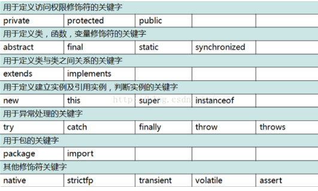

[TOC]

## 一、Java 注释

**单行注释**：// 注释内容（用的最多）。

**多行注释**：/* 注释内容*/（不推荐），不允许出现嵌套。

**文档注释：** /** 文档注释 */（常见于方法和类之上描述方法和类的作用)，可用来自动生成文档。

## 二、Java 标识符

- 标识符由字母、数字、_、$所组成，其中不能以数字开头，不能用Java中的保留字（关键字）
- 标识符采用有意义的简单命名
- “$”不要在代码中出现

## 三、Java 关键字




- Java中有两个未使用的保留字：goto、const
- **Java**中有三个特殊含义的单词：null、ture、alse
- **JDK1.4 **后追加了 **assert** **关键字；**
- **JDK1.5 **以后追加了 **enum** **关键字**。

## 四、Java 数据类型

### 1、基本数据类型

| 序号 | 数据类型        | 位数 | 默认值 | 取值范围       | 举例说明          |
| ---- | --------------- | ---- | ------ | -------------- | ----------------- |
| 1    | byte(位)        | 8    | 0      | -2^7 - 2^7-1   | byte b = 10;      |
| 2    | short(短整数)   | 16   | 0      | -2^15 - 2^15-1 | short s = 10;     |
| 3    | int(整数)       | 32   | 0      | -2^31 - 2^31-1 | int i = 10;       |
| 4    | long(长整数)    | 64   | 0      | -2^63 - 2^63-1 | long l = 10l;     |
| 5    | float(单精度)   | 32   | 0.0    | -2^31 - 2^31-1 | float f = 10.0f;  |
| 6    | double(双精度)  | 64   | 0.0    | -2^63 - 2^63-1 | double d = 10.0d; |
| 7    | char(字符)      | 16   | 空     | 0 - 2^16-1     | char c = 'c';     |
| 8    | boolean(布尔值) | 8    | false  | true、false    | boolean b = true; |

**类型转换**：

- 范围小的数据类型可以自动变为数据范围大的数据类型；
- 数据范围大的数据类型只有强制转换才能转为数据类型小的数据类型 。


### 2、引用数据类型

数组、类、接口

## 五、Java 运算符

### 1、基础运算符

所有运算符是有优先级的，使用（）括起来。

自增和自减运算（x++和++x)：**x++** **先运算后自增；****++x** **先自增后运算**

### 2、关系运算符

 关系运算符 >、<、>=、<=、== 返回类型均为布尔型(true,false)可以与逻辑判断语句一起使用 

### 3、逻辑运算符

与**(&、&&)、或(|、||)、非(!)**

- 当使用"&"时，明确的表示多个条件都判断了，如果在多个表达式中有条件返回了false，剩余的条件也
    要判断；而如果使用"&&"(短路与)，只要有条件返回false，剩余条件不再判断，返回false。
- 当使用"|"时，明确的表示多个条件都判断了，如果在多个表达式中有条件返回了true，剩余的条件也要
    判断；而如果使用"||"(短路非)，只要有条件返回true，剩余条件不再判断，返回true

### 4、三目运算符

 **数据类型 变量** **=** **布尔表达式？满足时赋值：不满足时赋值** 

### 5、位运算符

 &、|、^、~ 主要用于密码学，开发中使用不多，位运算的关键在于二进制与十进制的转换。 使用&（有一个0就是0）、使用|（有一个1就是1） 

```java
System.out.println(2&8); // 1
System.out.println(2|8); // 1
```

## 六、方法

### 1、方法的定义

```java
public static 方法返回值 方法名称（[参数类型 变量 ...]){
    方法体代码;
    [return 返回值];
}
```

### 2、方法重载

定义：**方法名称相同，参数的类型、顺序或个数不同（简称：参数列表不同）**

**注意：**不能有两个名字相同、参数类型也相同却返回不同类型值的方法

开发原则：在进行方法的重载时，要求：方法的返回值一定相同！

### 3、方法递归

定义： 指的是一个方法内部自己调用自己的方式。 

特点：

- 必须要有递归的结束条件。
-  方法在每次递归处理的时候一定要作出一些变更 。

## 七、数组

### 1、概述

- 数组的访问通过索引完成，如果访问超出数组长度，就会抛出异常“ "java.lang.ArrayIndexOutOfBoundsException ”；
-  当数组采用动态初始化开辟空间之后，数组之中的每个元素都是该数据类型的默认值； 

-  数组本身是一个有序的集合操作，所以对于数组的内容操作往往采用循环的模式完成。（数组是一个有
     限的集合，采用 for 循环） ；

### 2、数组初始化

1. 静态初始化：在定义的同时设置数组中的内容，完整格式 `数组类型[] 数组名称 = new 数据类型[] {值1，值2}`

2. 动态初始化：先开辟内存空间，而后使用索引进行内容的设置；

### 3、实现数组排序

 Java类库中数组排序操作如 ： java.util.Arrays.sort(arrayName) ; 只要是基本数据类型的数组，sort方法都可以进行排序处理(升序处理)。**内部使用双轴快速排序**。 

### 4、实现数组拷贝

数组部分拷贝：指的是将一个数组的部分内容替换掉另一个数组的部分内容（必须是连续的）

System**.arraycopy(源数组名称，源数组开始点，目标数组名称，目标数组开始点，拷贝长度);**

- 目标数组A： 1、2、3、4、5、6、7、8、9 

- 源数组B： 11、22、33、44、55、66、77、88、99

- 替换后： 1、55、66、77、5、6、7、8、9

```java
public class Demo01 {
    public static void main(String[] args) {
        int[] dataA = new int[]{1,2,3,4,5,6,7,8,9} ;
        int[] dataB = new int[]{11,22,33,44,55,66,77,88,99} ;
        System.arraycopy(dataB, 4, dataA, 1, 3);
        printArray(dataA);
    }
    public static void printArray(int[] temp) {
        for (int i = 0; i < temp.length; i++) {
            System.out.print(temp[i] + " ");
        }
        System.out.println();
    }
}
```

