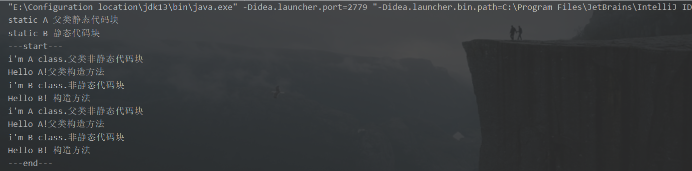

## 一、普通代码块

定义在方法中的代码块，一般如果方法中代码过长，为避免变量重名，可使用。

```java
public class Demo02 {
    public static void main(String[] args) {
        { //直接使用{}定义，普通方法块
            int x = 10;
            System.out.println("x = " + x);//x = 10
        }
        int x = 100;
        System.out.println("x = " + x);//x = 100
    }
}
```

## 二、构造块

定义在类中的代码块（不加修饰符），且构造块优先于构造方法执行，每产生一个新的对象就调用一次构造块，构造块可以进行简单的逻辑操作（在调用构造方法前）。

```java
class Person {
    {
        // 定义在类中，不加任何修饰
        System.out.println("1.Person类的构造块");
    }
    public Person() {
        System.out.println("2.Person类的构造方法");
    }
}
public class Demo03 {
    public static void main(String[] args) {
        new Person();
        new Person();
        //1.Person类的构造块
        //2.Person类的构造方法
        //1.Person类的构造块
        //2.Person类的构造方法
    }
}
```

## 三、静态代码块

使用 static 定义的代码块，根据所在类的不同可以分为两种：

1. 在主类中；
2. 在非主类中；

### 1、在非主类中

1. 静态块优先于构造块执行；
2. 无论产生多少实例对象，静态块都只执行一次；
3. 静态块的主要作用是为 static 属性进行初始化；

```java
class Person {
    {
        // 定义在类中，不加任何修饰
        System.out.println("1.Person类的构造块");
    }
    public Person() {
        System.out.println("2.Person类的构造方法");
    }
    static {
        // 定义在非主类中的静态块
        System.out.println("3.Person类的静态块");
    }
    public void print() {
        System.out.println("print 方法：" + this);
    }
}
public class Demo04 {
    public static void main(String[] args) {
        System.out.println("---start---");
        new Person();
        new Person();
        System.out.println("---end---");
        //---start---
        //3.Person类的静态块
        //1.Person类的构造块
        //2.Person类的构造方法
        //1.Person类的构造块
        //2.Person类的构造方法
        //---end---
    }
}
```

### 2、在主类中的代码块

在主类中定义的静态块，优先于 main 方法执行。

```java
public class Demo05 {
    {
        System.out.println("1.Test的构造块");
    }
    public Demo05() {
        System.out.println("2.Test的构造方法");
    }
    static {
        System.out.println("3.Test的静态块");
    }

    public static void main(String[] args) {
        System.out.println("---start---");
        new Demo05();
        new Demo05();
        System.out.println("---end---");
        //3.Test的静态块
        //---start---
        //1.Test的构造块
        //2.Test的构造方法
        //1.Test的构造块
        //2.Test的构造方法
        //---end---
    }
}
```

## 四、阿里的 java 校招笔试题

代码如下

```java
package com.xuwei;

public class HelloB extends HelloA{
    //构造方法
    public HelloB(){
        System.out.println("Hello B! 构造方法");
    }
    //非静态代码块
    {
        System.out.println("i'm B class.非静态代码块");
    }
    //静态代码块
    static{
        System.out.println("static B 静态代码块");
    }
    public static void main(String[] args) {
        System.out.println("---start---");
        new HelloB();
        new HelloB();
        System.out.println("---end---");
    }
}

class HelloA {
    // 构造方法
    public HelloA() {
        System.out.println("Hello A!父类构造方法");
    }
    //非静态代码块
    {
        System.out.println("i'm A class.父类非静态代码块");
    }
    //静态代码块
    static{
        System.out.println("static A 父类静态代码块");
    }
}
```

测试结果

