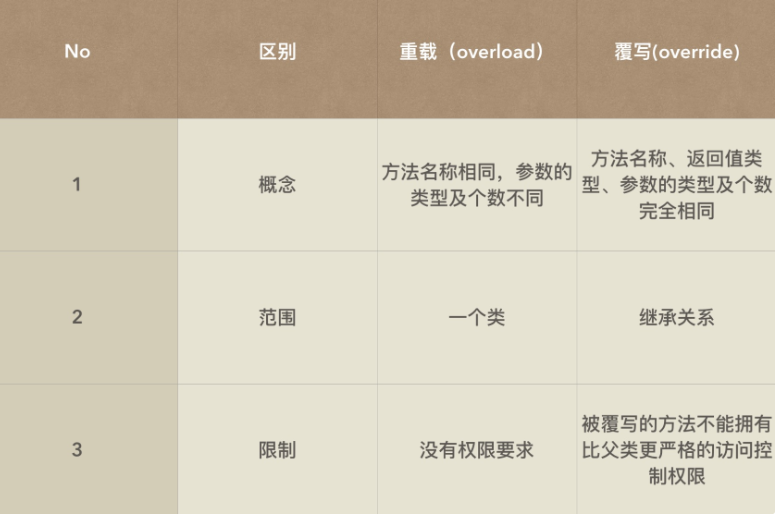
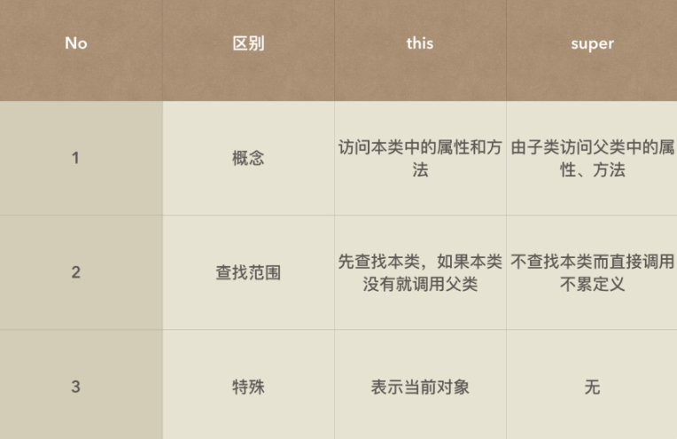

[TOC]

## 一、继承

### 1、继承的实现

 在 Java 中，继承使用 extends 关键字来实现，定义的语法如下：**class** 子类 **extends** 父类 

### 2、继承的限制

1. 子类对象在进行实例化前一定会首先实例化父类对象，默认调用父类的构造方法后再调用子类构造方法进行子类对象初始化。 
2. 在字类的构造方法中，相当于隐含了一句 super()，默认调用父类的无参构造方法，但是如果父类没有提供无参构造，那么字类必须使用 super() 明确指明要调用的父类构造方法。
3. 在继承的时候，字类会继承父类的所有结构（包括私有属性和方法）。但是所有的非私有操作属于显示继承（可以直接使用）， 所有的私有操作属于隐式继承（通过其他形式调用，例如 setter 或getter）。 

### 3、重写 override

#### 3.1 方法的重写

方法的重写：字类定义了与父类方法名称、参数类型及个数完全相同的方法， 但是被重写不能够拥有比父类更为严格的访问控制权限。 

解释重载和重写的区别：



#### 3.2 属性的重写

当字类定义了和父类属性名称完全相同的属性的时候，就成为了属性的覆盖。

### 4、super 关键字

使用 super 可以调用父类的同名方法或属性）。

super 和 this 的区别：



## 二、多态

### 1、概述

方法的多态性：

- 方法的重载；
- 方法的重写；

对象的多态性：（前提：方法重写）

- 对象的向上转型：父类 父类对象 = 子类实例；
- 对象的向下转型：子类 子类对象 = (子类) 父类实例

### 2、向上转型

本质：你使用的是哪一个子类（new 在哪里），而且调用的方法是否被子类所重写。

```java
public class Demo05 {
    public static void main(String[] args) {
        Person5 per = new Student5(); //向上转型
        per.print(); //2.我是儿子
    }
}

class Person5 {
    public void print() {
        System.out.println("1.我是爸爸");
    }
}

class Student5 extends Person5 {
    public void print() {
        System.out.println("2.我是儿子");
    }
}
```

### 3、向下转型

 向下转型指的是将父类对象变为子类对象 。

为什么？ 当你需要子类扩充操作的时候就要采用向下转型 。

```java
public class Demo05 {
    public static void main(String[] args) {
        Person5 per = new Student5(); //向上转型
        per.print(); //2.我是儿子
        //这个时候父类能够调用的方法只能是本类定义好的方法
        //所以并没有Student类中的fun()方法，那么只能够进行向下转型处理
        Student5 stu = (Student5) per;
        stu.fun(); //只有儿子有
    }
}

class Person5 {
    public void print() {
        System.out.println("1.我是爸爸");
    }
}

class Student5 extends Person5 {
    public void print() {
        System.out.println("2.我是儿子");
    }
    public void fun() {
        System.out.println("只有儿子有");
    }
}
```

使用 instanceof 关键字可以解决存在的安全隐患。

```java
Person per = new Student();
    System.out.println(per instanceof Person);
    System.out.println(per instanceof Student);
    if (per instanceof Student) { //避免ClassCastException
        Student stu = (Student) per ;
        stu.fun();
}
```

### 4、总结

- 对象多态性的核心在于方法的重写。

- 通过对象的向上转型可以实现接收参数的统一，向下转型可以实现子类扩充方法的调用。
- 两个没有关系的类对象是不能够进行转型的，一定会产生 ClassCastException。

