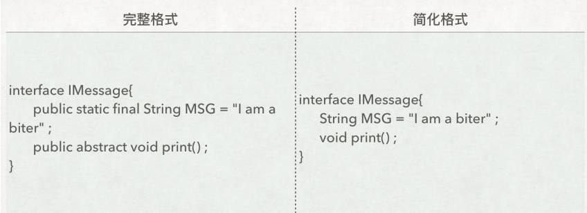
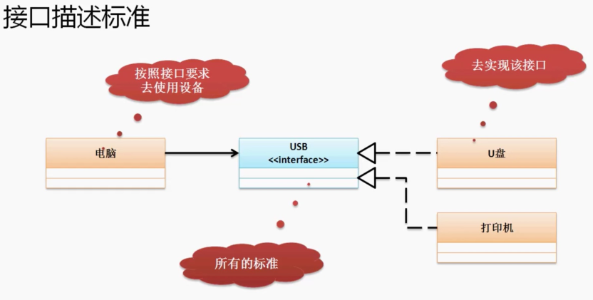

## 一、抽象类

### 1、定义

- 在普通类的基础上扩充了一些抽象方法，使用 abstract 修饰。

- 抽象类不一定要有抽象方法，但是有抽象方法的类一定是抽象类。

使用原则：

- 所有的抽象类必须要有子类；
- 抽象类的子类必须重写抽象类的所有抽象方法；
- 抽象类的对象可以通过对象多态性利用子类为其实例化；
- private 和 abstract 不能同时使用。

### 2、相关规定

- 在抽象类中也允许提供构造方法，并且子类也照样遵循对象实例化流程。实例化子类时一定先调用父类构造方法。如果构造方法没有初始化值，那么对象中的属性一定都是其对应数据类型的默认值；
- 抽象类允许不定义任何的抽象方法，但是此时抽象类依然无法直接创建实例化对象 ；
-  抽象类一定不能使用final声明，因为使用final声明的类不允许有子类；而抽象类必须有子类；相应的，抽象方法也不能使用private定义，因为抽象方法必须要能被覆写 ；
- 抽象类也分为内部抽象类和外部抽象类。内部抽象类中也可以使用 abstract 定义来描述外部抽象类 

## 二、接口

### 1、定义

接口就是抽象方法和全局常量的集合，使用 interface 关键字来定义。

### 2、接口使用限制

接口中只允许 public 权限（不管是属性还是方法，其权限都是 public），由于接口之中只是全局常量和抽象方法的集合，所以以下两种定义格式效果都是一样的




阿里编码规约：接口中的方法和属性不要加任何修饰符号,public也不要加，保持代码的简洁性。当一个子类即需要实现接口又需要继承抽象类时，请先使用extends继承**一个抽象类，而后使用implements实现多个接口。**

- 一个抽象类可以使用 implements 实现多个接口，但是接口不能继承抽象类。
- 一个接口可以使用 extends 继承多个父接口。
- 接口可以定义一系列的内部结构，包括：内部普通类，内部接口。其中，使用 static 定义的内部接口就相当于一个外部接口。

### 3、接口的应用

接口在实际开发之中有三大核心应用环境：

- 定义操作标准
- 表示能力
- 在分布式开发之中暴露远程服务方法

现在要求描述一个概念-电脑上可以使用任何的 USB 设备（U盘，打印机等等）：




```java
public class Demo05 {
    public static void main(String[] args) {
        Computer computer = new Computer();
        computer.plugin(new UDisk());
        computer.plugin(new PrintDisk());
    }
}

// 定义一个 USB
interface USB {
    void setup(); //安装USB驱动
    void work(); //进行工作
}

//定义电脑类
class Computer {
    public void plugin(USB usb) {
        usb.setup(); //安装
        usb.work(); //工作
    }
}

//定义一个 U盘
class UDisk implements USB { //定义一个USB设备
    @Override
    public void setup() {
        System.out.println("安装U盘驱动");
    }
    @Override
    public void work() {
        System.out.println("U盘开始工作");
    }
}
//定义一个打印机
class PrintDisk implements USB { //定义一个USB设备
    @Override
    public void setup() {
        System.out.println("安装打印机驱动");
    }
    @Override
    public void work() {
        System.out.println("打印机开始工作");
    }
}
```

### 4、接口定义加强

- 常量：public static final；
- 抽象方法：public abstract；
- 默认方法：public default，不强制重写，重写时需要去掉 default 关键字；
- 静态方法：public static，由接口名调用， 不能通过实现类名或对象名调用；
- 私有方法：private 返回值类型 方法名(参数列表) {方法体，必须有(JDK9提出的)}。

### 5、抽象类和接口的区别

1. 抽象类中的非抽象方法可以有方法体，但是接口中的方法不行 (静态方法，默认方法，私有方法可以)。
2. 抽象类的成员变量可以是任意类型，接口中只能是 public static final 类型。
3. 抽象类中可以有静态代码块和静态方法，接口中不能有静态代码块。
4. 一个类只能继承一个抽象类，却可以实现多个接口。