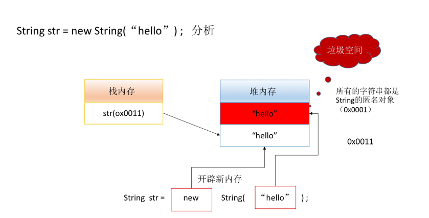

[TOC]


## 一、实例化方式

### 1、直接赋值

```java
String str1 = "hello" ;
String str2 = "hello" ;
String str3 = "hello" ;
System.out.println(str1 == str2); // true
System.out.println(str1 == str3); // true
System.out.println(str2 == str3); // true
```

从代码中可以看出，str1，str2，str3 都是同一个对象，这是为什么呢？

String 类的设计使用了共享设计模式，在 JVM 底层实际上会自动维护一个字符串对象池， 如果现在采用了直接赋值的模式进行 String 类的对象实例化操作，那么该实例化对象（字符串内容）将自动保存到这个对象池之中。如果下次继续使用直接赋值的模式声明String类对象，此时对象池之中如若有指定内容，将直接进行引用；如若没有，则开辟新的字符串对象而后将其保存在对象池之中以供下次使用。

### 2、构造方法

```java
// 该字符串常量并没有保存在对象池之中
String str1 = new String("hello") ;
String str2 = "hello" ;
System.out.println(str1 == str2); // false
System.out.println(str) ;
```



由于 "hello" (字符串字面值常量/String的匿名对象) 也是一个String对象，因此，JVM 会现在堆上创建一个 "hello" 字符串，再将这个字符串复制一份并由str指向，这就导致出现了垃圾空间(匿名String对象"hello")，并且如果采用构造方法的话，也不会将该字符串对象加入到JVM的"字符串常量池"中，导致字符串共享问题。

通过分析可知，如果使用 String 构造方法就会开辟两块堆内存空间，并且其中一块堆内存将成为垃圾空间。除了这一缺点之外，也会对字符串共享产生问题。

入池操作：

```java
String str1 = new String("hello").intern() ;
String str2 = "hello" ;
System.out.println(str1 == str2); // true
```

### 3、解释 String 类中两种对象实例化的区别

1. 直接赋值：只会开辟一块堆内存空间，并且该字符串对象可以自动保存到对象池中以供下次使用。
2. 构造方法： 会开辟两块堆内存空间，其中一块成为垃圾空间，不会自动保存在对象池中，可以使用 intern() 方法手工入池。 

## 二、字符串相等比较

```java
String str1 = "Hello" ;
String str = new String("Hello") ;
System.out.println(str1.equals(str));
```

解释 String 类 == 与 equals 的区别：

- ==

    - 对于基本数据类型，比较的是值是否相同；
    - 对于引用数据类型，比较的是引用是否相同。

    ```java
    String x = "hello";
    String y = "hello";
    String z = new String("hello");
    System.out.println(x==y); //true;
    System.out.println(x==z); //false
    System.out.println(x.equals(z)); //true
    ```

- equals
  
    - equals 本质就是 ==，只不过 String 和 Integer 的重写了 equals 方法，把它变成了值比较。

## 三、字符串不可变更

- 字符串一旦定义不可改变。

- 所有的语言对于字符串的底层实现，都是字符数组，数组的最大缺陷就是长度固定。在定义字符串常量时，它的内容不可改变。

## 四、字符串操作

### 1、字符串与字符数组

- public String(char value[])：将字符数组中的所有内容变为字符串。
- public char charAt(int index)：取得指定索引位置的字符串，索引从0开始。
- public char[] toCharArray()：将字符串变为字符数组返回。

### 2、字符串与字节数组

- public String(byte bytes[])：将字节数组变为字符串。
- public byte[] getBytes()：将字符串以字节数组的形式返回。
- public byte[] getBytes(String charsetName) throw UnsupportedEncodingException：编码转换处理。

### 3、字符串比较

- public boolean equals(Object object)：区分大小写比较。
- public boolean equalsIgnoreCase(String annotherString)：不区分大小写比较。
- public int compareTo(String annotherString)：比较两个字符串大小关系。
    - 小于：返回内容小于0；
    - 大于：返回内容大于0；
    - 等于：为0；

### 4、字符串查找


### 5、字符串替换


### 6、字符串拆分


### 7、字符串截取


### 8、其他操作方法


## 五、StringBuffer 类

String和StringBuffer最大的区别在于：String的内容无法修改，而StringBuffer的内容可以修改。频繁修改字符串的情况考虑使用StingBuffer 

- String 变为 StringBuffer：利用 StringBuffer 的构造方法；
- StringBuffer 变为 String：调用 toString() 方法；

常用方法：

- append();
- reverse();
- delete(int start, int end);
- insert(int offset, 各种数据类型)。

解释 String、StringBuffer、StringBuilder 的区别：

- String的内容不可修改，StringBuffer与StringBuilder的内容可以修改。
-  StringBuffer 采用同步处理，属于线程安全操作；而 StringBuilder 采用异步处理，属于线程不安全操作。 