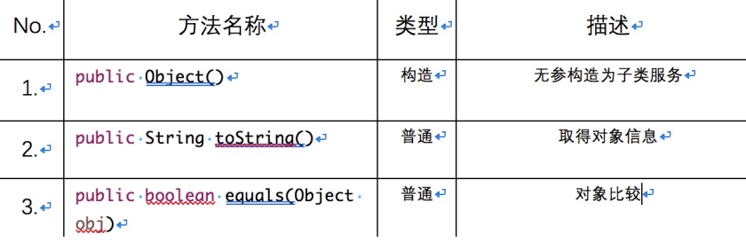

[TOC]

## 一、Object 类简介

Object是Java默认提供的一个类。Java里面除了Object类，所有的类都是存在继承关系的。默认会继承 Object 父类。即，所有类的对象都可以使用Object进行接收



## 二、获取对象信息

在使用对象直接输出的时候，默认输出的是一个地址编码。如果现在使用的是String类，该类对象直接输出的是内容，主要原因就是toString()方法的问题。

## 三、 对象比较

String类对象的比较使用的是equals()方法，实际上String类的equals()方法就是覆写的Object类中的equals()方法。

**范例：实现对象比较**

```java
class Person{
    private String name ;
    private int age ;
    public Person(String name, int age) {
        this.age = age ;
        this.name = name ;
    } @
            Override
    public String toString() {
        return "姓名："+this.name+",年龄："+this.age ;
    } @
            Override
    public boolean equals(Object obj) {
        if (obj == null) {
            return false ;
        } if(this == obj) {
            return true ;
        } // 不是Person类对象
        if (!(obj instanceof Person)) {
            return false ;
        } Person person = (Person) obj ; // 向下转型，比较属性值
        return this.name.equals(person.name) && this.age==person.age ;
    }
}

class Student{}

public class Test {
    public static void main(String[] args) {
        Person per1 = new Person("yuisama", 20) ;
        Person per2 = new Person("yuisama", 20) ;
        System.out.println(per1.equals(per2));
    }
}
```

## 四、接受引用数据类型

在之前已经分析了Object可以接收任意的对象，因为Object是所有类的父类，但是Obejct并不局限于此，它可以接收所有数据类型，包括：类、数组、接口。

范例：使用Object来接受数组对象

```java
public static void main(String[] args) {
    // Object接收数组对象，向上转型
    Object obj = new int[]{1,2,3,4,5,6} ;
    // 向下转型，需要强转
    int[] data = (int[]) obj ;
    for(int i :data){
        System.out.println(i+"、");
    }
}
```

而Object可以接收接口是Java中的强制要求，因为接口本身不能继承任何类。

范例：使用Object接收接口对象

```java
interface IMessage {
    public void getMessage() ;
} 
class MessageImpl implements IMessage {
    @Override
    public String toString() {
        return "I am small biter" ;
    } 
    public void getMessage() {
        System.out.println("比特欢迎你");
    }
} 
public class Test {
    public static void main(String[] args) {
        IMessage msg = new MessageImpl() ; // 子类向父接口转型
        Object obj = msg ; // 接口向Obejct转型
        System.out.println(obj);
        IMessage temp = (IMessage) obj ; // 强制类型转换
        temp.getMessage();
    }
}
```

