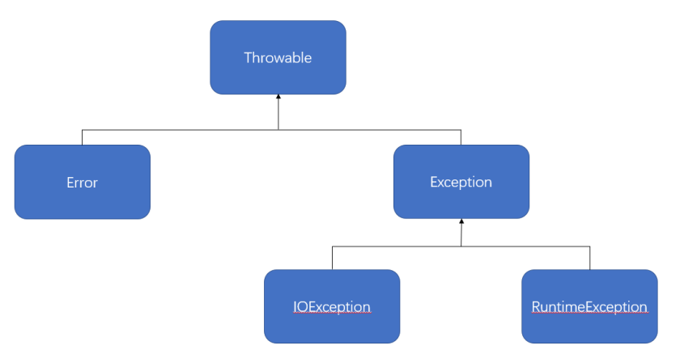

[TOC]

## 一、异常体系结构

先看一下异常的继承类结构



- Error类一般是指与虚拟机相关的问题，如系统崩溃，虚拟机错误，内存空间不足，方法调用栈溢等。对于这类错误的导致的应用程序中断，仅靠程序本身无法恢复和和预防，遇到这样的错误，建议让程序终止。

- Exception类表示程序可以处理的异常，可以捕获且可能恢复。遇到这类异常，应该尽可能处理异常，使程序恢复运行，而不应该随意终止异常。

Exception类又分为运行时异常（Runtime Exception）和受检查的异常(Checked Exception )，

运行时异常：编译能通过，但是一运行就终止了，程序不会处理运行时异常，是一种常见运行错误，只要程序设计得没有问题通常就不会发生，比如：IllegalArgumentException。

而受检查的异常，跟程序运行的上下文环境有关，即使程序设计无误，仍然可能因使用的问题而引发。要么用try。。。catch捕获，要么用throws字句声明抛出，交给它的父类处理，否则编译不会通过。

## 二、JVM 默认处理异常的方式

如果程序出现了问题，我们没有做任何处理，最终JVM 会做默认的处理，处理方式有如下两个步骤：

- 把异常的名称，错误原因及异常出现的位置等信息输出在了控制台
- 程序停止执行

## 三、异常处理格式

使用 try，catch，finally

范例：使用 try..catch..finally 进行处理

```java
public class Demo01 {
    public static void main(String[] args) {
        System.out.println("1.数学计算开始前");
        try {
            System.out.println("2.进行数学计算：" + 10 / 0);
        } catch (ArithmeticException e) {
            System.out.println("异常已经被处理了");
            e.printStackTrace();
        } finally {
            System.out.println("不管是否产生异常，都会执行");
        }
        System.out.println("3.数学计算结束后");
    }
}
```

## 编译时异常和运行时异常的区别

- 编译时异常

- - 都是 Exception 类及其子类。
    - 必须显示处理，否则程序就会发生错误，无法通过编译。

- 运行时异常

- - 都是 RuntimeException 类及其子类。
    - 无需显示处理，也可以和编译时异常一样处理。

## 六、throws 关键字

在进行方法定义的时候，如果要告诉调用者本方法可能产生哪些异常，就可以使用throws方法进行声明。即，如果该方法出现问题后不希望进行处理，就使用throws抛出。

编译时异常必须要进行处理，两种处理方案：try...catch …或者 throws，如果采用 throws 这种方案，将来谁调用谁处理，运行时异常可以不处理，出现问题后，需要我们回来修改代码

范例：使用 throws 定义方法

```java
public class Demo02 {
    public static void main(String[] args) {
        try {
            System.out.println(calculcate(10, 0));
        } catch (Exception e) {
            e.printStackTrace();
        }
    }
    public static int calculcate(int x, int y) throws Exception {
        return x/y;
    }
}
```

如果现在调用了throws声明的方法，那么在调用时必须明确的使用try..catch..进行捕获，因为该方法有可能产生异常，所以必须按照异常的方式来进行处理。

## 六、throw 关键字

thorw是直接编写在语句之中，表示人为进行异常的抛出。如果现在异常类对象实例化不希望由JVM产生而由用户产生，就可以使用throw来完成。

范例：使用 throw 产生异常类对象

```java
public class Demo03 {
    public static void main(String[] args) {
        try {
            throw new Exception("抛个异常玩玩");
        } catch (Exception e) {
            //java.lang.Exception: 抛个异常玩玩
            e.printStackTrace();
        }
    }
}
```

面试题：请解释throw和throws的区别

> 1. throw用于方法内部，主要表示手工异常抛出。
> 2. throws主要在方法声明上使用，明确告诉用户本方法可能产生的异常，同时该方法可能不处理此异常

## 七、异常处理标准格式

现在要求编写一个方法进行除法操作，但是对于此方法有如下要求：

> 1. 在进行除法计算操作之前打印一行语句"**"。
> 2. 如果在除法计算过程中出现错误，则应该将异常返回给调用处。
> 3. 不管最终是否有异常产生，都要求打印一行计算结果信息。

```java
public class Demo04 {
    public static void main(String[] args) {
        try {
            System.out.println(calculate(10, 0));
        } catch (Exception e) {
            e.printStackTrace();
        }
    }

    public static int calculate(int x, int y) throws Exception{
        int result = 0;
        System.out.println("1.计算开始前***");
        try {
            result = x / y;
        } catch (Exception e) {
            throw e; //抛出去
        } finally {
            System.out.println("2.计算结束");
        }
        return result;
    }
}
```

对于以上格式还可以进一步简化，直接使用 try...finally

```
public static int calculate(int x, int y) throws Exception{
        int result = 0;
        System.out.println("1.计算开始前***");
        try {
            result = x / y;
        } finally {
            System.out.println("2.计算结束");
        }
        return result;
    }
```

## 八、RuntimeException 类

先看一段贼简单的代码：

```java
String str = "100" ;
int num = Integer.parseInt(str) ;
System.out.println(num * 2);
```

来看 parseInt 的源码定义：

```
public static int parseInt(String s) throws NumberFormatException
```

这个方法上已经明确抛出异常，但是在进行调用的时候发现，即使没有进行异常处理也可以正常执行。这个就属于RuntimeException 的范畴。

总结：使用**RuntimeException定义的异常类可以不需要强制性进行异常处理。**

面试题：请解释 Exception 与 RuntimeException 的区别，请列举几个常见的RuntimeException：

> 1. Exception是RuntimeException的父类，使用 Exception 定义的异常都要求必须使用异常处理，而使用 RuntimeException 定义的异常可以由用户选择性的来进行异常处理。
> 2. 常见的RuntimeException:ClassCastException、NullPointerException等

## 九、断言 assert

断言是从JDK1.4开始引入的概念。断言指的是当程序执行到某些语句之后其数据的内容一定是约定的内容。

范例：观察断言

```java
public class Demo05 {
    public static void main(String[] args) {
        int num = 10;
        assert num == 55 : "错误: num 应当为55";
        System.out.println(num);
    }
}
```

如果要想让断言起作用，则必须使用-ea的参数，启用断言

## 十、自定义异常类

在Java里，针对于可能出现的公共的程序问题都会提供有相应的异常信息，但是很多时候这些异常信息往往不够我们使用。例如，现在有需求：在进行加法运算时，如果发现两个数相加内容为50，那么就应当抛出一个AddExceptio异常。这种异常Java不会提供，所以就必须定义一个属于自己的异常类。

自定义异常类可以继承两种父类：**Exception、RuntimeException。**

范例：实现自定义异常类

```java
public class Demo06 {
    public static void main(String[] args) throws AddException {
        int num1 = 20;
        int num2 = 30;
        if (num1 + num2 == 50) {
            throw new  AddException("错误的相加操作");
        }
    }
}

class AddException extends Exception {
    public AddException(String msg) {
        super(msg);
    }
}
```