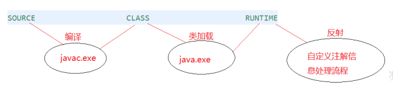
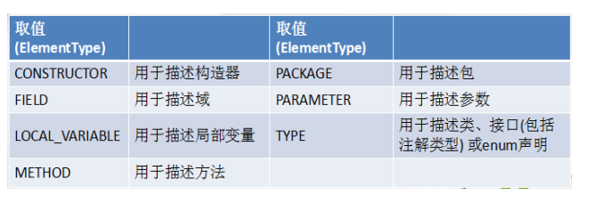

[TOC]

## 注解概述

Annotation 其实就是代码里的特殊标记, 这些标记可以在编译, 类加载, 运行时被读取, 并执行相应的处理。通过使用 Annotation, 程序员可以在不改变原有逻辑的情况下, 在源文件中嵌入一些补充信息。

Annotation 可以像修饰符一样被使用, 可用于修饰包,类, 构造器, 方法, 成员变量, 参数, 局部变量的声明, 这些信息被保存在 Annotation 的 “name=value” 对中。

## 常见的 Annotation 示例

### 1、声明重写

限定重写父类方法, 该注解只能用于方法，如果该方法确定成功覆写，则不会有语法错误；如果没有成功覆写，则认为是语法错误。

```java
class Person {
    @Override // 追加了此注解后将明确的表示该方法是一个覆写的方法，如果覆写错误会出现语法错误
    public String tostring() {
        return "小比特们" ;
    }
}
```

### 2、声明已过时

用于表示某个程序元素(类, 方法等)已过时

```java
public class Demo02 {
    public static void main(String[] args) {
        Person2 person2 = new Person2(); // 明确的标记出过期
        person2.fun();
        person2 = new Person2(" ");
    }
}

class Person2 {
    @Deprecated // 表示该方法已经不建议使用了，但是即使用了也不会出错
    public Person2() {}
    public Person2(String name) {}
    @Deprecated
    public void fun() {}
}
```

### 3、抑制编译器警告

@SuppressWarnings，当调用了某些操作可能产生问题的时候就会出现警告进行，但是警告信息并不是错，这个时候又不想总提示警告，这个时候可以使用压制警告。

```java
package com.xuwei.annotations;

public class Demo01 {
    @SuppressWarnings({"rawtypes","unused"})
    public static void main(String[] args) {
        Person person = new Person();
        System.out.println(person);
    }
}

class Person {
    @Deprecated
    public Person() {} // 表示该方法已经不建议使用了，但是即使用了也不会出错

    public Person(String name) {}

    @Deprecated
    public void fun() {}
}
```

## 自定义 Annotation

- 定义新的 Annotation 类型使用 @interface 关键字, 自定义注解默认继承了 java.lang.annotation.Annotation 接口
- Annotation 的成员变量在 Annotation 定义中以无参数方法的形式来声明. 其方法名和返回值定义了该成员的名字和类型。我们称为配置参数。类型只能是八种基本数据类型、String 类型、Class 类型、enum 类型、Annotation类型、以上所有类型的数组
- 可以在定义 Annotation 的成员变量时为其指定初始值, 指定成员变量的初始值可使用 default 关键字, 如果只有一个参数成员，建议使用参数名为 value。

`public @interface MyAnnotation{`

​	`String value() default “atguigu";`

`}`

- 没有成员定义的 Annotation 称为标记; 包含成员变量的 Annotation 称为元数据 Annotation

```java
@MyAnnotaion(value = "威少")
public class Demo02 {
    public static void main(String[] args) {
        Class<Demo02> clazz = Demo02.class;
        MyAnnotaion m = clazz.getAnnotation(MyAnnotaion.class);
        String info = m.value();
        System.out.println(info);

    }
}

@Retention(RetentionPolicy.RUNTIME)
@Target(ElementType.TYPE)
@interface MyAnnotaion {
    String value() default "weishao";
}
```

## JDK 中的元注解

- 用于修饰其他 Annotation 定义
- JDK5.0 提供了 4 个标准的 meta-annotation 类型，分别是：

- - **Retention:****保留策略**
    - **Target****：目标，可以用来修饰什么数据**
    - **Documented****：能否在生成的帮助文档中显示**
    - **Inherited：注解是否具备继承性**

### 1、@Retention

@Retention : 只能用于修饰一个 Annotation 定义, 用于指定该 Annotation 可以保留多长时间, @Rentention 包含一个 RetentionPolicy 类型的成员变量, 使用 @Rentention 时必须为该 value 成员变量指定值:

- RetentionPolicy.SOURCE: 在源文件中有效（即源文件保留），编译器直接丢弃这种策略的注释。
- RetentionPolicy.CLASS: 在 class 文件中有效（即 class 保留），当运行 java 程序时，JVM 不会保留注解。这是莫尔尼值。
- RetentionPolicy.RUNTIME: 在运行时有效（即允许时保留），当允许 java 程序时，JVM 会保留注释，程序可以通过反射获取该注释。




```java
@Retention(RetentionPolicy.CLASS)
@interface MyAnnotaion2 {
    String value() default "威少";    
}
```

### 2、@Target

用于修饰 Annotation 定义，用于指定被修饰的 Annotation 能用于修饰哪些程序元素。@Target 也包含一个名为 value 的成员变量。





```
@Target(ElementType.METHOD)
@interface MyAnnotation3{}
```

### 3、@Documented

用于指定被该元 Annotation 修饰的 Annotation 类将被 javadoc 工具提取成文档.

**注意** ：定义为Documented的注解必须设置Retention值为RUNTIME。

### 4、@Inherited

被它修饰的 Annotation 将具有继承性，如果某个类使用了被 @Inherited 修饰的 Annotation，则其子类将自动具有该注解。

**注意：实际应用很少。**

### 5、练习

1.编写一个Person类，使用Override注解它的toString方法

2.自定义一个名为“MyTiger”的注解类型，它只可以使用在方法上，带一个String类型的value属性，然后在第1题中的Person类上正确使用。

```java
class Person2 {
    private Integer id;
    private String name;

    public Person2(Integer id, String name) {
        this.id = id;
        this.name = name;
    }

    @MyTiger("威少")
    @Override
    public String toString() {
        return "Person2{" +
            "id=" + id +
            ", name='" + name + '\'' +
            '}';
    }
}

@Retention(RetentionPolicy.RUNTIME)
@Target(ElementType.METHOD)
@interface MyTiger {
    String value() default "weishao";
}
```