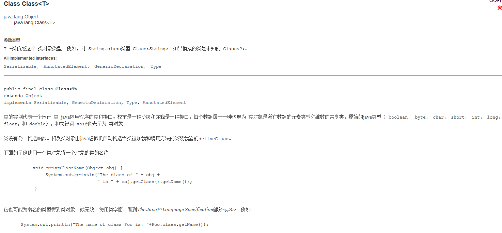
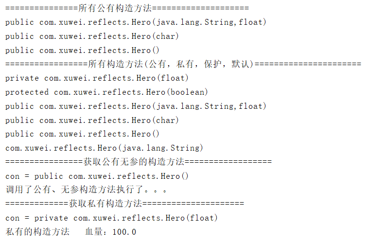

[TOC]

## 反射概述

Java语言在编译后会生成一个.class文件，反射就是通过这个字节码文件找到某一个类、类中的方法以及属性等。反射的实现主要借助以下四个类：

-  Class: 反射的核心类，可以获取类的属性，方法等信息。   
-  Constructor：表示类的构造方法。  
-  Field：表示类的成员变量，可以用来获取和设置类之中的属性值  
-  Method：表示类的方法，它可以用来获取类中的方法信息或者执行方法  

**作用**

 反射机制是指程序在运行状态中能够获取自身的信息，对于任意一个类，都能够知道这个类的所有属性和方法，对于任意一个对象，都可以获取该对象的属性和方法，这种动态获取的机制称为java的反射机制。

**动态语言** 

动态语言指的是程序在运行时可以改变其结构，新的函数可以引进，已有的函数可以被删除等结构上的变化。比如：JavaScript，Ruby，Python等都是动态语言，从反射角度讲，Java属于半动态语言。

实际上，我们创建的每一个类也都是对象，即类本身是 java.lang.Class 类的实例对象。这个实例对象称之为类对象，也就是Class对象。那么，Class对象又是什么对象呢？

## Class 对象特点

下图是 Class 类的 api



从图中可以得出如下几点：

1. Class 类的实例对象表示正在运行的 Java 应用程序中的类和接口。也就是jvm中有很多的实例，每个类都有唯一的Class对象。
2. **Class 类没有公共构造方法。****Class 对象是在加载类时由 Java 虚拟机自动构造****的。也就是说我们不需要创建，JVM已经帮我们创建了。**
3. **Class 对象用于提供类本身的信息，比如有几种构造方法， 有多少属性，有哪些普通方法。**

## 三、反射的使用

假设我们现在有一个 `Hero类`

```java
public class Hero {
    public String name; //姓名
    public float hp; //血量
    public float armor; //护甲
    public int moveSpeed; //移动速度
}
```

### 1、获取类对象

获取类对象有 3 种方式

1. `Class.forName()`  （常用）
2. `Hero.class`
3. `new Hero().getClass()`

在一个 JVM 中，一种类，只会有一个类对象存在。所以以上三种方式取出来的类对象，都是一样。（此处准确是在ClassLoader下,只有一个类对象）

**代码如下** 

```java
public class Demo01 {
    public static void main(String[] args) {
        String className = "com.xuwei.reflects.Hero";
        try {
            //第一种方式
            Class<?> clazz1 = Class.forName(className);
            //第二种方式
            Class<Hero> clazz2 = Hero.class;
            //第三种方式
            Class<? extends Hero> class3 = new Hero().getClass();
            System.out.println(clazz1 == clazz2); //true
            System.out.println(clazz2 == class3); //true
        } catch (ClassNotFoundException e) {
            e.printStackTrace();
        }
    }
}
```

总结：三种方式中，常用第一种，第二种需要导入包，依赖性太强，不导包就抛编译错误。第三种对象都有了还要反射干什么。一般都第一种，一个字符串可以传入也可写在配置文件中等多种方法。

### 2、利用反射机制创建对象

**基本步骤**

首先要拿到 Hero 的 Class 类对象，然后通过 Class 类对象获取“构造器对象”再通过构造器对象创建一个对象。

> 1. 获取 Class 类对象：Class class = Class.forName("com.xuwei.reflects.Hero");
> 2. 获取构造器对象：Constructor con = clazz.getConstructor(形参.class);
> 3. 获取对象：Hero hero = con.newInstance(实参)

当Hero的构造方法不是无参构造方法时，获取构造器对象略有不同，见下面测试：

示例：Hero 类添加6种构造方法

```java
//（默认的构造方法）
Hero(String str){
    System.out.println("(默认)的构造方法 s = " + str);
}

//无参构造方法
public Hero(){
    System.out.println("调用了公有、无参构造方法执行了。。。");
}

//有一个参数的构造方法
public Hero(char name){
    System.out.println("姓名：" + name);
}

//有多个参数的构造方法
public Hero(String name ,float hp){
    System.out.println("姓名："+name+"血量："+ hp);
}

//受保护的构造方法
protected Hero(boolean n){
    System.out.println("受保护的构造方法 n = " + n);
}

//私有构造方法
private Hero(float hp){
    System.out.println("私有的构造方法   血量："+ hp);
}
```

通过反射机制获取对象

```java
/**
 * 通过反射机制获取对象
 *
 * 1.获取构造方法：
 *  （1）批量的方法：
 *      public Constructor[] getConstructors()：所有"公有的"构造方法
 *      public Constructor[] getDeclaredConstructors()：获取所有的构造方法(包括私有、受保护、默认、公有)
 *  （2）获取单个的方法：
 *      public Constructor getConstructor(Class... parameterTypes):获取单个的"公有的"构造方法：
 *      public Constructor getDeclaredConstructor(Class... parameterTypes):获取"某个构造方法"可以是私有的，或受保护、默认、公有；
 */
public class Demo02 {
    public static void main(String[] args) throws ClassNotFoundException, NoSuchMethodException, IllegalAccessException, InvocationTargetException, InstantiationException {
        //1.加载Class对象
        Class<?> clazz = Class.forName("com.xuwei.reflects.Hero");
        //2.获取所有公有构造方法
        System.out.println("===============所有公有构造方法====================");
        Constructor<?>[] conArray = clazz.getConstructors();
        for (Constructor c : conArray) {
            System.out.println(c);
        }

        System.out.println("=================所有构造方法(公有，私有，保护，默认)======================");
        conArray = clazz.getDeclaredConstructors();
        for (Constructor c : conArray) {
            System.out.println(c);
        }

        System.out.println("================获取公有无参的构造方法==================");
        Constructor<?> con = clazz.getConstructor(null);
        //1.因为无参的构造方法所以类型是一个null，不写也可以：这里需要的是一个参数的类型，切记是类型
        //2.返回的是描述这个无参构造函数的类对象
        System.out.println("con = " + con); //con = public com.xuwei.reflects.Hero()
        //调用构造方法
        Object obj = con.newInstance();

        System.out.println("=============获取私有构造方法=====================");
        con = clazz.getDeclaredConstructor(float.class);
        System.out.println("con = " + con);;
        //调用构造方法
        con.setAccessible(true); //暴力访问（忽略掉访问权限修饰符） ---》取消封装
        obj = con.newInstance(100);
    }
}
```

输出




**总结**

获取构造方法：

1. 批量的方法：


`public Constructor[] getConstructors()：所有"公有的"构造方法`

`public Constructor[] getDeclaredConstructors()：获取所有的构造方法(包括私有、受保护、默认、公有)`

2. 获取单个的方法：

`public Constructor getConstructor(Class... parameterTypes):获取单个的"公有的"构造方法：`

`public Constructor getDeclaredConstructor(Class... parameterTypes):获取"某个构造方法"可以是私有的，或受保护、默认、公有；`

**另一种方法** 

使用 Class 对象的 newInstance()方法来创建该 Class 对象对应类的实例，但是这种方法要求该 Class 对象对应的类有默认的空构造器。

### 3、获取成员变量并使用

**基本步骤** 

1. 获取HeroPlus类的对象 
2. 获取属性 Field f1 = h.getDeclaredField("属性名")
3. 修改属性 f1.set(h，实参)，注意这里的h是对象，不是类对象

**新增 HeroPlus 类** 

```java
class HeroPlus {
    public String name;
    public float hp;
    public int damage;
    public int id;

    public String getName() {
        return name;
    }
    public void setName(String name) {
        this.name = name;
    }
    public HeroPlus(){

    }
    public HeroPlus(String string) {
        name =string;
    }

    @Override
    public String toString() {
        return "Hero [name=" + name + "]";
    }
    public boolean isDead() {
        // TODO Auto-generated method stub
        return false;
    }
    public void attackHero(HeroPlus h2) {
        System.out.println(this.name+ " 正在攻击 " + h2.getName());
    }
}
```

获取属性并修改

```java
publiic static void main(String[] args) {
    Class<?> clazz = null;
    try {
        clazz = Class.forName("com.xuwei.reflects.HeroPlus");
        //获取类 HeroPlus 的名字叫做 name 的字段
        Field f1 = clazz.getDeclaredField("name");
        //修改这个字段的值，之前必须先获取这个类对象
        Constructor<?> con = clazz.getDeclaredConstructor(String.class);
        Object obj = con.newInstance("jack");
        f1.set(obj, "jell");
        //打印被修改的值
        HeroPlus hp = (HeroPlus) obj;
        System.out.println(hp.name); //jell

    } catch (Exception e) {
        e.printStackTrace();
    }
}
```

**总结**

getField 和 getDeclaredField 的区别：

- getField 只能获取public的，包括从父类继承来的字段。
- getDeclaredField 可以获取本类所有的字段，包括private的，但是 不能获取继承来的字段。
- 注意： 这里只能获取到private的字段，但并不能访问该private字段的值,除非加上setAccessible(true)

### 4、获取成员方法并使用

1. 获取成员方法：

- `public Method getMethod(String name ，Class<?>… parameterTypes)`: 获取"公有方法"；（包含了父类的方法也包含Object类）
- `public Method getDeclaredMethods(String name ，Class<?>… parameterTypes)` : 获取成员方法，包括私有的(不包括继承的)

参数解释：name->方法名  Class...->形参的Class类型对象

2. 调用方法

`Method ---> public Object invoke(Object obj,Object… args):`

参数说明：obj-> 要调用方法的对象  args->调用方式时所传入的实参

```java
public static void main(String[] args) {
    try {
        //1.获取Class对象
        Class<?> clazz = Class.forName("com.xuwei.reflects.HeroPlus");
        //2.通过反射来创建对象
        Constructor<?> con = clazz.getDeclaredConstructor();
        Object obj = con.newInstance();
        //3.获取成员方法
        Method m = clazz.getMethod("setName", String.class);
        //4.调用这个方法
        m.invoke(obj, "威少");
        //5.查看是否调用成功
        HeroPlus h = (HeroPlus) obj;
        System.out.println(h.getName()); //威少
    } catch (Exception e) {
        e.printStackTrace();
    }
}
```

### 5、获取 main 方法并使用

**HeroPlus 新增 main 方法**

```java
public static void main(String[] args) {
    System.out.println("执行main方法");
}
```

**通过下面步骤获取 main 方法**

```java
public static void main(String[] args) {
    try {
        //1.获取Class类对象
        Class<?> clazz = Class.forName("com.xuwei.reflects.HeroPlus");
        //2.获取main方法，第一个参数：方法名称 第二个参数：方法形参的类型
        Method methodMain = clazz.getMethod("main", String[].class);
        //3.调用main方法
        //methodMain.invoke(null, new String[]{"a","b","c"});
        //第一个参数，对象类型，因为方法是static静态的，所以为null可以，第二个参数是String数组，这里要注意在jdk1.4时是数组，jdk1.5之后是可变参数
        //这里拆的时候将  new String[]{"a","b","c"} 拆成3个对象。所以需要将它强转。
        methodMain.invoke(null, (Object) new String[]{"a","b","c"}); //方式一
        // methodMain.invoke(null, new Object[]{new String[]{"a","b","c"}});//方式二
    } catch (Exception e) {
        e.printStackTrace();
    }
}
```

### 6、获取 Annotation 信息

#### 6.1 反射获取所有注解信息

1. HeroPlue 新增注解信息

- `@SuppressWarnings("serial")`

- `@Deprecated`

2. 获取 Annotation 信息

```java
public static void main(String[] args) throws Exception {
    Class<?> clazz = Class.forName("com.xuwei.reflects.HeroPlus");
    Annotation[] ants = clazz.getAnnotations();
    for (Annotation ant : ants) {
        System.out.println(ant); //@java.lang.Deprecated(forRemoval=false, since="")
    }
}
```

注意：此处只出现了一个 Annotation，这是因为 Annotation 本身有自己的保存范围，不同的 Annotation 的返回也不同。

#### 6.2 反射获取自定义 Annotation

要想自定义Annotation，首先需要解决的就是Annotation的作用范围。通过第一节的范例我们可以发现，不同的Annotation有自己的运行范围，而这些范围就在一个枚举类 (java.lang.annotation.RetentionPolicy) 中定义：

1. SOURCE:在源代码中出现的Annotation`

2. CLASS:在*.class中出现的Annotatation`

3. RUNTIME:在类执行的时候出现的Annotation`

**范例：定义一个在运行时生效的 Annotaion**

```java
public class Demo08 {
    public static void main(String[] args) {
        try {
            Class<?> clazz = Class.forName("com.xuwei.reflects.Memeber");
            MyAnnotation ma = clazz.getAnnotation(MyAnnotation.class);
            System.out.println("姓名：" + ma.name()); //姓名：威少
            System.out.println("年龄：" + ma.age()); //年龄：23
        } catch (Exception e) {
            e.printStackTrace();
        }
    }
}


@Retention(RetentionPolicy.RUNTIME)
@interface MyAnnotation {
    public String name() default "威少";
    public int age() default 23;
}

@Deprecated
@MyAnnotation()
class Memeber implements Serializable {}
```

## 四、反射实例

### 1、通过反射越过泛型检查

泛型是在编译期间起作用的。在编译后的.class文件中是没有泛型的。所有比如T或者E类型啊，本质都是通过Object处理的。所以可以通过使用反射来越过泛型。

```
public static void main(String[] args) throws Exception {
    ArrayList<String> list = new ArrayList<>();
    list.add("this");
    list.add("hello");

    System.out.println("==============越过泛型检查==============");
    //获取ArrayList的Class对象，反向的调用add()方法，添加数据
    Class<? extends ArrayList> clazz = list.getClass();
    //获取add()方法
    Method methodAdd = clazz.getDeclaredMethod("add", Object.class);
    //调用add()方法
    methodAdd.invoke(list, 5);

    //遍历集合
    for (Object obj : list) {
        System.out.print(obj + " "); //this hello 5
    }
}
```

### 2、通过反射运行配置文件内容

1. 首先准备两个业务类

```java
public class Service1 {
    public void doService1(){
        System.out.println("业务方法1");
    }
}

public class Service2 {
    public void doService2(){
        System.out.println("业务方法2");
    }
}
```

2. 当需要从第一个业务方法切换到第二个业务方法的时候，使用非反射方式，必须修改代码，并且重新编译运行，才可以达到效果。

```java
public class CommonTest {
    public static void main(String[] args) {
        //new Service1().doService1();
        //必须重新修改代码
        new Service2().doService2();
    }
}
```

3. 使用反射方式则方便很多
    1. 首先准备一个配置文件，就叫做spring.txt吧, 放在src目录下。里面存放的是类的名称，和要调用的方法名。
    2. 在测试类Test中，首先取出类名称和方法名，然后通过反射去调用这个方法。
    3. 当需要从调用第一个业务方法，切换到调用第二个业务方法的时候，不需要修改一行代码，也不需要重新编译，只需要修改配置文件spring.txt，再运行即可。

**示例** 

**spring.txt 内容**

```
class=com.xuwei.reflects.Service1
method=doService1
```

**测试类**

```java
@SuppressWarnings({"rawtypes", "unchecked"})
public static void main(String[] args) throws Exception {
    //从spring.txt中获取类名称和方法名称
    Properties springConfig = new Properties();
    File springConfigFile = new File("E:\\work_project\\JAVA\\Java\\新特性\\src\\spring.txt");
    springConfig.load(new FileInputStream(springConfigFile));
    String className = (String) springConfig.get("class");
    String methodName = (String) springConfig.get("method");

    //根据类名获取对象
    Class<?> clazz = Class.forName(className);
    //根据方法名称，获取方法对象
    Method m = clazz.getMethod(methodName);
    //获取构造器
    Constructor<?> c = clazz.getConstructor();
    //根据构造器，实例化对象
    Object obj = c.newInstance();
    //调用对象的指定方法
    m.invoke(obj);
}
```