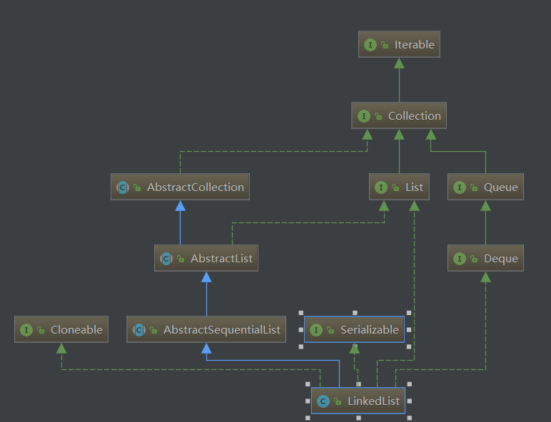

[TOC]

## 一、List 集合特点

- 有序（存储顺序和取出顺序一致），通过索引来定位元素。
- 可重复：允许满足 e1.equals(e2) 的元素重复加入容器。

Collection 接口返回的是 Iterator 迭代器接口，而 List 中有自己对应的实现 -> **ListIterator接口,** 该接口比普通的 Iterator 接口多了几个方法：


从方法名就可以知道，ListIterator 可以由后往前遍历，添加元素，设置元素。但是注意，如果要想实现由后向前的输出，那么应该首先进行从前向后的输出，否则无法实现双向。代码如下：

```java
public static void main(String[] args) {
    List<String> list = new ArrayList<>();
    list.add("hello");
    list.add("world");
    list.add("B");
    list.add("B");
    ListIterator<String> listIterator = list.listIterator();
    System.out.println("从前往后输出：");
    while (listIterator.hasNext()) {
        System.out.print(listIterator.next() + "、");
    }
    System.out.println("\n从后往前输出：");
    while (listIterator.hasPrevious()) {
        System.out.print(listIterator.previous() + "、");
    }
}
```


**List 接口新增的方法**：

```java
void add(int index, Object ele):在index位置插入ele元素
boolean addAll(int index, Collection eles):从index位置开始将eles中的所有元素添加进来
Object get(int index):获取指定index位置的元素
int indexOf(Object obj): 返回obj在集合中首次出现的位置
int lastIndexOf(Object obj): 返回obj在当前集合中末次出现的位置
Object remove(int index): 移除指定index位置的元素，并返回此元素
Object set(int index, Object ele): 设置指定index位置的元素为ele
List subList(int fromIndex, int toIndex): 返回从fromIndex到toIndex位置的子集合
```

## 二、ArrayList、Vector、LinkedList 的区别

## ArrayList

### 1、继承体系图


### 2、源码分析

#### 2.1 ArrayList 的属性

```java
private static final int DEFAULT_CAPACITY = 10;     //初始化容量为10
private static final Object[] EMPTY_ELEMENTDATA = {}; //指定该数组容量为0时，返回空数组
//它与EMPTY_ELEMENTDATA区别是：该数组是默认返回的，而后者是在用户指定容量为0时返回的。
private static final Object[] DEFAULTCAPACITY_EMPTY_ELEMENTDATA = {}; 
//保存添加到ArrayList中的元素，当第一次添加元素时，数组扩容值DEFAULT_CAPACITY
transient Object[] elementData;
private int size; //elementData中已存放的元素的个数，注意：不是elementData的容量
```

根据上面可以清晰的发现：**ArrayList 底层其实就是一个 Object[] elementData**，有扩容这个概念，所以它能够**实现“动态”增长。**

#### 2.2 构造方法

```java
//初始化数组如果没有指定容量，则使用默认的DEFAULTCAPACITY_EMPTY_ELEMENTDATA，为{}
public ArrayList() {
    this.elementData = DEFAULTCAPACITY_EMPTY_ELEMENTDATA;
}
//如果指定了容量，并且是大于0的，那么数组就初始化为对应的容量。
//如果指定的容量为0，则返回EMPTY_ELEMENTDATA为{}
//如果指定的容量为负，则抛出异常IllegalArgumentException
public ArrayList(int initialCapacity) {
    if (initialCapacity > 0) {
        this.elementData = new Object[initialCapacity];
    } else if (initialCapacity == 0) {
        this.elementData = EMPTY_ELEMENTDATA;
    } else {
        throw new IllegalArgumentException("Illegal Capacity: "+
                                           initialCapacity);
    }
}
public ArrayList(Collection<? extends E> c) {
    elementData = c.toArray();
    if ((size = elementData.length) != 0) {
        // c.toArray might (incorrectly) not return Object[] (see 6260652)
        if (elementData.getClass() != Object[].class)
            elementData = Arrays.copyOf(elementData, size, Object[].class);
    } else {
        // replace with empty array.
        this.elementData = EMPTY_ELEMENTDATA;
    }
}
```

#### 2.3 add 方法

```java
//直接添加元素
public boolean add(E e) {
    ensureCapacityInternal(size + 1);  // 确认list容量，尝试容量+1，看看有无必要
    elementData[size++] = e;
    return true;
}
//ensureCapacityInternal 确保内部容量
private void ensureCapacityInternal(int minCapacity) {
    //想要得到的最小容量
    if (elementData == DEFAULTCAPACITY_EMPTY_ELEMENTDATA) {
        minCapacity = Math.max(DEFAULT_CAPACITY, minCapacity);
    }

    ensureExplicitCapacity(minCapacity);
}

/**
* 如果要的最小的容量比数组的长度要大，那么就调用grow()来扩容了
* （当添加第11个元素时，minCapacity为11，数组长度为10，那么就要扩容）
*/
private void ensureExplicitCapacity(int minCapacity) {//ensureExplicitCapacity 确保明确容量
    modCount++;

    // overflow-conscious code
    if (minCapacity - elementData.length > 0)
        grow(minCapacity);
}

private void grow(int minCapacity) {
    // overflow-conscious code
    int oldCapacity = elementData.length;
    int newCapacity = oldCapacity + (oldCapacity >> 1); //相当于扩容1.5倍
    if (newCapacity - minCapacity < 0)
        newCapacity = minCapacity;
    if (newCapacity - MAX_ARRAY_SIZE > 0)
        newCapacity = hugeCapacity(minCapacity);
    // minCapacity is usually close to size, so this is a win:
    elementData = Arrays.copyOf(elementData, newCapacity);//将原数组的内容拷贝到新数组
}
```

首先去检查一下数组的容量是否足够

- 足够：直接添加。
- 不足够：扩容到原来的1.5倍。
- 第一次扩容后，如果容量还是小于minCapacity，就将容量扩充为minCapacity。

调用 add() 方法的详细过程：

- 首先会调用 ensureCapacityInternal(size + 1) 方法对当前数组容量进行判断，并且确保内部容量，什么意思呢？如果此刻的 elementData 还是 {} 的时候，获取 DEFAULT_CAPACITY(10) 和 （size+1) 两者中的最大值，并赋值给 minCapacity。

- 然后会对这个容量进行判断，如果 minCapacity 比 elementData.length 还大，就必须扩容。否则的话说明数组的容量比较大，直接就该元素添加到数组中，返回 true 即可。

- 扩容时会将数组的长度扩大为原来的1.5倍，但是如果扩容后数组的容量依然比 minCapacity 小，那么可能是第一次扩容，将 minCapacity 的值赋值给新 newCapacity 即可，扩容后则调用 Arrays.copyOf 方法将原数组的内容拷贝到新数组中。

#### 2.4 remove 方法

```java
public boolean remove(Object o) {
    if (o == null) {
        for (int index = 0; index < size; index++)
            if (elementData[index] == null) {
                fastRemove(index);
                return true;
            }
    } else {
        for (int index = 0; index < size; index++)
            if (o.equals(elementData[index])) {
                fastRemove(index);
                return true;
            }
    }
    return false;
}

public E remove(int index) {
    rangeCheck(index);

    modCount++;
    E oldValue = elementData(index);

    int numMoved = size - index - 1;
    if (numMoved > 0)
        System.arraycopy(elementData, index+1, elementData, index,
                         numMoved);
    elementData[--size] = null; // clear to let GC do its work

    return oldValue;
}
```

通过索引删除元素的过程：

第一步，对索引进行校验，如果不符合要求，抛出异常` IndexOutOfBoundsException`

第二步，调用 elementData(index) 方法来获取要删除的元素。

第三步，计算出需要移动的个数，并移动数组。

第四步，设置目标值为 null，让 GC 回收。

第五步，返回保存的要删除元素的值。

### 3、细节说明

- ArrayList是**基于动态数组实现的**，在**增删时候，需要数组的拷贝复制**。
- **ArrayList的默认初始化容量是10，每次扩容时候增加原先容量的一半，也就是变为原来的1.5倍**
- 删除元素时不会减少容量，**若希望减少容量则调用trimToSize()**
- 它不是线程安全的。它能存放null值。

在 JDK1.7 及之前，初始化 ArrayList 就直接创建了长度为 10 的 Object[] elementData，其他操作与 JDK1.8 无异。

## 四、Vector 

Vector 是 jdk1.0 的类，比较老的一个集合类，底层也是长度为 10 的 Object[] elementData，与 ArrayList 的区别就是：**相关方法都加了同步检查，因此“线程安全，效率低”****，并且 Vector 在底层数组不够用的情况下扩容 1 倍。**

如果想要 ArrayList 实现同步，可以使用Collections的方法：`List list = Collections.synchronizedList(new ArrayList(...));`，就可以实现同步了。

## LinkedList 

### 1、继承体系图



### 2、源码分析

#### 2.1 LinkedList 的属性

```
transient int size = 0; //链表的长度
transient Node<E> first; //头结点
transient Node<E> last; //尾结点
```

**底层用双向链表实现的存储。**它的每个数据节点中都有两个指针，分别指向前一个节点和后一个节点。 所以，从双向链表中的任意一个节点开始，都可以很方便地找到所有节点。

#### 2.2 构造方法

```java
public LinkedList() {
}

public LinkedList(Collection<? extends E> c) {
    this();
    addAll(c);
}
```

#### 2.3 add 方法

add 方法实际上就是往链表最后添加元素

```java
public boolean add(E e) {
    linkLast(e);
    return true;
}

void linkLast(E e) {
    final Node<E> l = last;
    final Node<E> newNode = new Node<>(l, e, null);
    last = newNode;
    if (l == null)
        first = newNode;
    else
        l.next = newNode;
    size++;
    modCount++;
}
```

#### 2.4 remove 方法

删除元素其实就是使用equals()方法来判断该元素是否在集合里，如果有，就将该元素的前一个结点的指向和后一个结点的指向都指向对方。

```java
public boolean remove(Object o) {
    if (o == null) {
        for (Node<E> x = first; x != null; x = x.next) {
            if (x.item == null) {
                unlink(x);
                return true;
            }
        }
    } else {
        for (Node<E> x = first; x != null; x = x.next) {
            if (o.equals(x.item)) {
                unlink(x);
                return true;
            }
        }
    }
    return false;
}
unlink(Node<E> x) {
    // assert x != null;
    final E element = x.item;
    final Node<E> next = x.next;
    final Node<E> prev = x.prev;

    if (prev == null) {
        first = next;
    } else {
        prev.next = next;
        x.prev = null;
    }

    if (next == null) {
        last = prev;
    } else {
        next.prev = prev;
        x.next = null;
    }

    x.item = null;
    size--;
    modCount++;
    return element;
}
```

#### 2.5 Node 内部类

```java
private static class Node<E> {
    E item;
    Node<E> next;
    Node<E> prev;

    Node(Node<E> prev, E element, Node<E> next) {
        this.item = element;
        this.next = next;
        this.prev = prev;
    }
}
```

