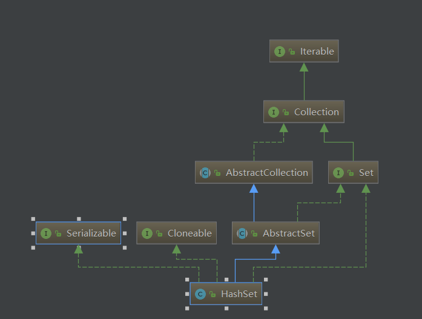
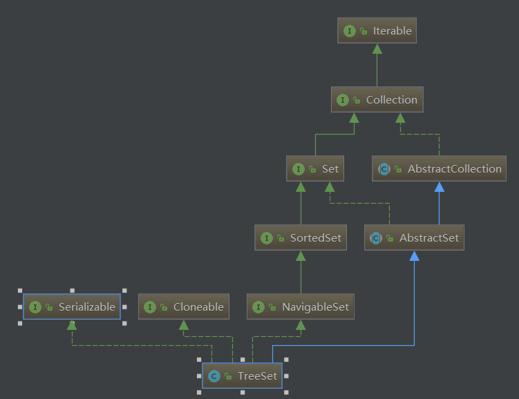
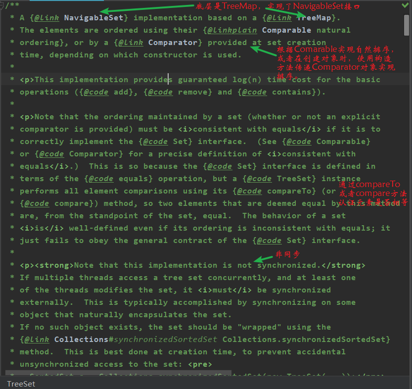
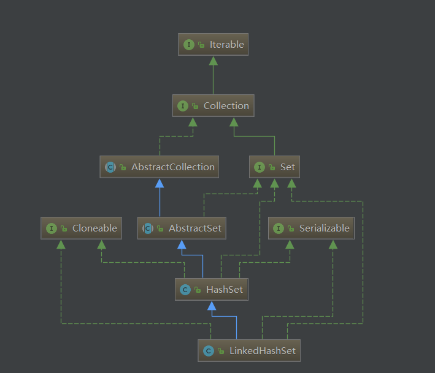

# Set 集合简单过一遍

## 1. 引言

- Set 接口是 Collection 的子接口，没有提供额外是方法。
- Set 集合不允许包含相同的元素，如果试把两个相同的元素加入同一个 Set 集合中，则添加操作失败。 
- Set 判断两个对象是否相同不是使用 == 运算符，而是根据 equals 方法 。


**特点**：

1. 无序性：不等于随机性，存储的数据在底层数组中并非按照数组索引的顺序添加，而是根据数据的哈希值决定的。
2. 不可重复性：不允许加入重复的元素。更确切地讲，新元素如果和Set中某个元素通过equals()方法对比为true，则不能加入;甚至，Set中也只能放入一个null元素，不能多个。


## 2. HashSet

### 2.1 继承结构图


​          


### 2.2 构造器


```
private transient HashMap<E,Object> map;

// Dummy value to associate with an Object in the backing Map
private static final Object PRESENT = new Object();

/**
     * Constructs a new, empty set; the backing <tt>HashMap</tt> instance has
     * default initial capacity (16) and load factor (0.75).
     */
public HashSet() {
    map = new HashMap<>();
}
```


从源码中可以看出，底层实际上是一个 HashMap 实例。


### 2.3 方法


```
public boolean add(E e) {
    return map.put(e, PRESENT)==null;
}

public boolean remove(Object o) {
    return map.remove(o)==PRESENT;
}
```


当我们调用 add 方法时，底层实际上调用的时 map 的 put 方法，但是 Map 是一个映射，有 key 和 value，既然 HashSet 底层使用的 HashSet，那么 value 在哪里呢？


**从源码中可以看出，value 是一个 Object，所有的 value 都是它。**


**所以可以总结出，HashSet 实际上就是封装了 HashMap，操作 HashSet 就是操作 HashMap，****这也是面向对象的一种体现，****重用性贼高****！**


## 3. TreeSet 

### 3.1 继承结构图





### 3.2 顶部注释分析





从顶部注释来看，我们可以总结出要点：

- 实现了 NavigableSet 接口
- 可以实现排序功能：自然排序或定制排序
- 底层实际上是一个 TreeMap 实例
- 非同步


### 3.3 构造方法


```
public TreeSet() {
    this(new TreeMap<E,Object>());
}
public boolean add(E e) {
    return m.put(e, PRESENT)==null;
}
```


### 3.4 自然排序

- TreeSet 会调用集合元素的 compareTo(Object obj) 方法来比较元素之间的大小关系，然后将集合元素按升序排列。
- 如果试图把一个对象添加到 TreeSet 时，则该对象的类必须实现 Comparable 接口。
- 实现 Comparable 的类必须实现 compareTo(Object obj) 方法，两个对象即通过 compareTo(Object obj) 方法的返回值来比较大小。


**典型实现** ：

- Date、Calendar：后边的时间、日期比前面的时间、日期大 。
- String：按字符串中字符的 unicode 值进行比较 。


```
public void test1() {
    TreeSet set = new TreeSet<>();
    //举例一：
    //        set.add(34);
    //        set.add(-34);
    //        set.add(43);
    //        set.add(8);

    //举例二：
    set.add(new Person("weishao",23));
    set.add(new Person("zhangsan",21));
    set.add(new Person("lisi",24));
    set.add(new Person("wangwu",25));
    set.add(new Person("wangwu",24));
    Iterator iterator = set.iterator();
    while (iterator.hasNext()) {
        Object next = iterator.next();
        System.out.println(next);
    }
}
package com.xuwei.Collection;

import java.util.Objects;

public class Person implements Comparable<Person>{
    private String name;
    private int age;

    public Person() {
    }

    public Person(String name, int age) {
        this.name = name;
        this.age = age;
    }

    @Override
    public String toString() {
        return "Person{" +
            "name='" + name + '\'' +
            ", age=" + age +
            '}';
    }

    //按照姓名从大到小排列,其次年龄从小到大
    @Override
    public int compareTo(Person o) {
        int compare = -this.name.compareTo(o.name);
        return compare == 0 ? Integer.compare(this.age,o.age) : compare;
    }

    @Override
    public boolean equals(Object o) {
        if (this == o) return true;
        if (o == null || getClass() != o.getClass()) return false;
        Person person = (Person) o;
        return age == person.age &&
            Objects.equals(name, person.name);
    }

    @Override
    public int hashCode() {
        return Objects.hash(name, age);
    }

    public String getName() {
        return name;
    }

    public void setName(String name) {
        this.name = name;
    }

    public int getAge() {
        return age;
    }

    public void setAge(int age) {
        this.age = age;
    }
}
```


### 3.5 定制排序

- 如果需要定制排序，比如降序排列，可通过Comparator接口的帮助。需要重写compare(T o1,T o2)方法。 
- 利用int compare(T o1,T o2)方法，比较o1和o2的大小：如果方法返回正整数，则表示o1大于o2；如果返回0，表示相等；返回负整数，表示o1小于o2。 
- 要实现定制排序，需要将实现Comparator接口的实例作为形参传递给TreeSet的构造器。 
- 此时，仍然只能向TreeSet中添加类型相同的对象。否则发生ClassCastException异常。 
- 使用定制排序判断两个元素相等的标准是：通过Comparator比较两个元素返回了0。


```
@Test
public void test2() {
    Comparator com = new Comparator() {
        @Override
        public int compare(Object o1, Object o2) {
            //按照年龄从小到大排列
            if (o1 instanceof  Person && o2 instanceof  Person) {
                Person u1 = (Person) o1;
                Person u2 = (Person) o2;
                return Integer.compare(u1.getAge(),u2.getAge());
            }else {
                throw new RuntimeException("输入的数据类型不匹配");
            }
        }
    };
    TreeSet set = new TreeSet(com);
    set.add(new Person("weishao",23));
    set.add(new Person("zhangsan",21));
    set.add(new Person("lisi",24));
    set.add(new Person("wangwu",25));
    set.add(new Person("wangwu",24));
    Iterator iterator = set.iterator();
    while (iterator.hasNext()) {
        Object next = iterator.next();
        System.out.println(next);
    }
}
```


## 4. LinkedHashSet 

### 4.1 继承结构图





### 4.2 顶部注释

代码就不放了，太多了，直接总结吧：

- 迭代有序。
- 运行为 null。
- 底层实际上是一个 **LinkedHashMap**
- 非同步
- 性能比 HashSet 差一点，因为要维护一个双向链表。
- 初始容量与迭代无关，LinkedHashSet 迭代的是双向链表


### 4.3 构造器


```
public LinkedHashSet() {
    super(16, .75f, true);
}
HashSet(int initialCapacity, float loadFactor, boolean dummy) {
    map = new LinkedHashMap<>(initialCapacity, loadFactor);
}
```


## 5. 总结

可以很明显的看到，Set 集合的底层都是 Map。

- **HashSet：无序，允许为 null，底层是 HashMap，****非线程同步。**
- **TreeSet：有序，不允许为 null，底层是 TreeMap(红黑树)，非线程同步。**
- **LinkedHashSet：迭代有序，允许为null，底层是HashMap+双向链表(**LinkedHashMap**)，非线程同步**


## 6. 面试题


```
public static void main(String[] args) {
        HashSet set = new HashSet();
        Person p1 = new Person(1001,"AA");
        Person p2 = new Person(1002,"BB");

        set.add(p1);
        set.add(p2);
        System.out.println(set); //[Person{id=1002, name='BB'}, Person{id=1001, name='AA'}]
        System.out.println("当前p1的hashCode为：" + p1.hashCode()); //34072
        p1.name = "CC";
        System.out.println("修改之后的p1的hashCode为：" + p1.hashCode()); //34136
        set.remove(p1);//删除过程：调用map的删除方法，获取当前hahsCode，然后经过hash运算得到存储位置，发现此位置为空
        System.out.println(set);

        set.add(new Person(1001,"CC"));
        System.out.println(set);
        set.add(new Person(1001,"AA"));//通过hashCode找到了存储位置，发现已经有元素，使用equals方法比较，内部不同，添加到链表的后面
        System.out.println(set);
    }
```