# Map 集合加油哈

## 1. 引言

- Map与Collection并列存在。用于保存具有映射关系的数据:Key-Value
- Map 中的 key 和  value 都可以是任何引用类型的数据
- Map 中的 key 用Set来存放，不允许重复，即同一个 Map 对象所对应的类，须重写hashCode()和equals()方法
- 常用String类作为Map的“键”
- key 和 value 之间存在单向一对一关系，即通过指定的 key 总能找到唯一的、确定的 value 


​                      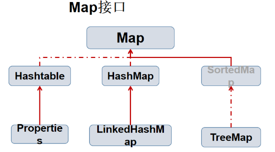


## 2. HashMap 的底层实现

### 2.1 继承结构图


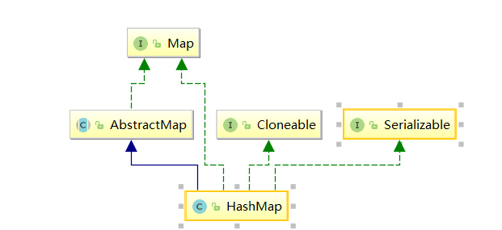


### 2.2 概念

HashMap 最早出现在 JDK 1.2中，底层基于散列算法实现。HashMap 允许 null 键和 null 值，在计算null 键的哈希值时，null 键哈希值为 0。HashMap 并不保证键值对的顺序，这意味着在进行某些操作后，键值对的顺序可能会发生变化。另外，需要注意的是，HashMap 是非线程安全类，在多线程环境下可能会存在问题。


散列算法分为散列再探测和拉链式。HashMap 则使用了拉链式的散列算法，并在 JDK 1.8 中引入了红黑树优化过长的链表。数据结构示意图如下：


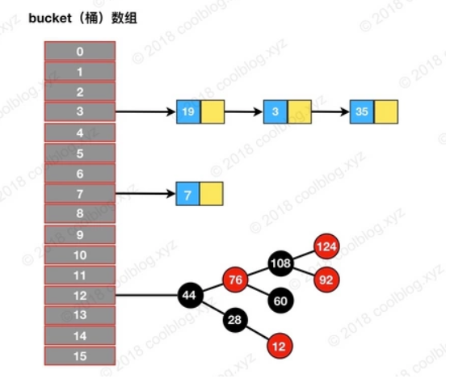


对于拉链式的散列算法，其数据结构是由数组和链表（或树形结构）组成。在进行增删查等操作时，首先要定位到元素的所在桶的位置，之后再从链表中定位该元素。比如我们要查询上图结构中是否包含元素`35`，步骤如下：

- 定位元素`35`所处桶的位置，`index = 35 % 16 = 3`
- 在`3`号桶所指向的链表中继续查找，发现35在链表中。


上面就是 HashMap 底层数据结构的原理，HashMap 基本操作就是对拉链式散列算法基本操作的一层包装。不同的地方在于 JDK 1.8 中引入了红黑树，底层数据结构由`数组+链表`变为了`数组+链表+红黑树`，不过本质并未变。


### 2.3 属性分析


```
//初始化容量为16
static final int DEFAULT_INITIAL_CAPACITY = 1 << 4; // aka 16

//最大容量为2的31次方
static final int MAXIMUM_CAPACITY = 1 << 30;

//默认负载因子为0.75
static final float DEFAULT_LOAD_FACTOR = 0.75f;

//当添加一个元素被添加到有至少TREEIFY_THRESHOLD个节点时，桶中的链表将被转换为树形结构
static final int TREEIFY_THRESHOLD = 8;

//桶上，不过是将树形结构转换为链表
static final int UNTREEIFY_THRESHOLD = 6;

//桶可能被转化为树形结构的最小容量
static final int MIN_TREEIFY_CAPACITY = 64;
```


**成员属性有这么几个：**

### 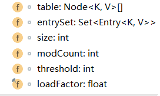


再来看一下 HashMap 的一个内部类 Node，也称之为“位桶数组”，其源码如下：


```
static class Node<K,V> implements Map.Entry<K,V> {
    final int hash;
    final K key;
    V value;
    Node<K,V> next;

    Node(int hash, K key, V value, Node<K,V> next) {
        this.hash = hash;
        this.key = key;
        this.value = value;
        this.next = next;
    }
}
```


一个Node 对象 存储了：

- key：键对象  
- value：值对象
- next：下一个结点
- hash：键对象的 hash 值


我们可以总结出 HashMap：

- **无序，允许为null，非同步**
- **底层由散列表(哈希表)实现**
- **初始容量和装载因子对HashMap影响挺大的，设置小了不好，设置大了也不好**


### 2.4 构造方法


```
/** 构造方法 1 */
public HashMap() {
    this.loadFactor = DEFAULT_LOAD_FACTOR; // all other fields defaulted
}

/** 构造方法 2 */
public HashMap(int initialCapacity) {
    this(initialCapacity, DEFAULT_LOAD_FACTOR);
}

/** 构造方法 3 */
public HashMap(int initialCapacity, float loadFactor) {
    if (initialCapacity < 0)
        throw new IllegalArgumentException("Illegal initial capacity: " +
                                           initialCapacity);
    if (initialCapacity > MAXIMUM_CAPACITY)
        initialCapacity = MAXIMUM_CAPACITY;
    if (loadFactor <= 0 || Float.isNaN(loadFactor))
        throw new IllegalArgumentException("Illegal load factor: " +
                                           loadFactor);
    this.loadFactor = loadFactor;
    this.threshold = tableSizeFor(initialCapacity);
}

/** 构造方法 4 */
public HashMap(Map<? extends K, ? extends V> m) {
    this.loadFactor = DEFAULT_LOAD_FACTOR;
    putMapEntries(m, false);
}
```


| 名称            | 用途                                                         |
| --------------- | ------------------------------------------------------------ |
| initialCapacity | HashMap 初始容量                                             |
| loadFactor      | 负载因子                                                     |
| threshold       | 当前 HashMap 所能容纳键值对数量的最大值，超过这个值，则需扩容 |


在上面的构造方法最后一行，我们会发现调用了`tableSizeFor()`，我们进去看看：


```
/**
 * Returns a power of two size for the given target capacity.
 */
static final int tableSizeFor(int cap) {
    int n = cap - 1;
    n |= n >>> 1;
    n |= n >>> 2;
    n |= n >>> 4;
    n |= n >>> 8;
    n |= n >>> 16;
    return (n < 0) ? 1 : (n >= MAXIMUM_CAPACITY) ? MAXIMUM_CAPACITY : n + 1;
}
```


上面的代码长的有点不太好看，总结起来就一句话：找到大于或等于 cap 的最小2的幂。

- threshold这个成员变量是阈值，决定了是否要将散列表再散列。它的值应该是：**`capacity \* load factor`**才对的。


其实这里仅仅是一个初始化，当创建哈希表的时候，它会重新赋值的：


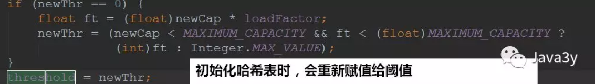


### 2.5 put 方法

put方法可以说是HashMap的核心，我们来看看：


```
public V put(K key, V value) {
    return putVal(hash(key), key, value, false, true);
}
```


调用了 putVal() 方法，以 key 计算哈希值，传入 key 和 value，还有两个参数。


我们来看看它是怎么计算哈希值的：


```
static final int hash(Object key) {
    int h;
    //得到 key 的 HashCode，与 KeyHashCode 的高16位做异或运算
    return (key == null) ? 0 : (h = key.hashCode()) ^ (h >>> 16);
}
```


为什么要这样干呢？？我们一般来说直接将key作为哈希值不就好了吗，做异或运算是干嘛用的？？我们看下来：


```
final V putVal(int hash, K key, V value, boolean onlyIfAbsent,
               boolean evict) {
    Node<K,V>[] tab; Node<K,V> p; int n, i;
    if ((tab = table) == null || (n = tab.length) == 0)
        n = (tab = resize()).length;
    if ((p = tab[i = (n - 1) & hash]) == null)
        tab[i] = newNode(hash, key, value, null);
    else {
        Node<K,V> e; K k;
        if (p.hash == hash &&
            ((k = p.key) == key || (key != null && key.equals(k))))
            e = p;
        else if (p instanceof TreeNode)
            e = ((TreeNode<K,V>)p).putTreeVal(this, tab, hash, key, value);
        else {
            for (int binCount = 0; ; ++binCount) {
                if ((e = p.next) == null) {
                    p.next = newNode(hash, key, value, null);
                    if (binCount >= TREEIFY_THRESHOLD - 1) // -1 for 1st
                        treeifyBin(tab, hash);
                    break;
                }
                if (e.hash == hash &&
                    ((k = e.key) == key || (key != null && key.equals(k))))
                    break;
                p = e;
            }
        }
        if (e != null) { // existing mapping for key
            V oldValue = e.value;
            if (!onlyIfAbsent || oldValue == null)
                e.value = value;
            afterNodeAccess(e);
            return oldValue;
        }
    }
    ++modCount;
    if (++size > threshold)
        resize();
    afterNodeInsertion(evict);
    return null;
}
```


我们是根据 key 的哈希值来保存在散列表中的，我们表默认的初始容量是16，要放到散列表中，就是0-15的位置上。也就是**`tab[i = (n - 1) & hash]`**。可以发现的是：在做`&`运算的时候，仅仅是**后4位有效**~那如果我们key的哈希值高位变化很大，低位变化很小。直接拿过去做`&`运算，这就会导致计算出来的Hash值相同的很多。


而设计者**将key的哈希值的高位也做了运算(与高16位做异或运算，使得在做&运算时，此时的低位实际上是高位与低位的结合)，这就增加了随机性**，减少了碰撞冲突的可能性！


下面我们再来看看流程是怎么样的：

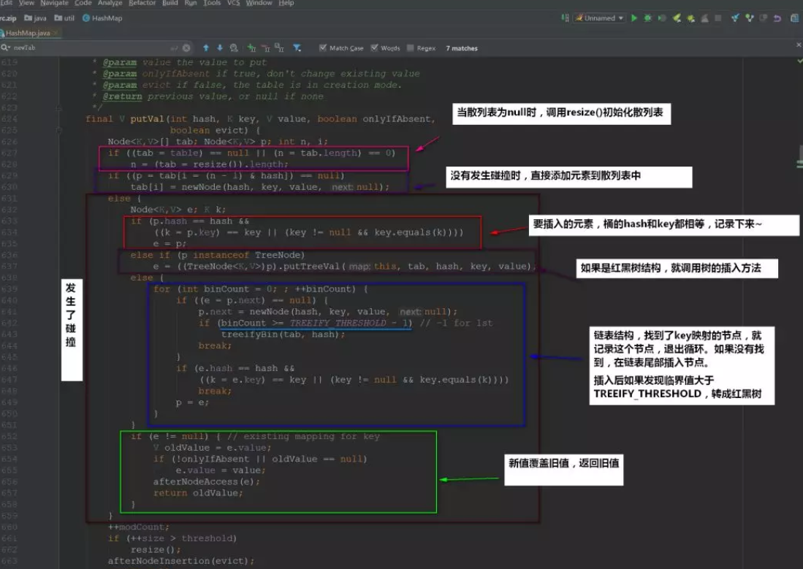


接下来我们看看`resize()`方法，在初始化的时候要调用这个方法，当散列表元素大于`capacity * load factor`的时候也是调用`resize()`

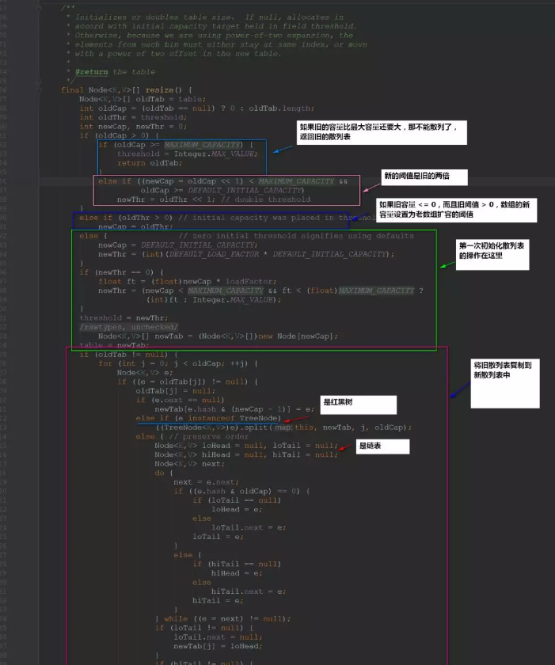


### 2.6 get 方法

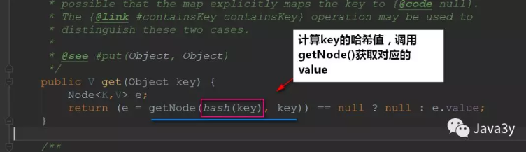


接下来我们看看`getNode()`是怎么实现的：

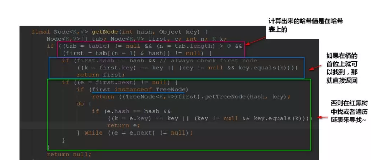


### 2.7 remove 方法

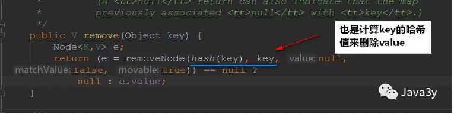


再来看看`removeNode()`的实现：

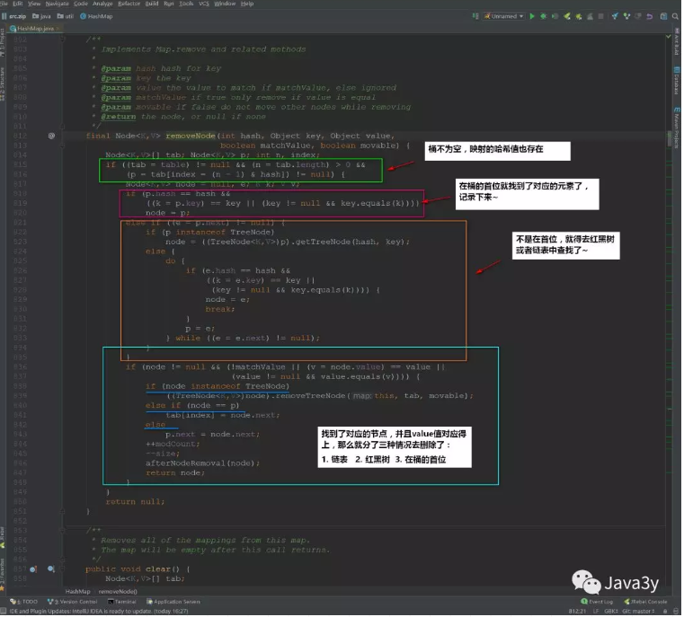