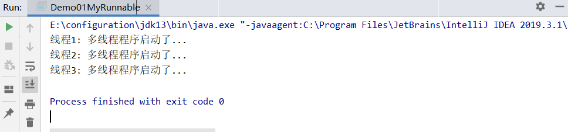

[TOC]

## 一、概述

### 1、什么是 Lambda 表达式？ 

Lambda 表达式是一个匿名函数，可以把 Lambda 表达式理解为一段可以传递的代码（将代码像数据一样进行传递），可以写出更简洁、更灵活的代码。

### 2、Lambda 怎么用？ 

Lambda 表达式再 Java 语言中引入了一个新的语法元素操作符 "->"，它将 Lambda 表达式分成两个部分：

- 左侧：指定了 Lambda 表达式所需要的参数。
- 右侧：指定了 Lambda 本体，即 Lambda 表达式要执行的功能。

### 3、为什么要用 Lambda 表达式？ 

有这么一个案例，启动一个线程，在控制台输出一句话：多线程程序启动了。

- 实现方式一：定义一个类 MyRunnable 实现 Runnable 接口。
- 实现方式二：使用匿名内部类。
- 实现方式三：使用 Lambda 表达式。

```java
public class Demo01MyRunnable {
    public static void main(String[] args) {
        new Thread(new MyRunnable(), "线程1").start();
        new Thread(new Runnable() {
            @Override
            public void run() {
                System.out.println(Thread.currentThread().getName() + ": 多线程程序启动了...");
            }
        }, "线程2").start();
        new Thread(() -> {
            System.out.println(Thread.currentThread().getName() + ": 多线程程序启动了...");
        }, "线程3").start();
    }
}

class MyRunnable implements Runnable {
    @Override
    public void run() {
        System.out.println(Thread.currentThread().getName() + ": 多线程程序启动了...");
    }
}
```



可以发现，使用 Lambda 表达式代码要简洁的多。

### 4、函数式编程思想

尽量忽略面向对象的复杂语法："强调做什么，而不是以什么形式去做"

### 4、Lambda 表达式的使用前提

1. **使用 Lambda 必须要有接口，且接口中只有一个抽象方法。**
2. **使用 Lambda 必须具有上下文推断，也就是方法的参数或者局部变量类型必须为 Lambda 对应的接口类型，才能使用 Lambda 作为该接口的实例。**

**注意：有且只有一个抽象方法的接口，称为函数式接口。**

## 二、Lambda 表达式的省略模式

### 1、省略的规则

1. 参数类型可以省略。但是有多个参数的情况下，不能只省略一个。
2. 如果参数有且仅有一个，那么小括号可以省略。
3. 如果代码块的语句只有一条，可以省略大括号和分号，和return关键字。

### 2、代码演示

```java
package com.xuwei.lambdas;

public class Demo02 {
    public static void main(String[] args) {
        useAddable((x, y) -> {return x + y;}); //省略参数类型

        useAddable(((x, y) -> x + y)); //代码块语句只有一条，省略大括号和分号，如果有return，也得省略

        useFlyable(s -> {System.out.println(s);}); //参数只有一个，小括号可以省略

        useFlyable(s -> System.out.println(s)); //代码块语句只有一条，省略大括号和分号
    }

    public static void useFlyable(Flyable f) {
        f.fly("风和日历，晴空万里");
    }

    public static void useAddable(Addable a) {
        int sum = a.add(10, 20);
        System.out.println(sum);
    }
}

interface Addable {
    int add(int x, int y);
}

interface Flyable {
    void fly(String s);
}
```

## 三、Lambda 表达式和匿名内部类的区别

**所需类型不同**

- 匿名内部类：可以是接口，也可以是抽象类，还可以是具体类。
- Lambda 表达式：只能是接口。

**使用限制不同**

- 如果接口中有且仅有一个抽象方法，可以使用Lambda表达式，也可以使用匿名内部类。
- 如果接口中多于一个抽象方法，只能使用匿名内部类，而不能使用Lambda表达式

**实现原理不同**

- 匿名内部类：编译之后，产生一个单独的.class字节码文件。
- Lambda表达式：编译之后，没有一个单独的.class字节码文件。对应的字节码会在运行的时候动态生成。