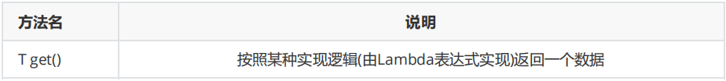
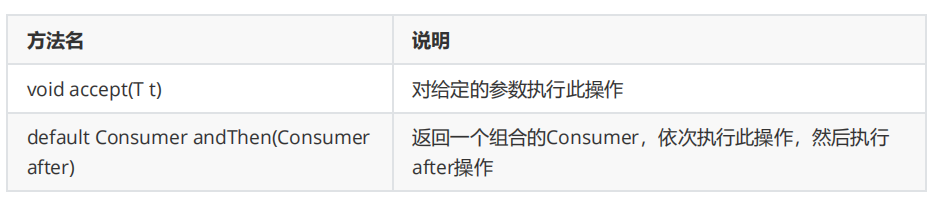
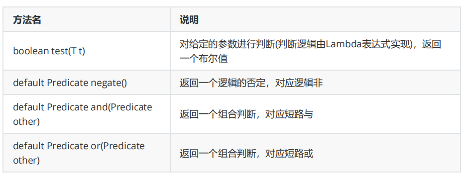
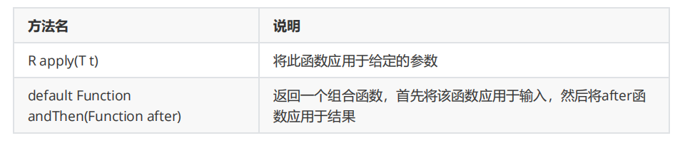

[TOC]

## 一、概述

**什么是函数式接口？**

有且只有一个抽象方法的接口。

**如何检测一个接口是不是函数式接口？**

使用注解：@FuntionalInterface，放在接口上方。自己定义函数式接口时，建议加上注解@FuntionalInterface。

## 二、常用函数式接口

### 1、Supplier

**Supplier 接口**

Supplier 接口也被称为生产型接口，如果我们指定了接口的泛型是什么类型，那么接口中的 get 方法就会生产

什么类型的数据供我们使用。

**常用方法**



**代码演示**

```java
public class Demo01Supplier {
    public static void main(String[] args) {
        String s = getString(() -> "林青霞");
        System.out.println(s);

        Integer i = getInteger(() -> 30);
        System.out.println(i);
    }

    //定义一个方法，返回一个整型数据
    private static Integer getInteger(Supplier<Integer> sup) {
        return sup.get();
    }

    //定义一个方法，返回一个字符串数据
    public static String getString(Supplier<String> sup) {
        return sup.get();
    }
}
```

**获取最大值**

```java
public class Demo02Supplier {
    public static void main(String[] args) {
        //定义一个int数组
        int[] arr = {19, 57, 23, 44, 23};

        int maxValue = getMax(() -> {
            int max = arr[0];
            for (int i = 1; i < arr.length; i++) {
                if (arr[i] > max) {
                    max = arr[i];
                }
            }
            return max;
        });
        System.out.println(maxValue);
    }

    public static int getMax(Supplier<Integer> sup) {
        return sup.get();
    }
}
```

### 2、Consumer

**Consumer 接口**

Consumer 接口被称为消费型接口，它消费的数据类型由泛型指定。

**常用方法**



**代码演示**

```java
public class Demo03Consumer {
    public static void main(String[] args) {
        //传入两个操作使用andThen完成
        operatorString("威少", s -> System.out.println(s), s -> System.out.println(new StringBuilder(s).reverse().toString()));
    }

    //定义一个方法，用不同的方式消费同一个字符串数据两次
    public static void operatorString(String name, Consumer<String> con1, Consumer<String> con2) {
        //        con1.accept(name);
        //        con2.accept(name);
        con1.andThen(con2).accept(name);
    }
}
```

**按要求打印信息**

String[] strArray = {"林青霞,30", "张曼玉,35", "王祖贤,33"};

字符串数组中有多条信息，请按照格式：“姓名：XX,年龄：XX"的格式将信息打印出来

```java
public class Demo04Consumer {
    public static void main(String[] args) {
        String[] strArray = {"刘德华,54", "张曼玉,23", "王无线,24"};

        printInfo(strArray, str -> System.out.println("姓名：" + str.split(",")[0]),
                  str -> System.out.println("年龄：" + str.split(",")[1]));
    }

    public static void printInfo(String[] strArray, Consumer<String> con1, Consumer<String> con2) {
        for (String str : strArray) {
            con1.andThen(con2).accept(str);
        }
    }
}
```

### 3、Predicate

**Predicate 接口**

Predicate接口通常用于判断参数是否满足指定的条件

**常用方法**



**代码演示**

```java
public class Demo05Predicate {
    public static void main(String[] args) {
        boolean b1 = checkString("hello", s -> s.length() > 8);
        System.out.println(b1); //true
        boolean b2 = checkString("helloworld", s -> s.length() > 8);
        System.out.println(b2); //false
    }

    //判断给定的字符串是否满足要求
    private static boolean checkString(String s, Predicate<String> pre) {
        return pre.negate().test(s);
    }
}
```

**筛选满足条件数据**

- String[] strArray = {"林青霞,30", "柳岩,34", "张曼玉,35", "貂蝉,31", "王祖贤,33"};
- 字符串数组中有多条信息，请通过Predicate接口的拼装将符合要求的字符串筛选到集合ArrayList中，并遍历ArrayList集合
- 同时满足如下要求：姓名长度大于2；年龄大于33

```java
public class Demo06Predicate {
    public static void main(String[] args) {
        String[] strArray = {"林青霞,30", "柳岩,34", "张曼玉,35", "貂蝉,31", "王祖贤,33"};

        ArrayList<String> array = myFilter(strArray, s -> s.split(",")[0].length() > 2,
                                           s -> Integer.parseInt(s.split(",")[1]) > 33);

        for (String str : array) {
            System.out.println(str);
        }

    }

    //通过Predicate接口的拼装将符合要求的字符串筛选到集合ArrayList中
    private static ArrayList<String> myFilter(String[] strArray, Predicate<String>
                                              pre1, Predicate<String> pre2) {
        //定义一个集合
        ArrayList<String> array = new ArrayList<>();

        //遍历数组
        for (String str : strArray) {
            if (pre1.and(pre2).test(str)) {
                array.add(str);
            }
        }
        return array;
    }
}
```

### 4、Function

**Function 接口**

Function<T,R> 接口通常用于对参数进行处理，转换(处理逻辑由Lambda表达式实现)，然后返回一个新的值。

**常用方法**



**代码演示**

```java
public class Demo07 {
    public static void main(String[] args) {
        //操作一
        convert("100",s -> Integer.parseInt(s));
        //操作二
        convert(100,i -> String.valueOf(i + 566));
        //使用andThen的方式连续执行两个操作
        convert("100", s -> Integer.parseInt(s), i -> String.valueOf(i + 566));
    }

    //定义一个方法，把一个字符串转换int类型，在控制台输出
    private static void convert(String s, Function<String,Integer> fun) {
        // Integer i = fun.apply(s);
        int i = fun.apply(s);
        System.out.println(i);
    }

    //定义一个方法，把一个int类型的数据加上一个整数之后，转为字符串在控制台输出
    private static void convert(int i, Function<Integer,String> fun) {
        String s = fun.apply(i);
        System.out.println(s);
    }

    //定义一个方法，把一个字符串转换int类型，把int类型的数据加上一个整数之后，转为字符串在控制台输出
    private static void convert(String s, Function<String,Integer> fun1,
                                Function<Integer,String> fun2) {
        String ss = fun1.andThen(fun2).apply(s);
        System.out.println(ss);
    }
}
```

**练习描述**

- String s = "林青霞,30";
- 请按照我指定的要求进行操作：

- - 1:将字符串截取得到数字年龄部分
    - 2:将上一步的年龄字符串转换成为int类型的数据
    - 3:将上一步的int数据加70，得到一个int结果，在控制台输出

```java
public class Demo08 {
    public static void main(String[] args) {
        String s = "林青霞,30";
        convert(s, ss -> ss.split(",")[1], Integer::parseInt, i -> i + 10);
    }

    private static void convert(String s, Function<String, String> fun1,
                                Function<String, Integer> fun2, Function<Integer, Integer> fun3) {
        int i = fun1.andThen(fun2).andThen(fun3).apply(s);
        System.out.println(i);
    }
}
```