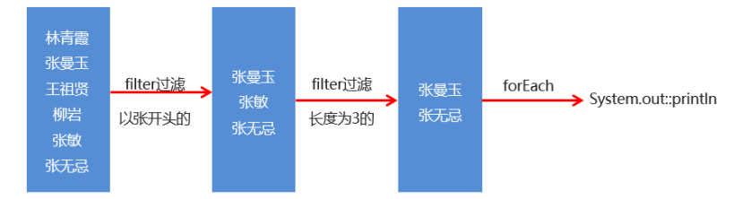
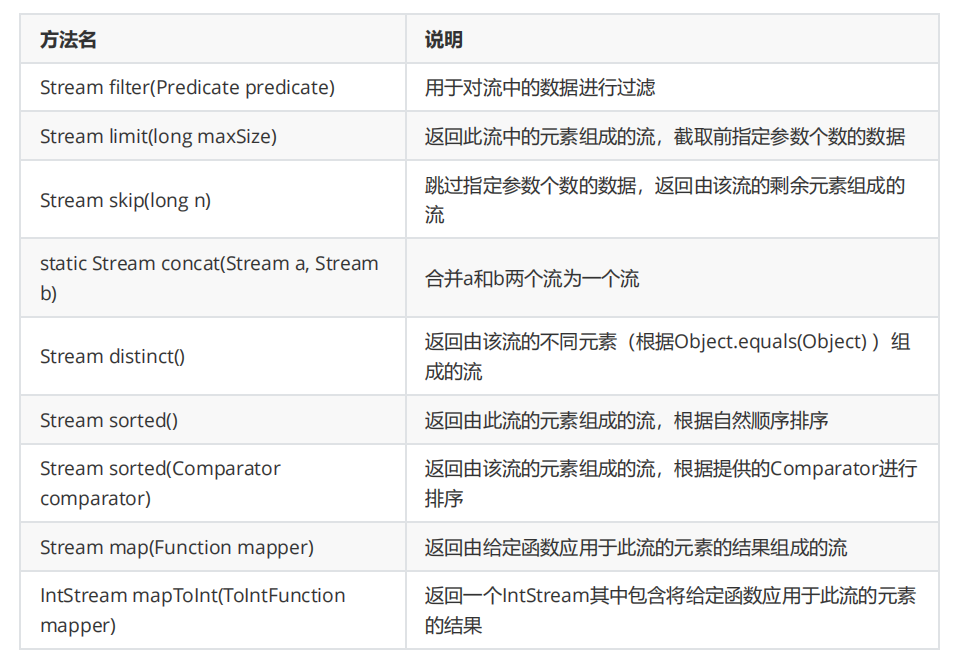
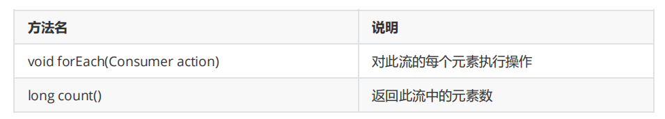
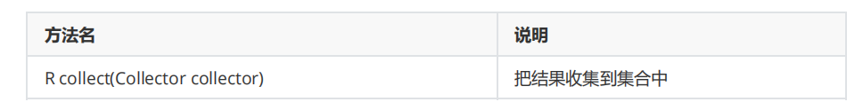
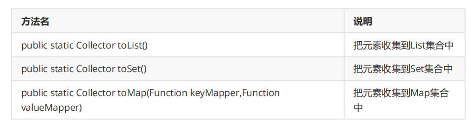

[TOC]

## 一、概述

**案例需求**

- 创建一个集合，存储多个字符串元素
- 把集合中所有以"张"开头的元素存储到一个新的集合
- 把"张"开头的集合中的长度为3的元素存储到一个新的集合
- 遍历上一步得到的集合

```java
public class Demo01Stream {
    public static void main(String[] args) {
        //创建一个集合，存储多个字符串元素
        ArrayList<String> list = new ArrayList<>();

        list.add("林青霞");
        list.add("张曼玉");
        list.add("王祖贤");
        list.add("柳岩");
        list.add("张敏");
        list.add("张无忌");

        //Stream 流来改进
        list.stream().filter(s -> s.startsWith("张")).filter(s -> s.length() == 3)
            .forEach(System.out::println);
    }
}
```

**什么是 Stream 流？**

Stream 就如同一个迭代器（Iterator），`单向`，`不可往复`，`数据只能遍历一次`，`遍历过一次后即用尽了，就好比流水从面前流过`，一去不复返。

**Stream 流的好处**

- 可以直接阅读代码的字面意思：获取流、过滤姓张、过滤长度为3、逐一打印
- Stream流把真正的函数式编程风格引入到 Java 中

## 二、Stream 流的常见生成方式

**Stream 流的思想**



**生成 Stream 流的方式**

- Collection 集合：使用默认方法 stream() 直接生成
- Map 集合：把 Map 转换成 Set 集合，间接的生成流
- 数组：通过 Stream 接口的静态方法 of(T... values) 生成流

**代码演示**

```java
public class Demo02Stream {
    public static void main(String[] args) {
        //Collection 集合可以使用默认方法 stream() 生成流
        List<String> list = new ArrayList<>();
        Stream<String> listStream = list.stream();

        //Map 集合间接生成流
        Map<String, Integer> map = new HashMap<>();
        Stream<String> keyStream = map.keySet().stream();
        Stream<Integer> valuesStream = map.values().stream();
        Stream<Map.Entry<String, Integer>> entryStream = map.entrySet().stream();

        //数组通过 Stream 接口的静态方法生成流
        String[] arr = {"1", "2", "3"};
        Stream<String> strArrayStream = Stream.of(arr);
        Stream<String> strArrayStream2 = Stream.of("hello", "world", "java");
        Stream<Integer> intStream = Stream.of(10, 20, 30);
    }
}
```

## 三、Stream 流中间操作方法

**概念**

中间操作的意思是，执行完此方法之后，Stream流依然可以继续执行其他操作。

**常见方法**



```java
public class Demo03 {
    public static void main(String[] args) {
        //创建一个集合，存储多个字符串元素
        ArrayList<String> list = new ArrayList<String>();
        list.add("林青霞");
        list.add("张曼玉");
        list.add("王祖贤");
        list.add("柳岩");
        list.add("张敏");
        list.add("张无忌");

        //limit 取前3个数据在控制台输出
        list.stream().limit(3).forEach(System.out::println);
        //skip 跳过3个元素，把剩下的元素在控制台输出
        list.stream().skip(3).forEach(System.out::println);
        //跳过2个元素，把剩下的元素中前2个在控制台输出
        list.stream().skip(2).limit(2).forEach(System.out::println);

        //需求1：取前4个数据组成一个流
        Stream<String> s1 = list.stream().limit(4);
        //需求2：跳过2个数据组成一个流
        Stream<String> s2 = list.stream().skip(2);
        ///需求3：合并需求1和需求2得到的流，并把结果在控制台输出
        Stream.concat(s1, s2).forEach(System.out::println);
        //需求4：合并需求1和需求2得到的流，并把结果在控制台输出，要求字符串元素不能重复
        Stream.concat(s1,s2).distinct().forEach(System.out::println);

        //需求5：按照字母顺序把数据在控制台输出
        list.stream().sorted().forEach(System.out::println);
        //需求6：按照字符串长度把数据在控制台输出
        list.stream().sorted((s11,s22) -> {
            int num = s11.length()-s22.length();
            int num2 = num==0?s11.compareTo(s22):num;
            return num2;
        }).forEach(System.out::println);

        //需求7：将集合中的字符串数据转换为整数之后在控制台输出
        list.stream().map(s -> Integer.parseInt(s)).forEach(System.out::println);
    }
}
```

## 四、Stream 流终结操作方法

**概念**

终结操作的意思是，执行完此方法之后，Stream流将不能再执行其他操作。

**常用方法**




```java
public class Demo03 {
    public static void main(String[] args) {
        //创建一个集合，存储多个字符串元素
        ArrayList<String> list = new ArrayList<String>();
        list.add("林青霞");
        list.add("张曼玉");
        list.add("王祖贤");
        list.add("柳岩");
        list.add("张敏");
        list.add("张无忌");
        //需求1：把集合中的元素在控制台输出
        list.stream().forEach(System.out::println);

        //需求2：统计集合中有几个以张开头的元素，并把统计结果在控制台输出
        long count = list.stream().filter(s -> s.startsWith("张")).count();
        System.out.println(count); //3
    }
}
```

## 五、Stream 流综合练习

**案例需求**

现在有两个 ArrayList 集合，分别存储 6 名男演员名称和 6 名女演员名称，要求完成如下的操作

- 男演员只要名字为3个字的前三人
- 女演员只要姓林的，并且不要第一个
- 把过滤后的男演员姓名和女演员姓名合并到一起
- 把上一步操作后的元素作为构造方法的参数创建演员对象,遍历数据

演员类 Actor 已经提供，里面有一个成员变量，一个带参构造方法，以及成员变量对应的 get/set 方法。

```java
public class Demo04 {
    public static void main(String[] args) {
        //创建集合
        ArrayList<String> manList = new ArrayList<String>();
        manList.add("周润发");
        manList.add("成龙");
        manList.add("刘德华");
        manList.add("吴京");
        manList.add("周星驰");
        manList.add("李连杰");
        ArrayList<String> womanList = new ArrayList<String>();
        womanList.add("林心如");
        womanList.add("张曼玉");
        womanList.add("林青霞");
        womanList.add("柳岩");
        womanList.add("林志玲");
        womanList.add("王祖贤");

        //男演员只要名字为3个字的前三人,女演员只要姓林的，并且不要第一个
        //把过滤后的男演员姓名和女演员姓名合并到一起
        //把上一步操作后的元素作为构造方法的参数创建演员对象,遍历数据
        Stream.concat(
            manList.stream().filter(s -> s.length() == 3).limit(3),
            womanList.stream().filter(s -> s.startsWith("林")).skip(1)
        ).map(Actor::new).forEach(p -> System.out.println(p.getName()));
    }
}
```

## 六、Stream 流的收集操作

**概念**

对数据使用 Stream 流的方式操作完毕后，可以把流中的数据收集到集合中

**常用方法**



**工具类 Collectors 提供了具体的收集方式**



**代码演示**

```java
public class Demo05 {
    public static void main(String[] args) {
        //创建List集合对象
        List<String> list = new ArrayList<String>();
        list.add("林青霞");
        list.add("张曼玉");
        list.add("王祖贤");
        list.add("柳岩");

        //创建Set集合对象
        Set<Integer> set = new HashSet<Integer>();
        set.add(10);
        set.add(20);
        set.add(30);
        set.add(33);
        set.add(35);

        //定义一个字符串数组，每一个字符串数据由姓名数据和年龄数据组合而成
        String[] strArray = {"林青霞,30", "张曼玉,35", "王祖贤,33", "柳岩,25"};

        //需求1：得到名字为3个字的流
        Stream<String> listStream = list.stream().filter(s -> s.length() == 3);

        //需求2：把使用Stream流操作完毕的数据收集到List集合中并遍历
        List<String> names = listStream.collect(Collectors.toList());
        for(String name : names) {
            System.out.println(name);
        }

        //需求3：得到年龄大于25的流
        Stream<Integer> setStream = set.stream().filter(age -> age > 25);

        //需求4：把使用Stream流操作完毕的数据收集到Set集合中并遍历
        Set<Integer> ages = setStream.collect(Collectors.toSet());
        for(Integer age : ages) {
            System.out.println(age);
        }

        //需求5：得到字符串中年龄数据大于28的流
        Stream<String> arrayStream = Stream.of(strArray).filter(s ->
                  Integer.parseInt(s.split(",")[1]) > 28);

        //需求6：把使用Stream流操作完毕的数据收集到Map集合中并遍历，字符串中的姓名作键，年龄作值
        Map<String, Integer> map = arrayStream.collect(Collectors.toMap(s ->
                  s.split(",")[0], s -> Integer.parseInt(s.split(",")[1])));

        Set<String> keySet = map.keySet();
        for (String key : keySet) {
            Integer value = map.get(key);
            System.out.println(key + "," + value);
        }
    }
}
```