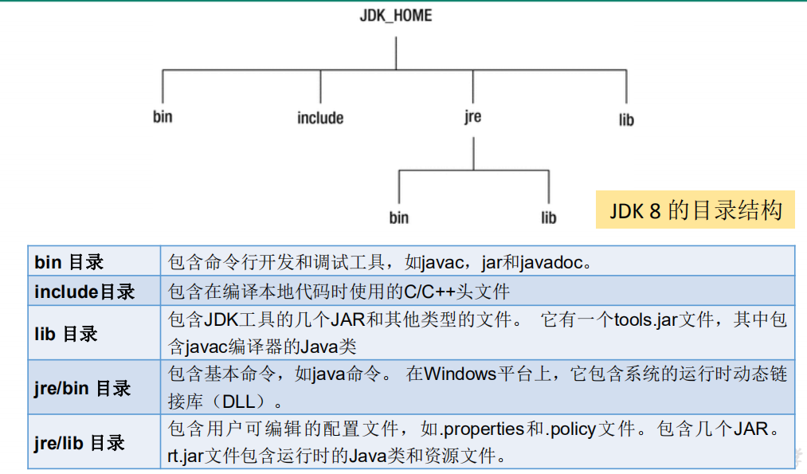
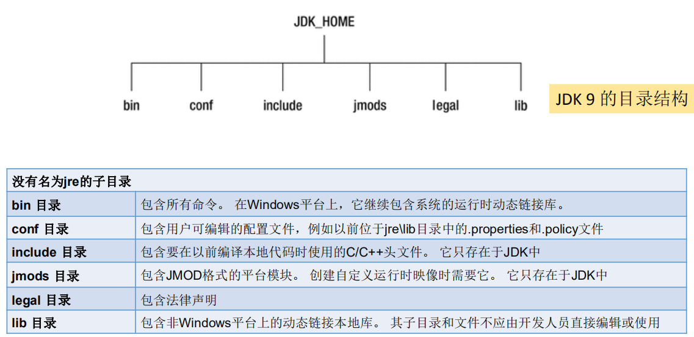
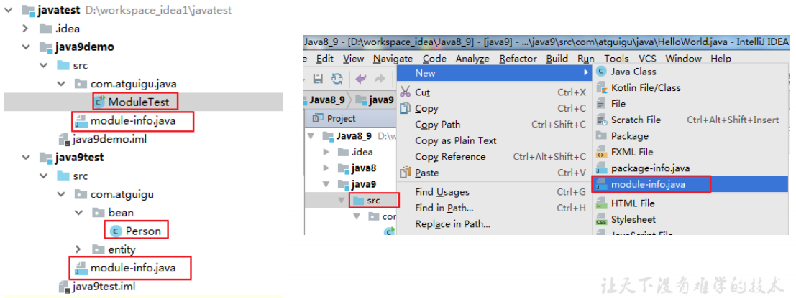
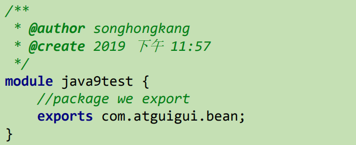
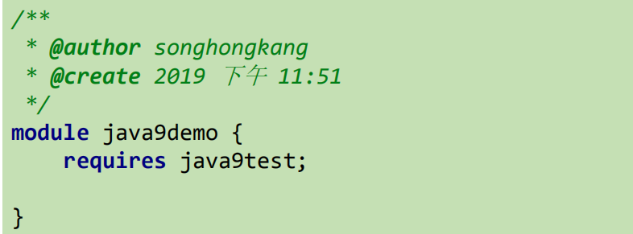
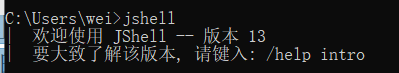
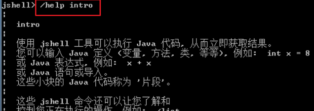
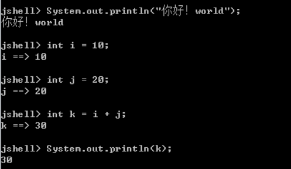

[TOC]

## 一、前言

主要介绍两个最重要的新特性， **模块化系统** 和 **jshell命令。**

## 二、JDK 目录发生的变化

## 三、模块化系统

**问题的产生**

- Java 运行环境的膨胀和臃肿。
- 当代码库越来越大，创建复杂，盘根错节的“意大利面条式代码”的几率呈指数级的增长。
- 很难真正地对代码进行封装, 而系统并没有对不同部分（也就是 JAR 文件）之间的依赖关系有个明确的概念。每一个公共类都可以被类路径之下任何其它的公共类所访问到，这样就会导致无意中使用了并不想被公开访问的 API。

**怎么解决**

Java 9 最大的变化之一是引入了模块系统（Jigsaw 项目），用模块来管理各个package，通过声明某个package

暴露，，模块(module)的概念，其实就是package外再裹一层，不声明默认就是隐藏。因此，模块化使得代码组织上更安全，因为它可以指定哪些部分可以暴露，哪些部分隐藏。

模块将由通常的类和新的模块声明文件（module-info.java）组成。该文件是位于java代码结构的顶层，该模块描述符明确地定义了我们的模块需要什么依赖关系，以及哪些模块被外部使用。在exports子句中未提及的所有包默认情况下将封装在模块中，不能在外部使用。

要想在java9demo模块中调用java9test模块下包中的结构，需要在java9test的module-info.java中声明

**exports：控制着哪些包可以被其它模块访问到。所有不被导出的包默认都被封装在模块里面。**
对应在java 9demo 模块的src 下创建module-info.java文件：

requires：指明对其它模块的依赖。

## 四、Java的REPL工具： jShell命令

Java 9 中终于拥有了 REPL工具：jShell。让Java可以像脚本语言一样运行，从控制台启动jShell，利用 jShell 在没有创建类的情况下直接声明变量，计算表达式，执行语句。即开发时可以在命令行里直接运行Java的代码，而无需创建Java文件，无需跟人解释”public static void main(String[] args)”这句废话。

**调用 jShell**

**获取帮助**

**基本使用**

**导入指定的包**

