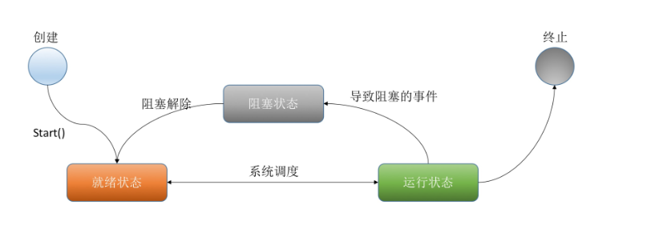

# 1. 基本概念

## 1. 进程与线程

进程是一个具有一定独立功能的程序关于某个数据集合的一次运行活动。它是**操作系统动态执行的基本单元**，在传统的操作系统中，进程既是基本的分配单元，也是基本的执行单元。

线程：通常在一个进程中可以包含若干个线程，当然**一个进程中至少有一个线程**，不然没有存在的意义。线程可以利用进程所拥有的资源，在引入线程的操作系统中，**通常都是把进程作为分配资源的基本单位，而把线程作为独立运行和独立调度的基本单位**，由于线程比进程更小，基本上不拥有系统资源，故对它的调度所付出的开销就会小得多，能更高效的提高系统多个程序间并发执行的程度。

比如使用 QQ，打开任务管理器一定有一个 QQ.exe 的进程，我可以用 qq 和 A 文字聊天，和 B 视频聊天，给 C 传文件等等。大四的时候写论文，用 word 写论文，同时使用 qq音乐放音乐，同时用QQ聊天，多个进程。

word 如果没有保存，停电关机，再通电后打开 word 可以恢复之前未保存的文档，word 也会检查你的拼写，两个线程：**容灾备份，语法检查**。

## 2. 并发与并行

##### 并行

并行(parallel)：指在同一时刻，有多条指令在多个处理器上同时执行。所以无论从微观还是从宏观来看，二者都是一起执行的。

##### 并发

并发(concurrency)：指在同一时刻只能有一条指令执行，但多个进程指令被快速的轮换执行，使得在宏观上具有多个进程同时执行的效果，但在微观上并不是同时执行的，只是把时间分成若干段，使多个进程快速交替的执行。

举个例子来说：

1. 你吃饭吃到一半，电话来了，你一直到吃完了以后才去接，这就说明你不支持并发也不支持并行。
2. 你吃饭吃到一半，电话来了，并发应该是一手筷子，一手电话，说一句话，咽一口饭，之间很快。
3. 并行是咽一口饭同时说一句话，而这光靠一张嘴是办不到的，至少两张嘴。

- **并发的关键是你有处理多个任务的能力，不一定要同时。**
- **并行的关键是你有同时处理多个任务的能力。**

**
**

**
**

**
**

## 3. 同步与异步

同步就好比：你去外地上学(人生地不熟)，突然生活费不够了；此时你决定打电话回家，通知家里转生活费过来，可是当你拨出电话时，对方一直处于待接听状态(即：打不通，联系不上)，为了拿到生活费，你就不停的 oncall、等待，最终可能不能及时要到生活费，导致你今天要做的事都没有完成，而白白花掉了时间。

异步就是：在你打完电话发现没人接听时，猜想：对方可能在忙，暂时无法接听电话，所以你发了一条短信(或者语音留言，亦或是其他的方式)通知对方后便忙其他要紧的事了；这时你就不需要持续不断的拨打电话，还可以做其他事情；待一定时间后，对方看到你的留言便回复响应你，当然对方可能转钱也可能不转钱。但是整个一天下来，你还做了很多事情。 或者说你找室友临时借了一笔钱，又开始 happy 的上学时光了。

简而言之，：**同步可以看做是一个单线程操作，只要客户端请求了，在服务器没有反馈信息之前是一个线程阻塞状态（就是假死状态，不能操作其他方法）。****异步肯定是个多线程。在客户端请求时，可以执行其他线程，并且在把这个线程存放在他的队列里面，有序的执行。（可以设置线程的数量，当超过最大时会显示等待状态）。**

**
**

线程同步：多个线程同时访问同一资源，等待资源访问结束，浪费时间，效率低。

线程异步：访问资源时在空闲等待时同时访问其他资源，实现多线程机制。

## 4. 线程状态

1. **新建(NEW)**：新创建了一个线程对象。
2. **可运行(RUNNABLE)**：线程对象创建后，其他线程(比如main线程）调用了该对象的start()方法。该状态的线程位于可运行线程池中，等待被线程调度选中，获取cpu 的使用权 。
3.  **运行(RUNNING)**：可运行状态(runnable)的线程获得了cpu 时间片（timeslice） ，执行程序代码。
4.  **阻塞(BLOCKED)**：阻塞状态是指线程因为某种原因放弃了cpu 使用权，也即让出了cpu timeslice，暂时停止运行。直到线程进入可运行(runnable)状态，才有机会再次获得cpu timeslice 转到运行(running)状态。阻塞的情况分三种： 

1. 1. **等待阻塞：运行(running)的线程执行o.wait()方法，JVM会把该线程放入等待队列(waitting queue)中。**
    2. **同步阻塞：运行(running)的线程在获取对象的同步锁时，若该同步锁被别的线程占用，则JVM会把该线程放入锁池(lock pool)中。**
    3. **其他阻塞：运行(running)的线程执行Thread.sleep(long ms)或t.join()方法，或者发出了I/O请求时，JVM会把该线程置为阻塞状态。当sleep()状态超时、join()等待线程终止或者超时、或者I/O处理完毕时，线程重新转入可运行(runnable)状态。**

1. **死亡(DEAD)**：线程run()、main() 方法执行结束，或者因异常退出了run()方法，则该线程结束生命周期。死亡的线程不可再次复生。