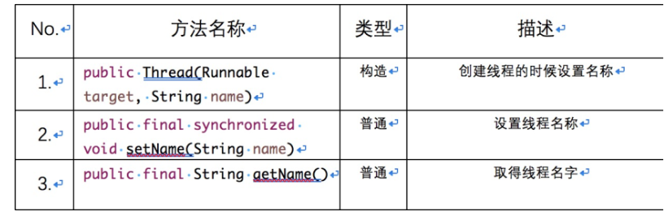

# 3. 多线程常用操作方法

## 1. 线程命名与取得

要想取得线程的对象，在Thread类中提供有一个方法取得当前线程对象：


```
public static native Thread currentThread();
```


在 Thread 类中提供有如下的线程名称方法：





## 2. 线程休眠（Sleep）

线程休眠：指的是让线程暂缓执行一下，等到了预计时间之后再恢复执行。会交出CPU，让CPU去执行其他的任务。但是有一点要非常注意，**sleep****方法不会释放锁，也就是说如果当前线程持有对某个对象的锁，则即使调用****sleep****方法，其他线程也无法访问这个对象。**


## 3. 线程让步（yield）

线程让步：**暂停当前正在执行的线程对象，并执行其他线程。**意思就是调用yield方法会让当前线程交出CPU权限，让CPU去执行其他的线程。它跟sleep方法类似，同样不会释放锁。但是yield不能控制具体的交出CPU的时间，另外，yield 方法只能让拥有相同优先级的线程有获取CPU执行时间的机会。


```
public class Demo05 {
    public static void main(String[] args) {
        MyThread5 mt = new MyThread5();
        new Thread(mt, "线程1").start();
        new Thread(mt, "线程2").start();
        new Thread(mt, "线程3").start();
    }
}

class MyThread5 implements Runnable {
    @Override
    public void run() {
        for (int i = 0; i < 3; i++) {
            Thread.yield();
            System.out.println(Thread.currentThread().getName() + ": " + i);
        }
    }
}
```


## 4. join() 方法

join() ：等待该线程终止。意思就是如果在主线程中调用该方法时就会让主线程休眠，让调用该方法的线程 run方法先执行完毕之后再开始执行主线程。


```
package com.xuwei.threads;

import java.text.DateFormat;
import java.text.SimpleDateFormat;
import java.util.Date;

public class Demo06 {
    public static void main(String[] args) throws InterruptedException {
        MyThread6 mt = new MyThread6();
        Thread ta = new Thread(mt, "子线程A");
        ta.start();
        ta.join();
        System.out.println(Thread.currentThread().getName());
        System.out.println("代码结束");
    }

    public static void printTime() {
        Date date = new Date();
        DateFormat format = new SimpleDateFormat("yyyy-MM-dd HH:mm:ss");
        String time = format.format(date);
        System.out.println(time);
    }
}

class MyThread6 implements Runnable {
    @Override
    public void run() {
        System.out.println("当前线程睡眠前的时间：");
        Demo06.printTime();
        for (int i = 0; i < 10000; i++) {
            System.out.println(Thread.currentThread().getName() + ": " + i);
        }
        System.out.println("睡眠结束的时间：");
        Demo06.printTime();
    }
}
```


## 5. 线程停止

多线程中有三种方式可以停止线程


## 6. 线程优先级


## 7. 守护线程


## 8. 线程的生命周期