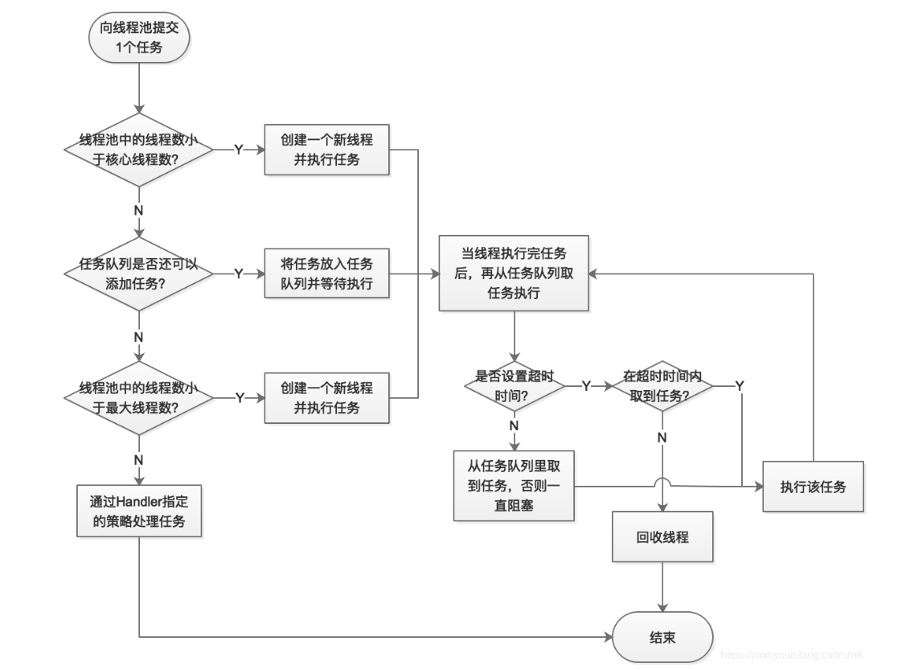

# 7. 线程池

## 1. 线程池的概述

Java中的线程池是运用场景最多的并发框架，几乎所有需要异步或者并发执行任务的程序都可以使用线程池。开发中使用线程池的三个优点如下：

> 1. 降低资源消耗:通过重复利用已创建的线程降低线程创建和销毁带来的消耗。
> 2. 提高响应速度:当任务到达时，任务可以不需要等待线程创建就能立即执行。
>
> 1. 提高线程的可管理性:使用线程池可以统一进行线程分配、调度和监控


## 2. 线程池的使用

线程池的真正实现类是 ThreadPoolExecutor，其构造方法有如下4种：


```
public ThreadPoolExecutor(int corePoolSize,
                              int maximumPoolSize,
                              long keepAliveTime,
                              TimeUnit unit,
                              BlockingQueue<Runnable> workQueue) {
        this(corePoolSize, maximumPoolSize, keepAliveTime, unit, workQueue,
             Executors.defaultThreadFactory(), defaultHandler);
    }
```


```
public ThreadPoolExecutor(int corePoolSize,
                              int maximumPoolSize,
                              long keepAliveTime,
                              TimeUnit unit,
                              BlockingQueue<Runnable> workQueue,
                              ThreadFactory threadFactory) {
        this(corePoolSize, maximumPoolSize, keepAliveTime, unit, workQueue,
             threadFactory, defaultHandler);
    }
```


```
public ThreadPoolExecutor(int corePoolSize,
                              int maximumPoolSize,
                              long keepAliveTime,
                              TimeUnit unit,
                              BlockingQueue<Runnable> workQueue,
                              RejectedExecutionHandler handler) {
        this(corePoolSize, maximumPoolSize, keepAliveTime, unit, workQueue,
             Executors.defaultThreadFactory(), handler);
    }
```


```
public ThreadPoolExecutor(int corePoolSize,
                              int maximumPoolSize,
                              long keepAliveTime,
                              TimeUnit unit,
                              BlockingQueue<Runnable> workQueue,
                              ThreadFactory threadFactory,
                              RejectedExecutionHandler handler) {
        if (corePoolSize < 0 ||
            maximumPoolSize <= 0 ||
            maximumPoolSize < corePoolSize ||
            keepAliveTime < 0)
            throw new IllegalArgumentException();
        if (workQueue == null || threadFactory == null || handler == null)
            throw new NullPointerException();
        this.corePoolSize = corePoolSize;
        this.maximumPoolSize = maximumPoolSize;
        this.workQueue = workQueue;
        this.keepAliveTime = unit.toNanos(keepAliveTime);
        this.threadFactory = threadFactory;
        this.handler = handler;
    }
```


可以看到，其需要如下几个参数：

- **corePoolSize**（必需）：核心线程数。默认情况下，核心线程会一直存活，但是当将allowCoreThreadTimeout 设置为true时，核心线程也会超时回收。
- **maximumPoolSize**（必需）：线程池所能容纳的最大线程数。当活跃线程数达到该数值后，后续的新任务将会阻塞。
- **keepAliveTime**（必需）：线程闲置超时时长。如果超过该时长，非核心线程就会被回收。如果将allowCoreThreadTimeout 设置为true时，核心线程也会超时回收。
- **unit**（必需）：指定keepAliveTime参数的时间单位。常用的有：

- - **TimeUnit.MILLISECONDS**（毫秒）
    - **TimeUnit.SECONDS**（秒）
    - **TimeUnit.MINUTES**（分）

- **workQueue**（必需）：任务队列。通过线程池的execute()方法提交的Runnable对象将存储在该参数中。其采用阻塞队列实现。
- **threadFactory**（可选）：线程工厂。用于指定为线程池创建新线程的方式。
- **handler**（可选）：拒绝策略。当达到最大线程数时需要执行的饱和策略。


线程池的使用流程如下：


```
public class Demo03 {
    public static void main(String[] args) {
        //创建线程池
        Executor threadPool = new ThreadPoolExecutor(CORE_POOL_SIZE,
                MAXIMUM_POOL_SIZE,
                KEEP_ALIVE,
                TimeUnit.SECONDS,
                sPoolWorkQueue,
                sThreadFactory
                );

        // 向线程池提交任务
        threadPool.execute(new Runnable() {
            @Override
            public void run() {
                ... // 线程执行的任务
            }
        });
        // 关闭线程池
        threadPool.shutdown(); // 设置线程池的状态为SHUTDOWN，然后中断所有没有正在执行任务的线程
        threadPool.shutdownNow(); // 设置线程池的状态为 STOP，然后尝试停止所有的正在执行或暂停任务的线程，并返回等待执行任务的列表
    }
}
```


## 3. 线程池的原理

### 3.1 工作原理




### 3.2 实现原理

当向线程池提交了一个任务之后，线程池是如何处理这个任务的呢？下面来看线程池的主要处理流程如下: 

> 1. 线程池判断核心线程池里的线程是否都在执行任务。如果不是，则创建一个新的工作线程来执行任务。如
>
> 果核心线程池里的线程都在执行任务，则进入下个流程。
>
> 1. 线程池判断工作队列是否已经满。如果工作队列没有满，则将新提交的任务存储在这个工作队列里。如果
>
> 工作队列满了，则进入下个流程。
>
> 1. 线程池判断线程池的线程是否都处于工作状态。如果没有，则创建一个新的工作线程来执行任务。如果已
>
> 经满了，则交给饱和策略来处理这个任务。


ThreadPoolExecutor执行execute()方法的流程图如下:

> 1. 如果当前运行的线程少于corePoolSize，则创建新线程来执行任务（注意，执行这一步骤需要获取全局
>
> 锁）。 
>
> 1. 如果运行的线程等于或多于corePoolSize，则将任务加入BlockingQueue
> 2. 如果无法将任务加入BlockingQueue（队列已满），则创建新的线程来处理任务（注意，执行这一步骤需
>
> 要获取全局锁）。
>
> 1. 如果创建新线程将使当前运行的线程超出maximumPoolSize，任务将被拒绝，并调用
>
> RejectedExecutionHandler.rejectedExecution()方法。

ThreadPoolExecutor采取上述步骤的总体设计思路，是为了在执行execute()方法时，尽可能地避免获取全局锁（那将会是一个严重的可伸缩瓶颈）。在ThreadPoolExecutor完成预热之后（当前运行的线程数大于等于corePoolSize），几乎所有的execute()方法调用都是执行步骤2，而步骤2不需要获取全局锁。


### 3.3 工作线程

线程池创建线程时，会将线程封装成工作线程Worker，Worker在执行完任务后，还会循环获取工作队列里的任务

来执行。


ThreadPoolExecutor中线程执行任务的示意图如下图所示。


线程池中的线程执行任务分两种情况，如下。

> - 在execute()方法中创建一个线程时，会让这个线程执行当前任务。
> - 这个线程执行完当前任务后，会反复从BlockingQueue获取任务来执行。


## 4. 线程池的使用

### 4.1 线程池的创建

我们可以通过ThreadPoolExecutor来创建一个线程池:


```
public ThreadPoolExecutor(int corePoolSize,
                          int maximumPoolSize,
                          long keepAliveTime,
                          TimeUnit unit,
                          BlockingQueue<Runnable> workQueue,
                          RejectedExecutionHandler handler)
```


创建一个线程池时需要输入几个参数，如下。

> 1. corePoolSize（线程池的基本大小）：当提交一个任务到线程池时，线程池会创建一个线程来执行任务，
>
> 即使其他空闲的基本线程能够执行新任务也会创建线程，等到需要执行的任务数大于线程池基本大小时就不
>
> 再创建。如果调用了线程池的prestartAllCoreThreads()方法，线程池会提前创建并启动所有基本线程。
>
> 
>
> 1. runnableTaskQueue（任务队列）：用于保存等待执行的任务的阻塞队列。可以选择以下几个阻塞队
>
> 列。
>
> 1. 1. ·ArrayBlockingQueue：是一个基于数组结构的有界阻塞队列，此队列按FIFO（先进先出）原则对元素进行排序。
>     2. ·LinkedBlockingQueue：一个基于链表结构的阻塞队列，此队列按FIFO排序元素，吞吐量通常要高于ArrayBlockingQueue。静态工厂方法Executors.newFixedThreadPool()使用了这个队列。
>     3. SynchronousQueue：一个不存储元素的阻塞队列。每个插入操作必须等到另一个线程调用移除操作，否则插入操作一直处于阻塞状态，吞吐量通常要高于Linked-BlockingQueue，静态工厂方法Executors.newCachedThreadPool使用了这个队列。
>     4. PriorityBlockingQueue：一个具有优先级的无限阻塞队列。 
>
> 
>
> 1. maximumPoolSize（线程池最大数量）：线程池允许创建的最大线程数。如果队列满了，并且已创建的
>
> 线程数小于最大线程数，则线程池会再创建新的线程执行任务。值得注意的是，如果使用了无界的任务队列
>
> 这个参数就没什么效果。 
>
> 
>
> 1. keepAliveTime（线程活动保持时间）：线程池的工作线程空闲后，保持存活的时间。所以，如果任务很
>
> 多，并且每个任务执行的时间比较短，可以调大时间，提高线程的利用率。
>
> 
>
> 1. TimeUnit（线程活动保持时间的单位）：可选的单位有天（DAYS）、小时（HOURS）、分钟
>
> （MINUTES）、毫秒（MILLISECONDS）、微秒（MICROSECONDS，千分之一毫秒）和纳秒
>
> （NANOSECONDS，千分之一微秒）。
>
> 
>
> 1. RejectedExecutionHandler（饱和策略）：当队列和线程池都满了，说明线程池处于饱和状态，那么必须
>
> 采取一种策略处理提交的新任务。这个策略默认情况下是AbortPolicy，表示无法处理新任务时抛出异常。在
>
> JDK 1.5中Java线程池框架提供了以下4种策略。 ·AbortPolicy：直接抛出异常。(默认采用此策略)
>
> ·CallerRunsPolicy：只用调用者所在线程来运行任务。 ·DiscardOldestPolicy：丢弃队列里最近的一个任
>
> 务，并执行当前任务。 ·DiscardPolicy：不处理，丢弃掉。


范例：手工创建一个线程池


```
public class Demo01 {
    public static void main(String[] args) {
        ThreadPoolExecutor threadPoolExecutor = 
                new ThreadPoolExecutor(3, 5, 2000, TimeUnit.MICROSECONDS,
                        new LinkedBlockingDeque<Runnable>());
    }
}
```


### 4.2 向线程池提交任务

可以使用两个方法向线程池提交任务，分别为execute()和submit()方法。

- execute()方法用于提交不需要返回值的任务，所以无法判断任务是否被线程池执行成功。
- submit()方法用于提交需要返回值的任务。线程池会返回一个future类型的对象，通过这个future对象可以判断任务是否执行成功，并且可以通过future的get()方法来获取返回值，get()方法会阻塞当前线程直到任务完成，而使用get（long timeout，TimeUnit unit）方法则会阻塞当前线程一段时间后立即返回，这时候有可能任务没有执行完。


范例:使用execute()方法


范例：使用submit方法


### 4.3 关闭线程池

可以通过调用线程池的shutdown或shutdownNow方法来关闭线程池。它们的原理是遍历线程池中的工作线程，然后逐个调用线程的interrupt方法来中断线程，所以无法响应中断的任务可能永远无法终止。但是它们存在一定的区别。


- shutdownNow首先将线程池的状态设置成STOP，然后尝试停止所有的正在执行或暂停任务的线程，并返回等待执行任务的列表。
- shutdown只是将线程池的状态设置成SHUTDOWN状态，然后中断所有没有正在执行任务的线程。


只要调用了这两个关闭方法中的任意一个，isShutdown方法就会返回true。当所有的任务都已关闭后，才表示线程池关闭成功，这时调用isTerminaed方法会返回true。至于应该调用哪一种方法来关闭线程池，应该由提交到线程池的任务特性决定，通常调用shutdown方法来关闭线程池，如果任务不一定要执行完，则可以调用shutdownNow方法。


范例：关闭线程池


```
threadPoolExecutor.shutdown();
```


### 4.4 合理配置线程池

要想合理地配置线程池，就必须首先分析任务特性，可以从以下几个角度来分析。

> 任务的性质：CPU密集型任务、IO密集型任务和混合型任务。
>
> 任务的优先级：高、中和低。
>
> 任务的执行时间：长、中和短。
>
> 任务的依赖性：是否依赖其他系统资源，如数据库连接


性质不同的任务可以用不同规模的线程池分开处理。CPU密集型任务应配置尽可能小的线程，如配置Ncpu+1个线程的线程池。由于IO密集型任务线程并不是一直在执行任务，则应配置尽可能多的线程，如2*Ncpu。混合型的任务，如果可以拆分，将其拆分成一个CPU密集型任务和一个IO密集型任务，只要这两个任务执行的时间相差不是太大，那么分解后执行的吞吐量将高于串行执行的吞吐量。如果这两个任务执行时间相差太大，则没必要进行分解。


可以通过Runtime.getRuntime().availableProcessors()方法获得当前设备的CPU个数。优先级不同的任务可以使用优先级队列PriorityBlockingQueue来处理。它可以让优先级高的任务先执行。


注意：**如果一直有优先级高的任务提交到队列里，那么优先级低的任务可能永远不能执行。执行时间不同的任务可以交给不同规模的线程池来处理，或者可以使用优先级队列，让执行时间短的任务先执行。依赖数据库连接池的任务，因为线程提交SQL后需要等待数据库返回结果，等待的时间越长，则CPU空闲时间就越长，那么线程数应该设置得越大，这样才能更好地利用CPU**