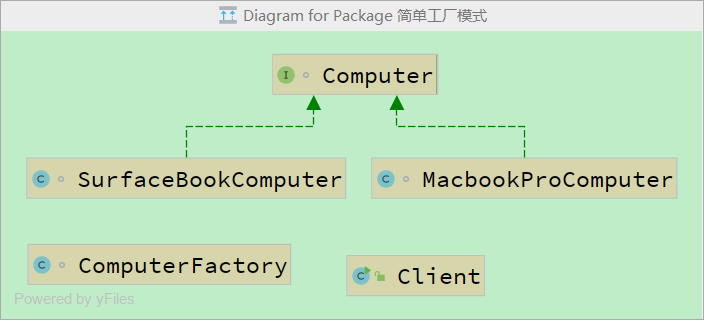

[TOC]

## 一、简单工厂模式

简单工厂模式：专门定义一个类用来创建其它类的实例，被创建的实例通常都具有共同的父类。

这里我们相当于是创建生产电脑的工厂，客户需要购买什么样的电脑，只要输入类型编号就可以获取该电脑。**将类的实例化交给工厂易于解耦**。

优点：

1. 简单易于实现
2. 把类的实例化交给工厂，易于解耦

缺点：

- 添加具体产品需要修改工厂违反OCP开放封闭原则。




顶级电脑接口：

```java
interface Computer {
    void printComputer();
}
```

两个电脑实现类：

```java
class MacbookProComputer implements Computer {
    public void printComputer() {
        System.out.println("this is a macbookpro");
    }
}

class SurfaceBookComputer implements Computer {
    public void printComputer() {
        System.out.println("this is a surfacebook");
    }
}
```

工厂类：用来创建电脑实例

```java
// 该类用来创建其他类的实例
class ComputerFactory {
    public static Computer getInstance(String type) {
        Computer computer = null;
        if (type.equals("macbook")) {
            computer = new MacbookProComputer();
        } else if (type.equals("surface")) {
            computer = new SurfaceBookComputer();
        }
        return computer;
    }
}
```

测试类：

```java
public class Client {
    public void buyComputer(Computer computer) {
        computer.printComputer();
    }

    public static void main(String[] args) {
        Client client = new Client();
        Scanner scanner = new Scanner(System.in);
        System.out.println("请输入想要的电脑型号：");
        String type = scanner.next();
        Computer computer = ComputerFactory.getInstance(type);
        client.buyComputer(computer);
    }
}
```

## 二、工厂方法模式

工厂方法模式：工厂方法模式是针对每个产品提供一个工厂类，在客户端判断使用哪个工厂类去创建对象。定义一个用来创建对象的接口，让子类决定实例化哪一个类，让子类决定实例化延迟到子类。工厂方法模式是针对每个产品提供一个工厂类，在客户端中判断使用哪个工厂类去创建对象。

我们将之前的 ComputerFactory 抽象成一个接口，那么创建相应具体的工厂类去实现该接口的方法

简单工厂模式 VS 工厂方法模式：

- 对于简单工厂模式而言，创建对象的逻辑判断放在了工厂类中，客户不感知具体的类，但是其违背了开闭原
    则，如果要增加新的具体类，就必须修改工厂类。
- 对于工厂方法模式而言，是通过扩展来新增具体类的，符合开闭原则，但是在客户端就必须要感知到具体的
    工厂类，也就是将判断逻辑由简单工厂的工厂类挪到客户端。
- **工厂方法横向扩展很方便**，假如该工厂又有新的产品 Macbook Air 要生产，那么只需要创建相应的工厂类和
    产品类去实现抽象工厂接口和抽象产品接口即可，而不用去修改原有已经存在的代码。

优点：

- 降低了代码耦合度，对象的生成交给子类去完成
- 实现了开放封闭原则，每次添加子产品不需要修改原有代码

缺点：

- 增加了代码量，每个具体产品都需要一个具体工厂
- 当增加抽象产品，也就是添加一个其他产品族，需要修改工厂，违背了OCP


- 顶级电脑接口，代码不变；
- 两个电脑实现类，代码不变；
- 定义用来创建对象的接口：

```java
// 定义一个用来创建对象的接口
interface ComputerFactory {
    Computer createComputer();
}
```

- 两个电脑各自工厂实现类：

```java
class MsFactory implements ComputerFactory {
    public Computer createComputer() {
        return new SurfaceBookComputer();
    }
}

class AppleFactory implements ComputerFactory {
    public Computer createComputer() {
        return new MacbookProComputer();
    }
}
```

- 测试类

```java
public class Client {
    public void buyComputer(Computer computer) {
        computer.printComputer();
    }

    public static void main(String[] args) {
        Client client = new Client();
        ComputerFactory factory = new AppleFactory();
        client.buyComputer(factory.createComputer());
    }
}
```

## 三、抽象工厂模式

**抽象工厂模式**：提供一个创建一系列相关或相互依赖对象的接口，而无需指定它们具体的类。

工厂方法模式和抽象工厂模式基本类似，可以这么理解：当工厂只生产一个产品的时候，即为工厂方法模式，而工厂如果生产两个或以上的商品即变为抽象工厂模式。我们在抽象工厂接口中新增创建系统的方法，并由实例工厂类去实现

优点:

- 代码解耦
- 实现多个产品族(相关联产品组成的家族)，而工厂方法模式的单个产品,可以满足更多的生产需求
- 很好的满足OCP开放封闭原则
- 抽象工厂模式中我们可以定义实现不止一个接口，一个工厂也可以生成不止一个产品类 对于复杂对象的生产
    相当灵活易扩展

缺点：

- 扩展产品族相当麻烦 而且扩展产品族会违反OCP,因为要修改所有的工厂。
- 由于抽象工厂模式是工厂方法模式的扩展 总体的来说 很笨重。


- 顶级电脑接口，代码不变
- 两个电脑实现类，代码不变
- 顶级电脑系统接口：

```java
interface OperatingSystem {
    void printSystem();
}
```

- 两个电脑系统实现类：

```java
class MacOSSystem implements OperatingSystem{
    public void printSystem() {
        System.out.println("this is a mac os");
    }
}

class Windows8System implements OperatingSystem {
    public void printSystem() {
        System.out.println("this is a windows8");
    }
}
```

- 顶级产品生产接口：

```java
interface  ProductionFactory {
    Computer createComputer();
    OperatingSystem createSystem();
}
```

- 两个产品工厂实现类：

```java
class AppleFactory implements ProductionFactory {
    public Computer createComputer() {
        return new MacbookProComputer();
    }

    public OperatingSystem createSystem() {
        return new MacOSSystem();
    }
}

class MsFactory implements ProductionFactory {
    public Computer createComputer() {
        return new SurfaceBookComputer();
    }

    public OperatingSystem createSystem() {
        return new Windows8System();
    }
}
```

- 测试类：

```java
public class Client {
    public void buyComputer(Computer computer) {
        computer.printComputer();
    }
    public void use(OperatingSystem s) {
        s.printSystem();
    }

    public static void main(String[] args) {
        Client client = new Client();
        ProductionFactory factory = new AppleFactory();
        Computer computer = factory.createComputer();
        OperatingSystem system = factory.createSystem();
        client.buyComputer(computer);
        client.use(system);
    }
}
```

## 四、总结

- 简单工厂模式最大的优点就是工厂内有具体的逻辑去判断生成什么产品，将类的实例化交给了工厂，这样当我们需要什么产品只需要修改工厂的调用而不需要去修改客户端，对于客户端来说降低了与具体产品的依赖


- 工厂方法模式是简单工厂的扩展，工厂方法模式把原先简单工厂中的实现那个类的逻辑判断交给了客户端，如果像添加功能只需要修改客户和添加具体的功能，不用去修改之前的类。


- 抽象工厂模式进一步扩展了工厂方法模式，它把原先的工厂方法模式中只能有一个抽象产品不能添加产品族的缺点克服了，抽象工厂模式不仅仅遵循了OCP原则，而且可以添加更多产品(抽象产品),具体工厂也不仅仅可以生成单一产品，而是生成一组产品，抽象工厂也是声明一组产品，对应扩展更加灵活，但是要是扩展族系就会很笨重。


JDK 中用到工厂模式的典型操作：

- Collection 中的iterator方法（集合类中的迭代器）
- java.util包中的sql操作