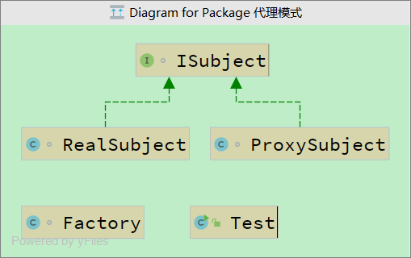

# 4. 代理模式

两个子类共同实现一个接口，其中一个子类负责真实业务实现，另外一个子类完成辅助真实业务主题的操作。




```
package com.xuwei.代理模式;

interface ISubject {
    public void buyComputer(); //核心功能是买电脑
}

class RealSubject implements ISubject {
    public void buyComputer() {
        System.out.println("买一台外星人电脑");
    }
}

class ProxySubject implements ISubject {
    private ISubject subject; // 真正的操作业务
    public ProxySubject(ISubject subject) {
        this.subject = subject;
    }
    public void produceComputer() {
        System.out.println("1.生产外星人电脑");
    }
    public void afterSale() {
        System.out.println("3.外星人电脑售后团队");
    }
    public void buyComputer() {
        this.produceComputer();// 真实的操作前的准备
        this.subject.buyComputer(); // 调用真实业务
        this.afterSale(); // 操作后的收尾
    }
}

class Factory {
    public static ISubject getInstance() {
        return new ProxySubject(new RealSubject());
    }
}

public class Test {
    public static void main(String[] args) {
        ISubject subject = Factory.getInstance();
        subject.buyComputer();
    }
}
```


代理模式的本质：所有的真实业务操作都会有一个与之辅助的工具类来完成