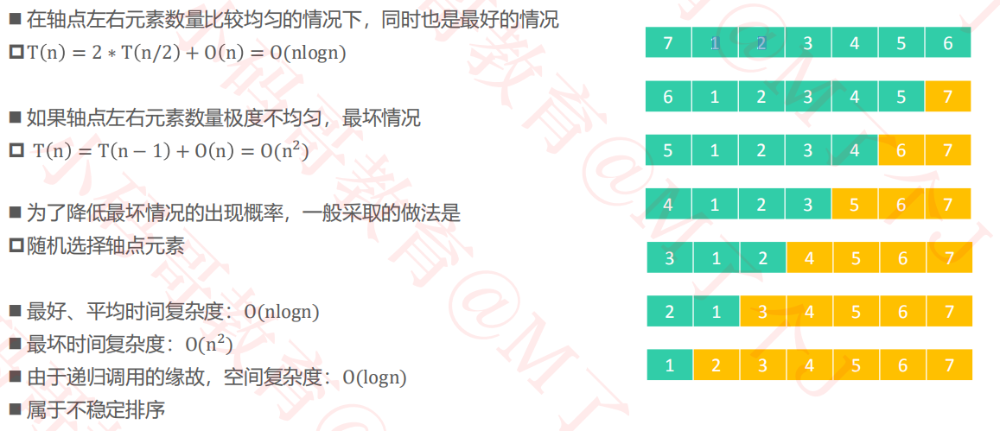
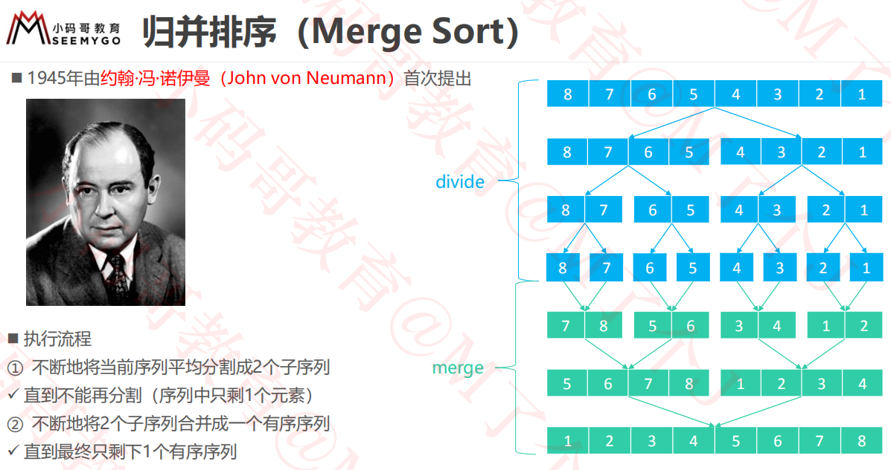
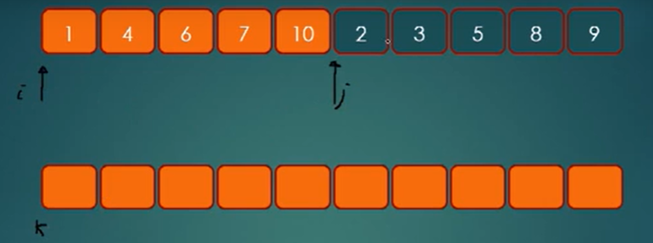
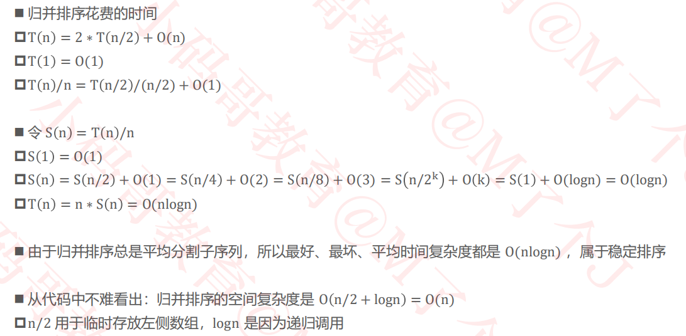
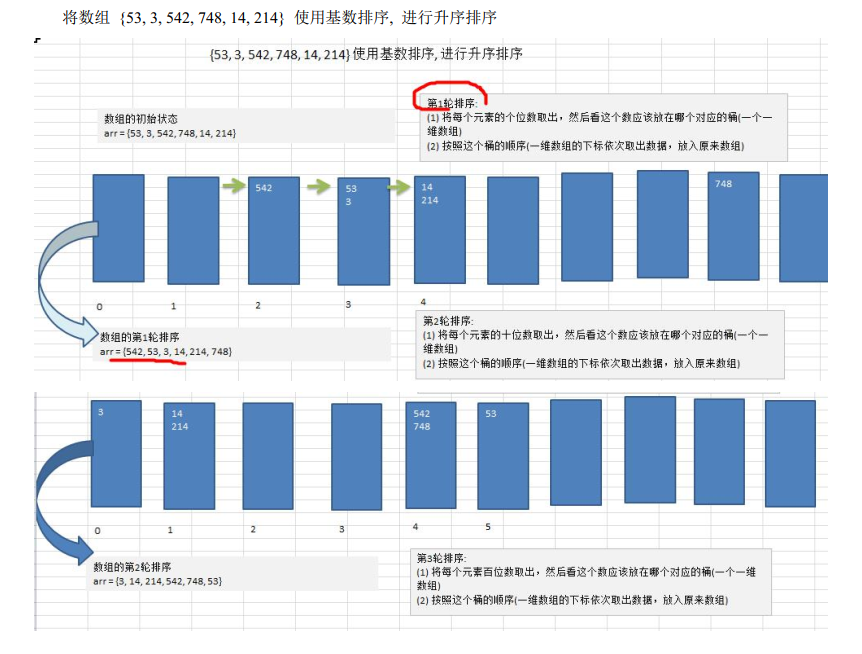
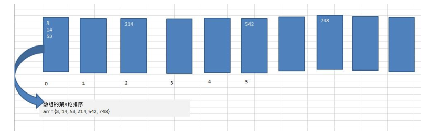

​                                                                                                                                                                                                                                                                                                                                                                                                                                                                                                                                                                                                                                                                                                                                                                                                                                                                                                                                                                                                                                                                                                                                                                                                                                                                                                                                                                                                                                                                                                                                                                                                                                                                                                                                                                                                                                                                                                                                                                                                                                                                                                                                                                                                                                                                                                                                                                                                                                                                                                                                                                                                                                                                                                                                                                                                                                                                                                                                                                                                                                                                                                                                                                                                                                                                                                                                                                                                                                                                                                                                                                                                                                                                                                                                                                                                                                                                                                                                                                                                                                                                                                                                                                                                                                                                                                                                                                                                                                                                                                                                                                                                                                                                                                                                                                                                                                                                                                                                                                                                                                                                                                                                                                                                                                                                                                                                                                                                                                                                                                                                                                                                                                                                                                                                                                                                                                                                                                                                                                                                                                                                                                                                                                                                                                                                                                                                                                                                                                                                                                                                                                                                                                                                                                                                                                                                                                                                                                                                                                                                                                                                                                                                                                                                                                                                                                                                                                                                                                                                                                                                                                                                                                                                                                                                                                                                                                                                                                                                                                                                                                                                                                                                                                                                                                                                                                                                                                                                                                                                                                                                                                                                                                                                                                                                                                                                                                                                                                                                                                                                                                                                                                                                                                                                                                                                                                                                                                                                                                                                                                                                                                                                                                                                                                                                                                                                                                                                                                                                                                                                                                                                                                                                                                                                                                                                                                                                                                                                                                                                                                                                                                                                                                                                                                                                                                                                                                                                                                                                                                                                                                                                                                                                                                                                                                                                                                                                                                                                                                                                                                                                                                                                                                                                                                                                                                                                                                                                                                                                                                                                                                                                                                                                                                                                                                                                                                                                                                                                                                                                                                                                                                                                                                                                                                                                                                                                                                                                                                                                                                                                                                                                                                                                                                                                                                                                                                                                                                                                                                                                                                                                                                                                                                                                                                                                                                                                                                                                                                                                                                                                                                                                                                                                                                                                                                                                                                                                                                                                                                                                                                                                                                                                                                                                                                                                                                                                                                                                                                                                                                                                                                                                                                                                                                                                                                                                                                                                                                                                                                                                                                                                                                                                                                                                                                                                                                                                                                                                                                                                                                                                                                                                                                                                                                                                                                                                                                                                                                                                                                                                                                                                                                                                                                                                                                                                                                                                                                                                                                                                                                                                                                                                                                                                                                                                                                                                                                                                                                                                                                                                                                                                                                                                                                                                                                                                                                                                                                                                                                                                                                                                                                                                                                                                                                                                                                                                                                                                                                                                                                                                                                                                                                                                                                                                                                                                                                                                                                                                                                                                                                                                                                                                                                                                                                                                                                                                                                                                                                                                                                                                                                                                                                                                                                                                                                                                                                                                                                                                                                                                                                                                                                                                                                                                                                                                                                                                                                                                                                                                                                                                                                                                                                                                                                                                                                                                                                                                                                                                                                                                                                                                                                                                                                                                                                                                                                                                                                                                                                                                                                                                                                                                                                                                                                                                                                                                                                                                                                                                                                                                                                                                                                                                                                                                                                                                                                                                                                                                                                                                                                                                                                                                                                                                                                                                                                                                                                                                                                                                                                                                                                                                                                                                                                                                                                                                                                                                                                                                                                                                                                                                                                                                                                                                                                                                                                                                                                                                                                                                                                                                                                                                                                                                                                                                                                                                                                                                                                                                                                                                                                                                                                                                                                                                                                                                                                                                                                                                                                                                                                                                                                                                                                                                                                                                                                                                                                                                                                                                                                                                                                                                                                                                                                                                                                                                                                                                                                                                                                                                                                                                                                                                                                                                                                                                                                                                                                                                                                                                                                                                                                                                                                                                                                                                                                                                                                                                                                                                                                                                                                                                                                                                                                                                                                                                                                                                                                                                                                                                                                                                                                                                                                                                                                                                                                                                                                                                                                                                                                                                                                                                                                                                                                                                                                                                                                                                                                                                                                                                                                                                                                                                                                                                                                                                                                                                                                                                                                                                                                                                                                                                                                                                                                                                                                                                                                                                                                                                                                                                                                                                                                                                                                                                                                                                                                                                                                                                                                                                                                                                                                                                                                                                                                                                                                                                                                                                                                                                                                                                                                                                                                                                                                                                                                                                                                                                                                                                                                                                                                                                                                                                                                                                                                                                                                                                                                                                                                                                                                                                                                                                                                                                                                                                                                                                                                                                                                                                                                                                                                                                                                                                                                                                                                                                                                                                                                                                                                                                                                                                                                                                                                                                                                                                                                                                                                                                                                                                                                                                                                                                                                                                                                                                                                                                                                                                                                                                                                                                                                                                                                                                                                                                                                                                                                                                                                                                                                                                                                                                                                                                                                                                                                                                                                                                                                                                                                                                                                                                                                                                                                                                                                                                                                                                                                                                                                                                                                                                                                                                                                                                                                                                                                                                                                                                                                                                                                                                                                                                                                                                                                                                                                                                                                                                                                                                                                                                                                                                                                                                                                                                                                                                                                                                                                                                                                                                                                                                                                                                                                                                                                                                                                                                                                                                                                                                                                                                                                                                                                                                                                                                                                                                                                                                                                                                                                                                                                                                                                                                                                                                                                                                                                                                                                                                                                                                                                                                                                                                                                                                                                                                                                                                                                                                                                                                                                                                                                                                                                                                                                                                                                                                                                                                                                                                                                                                                                                                                                                                                                                                                                                                                                                                                                                                                                                                                                                                                                                                                                                                                                                                                                                                                                                                                                                                                                                                                                                                                                                                                                                                                                                                                                                                                                                                                                                                                                                                                                                                                                                                                                                                                                                                                                                                                                                                                                                                                                                                                                                                                                                                                                                                                                                                                                                                                                                                                                                                                                                                                                                                                                                                                                                                                                                                                                                                                                                                                                                                                                                                                                                                                                                                                                                                                                                                                                                                                                                                                                                                                                                                                                                                                                                                                                                                                                                                                                                                                                                                                                                                                                                                                                                                                                                                                                                                                                                                                                                                                                                                                                                                                                                                                                                                                                                                                                                                                                                                                                                                                                                                                                                                                                                                                                                                                                                                                                                                                                                                                                                                                                                                                                                                                                                                                                                                                                                                                                                                                                                                                                                                                                                                                                                                                                                                                                                                                                                                                                                                                                                                                                                                                                                                                                                                                                                                                                                                                                                                                                                                                                                                                                                                                                                                                                                                                                                                                                                                                                                                                                                                                                                                                                                                                                                                                                                                                                                                                                                                                                                                                                                                                                                                                                                                                                                                                                                                                                                                                                                                                                                                                                                                                                                                                                                                                                                                                                                                                                                                                                                                                                                                                                                                                                                                                                                                                                                                                                                                                                                                                                                                                                                                                                                                                                                                                                                                                                                                                                                                                                                                                                                                                                                                                                                                                                                                                                                                                                                                                                                                                                                                                                                                                                                                                                                                                                                                                                                                                                                                                                                                                                                                                                                                                                                                                                                                                                                                                                                                                                                                                                                                                                                                                                                                                                                                                                                                                                                                                                                                                                                                                                                                                                                                                                                                                                                                                                                                                                                                                                                                                                                                                                                                                                                                                                                                                                                                                                                                                                                                                                                                                                                                                                                                                                                                                                                                                                                                                                                                                                                                                                                                                                                                                                                                                                                                                                                                                                                                                                                                                                                                                                                                                                                                                                                                                                                                                                                                                                                                                                                                                                                                                                                                                                                                                                                                                                                                                                                                                                                                                                                                                                                                                                                                                                                                                                                                                                                                                                                                                                                                                                                                                                                                                                                                                                                                                                                                                                                                                                                                          

[TOC]

## 一、冒泡排序

### 1、思想

冒泡排序（Bubble Sorting） 的基本思想是： **通过对待排序序列从前向后（从下标较小的元素开始） ,依次比较相邻元素的值， 若发现逆序则交换， 使值较大的元素逐渐从前移向后部， 就象水底下的气泡一样逐渐向上冒。**

**优化**： 因为排序的过程中， 各元素不断接近自己的位置， 如果一趟比较下来没有进行过交换， 就说明序列有序， 因此要在排序过程中设置一个标志 flag 判断元素是否进行过交换。 从而减少不必要的比较。 (这里说的优化， 可以在冒泡排序写好后， 在进行)

### 2、实现

```java
public class BubbleSort {
    public static void main(String[] args) {
        int[] arr = {1,2,3,1,2,6,4,3,26,3,6};
        System.out.println("排序前：" + Arrays.toString(arr));
        bubbleSort(arr);
        System.out.println("排序后：" + Arrays.toString(arr));
    }
    public static void bubbleSort(int[] arr) {
        for(int i = 0; i < arr.length - 1; i++) {
            boolean flag = false;
            for (int j = 0; j < arr.length - 1 - i; j++) {
                if (arr[j] > arr[j + 1]) {
                    int temp = arr[j + 1];
                    arr[j + 1] = arr[j];
                    arr[j] = temp;
                    flag = true; //发生了交换
                }
            }
            if (!flag) {
                break;
            }else {
                flag = false;
            }
        }
    }
}
```

### 3、分析

时间复杂度：最好O(n)，最坏O(n^2)，平均O(n^2)

空间复杂度：O(1)

稳定性：稳定

## 二、选择排序

### 1、思想

选择排序（select sorting） 也是一种简单的排序方法。 它的基本思想是： 第一次从 arr[0]~arr[n-1]中选取最小值，与 arr[0]交换， 第二次从 arr[1]~arr[n-1]中选取最小值， 与 arr[1]交换， 第三次从 arr[2]~arr[n-1]中选取最小值， 与 arr[2]交换， …， 第 i 次从 arr[i-1]~arr[n-1]中选取最小值， 与 arr[i-1]交换， …, 第 n-1 次从 arr[n-2]~arr[n-1]中选取最小值，与 arr[n-2]交换， 总共通过 n-1 次， 得到一个按排序码从小到大排列的有序序列。

### 2、实现

```java
public class SelectSort {
    public static void main(String[] args) {
        int[] arr = {1,2,3,1,2,6,4,3,26,3,6};
        System.out.println("排序前：" + Arrays.toString(arr));
        selectSort(arr);
        System.out.println("排序后：" + Arrays.toString(arr));
    }
    public static void selectSort(int[] arr) {
        for (int i = 0; i < arr.length - 1; i++) {
            int minIndex = i; //记录最小值的索引
            int minValue = arr[i]; //记录最小值
            for (int j = i + 1; j < arr.length; j++) {
                if (arr[j] < minValue) {
                    //记录最小值的索引
                    minIndex = j;
                }
            }
            //判断最小值的索引是否发生改变
            if (minIndex != i) {
                arr[i] = arr[minIndex];
                arr[minIndex] = minValue;
            }
        }
    }
}
```

### 3、分析

时间复杂度：最好O(n^2)，最坏O(n^2)，平均O(n^2)

空间复杂度：O(1)

稳定性：不稳定

## 三、插入排序

### 1、思想

插入排序（Insertion Sorting） 的基本思想是： 把 n 个待排序的元素看成为一个有序表和一个无序表， 开始时有序表中只包含一个元素， 无序表中包含有 n-1 个元素， 排序过程中每次从无序表中取出第一个元素， 把它的排序码依次与有序表元素的排序码进行比较， 将它插入到有序表中的适当位置， 使之成为新的有序表

分而治之(divide - conquer);每个递归过程涉及三个步骤：

1. 第一, 分解: 把待排序的 n 个元素的序列分解成两个子序列, 每个子序列包括 n/2 个元素。
2. 第二, 治理: 对每个子序列分别调用归并排序MergeSort, 进行递归操作。
3. 第三, 合并: 合并两个排好序的子序列,生成排序结果。

**插入排序优化** ：

将交换转为挪动，就是每次和前面的元素进行比较时，如果满足，就先不交换，继续往前比较，知道不满足然后放到指定位置上。

**插入排序优化2** ：

对有序表进行二分查找，找到指定位置插入。

### 2、实现

**插入优化** ：将交换转为挪动。

```java
public class InsertSort {
    public static void main(String[] args) {
        int[] arr = {1,2,3,1,2,6,4,3,26,3,6};
        System.out.println("排序前：" + Arrays.toString(arr));
        insertSort(arr);
        System.out.println("排序后：" + Arrays.toString(arr));
    }
    public static void insertSort(int[] arr) {
        int insertVal = 0; //要插入的值
        int insertIndex = 0; //待插入的下标
        for (int i = 1; i < arr.length; i++) {
            insertVal = arr[i];  //定义待插入的数,第一次判断从1开始，将1左边的看成有序表
            insertIndex = i - 1;
            while (insertIndex >= 0 && insertVal < arr[insertIndex]) {
                arr[insertIndex + 1] = arr[insertIndex]; //前面的值后移
                insertIndex--;
            }
            //循环推出代表要插入的位置找到，就在 insertIndex+1
            if (insertIndex + 1 != i) {
                arr[insertIndex + 1] = insertVal;
            }
        }
    }
}
```

**插入优化：二分搜素位置，只是减少了比较次数，但**插入排序的平均时间复杂度依然是 O(n^2）。

```java
public static void insertSort2(int[] arr) {
    for (int i = 1; i < arr.length; i++) {
        insert(arr, i, search(arr, i));
    }
}

/**
     * @param arr       数组
     * @param source    待插入的元素下标
     * @param dest      待插入的元素位置
     */
public static void insert(int[] arr, int source, int dest) {
    Integer val = arr[source]; //获取待插入元素
    for (int i = source; i > dest; i--) {
        arr[i] = arr[i - 1]; //前面元素后移
    }
    arr[dest] = val;
}

//返回待插入元素的位置
public static int search(int[] arr, int index) {
    int begin = 0;
    int end = index;
    while (begin < end) {
        int mid = (begin + end) / 2;
        if (arr[index] < arr[mid]) {
            end = mid;
        }else {
            begin = mid + 1;
        }
    }
    return begin;
}
```

### 3、分析

时间复杂度：最好O(n)，最坏O(n^2)，平均O(n^2)

空间复杂度：O(1)

稳定性：稳定

## 四、希尔排序

### 1、思想

### 2、实现

### 3、分析

## 五、快速排序

### 1、思想

快速排序（Quicksort）是对冒泡排序的一种改进。基本思想是：通过一趟排序将要排序的数据分割成独立的两

部分，其中一部分的所有数据都比另外一部分的所有数据都要小，然后再按此方法对这两部分数据分别进行快速排

序，整个排序过程可以递归进行，以此达到整个数据变成有序序列

### 2、代码实现

```java
public class QuickSort {
    public static void main(String[] args) {
        int[] arr = {-9,78,0,23,-567,70, -1,900, 4561};
        quickSort(arr, 0, arr.length - 1);
        print(arr);
    }

    public static void quickSort(int[] arr, int left, int right) {
        if (left >= right) {
            return;
        }

        int low = left; //左下标
        int high = right; //右下标
        int midValue = arr[left]; //将当前数组中的最左则元素当作基准值

        while (low < high) {
            while (low < high && arr[high] >= midValue) {
                high--;
            }
            while (low < high && arr[low] <= midValue) {
                low++;
            }
            //循环退出代表找到了一个元素比基准值大
            if (low < high) {
                swap(arr, low, high);
            }
        }
        //循环推出代表low=high，此时指向的位置为基准值的位置
        if (low != left) {
            arr[left] = arr[low];
            arr[low] = midValue;
            quickSort(arr, left, low - 1);
            quickSort(arr, low + 1, right);
        }
    }

    public static void swap(int[] arr, int i, int j) {
        int temp = arr[i];
        arr[i] = arr[j];
        arr[j] = temp;
    }

    public static void print(int[] arr) {
        for (int i = 0; i < arr.length; i++) {
            System.out.print(arr[i] + " ");
        }
    }
}
```

### 3、优化

**枢纽元的选取策略**

1. **取第一个或者最后一个：**简单但**很傻**的选择。当输入序列是升序或者降序时，这时候就会导致S1集合为空，除枢纽元外所有元素在S2集合，这种做法，**最坏时间复杂度为O(N2)。**
2. **随机选择：**这是**比较安全**的做法。除非随机数发生器出现错误，并且连续产生劣质分割的概率比较低。但随机数生成开销较大，这样就增加了运行时间。
3. **三数中值分割法**：一组序列的**中值（中位数）是枢纽元最好的选择（因为可以将序列均分为两个子序列，[归并排序](https://www.cnblogs.com/9dragon/p/10790415.html)告诉我们，这时候是O(NlogN）**；但要计算一组数组的中位数就比较耗时，会减慢快排的效率。但**可以通过计算数组的第一个，中间位置，最后一个元素的中值来代替。**比如序列：[8，1，4，9，6，3，5，2，7，0]。第一个元素是8，中间(left+right)/2(向下取整)元素为6，最后一个元素为0。所以中位数是6，即枢纽元是6。显然使用三数分割法消除了预排序输入的坏情形，并且实际减少了14%的比较。

**三数中值分割法** 

```java
public static void quickSort2(int[] arr, int left, int right) {
    int l = left;
    int r = right;
    int pivot = arr[(left + right) / 2]; //中轴值

    while (l < r) {
        //在pivot的左边一直找，找到大于等于pivot值，才退出
        while (arr[l] < pivot) {
            l++;
        }
        //在pivot的右边一直找，找到小于等于pivot值，才退出
        while (arr[r] > pivot) {
            r--;
        }

        //如果l>=r，说明pivot的左右两的值，已经按照左边值小于pivot，右边值大于等于pivot
        if (l >= r) {
            break;
        }

        //交换
        swap(arr, l, r);

        //如果交换完后，发现这个arr[l]=pivot值，相等r--，前移
        if (arr[l] == pivot) {
            r--;
        }
        //如果交换完后，发现这个 arr[r] == pivot 值 相等 l++， 后移
        if(arr[r] == pivot) {
            l += 1;
        }
    }
    //如果l==r，必须l++，r--，否则会出现栈溢出
    if (l == r) {
        l++;
        r--;
    }
    //向左递归
    if (left < r) {
        quickSort2(arr, left, r);
    }
    //向右递归
    if (right > l) {
        quickSort2(arr, l, right);
    }
}
```

### 4、分析



## 六、归并排序

### 1、思想





### 2、代码实现

**模板实现** 

```java
/**
 * @author xuwei
 * @create 2020-01-29 12:52
 * 把能解决的子问题先封装起来
 */
public class MergeSort {
    public static void main(String[] args) {
        int[] arr = {1, 4, 7, 8, 3, 6, 9};
        sort(arr); //假设现在已经分好顺序，准备合并
    }

    public static void sort(int[] arr) {
        merge(arr);
    }

    public static void merge(int[] arr) {
        int mid = arr.length / 2;
        int[] temp = new int[arr.length];

        //三个指针，i，j，k
        int i = 0;
        int j = mid + 1;
        int k = 0;

        while (i <= mid && j < arr.length) {
            if (arr[i] <= arr[j]) {
                temp[k++] = arr[i++]; //将i的值挪到k的位置上
            }else {
                temp[k++] = arr[j++];
            }
        }

        //有一个数组已经拷贝完了，将剩余数组的元素拷贝到新数组中
        while (i <= mid) temp[k++] = arr[i++];
        while (j < arr.length) temp[k++] = arr[j++];
        print(temp);
    }

    public static void print(int[] arr) {
        for (int i = 0; i < arr.length; i++) {
            System.out.print(arr[i] + " ");
        }
    }
}
```

**真正代码** :

```java
public class MergeSort2 {
    public static void main(String[] args) {
        int[] arr = {1, 4, 7, 8, 3, 6, 9};
        sort(arr, 0, arr.length - 1, new int[arr.length]); //假设现在已经分好顺序，准备合并
        print(arr);
    }

    public static void sort(int[] arr, int left, int right, int[] temp) {
        if (left < right) {
            int mid = (left + right) / 2; //中间索引
            //向左递归进行分解
            sort(arr, left, mid, temp);
            //向右递归进行分解
            sort(arr, mid + 1, right, temp);
            //合并
            merge(arr, left, mid, right, temp);
        }
    }

    /**
     * 合并的方法
     * @param arr   排序的原始数组
     * @param left  左边有序序列的初始索引
     * @param mid   中间索引
     * @param right 右边索引
     * @param temp  做中转的数组
     */
    public static void merge(int[] arr, int left, int mid, int right, int[] temp) {
        //        int mid = arr.length / 2;
        //        int[] temp = new int[arr.length]; //新数组

        //创建三个指针，分别指向左侧有序数组，右侧有序数组，新数组
        int i = left; //初始化i，左边有序序列的初始索引
        int j = mid + 1; //初始化j，右边有序序列的初始索引
        int k = 0; //指向temp数组的当前索引

        while (i <= mid && j <= right) {
            if (arr[i] <= arr[j]) {
                temp[k++] = arr[i++];
            }else {
                temp[k++] = arr[j++];
            }
        }

        //将剩余的元素拷贝到新数组中
        while (i <= mid) temp[k++] = arr[i++];
        while (j <= right) temp[k++] = arr[j++];

        //注意，将temp数组的元素拷贝到arr
        k = 0;
        int tempLeft = left;
        //第一次合并 tempLeft = 0, right=1 // tempLeft=2, right=3
        //最后一次 tempLeft = 0, right = 7
        while (tempLeft <= right) {
            arr[tempLeft++] = temp[k++];
        }
    }

    public static void print(int[] arr) {
        for (int i = 0; i < arr.length; i++) {
            System.out.print(arr[i] + " ");
        }
    }
}
```

### 3、分析



## 七、桶排序

### 1、说明

基数排序（radix sort） 属于“分配式排序” （distribution sort） ， 又称“桶子法” （bucket sort） 或 bin sort， 顾名思义， 它是通过键值的各个位的值， 将要排序的元素分配至某些“桶” 中， 达到排序的作用2) 基数排序法是属于稳定性的排序， 基数排序法的是效率高的稳定性排序法

将所有待比较数值统一为同样的数位长度， 数位较短的数前面补零。 然后， 从最低位开始， 依次进行一次排序。
这样从最低位排序一直到最高位排序完成以后, 数列就变成一个有序序列。






### 2、代码实现

```java
public static void radixSort(int[] arr) {
        //1.得到数组中最大的数的位数
        int max = arr[0]; //假设第一数就是最大数
        for (int i = 0; i < arr.length; i++) {
            if (arr[i] > max) {
                max = arr[i];
            }
        }
        //得到最大数是几位数
        int maxLength = (max + "").length();

        //定义一个二维数组，表示10个桶，每个桶就是一个一维数组
        //说明
        //1.二维数组包含10个一维数组
        //2.为了防止在放入数的时候，数据溢出，则每个一维数组(桶)，大小定位arr.length
        //3.基数排序是使用空间换时间
        int[][] bucket = new int[10][arr.length];

        //为了记录每个桶中，实际存放了多少个数据，我们定义一个一维数组来记录各个桶的每次放入的数据个数
        //比如：bucketElementCounts[0]，记录的就是bucket[0]桶的放入数据个数
        int[] bucketElementCounts = new int[10];

        //使用循环将代码处理, i表示循环几次，
        for (int i = 0,n = 1; i < maxLength; i++, n *= 10) {
            //针对每个元素的对应位进行排序处理，第一次是个位，第二次是十位，第三次是百位
            for (int j = 0; j < arr.length; j++) {
                //取出每个元素的对应位的值
                int digitOfElement = arr[j] / n % 10; //第一次获取个位的值
                //放入到对应的桶中
                bucket[digitOfElement][bucketElementCounts[digitOfElement]] = arr[j];
                bucketElementCounts[digitOfElement]++; //该桶中的数据个数++
            }
            //按照这个桶的顺序（一维数组的下标依次取出数据，放入原来数组）
            int index = 0;
            //遍历每一桶，并将桶中是数据，放入到原数组
            for (int k = 0; k < bucketElementCounts.length; k++) {
                //如果桶中有数据，我们才放入到原数组
                if (bucketElementCounts[k] != 0) {
                    //循环该桶即第k个桶（即第k个一维数组），放入
                    for (int l = 0; l < bucketElementCounts[k]; l++) {
                        //取出元素放入到arr
                        arr[index++] = bucket[k][l];
                    }
                }
                //第 i+1 轮处理后，需要将每个 bucketElementCounts
                bucketElementCounts[k] = 0;
            }
        }
    }
```

## 九、常用排序总结


1. 稳定： 如果 a 原本在 b 前面， 而 a=b， 排序之后 a 仍然在 b 的前面；
2. 不稳定： 如果 a 原本在 b 的前面， 而 a=b， 排序之后 a 可能会出现在 b 的后面；
3. 内排序： 所有排序操作都在内存中完成；
4. 外排序： 由于数据太大， 因此把数据放在磁盘中， 而排序通过磁盘和内存的数据传输才能进行；
5. 时间复杂度： 一个算法执行所耗费的时间。
6. 空间复杂度： 运行完一个程序所需内存的大小。
7. n: 数据规模
8. k: “桶” 的个数
9. In-place: 不占用额外内存
10. Out-place: 占用额外内存