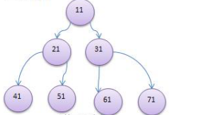
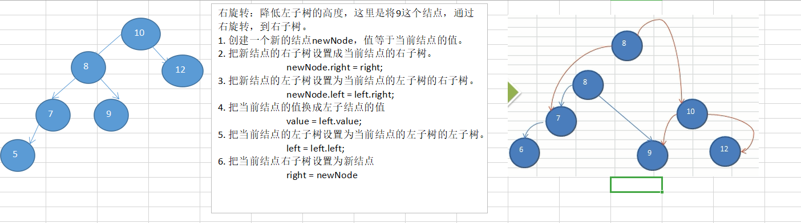

[TOC]

## 一、基本概念

### 1、 二叉树

**树** 是一种抽象数据类型，是用来模拟树状结构性质的数据集合。它是由 n 个有限结点并通过连接它们的边组成的一个具有层次关系的集合。树具有很明显的特点，就是根朝上，叶子朝下。

**二叉树** 是一种特殊的树，每个结点最多只能有两个子节点，分别为左子结点和右子结点。

如果该二叉树的所有 **叶子结点** 都在最后一层，并且结点总数为 2^n - 1，那么该二叉树被称为 **满二叉树** 。



如果该二叉树的所有 **叶子结点** 都在**最后一层**或者**倒数第二层**，并且最后一层的叶子结点在左边连续，倒数第二层的叶子结点在右边连续，那么该二叉树为完全二叉树。


### 2、二叉树特点

在说二叉树特点之前先说下数组和链表的特点。

**数组** 

1. 通过下标访问元素，速度快，对于有序数组，还可以采用二分查找。
2. 如果要检索具体值，或者插入某个元素（按一定顺序）会整体移动，效率低。

**链表** 

1. 在一定程度上对数组存储方式进行了优化，比如在插入，删除元素上效率很高。
2. 在进行检索时，效率依然低，比如（检索某个值，需要从头结点开始遍历）。

**树存储** 

能提高存储、读取的效率，比如利用 **二叉排序树（Binary Sort Tree)，**既可以保证数据的检索，也可以保证数据的插入，删除，修改的速度。

**二叉排序树** 就是对于任何一个非叶子结点，当前结点的值比左子结点的值大，比右子结点的值小。

​      

### 3、专业术语

1. **路径**：顺着节点的边从一个节点走到另一个节点，所经过的节点的顺序排列就称为“路径”。
2. **根**：当前二叉树最顶层的那个结点。
3. **父节点**：若当前结点有子结点，那么当前结点就称为该子结点的父结点。
4. **子节点**：一个节点含有的子树的根节点称为该节点的子节点。
5. **兄弟节点**：具有相同父节点的节点互称为兄弟节点。
6. **叶子节点**：没有子节点的节点称为叶节点，也叫叶子节点。
7. **子树**：每个节点都可以作为子树的根，它和它所有的子节点、子节点的子节点等都包含在子树中。
8. **节点的层次**：从根开始定义，根为第一层，根的子节点为第二层，以此类推。
9. **深度**：树根下中所有**分支结点层数**的**最大值。**
10. **高度**：从当前结点向下到一个叶子结点的**最长简单路径**中**边的条数**

## 二、普通二叉树

### 1、二叉树遍历

**二叉树遍历有三种方式，前序、中序和后序。**

要求：

- 请编写前序查找， 中序查找和后序查找的方法。
- 并分别使用三种查找方式， 查找 heroNO = 5 的节点
- 并分析各种查找方式， 分别比较了多少次

**BinaryTree**  ：

```java
//前序遍历
public void preOrder() {
    if (this.root != null) {
        this.root.preOrder();
    }else {
        System.out.println("树为空");
    }
}

//中序遍历
public void infixOrder() {
    if (this.root != null) {
        this.root.infixOrder();
    }else {
        System.out.println("树为空");
    }
}

//后序遍历
public void postOrder() {
    if (this.root != null) {
        this.root.postOrder();
    }else {
        System.out.println("树为空");
    }
}
```

**HeroNode** ：

```java
//前序遍历
public void preOrder() {
    //1.先输出当前结点
    System.out.println(this);
    //2.递归向左子树前序遍历
    if (this.left != null) {
        this.left.preOrder();
    }
    //3.递归向右子树前序遍历
    if (this.right != null) {
        this.right.preOrder();
    }
}

//中序遍历
public void infixOrder() {
    //2.递归向左子树前序遍历
    if (this.left != null) {
        this.left.infixOrder();
    }
    //1.先输出当前结点
    System.out.println(this);
    //3.递归向右子树前序遍历
    if (this.right != null) {
        this.right.infixOrder();
    }
}

//后序遍历
public void postOrder() {
    //2.递归向左子树前序遍历
    if (this.left != null) {
        this.left.postOrder();
    }
    //3.递归向右子树前序遍历
    if (this.right != null) {
        this.right.postOrder();
    }
    //1.先输出当前结点
    System.out.println(this);
}
```

### 2、查找指定结点

要求：

- 请编写前序查找， 中序查找和后序查找的方法。
- 并分别使用三种查找方式， 查找 heroNO = 5 的节点
- 并分析各种查找方式， 分别比较了多少次

**BinaryTree** 

```java
//前序查找指定结点
public HeroNode preOrderSearch(int no) {
    System.out.println("查找指定结点...");
    //1.先判断当前结点是否是指定结点
    if (no == this.no) {
        return this;
    }
    HeroNode tempNode = null;
    //2.左子树遍历查找
    if (this.left != null) {
        tempNode = this.left.preOrderSearch(no);
    }
    if (tempNode != null) { //如果tempNode不为空，说明找到，直接返回。
        return tempNode;
    }

    //3.右子树遍历查找
    if (this.right != null) {
        tempNode = this.right.preOrderSearch(no);
    }
    if (tempNode != null) { //如果tempNode不为空，说明找到，直接返回。
        return tempNode;
    }
    return tempNode;
}
```

**HeroNode** 

```java
//前序查找
public HeroNode preOrderSearch(int no) {
    if (root != null) {
        return root.preOrderSearch(no);
    }else {
        return null;
    }
}
```

**测试代码** 

```java
//查找指定结点5，前序查找
binaryTree.preOrderSearch(5); //比较了4次
```

### 3、删除指定结点

**BinaryTree**：

```java
//删除结点
public void delNode(int no) {
    if (root != null) {
        //判断root结点是否是要删除的结点
        if (root.getNo() == no) {
            root = null;
        }else {
            root.delNode(no);
        }
    }else {
        System.out.println("空树，删除个锤子");
    }
}
```

**HeroNode**：

```java
/**
     * 删除结点：5号叶子结点 和 3号子树
     * 要求：
     *      如果删除的是叶子结点，直接删除
     *      如果删除的是非叶子结点，删除该子树
     * @param no    被删除的结点编号
     */
public void delNode(int no) {
    /*
            思路:
                通过编号在当前二叉树中查找是否有这个结点，如果有，就删除。
                怎么查找？ 前序遍历查找。
                怎么删除？ 二叉树是单向的，所以我们只能找到要删除结点的父结点，通过父结点来删除。
                步骤：
                    1.判断当前结点的左子结点是否是要删除的结点，如果是，直接删除。
                    2.判断前结点的右子结点是否是要删除的结点，如果是，直接删除。
                    3.说明当前左子结点和右子结点都不是要删除的结点，递归删除。
         */
    if (this.left != null && this.left.no == no) {
        this.left = null;
        return;
    }
    //递归删除左子结点
    if (this.left != null) {
        this.left.delNode(no);
    }

    if (this.right != null && this.right.no == no) {
        this.right = null;
        return;
    }
    //递归删除右子结点
    if (this.right != null) {
        this.right.delNode(no);
    }
}
```

**测试代码**：

```java
//删除指定结点 5号叶子结点 和 3号子树
binaryTree.delNode(5);
binaryTree.delNode(3);
binaryTree.preOrder();
```

## 三、顺序存储二叉树

### 1、概述

从数据存储来看， 数组存储方式和树的存储方式可以相互转换， 即数组可以转换成树， 树也可以转换成数组


要求：

1. 右图的二叉树的结点， 要求以数组的方式来存放 arr : [1, 2, 3, 4, 5, 6, 6]
2. 要求在遍历数组 arr 时， 仍然可以以前序遍历， 中序遍历和后序遍历的方式完成结点的遍历

顺序存储二叉树的特点：

1. 顺序二叉树通常只考虑[完全二叉树](https://www.yuque.com/u277073/struggle/rvat2t#eAwOL)
2. 第 n 个元素的左子节点为 2 * n + 1
3. 第 n 个元素的右子节点为 2 * n + 2
4. 第 n 个元素的父节点为 (n-1) / 2
5. n : 表示二叉树中的第几个元素(按 0 开始编号）

**ArrBianryTree** ：

```java
//实现顺序存储二叉树遍历
class ArrBinaryTree {
    private int[] arr;

    public ArrBinaryTree(int[] arr) {
        this.arr = arr;
    }

    //重载前序遍历
    public void preOrder() {
        this.preOrder(0);
    }

    //重载中序遍历
    public void infixOrder() {
        this.infixOrder(0);
    }

    //重载后序遍历
    public void postOrder() {
        this.postOrder(0);
    }

    /**
     * 实现前序遍历，将数组按照前序遍历
     * @index   传入的下标，初始值为0
     */
    public void preOrder(int index) {
        /**
         * 思路：
         *      将数组进行前序遍历，首先第一步，肯定是对数组进行校验。
         *      进行前序遍历的话，肯定是先输出当前结点。
         *      然后递归输出左子节点，如何判断数组哪些树是左子结点，第n个元素的左子节点为2*n+1
         *      递归输出右子结点，第n个元素的右子结点为2*n+2
         *
         *
         *  步骤：
         *      1.对数组进行校验，如果为空或者长度为0则返回。
         *      2.输出当前元素
         *      3.向左递归遍历输出
         *      4.向右递归遍历输出
         */
        if (arr == null || arr.length == 0) {
            System.out.println("数组为空，不能遍历");
            return;
        }
        System.out.print(arr[index] + " ");
        //向左递归输出
        if ((index * 2 + 1) < arr.length) {
            preOrder(index * 2 + 1);
        }

        //向右递归输出
        if ((index * 2 + 2) < arr.length) {
            preOrder(index * 2 + 2);
        }
    }

    public void infixOrder(int index) {
        if (arr == null || arr.length == 0) {
            System.out.println("数组为空，不能遍历");
            return;
        }
        //向左递归输出
        if ((index * 2 + 1) < arr.length) {
            infixOrder(index * 2 + 1);
        }

        System.out.print(arr[index] + " ");

        //向右递归输出
        if ((index * 2 + 2) < arr.length) {
            infixOrder(index * 2 + 2);
        }
    }

    public void postOrder(int index) {
        if (arr == null || arr.length == 0) {
            System.out.println("数组为空，不能遍历");
            return;
        }
        //向左递归输出
        if ((index * 2 + 1) < arr.length) {
            postOrder(index * 2 + 1);
        }

        //向右递归输出
        if ((index * 2 + 2) < arr.length) {
            postOrder(index * 2 + 2);
        }
        System.out.print(arr[index] + " ");
    }
}
```

**测试代码** 

```java
public static void main(String[] args) {
    int[] arr = {1,2,3,4,5,6,7};
    ArrBinaryTree arrBinaryTree = new ArrBinaryTree(arr);
    //前序遍历输出数组
    arrBinaryTree.preOrder(); //1 2 4 5 3 6 7
    System.out.println();
    //中序遍历输出数组
    arrBinaryTree.infixOrder(); //4 2 5 1 6 3 7
    System.out.println();
    //后序遍历输出数组
    arrBinaryTree.postOrder(); //4 5 2 6 7 3 1
}
```

### 2、经典算法题

输入某二叉树的前序遍历和中序遍历的结果，请重建出该二叉树。假设输入的前序遍历和中序遍历的结果中都不含重复的数字。例如输入前序遍历序列 {1,2,4,7,3,5,6,8} 和中序遍历序列 {4,7,2,1,5,3,8,6}，则重建二叉树并返回。

**思路** ：

1. 对这两个数组进行校验，判断是否为空或者长度为0或者两个数组长度不一致。
2. 通过前序遍历的数组的第一个元素获取根结点。
3. 通过in数组找到根节点的位置，即根节点左边的都是左子结点，右边的都是右子结点。
4. 通过递归的方式获取根结点的左子结点和右子结点**。**

**测试代码** 

```java
/**
 * 输入某二叉树的前序遍历和中序遍历的结果，请重建出该二叉树。假设输入的前序遍历和中序遍历的结果中都不含重复的数字。例如输入前序遍历序列 {1,2,4,7,3,5,6,8} 和中序遍历序列 {4,7,2,1,5,3,8,6}，则重建二叉树并返回。
 *                  1
 *                /   \
 *               2     3
 *              /     / \
 *             4     5   6
 *              \       /
 *               7     8
 */
public class Demo02ArrBinaryTree {
    public static void main(String[] args) {
        int[] pre = {1,2,4,7,3,5,6,8};
        int[] in = {4,7,2,1,5,3,8,6};
        TreeNode root = reConstructBinaryTree(pre,in);
        System.out.println(root); //1
        System.out.println(root.left);//2
        System.out.println(root.right);//3

    }

    /**
     *
     * @param pre   {1,2,4,7,3,5,6,8}
     * @param in    {4,7,2,1,5,3,8,6}
     * @return
     */
    public static TreeNode reConstructBinaryTree(int[] pre, int[] in) {
        /*
            T[] Arrays.copyOfRange(T[] original, int from, int to)
                original 表示要复制的哪个数组
                from    起始位置
                to      终止位置（左闭右开)
                返回一个当前类型的数组。

         */
        //1.校验
        if (pre == null || in == null || pre.length == 0 ||
                in.length == 0 || pre.length != in.length) {
            return null;
        }
        //2.获取根节点
        TreeNode root = new TreeNode(pre[0]);
        //3.找到根节点在in中的位置
        for (int i = 0; i < pre.length; i++) {
            if (pre[0] == in[i]) { //i指向了根结点的位置
                //递归获取左子结点
                root.left = reConstructBinaryTree(
                        Arrays.copyOfRange(pre,1,i + 1), //{2,4,7}
                        Arrays.copyOfRange(in,0, i) //{4,7,2}
                );
                //递归获取右子结点
                root.right = reConstructBinaryTree(
                        Arrays.copyOfRange(pre,i + 1,pre.length), //{3,5,6,8}
                        Arrays.copyOfRange(in,i + 1, in.length) //{5,3,8,6}
                );
            }
        }
        //4.返回root
        return root;
    }
}
```

**TreeNode** 结点类：

```
class TreeNode {
    int val;
    TreeNode left;
    TreeNode right;

    public TreeNode (int x) {
        this.val = x;
    }

    @Override
    public String toString() {
        return "TreeNode{" +
                "val=" + val +
                '}';
    }
}
```

## 四、线索化二叉树

### 1、引言

将数列 {1, 3, 6, 8, 10, 14 } 构建成一颗二叉树. n+1=7


问题分析：

1. 当我们对上面的二叉树进行中序遍历时， 数列为 {8, 3, 10, 1, 6, 14 }。
2. 但是 6, 8, 10, 14 这几个节点的 左右指针， 并没有完全的利用上.
3. 如果我们希望充分的利用 各个节点的左右指针， 让各个节点可以指向自己的前后节点,怎么办?
4. 解决方案-线索二叉树。

### 2、介绍

**概念** ：

n 个结点的二叉链表中含有 n+1 【公式 2n-(n-1)=n+1】 个空指针域。 利用二叉链表中的空指针域， 存放指向
该结点在某种遍历次序下的前驱和后继结点的指针（这种附加的指针称为"线索"）。

**线索二叉树** ：

这种加上了线索的二叉链表称为线索链表， 相应的二叉树称为线索二叉树(Threaded BinaryTree)。 根据线索性质的不同， 线索二叉树可分为前序线索二叉树、 中序线索二叉树和后序线索二叉树三种。

**前驱结点** ：

一个结点的前一个结点， 称为前驱结点。

**后继结点** ：
  一个结点的后一个结点，称为后继结点。

### 3、应用案例

将下面的二叉树， 进行中序线索二叉树。 中序遍历的数列为 {8, 3, 10, 1, 14, 6}


**思路分析** ：


当线索化二叉树后， Node 节点的 属性 left 和 right ， 有如下情况:

- left 指向的是左子树， 也可能是指向的前驱节点. 比如 ① 节点 left 指向的左子树, 而 ⑩ 节点的 left 指向的
    就是前驱节点。
- right 指向的是右子树， 也可能是指向后继节点， 比如 ① 节点 right 指向的是右子树， 而⑩ 节点的 right 指向的是后继节点。

### 4、代码实现

**HeroNode 节点类**

```java
class HeroNode {
    private int no;
    private String name;
    private HeroNode left;
    private HeroNode right;

    /*
        说明：
            这里定义两个int类型，leftType和rightType，表示当前结点的左子结点类型是左子树还是前驱结点。
            如果leftType == 0表示指向的是树，leftType == 1 表示指向的是前驱结点。
     */
    private int leftType;
    private int rightType;

    public HeroNode() {
    }

    public HeroNode(int no, String name) {
        this.no = no;
        this.name = name;
    }

    //前序遍历
    public void preOrder() {
        //1.先输出当前结点
        System.out.println(this);
        //2.递归向左子树前序遍历
        if (this.left != null) {
            this.left.preOrder();
        }
        //3.递归向右子树前序遍历
        if (this.right != null) {
            this.right.preOrder();
        }
    }

    //中序遍历
    public void infixOrder() {
        //2.递归向左子树前序遍历
        if (this.left != null) {
            this.left.infixOrder();
        }
        //1.先输出当前结点
        System.out.println(this);
        //3.递归向右子树前序遍历
        if (this.right != null) {
            this.right.infixOrder();
        }
    }

    //后序遍历
    public void postOrder() {
        //2.递归向左子树前序遍历
        if (this.left != null) {
            this.left.postOrder();
        }
        //3.递归向右子树前序遍历
        if (this.right != null) {
            this.right.postOrder();
        }
        //1.先输出当前结点
        System.out.println(this);
    }

    //前序查找指定结点
    public HeroNode preOrderSearch(int no) {
        System.out.println("查找指定结点...");
        //1.先判断当前结点是否是指定结点
        if (no == this.no) {
            return this;
        }
        HeroNode tempNode = null;
        //2.左子树遍历查找
        if (this.left != null) {
            tempNode = this.left.preOrderSearch(no);
        }
        if (tempNode != null) { //如果tempNode不为空，说明找到，直接返回。
            return tempNode;
        }

        //3.右子树遍历查找
        if (this.right != null) {
            tempNode = this.right.preOrderSearch(no);
        }
        if (tempNode != null) { //如果tempNode不为空，说明找到，直接返回。
            return tempNode;
        }
        return tempNode;
    }

    /**
     * 删除结点：5号叶子结点 和 3号子树
     * 要求：
     *      如果删除的是叶子结点，直接删除
     *      如果删除的是非叶子结点，删除该子树
     * @param no    被删除的结点编号
     */
    public void delNode(int no) {
        /*
            思路:
                通过编号在当前二叉树中查找是否有这个结点，如果有，就删除。
                怎么查找？ 前序遍历查找。
                怎么删除？ 二叉树是单向的，所以我们只能找到要删除结点的父结点，通过父结点来删除。
                步骤：
                    1.判断当前结点的左子结点是否是要删除的结点，如果是，直接删除。
                    2.判断前结点的右子结点是否是要删除的结点，如果是，直接删除。
                    3.说明当前左子结点和右子结点都不是要删除的结点，递归删除。
         */
        if (this.left != null && this.left.no == no) {
            this.left = null;
            return;
        }
        //递归删除左子结点
        if (this.left != null) {
            this.left.delNode(no);
        }

        if (this.right != null && this.right.no == no) {
            this.right = null;
            return;
        }
        //递归删除右子结点
        if (this.right != null) {
            this.right.delNode(no);
        }
    }

    @Override
    public String toString() {
        return "HeroNode{" +
                "no=" + no +
                ", name='" + name + '\'' +
                '}';
    }

    public int getLeftType() {
        return leftType;
    }

    public void setLeftType(int leftType) {
        this.leftType = leftType;
    }

    public int getRightType() {
        return rightType;
    }

    public void setRightType(int rightType) {
        this.rightType = rightType;
    }

    public int getNo() {
        return no;
    }

    public void setNo(int no) {
        this.no = no;
    }

    public String getName() {
        return name;
    }

    public void setName(String name) {
        this.name = name;
    }

    public HeroNode getLeft() {
        return left;
    }

    public void setLeft(HeroNode left) {
        this.left = left;
    }

    public HeroNode getRight() {
        return right;
    }

    public void setRight(HeroNode right) {
        this.right = right;
    }
}
```

**ThreadedBinaryTree 树类**

```java
class ThreadBinaryTree {
    private HeroNode root; //根结点

    //为了实现线索化，需要创建指向当前结点的前驱结点的引用
    //在递归进行线索化时，pre总是保留前驱结点。
    private HeroNode pre = null;

    public ThreadBinaryTree() {
    }

    public ThreadBinaryTree(HeroNode root) {
        this.root = root;
    }

    public HeroNode getRoot() {
        return root;
    }

    public void setRoot(HeroNode root) {
        this.root = root;
    }


    //重载threadNodes方法
    public void threadedNodes() {
        this.threadedNodes(root);
    }

    /**
     * 编写对二叉树进行中序线索化的方法
     * @param node  就是当前需要线索化的结点,初始为根节点
     */
    public void threadedNodes(HeroNode node) {
        /*
            思路：
                校验别忘了！！！
                (一) 先线索化左子树
                (二) 线索化当前结点
                    1.先处理当前结点的前驱结点
                        1.1 判断当前结点的左子结点是否为null。
                            1.1.1 让当前结点的左指针指向前驱结点
                            1.1.2 设置当前结点的左指针类型为1
                    2.处理当前结点的后继结点
                        注意：我们无法直接获取到后继结点，所以我们让pre指向当前结点。
                        2.1 判断当前结点的右子结点是否为null（pre不能为空）
                            2.1.1  让当前结点的右指针指向后继结点
                            2.1.2 设置当前结点的右指针的类型
                (三) 线索化右子树
         */
        if (node == null) {
            return;
        }
        //1.线索化左子树
        threadedNodes(node.getLeft());
        //2.线索化当前结点
            if (node.getLeft() == null) {
                node.setLeft(pre);
                node.setLeftType(1);
            }
            if (pre != null && pre.getRight() == null) {
                pre.setRight(node);
                pre.setRightType(1);
            }
            //每处理一个结点后，当前结点是下一个结点的前驱结点
            pre = node;
        //3.线索化右子树
        threadedNodes(node.getRight());
    }

    //遍历线索化二叉树
    public void threadList() {
        /*
            思路：
                1.找到当前二叉树的左指针类型为1的结点，初始为8
                2.打印当前节点。
                3.如果当前结点的右指针类型为1，即右指针指向后继结点，一直输出。
                4.如果不是，则让指向该右子树，继续判断。

         */
        //定义一个遍历，存储当前遍历的结点，从根结点开始
        HeroNode curNode = root;
        while (curNode != null) {
            //循环找到leftType == 1 的结点，第一个找到的就是8结点。
            //后面随着遍历而变化，因为当leftType == 1时，说明该结点是按照线索化处理的有效节点。
            while (curNode.getLeftType() == 0) { //说明当前结点的左指针为左子树
                curNode = curNode.getLeft();
            }
            //循环退出代表找到了，该结点就是8,打印当前结点
            System.out.println(curNode);
            //如果当前结点的右指针指向的是后继结点，就一直输出。
            while (curNode.getRightType() == 1) {
                //获取当前结点的后继结点
                curNode = curNode.getRight(); //此时curNode指向3
                System.out.println(curNode);
            }
            //循环退出代表当前结点的右指针指向的是右子树，替换这个结点
            curNode = curNode.getRight();
        }
    }

    public void threadList2() {
        //1.获取根结点
        HeroNode node = root;
        //2.获取左指针为1的结点
        while (node != null) {
            while (node.getLeftType() == 0) {
                node = node.getLeft();
            }
            //3.输出当前结点
            System.out.println(node);
            //4.只要当前结点的右指针类型为1，就一直输出
            while (node.getRightType() == 1) {
                node = node.getRight();
                System.out.println(node);
            }
            //循环退出代表当前结点的右指针类型为0
            //5.获取这个结点
            node = node.getRight();

        }
    }
}
```

**测试类**

```java
public static void main(String[] args) {
    //测试一把中序线索二叉树的功能
    HeroNode root = new HeroNode(1, "tom");
    HeroNode node2 = new HeroNode(3, "jack");
    HeroNode node3 = new HeroNode(6, "smith");
    HeroNode node4 = new HeroNode(8, "mary");
    HeroNode node5 = new HeroNode(10, "king");
    HeroNode node6 = new HeroNode(14, "dim");

    //二叉树，后面我们要递归创建,现在简单处理使用手动创建
    root.setLeft(node2);
    root.setRight(node3);
    node2.setLeft(node4);
    node2.setRight(node5);
    node3.setLeft(node6);

    //测试中序线索化
    ThreadBinaryTree threadBinaryTree = new ThreadBinaryTree();
    threadBinaryTree.setRoot(root);
    threadBinaryTree.threadedNodes();


    //测试：以10号节点测试
    HeroNode leftNode = node5.getLeft();
    HeroNode rightNode = node5.getRight();
    System.out.println("10号节点的前驱节点是：" + leftNode); //3
    System.out.println("10号节点的后继节点是：" + rightNode); //1

    //当线索化二叉树后，不能在使用原来的遍历方法
    System.out.println("使用线索化的方式遍历线索化二叉树");
    threadBinaryTree.threadList2(); //8 3 10 1 14 6
}
```

## 五、二叉排序树

### 1、引言

**需求** ：

给你一个数列 (7, 3, 10, 12, 5, 1, 9)，要求能够高效的完成对数据的查询和添加

**解决方案分析** 

- 使用数组：
    - 数组未排序，**优点**：直接在数组尾添加，速度快。**缺点**：查找速度慢。
    - 数组排序，**优点**：可以使用二分查找，查找速度快，**缺点**：为了保证数组有序，在添加新数据时，找到插入位置后，后面的数据需整体移动，速度慢。

- 使用链式存储-链表

不管链表是否有序，查找速度都慢，添加数据速度比数组快，不需要数据整体移动。

- 使用二叉排序树

### 2. 二叉排序树介绍

**二叉排序树** ：BST（Bianry Sort(Search) Tree），对于二叉排序树的任何一个**非叶子结点**，要求**左子结点的值比当前结点的值小，右子结点的值比当前结点的值大。

注意：如果有相同的值，可以将该结点放在左子结点或右子结点。

比如针对前面的数据 (7, 3, 10, 12, 5, 1, 9) ，对应的二叉排序树为：


### 3、二叉排序树创建和遍历

一个数组创建成对应的二叉排序树，并使用中序遍历二叉排序树，比如: 数组为 Array(7, 3, 10, 12, 5, 1, 9) ， 创建成对应的二叉排序树为 

      

**Node 结点类** 

```java
class Node {
    int value;
    Node left;
    Node right;

    /**
     * 添加结点的方法
     * 思路:
     *      1.校验：判断node结点是否为空。
     *      2.将node和当前值进行比较，分两种情况。
     *          如果node的值小于当前值，判断当前结点的左子结点是否为空，如果为空，添加上。如果不为空，递归添加。
     *          如果node的值大于或等于当前值，判断当前结点的右子结点是否位空，如果为空，添加上，如果不为空，递归添加。。
     *
     * @param node  待插入的结点
     */
    public void add(Node node) {
        if (node == null) {
            return;
        }
        if (node.value < this.value) {
            if (this.left == null) {
                this.left = node;
            }else {
                this.left.add(node);
            }
        }else {
            if (this.right == null) {
                this.right = node;
            }else {
                this.right.add(node);
            }
        }
    }
    
    //中序遍历
    public void infixOrder() {
        //2.递归向左子树前序遍历
        if (this.left != null) {
            this.left.infixOrder();
        }
        //1.先输出当前结点
        System.out.println(this);
        //3.递归向右子树前序遍历
        if (this.right != null) {
            this.right.infixOrder();
        }
    }
    
    public Node() {
    }

    public Node(int value) {
        this.value = value;
    }

    @Override
    public String toString() {
        return "Node{" +
                "value=" + value +
                '}';
    }
}
```

 **BinarySortTree 类** 

```java
class BinarySortTree {
    private Node root;

    public BinarySortTree() {
    }

    public BinarySortTree(Node root) {
        this.root = root;
    }

    //向二叉排序树添加结点
    public void add(Node node) {
        if (root == null) {
            root = node;
        }else {
            root.add(node);
        }
    }

    //中序遍历
    public void infixOrder() {
        if (this.root != null) {
            this.root.infixOrder();
        }else {
            System.out.println("树为空");
        }
    }

    public Node getRoot() {
        return root;
    }

    public void setRoot(Node root) {
        this.root = root;
    }
}
```

**测试代码** 

```java
public class Demo01BinarySortTree {
    public static void main(String[] args) {
        int[] arr = {7,3,10,12,5,1,9};
        BinarySortTree binarySortTree = new BinarySortTree();
        //循环的添加结点到二叉排序树
        for (int i = 0; i < arr.length; i++) {
            binarySortTree.add(new Node(arr[i]));
        }
        //中序遍历二叉排序树
        System.out.println("中序遍历二叉排序树");
        binarySortTree.infixOrder();
    }
}
```

### 4、二叉排序树的删除

二叉排序树的删除情况比较复杂，有下面三种情况需要考虑：


1. **删除叶子结点** （比如 2，5，9，12）
2. 删除 **只有一颗子树的结点** （比如 1）
3. 删除 **有两颗子树的结点** （比如7，3，10）

**操作思路分析** ：


**Node 类** 

```java
/**
     * 要删除该二叉排序树的结点，有三种情况，但是都必须要找到目标结点和目标结点的父节点。
     * @param value     要找到的结点的值
     * @return      返回的是要删除的结点的父结点，如果没有就返回null
     */
    public Node searchParent(int value) {
        /*
            思路：
                默认该二叉树没有重复值。
                1.如果当前结点就是要删除结点的父结点，就返回。
                2.如果要查找的结点小于当前结点的值并且当前结点的左子结点不为空，递归查找。
                3.大于向右递归查找。
         */
        //如果当前结点就是要删除的结点的父节点，就返回
        if (this.left != null && this.left.value == value ||
                this.right != null && this.right.value == value) {
            return this;
        }else {
            //如果要查找的值小于当前结点的值，且当前结点的左子结点不为空
            if (value < this.value && this.left != null) {
                return this.left.searchParent(value); //向左子树递归查找
            }else if (value >= this.value && this.right != null) {
                return this.right.searchParent(value); //向右子树递归查找
            }else {
                return null; //没有找到父结点
            }
        }
    }

    /**
     * 查找要删除的结点
     * @param value     希望删除的结点的值
     * @return      如果找到返回该结点，否则返回null
     */
    public Node search(int value) {
        if (value == this.value) {
            return this;
        }else if (value < this.value) {
            //如果左子结点为空
            if (this.left == null) {
                return null;
            }
            return this.left.search(value);
        }else {
            if (this.right == null) {
                return null;
            }
            return this.right.search(value);
        }
    }
```

**BinarySortTree 类** 

```java
///查找要删除的结点
public Node search(int value) {
    if (root == null) {
        return null;
    }else {
        return root.search(value);
    }
}

//查找父结点
public Node searchParent(int value) {
    if (root == null) {
        return null;
    }else {
        return root.searchParent(value);
    }
}

/**
     * 1.返回以node为根结点的二叉排序树的最小结点的值
     * 2.删除node为根结点的二叉排序树的最小结点
     * @param node  传入的结点
     * @return  返回的以node为根结点的二叉排序树的最小结点的值
     */
public int delRightTreeMin(Node node) {
    Node target = node;
    //循环的查找右子结点，就会找到最小值
    while (target.left != null) {
        target = target.left;
    }
    //这时target就指向了最小结点
    //删除最小结点
    delNode(target.value);
    return target.value;
}

//删除结点
public void delNode(int value) {
    if (root == null) {
        return;
    }
    //1.先去找到要删除的结点 targetNode
    Node targetNode = search(value);
    //如果没有找到要删除的结点
    if (targetNode == null) {
        return;
    }
    //如果我们发现当前这颗二叉树只有一个结点
    if (root.left == null && root.right == null) {
        root = null;
        return;
    }

    //2.找到 targetNode 的父结点
    Node parent = searchParent(value);

    //3.如果要删除的结点是叶子结点
    if (targetNode.left == null && targetNode.right == null) {
        //确定 targetNode 是 parent 的左子结点还是右子结点
        if (parent.left != null && parent.left.value == value) { //是左子结点
            parent.left = null;
        }else if (parent.right != null && parent.right.value == value){ //是右子结点
            parent.right = null;
        }
        //4.删除有两颗子树的结点
    }else if (targetNode.left != null && targetNode.right != null) {
        //从当前结点的右子树找到最小的结点，返回，并删除这个最小结点
        int minVal = delRightTreeMin(targetNode.right);
        targetNode.value = minVal;

        //5.删除只有一颗子树的结点
    }else {
        //如果要删除的结点有左子结点
        if (targetNode.left != null) {
            if (parent != null) {
                //如果 targetNode 是 parent 的左子结点
                if (parent.left.value == value) {
                    parent.left = targetNode.left; //即将父结点的left指向当前结点的左子结点
                }else { //targetNode 是parent 的右子结点
                    parent.right = targetNode.left; //即将父结点的right指向当前结点的左子结点
                }
            }else {// 父结点为空，说明要删除的是根结点
                root = targetNode.left;
            }
        }else {//如果要删除的结点有右子结点
            if (parent != null) {
                //如果 targetNode 是 parent 的左子结点
                if (parent.left.value == value) {
                    parent.left = targetNode.right;
                }else { //如果 targetNode 是 parent 的右子结点
                    parent.right = targetNode.right;
                }
            }else { //父结点为空
                root = targetNode.right;
            }
        }
    }
}
```

**测试代码类** 

```java
//测试一下删除叶子结点
//        binarySortTree.delNode(12);
System.out.println("删除叶子结点12后~~~");
binarySortTree.infixOrder();

//测试一下删除有一个子结点的结点
//        binarySortTree.delNode(1);
System.out.println("删除结点1之后~~~");
binarySortTree.infixOrder();

//测试删除有两个子结点的结点
binarySortTree.delNode(1);
System.out.println("删除结点之后~~~");
binarySortTree.infixOrder();
```

### 5、练习题

**前提** ：要删除的结点有两个子结点

**需求** ：如果我们从左子树找到最大的结点，然后前面的思路完成

```java
/**
     * 从要删除结点的左子结树种找到一个最大的结点并返回其数值，且删除该最大结点
     * @param node  传入的结点！！！这个结点并不是要删除的结点，而是要删除结点的左子结点
     * @return  返回的以node为根结点的二叉排序树的最大结点的值
     */
public int delLeftTreeMax(Node node) {
    Node target = node;
    while (target.right != null) {
        target = target.right;
    }
    //循环退出代表target指向了最右边的结点，也就是最大的结点
    //删除最大结点
    delNode(target.value);
    return target.value;
}
```

## 六、平衡二叉树

### 1、引言

给你一个数列{1,2,3,4,5,6}，要求创建一颗二叉排序树(BST), 并分析问题所在

**存在的问题** 

- 左子树全部为空，从形式上看，更像一个单链表。
- 插入速度没有影响
- 查找速度明显降低（因为需要以此比较），不能发挥 BST 的优势，因为每次还需要比较左子树，其查询速度比

单链表还慢

**解决方案**   

平衡二叉树

### 2、概述

1. 平衡二叉树也叫平衡搜索树（Self-balancing binary search tree）又被称为 AVL 树，可以保证查询效率较高。
2. 具有以下特点：它是 **一颗空树** 或 **它的左右两个子树的高度差的绝对值不超过1** ，并且左右两个子树都是一棵

平衡二叉树。平衡二叉树的常用实现方法有红黑树、AVL、替罪羊树、Treap、伸展树等。

1. 举例说明，哪些是 AVL 树？

 

### 3、左旋转

**要求** 

给你一个数列，创建出对应的平衡二叉树，数列{4，3，6，5，7，8}

**思路分析** 


**Node** 类

```java
//左旋转方法
public void leftRotate() {
    /*
            思路：
                1.将当前结点的左子结点和当前结点的右子结点的左子结点作为新结点的左结点和右结点。
                2.将当前结点的值替换为当前结点右子结点的值，并把右子结点的自己的右子树也一并拴上。
                3.本质是让当前结点的右子结点作为新的根结点。
         */
    //1.创建新的结点，以当前根结点的值
    Node newNode = new Node(value);
    //2.把新结点的左子树设置成当前结点的左子树
    newNode.left = this.left;
    //3.把新结点的右子树设置成当前结点的右子树的左子树
    newNode.right = this.right;
    //4.把当前结点的值替换为右子结点的值
    this.value = this.right.value;
    //5.把当前结点的右子树设置成当前结点右子树的右子树
    this.right = this.right.right;
    //6.把当前结点的左子树设置成新的结点
    this.left = newNode;
}

//返回左子树的高度
public int leftHeight() {
    if (this.left == null) {
        return 0;
    }
    return left.height();
}

//返回右子树的高度
public int rightHeight() {
    if (right == null) {
        return 0;
    }
    return right.height();
}

//返回以该结点为根结点的树的高度
public int height() {
    return Math.max(this.left == null ? 0 : left.height(),
                    this.right == null ? 0 : right.height())  + 1;
}

/**
     * 添加结点的方法
     * 思路:
     *      1.校验：判断node结点是否为空。
     *      2.将node和当前值进行比较，分两种情况。
     *          如果node的值小于当前值，判断当前结点的左子结点是否为空，如果为空，添加上。如果不为空，递归添加。
     *          如果node的值大于或等于当前值，判断当前结点的右子结点是否位空，如果为空，添加上，如果不为空，递归添加。。
     *
     * @param node  待插入的结点
     */
public void add(Node node) {
    if (node == null) {
        return;
    }
    if (node.value < this.value) {
        if (this.left == null) {
            this.left = node;
        }else {
            this.left.add(node);
        }
    }else {
        if (this.right == null) {
            this.right = node;
        }else {
            this.right.add(node);
        }
    }

    //当添加完一个结点后，如果（右子树的高度-左子树的高度）> 1 ，左旋转
    if (rightHeight() - leftHeight() > 1) {
        leftRotate(); //左旋转
    }
}
```

**测试代码**

```java
public static void main(String[] args) {
    int[] arr = {4,3,6,5,7,8};
    //创建一个AVLTree对象
    AVLTree avlTree = new AVLTree();
    //添加结点
    for (int i = 0; i < arr.length; i++) {
        avlTree.add(new Node(arr[i]));
    }
    //中序遍历
    avlTree.infixOrder();

    System.out.println("在平衡处理后~~~");
    System.out.println("树的高度=" + avlTree.getRoot().height());
    System.out.println("树的左子树高度：" + avlTree.getRoot().leftHeight());
    System.out.println("树的右子树高度：" + avlTree.getRoot().rightHeight());
}
```

### 4、右旋转

**要求**

给你一个数列，创建出对应的平衡二叉树，数列{10,12, 8, 9, 7, 6}

**思路分析**



**Node 类** 

```java
//右旋转方法
private void rightRotate() {
    Node newNode = new Node(value);
    newNode.right = this.right;
    newNode.left = this.left.right;
    this.value = this.left.value;
    this.left = this.left.left;
    this.right = newNode;
}

/**
     * 添加结点的方法
     * 思路:
     *      1.校验：判断node结点是否为空。
     *      2.将node和当前值进行比较，分两种情况。
     *          如果node的值小于当前值，判断当前结点的左子结点是否为空，如果为空，添加上。如果不为空，递归添加。
     *          如果node的值大于或等于当前值，判断当前结点的右子结点是否位空，如果为空，添加上，如果不为空，递归添加。。
     *
     * @param node  待插入的结点
     */
public void add(Node node) {
    if (node == null) {
        return;
    }
    if (node.value < this.value) {
        if (this.left == null) {
            this.left = node;
        }else {
            this.left.add(node);
        }
    }else {
        if (this.right == null) {
            this.right = node;
        }else {
            this.right.add(node);
        }
    }

    //当添加完一个结点后，如果（右子树的高度-左子树的高度）> 1 ，左旋转
    if (rightHeight() - leftHeight() > 1) {
        leftRotate(); //左旋转
    }

    //当添加完一个结点后，如果（左子树的高度-右子树的高度）> 1 ，右旋转
    if (leftHeight() - rightHeight() > 1) {
        rightRotate(); //左旋转
    }
}
```

 **测试代码** 

```jAVA
public static void main(String[] args) {
    int[] arr = {4,3,6,5,7,8};
    int[] arr2 = {10,12,8,9,7,6};
    //创建一个AVLTree对象
    AVLTree avlTree = new AVLTree();
    //添加结点
    for (int i = 0; i < arr2.length; i++) {
        avlTree.add(new Node(arr2[i]));
    }
    //中序遍历
    avlTree.infixOrder();

    System.out.println("在平衡处理~~~");
    System.out.println("树的高度=" + avlTree.getRoot().height());
    System.out.println("树的左子树高度：" + avlTree.getRoot().leftHeight());
    System.out.println("树的右子树高度：" + avlTree.getRoot().rightHeight());
    System.out.println("当前的根节点为：" + avlTree.getRoot());
}
```

### 5、双向旋转

前面的两个数列，进行单旋转(即一次旋转)就可以将非平衡二叉树转成平衡二叉树,但是在某些情况下，单旋转不能完成平衡二叉树的转换。比如数列

int[] arr = { 10, 11, 7, 6, 8, 9 }; 运行原来的代码可以看到，并没有转成 AVL 树. int[] arr = {2,1,6,5,7,3}; // 运行原来的代码可以看到，并没有转成 AVL 树

**思路分析** ：


 **Node 类** 

```java
//当添加完一个结点后，如果（右子树的高度-左子树的高度）> 1 ，左旋转
if (rightHeight() - leftHeight() > 1) {
    //如果它的右子树的的左子树的高度大于它的右子树的右子树的高度
    if (this.right != null && this.right.leftHeight() > this.right.rightHeight()) {
        //先对右子结点进行右旋转
        this.right.rightRotate();
        //然后再对当前结点进行左旋转
        this.leftRotate(); //左旋转
    }else {
        //直接进行左旋转即可
        this.leftRotate();
    }
    return; //必须要
}

//当添加完一个结点后，如果（左子树的高度-右子树的高度）> 1 ，右旋转
if (leftHeight() - rightHeight() > 1) {
    //如果它的左子树的右子树高度大于它的左子树的高度
    if (this.left != null && this.left.rightHeight() > this.left.leftHeight()) {
        //先对当前结点的左结点（左子树）————》左旋转
        this.left.leftRotate();
        //再对当前结点进行右旋转
        rightRotate();
    }else {
        //直接进行右旋转即可
        rightRotate();
    }
}
```

### 6、完整代码

 **Node 类** 

```java
class Node {
    int value;
    Node left;
    Node right;

    public Node() {
    }

    public Node(int value) {
        this.value = value;
    }

    @Override
    public String toString() {
        return "Node{" +
                "value=" + value +
                '}';
    }

    //左旋转方法
    public void leftRotate() {
        /*
            思路：
                1.将当前结点的左子结点和当前结点的右子结点的左子结点作为新结点的左结点和右结点。
                2.将当前结点的值替换为当前结点右子结点的值，并把右子结点的自己的右子树也一并拴上。
                3.本质是让当前结点的右子结点作为新的根结点。
         */
        //1.创建新的结点，以当前根结点的值
        Node newNode = new Node(value);
        //2.把新结点的左子树设置成当前结点的左子树
        newNode.left = this.left;
        //3.把新结点的右子树设置成当前结点的右子树的左子树
        newNode.right = this.right;
        //4.把当前结点的值替换为右子结点的值
        this.value = this.right.value;
        //5.把当前结点的右子树设置成当前结点右子树的右子树
        this.right = this.right.right;
        //6.把当前结点的左子树设置成新的结点
        this.left = newNode;
    }

    //右旋转方法
    private void rightRotate() {
        Node newNode = new Node(value);
        newNode.right = this.right;
        newNode.left = this.left.right;
        this.value = this.left.value;
        this.left = this.left.left;
        this.right = newNode;
    }

    //返回左子树的高度
    public int leftHeight() {
        if (this.left == null) {
            return 0;
        }
        return left.height();
    }

    //返回右子树的高度
    public int rightHeight() {
        if (right == null) {
            return 0;
        }
        return right.height();
    }

    //返回以该结点为根结点的树的高度
    public int height() {
        return Math.max(this.left == null ? 0 : left.height(),
                this.right == null ? 0 : right.height())  + 1;
    }


    /**
     * 要删除该二叉排序树的结点，有三种情况，但是都必须要找到目标结点和目标结点的父节点。
     * @param value     要找到的结点的值
     * @return      返回的是要删除的结点的父结点，如果没有就返回null
     */
    public Node searchParent(int value) {
        /*
            思路：
                默认该二叉树没有重复值。
                1.如果当前结点就是要删除结点的父结点，就返回。
                2.如果要查找的结点小于当前结点的值并且当前结点的左子结点不为空，递归查找。
                3.大于向右递归查找。
         */
        //如果当前结点就是要删除的结点的父节点，就返回
        if (this.left != null && this.left.value == value ||
                this.right != null && this.right.value == value) {
            return this;
        }else {
            //如果要查找的值小于当前结点的值，且当前结点的左子结点不为空
            if (value < this.value && this.left != null) {
                return this.left.searchParent(value); //向左子树递归查找
            }else if (value >= this.value && this.right != null) {
                return this.right.searchParent(value); //向右子树递归查找
            }else {
                return null; //没有找到父结点
            }
        }
    }

    /**
     * 查找要删除的结点
     * @param value     希望删除的结点的值
     * @return      如果找到返回该结点，否则返回null
     */
    public Node search(int value) {
        if (value == this.value) {
            return this;
        }else if (value < this.value) {
            //如果左子结点为空
            if (this.left == null) {
                return null;
            }
            return this.left.search(value);
        }else {
            if (this.right == null) {
                return null;
            }
            return this.right.search(value);
        }
    }

    //中序遍历
    public void infixOrder() {
        //2.递归向左子树前序遍历
        if (this.left != null) {
            this.left.infixOrder();
        }
        //1.先输出当前结点
        System.out.println(this);
        //3.递归向右子树前序遍历
        if (this.right != null) {
            this.right.infixOrder();
        }
    }


    /**
     * 添加结点的方法
     * 思路:
     *      1.校验：判断node结点是否为空。
     *      2.将node和当前值进行比较，分两种情况。
     *          如果node的值小于当前值，判断当前结点的左子结点是否为空，如果为空，添加上。如果不为空，递归添加。
     *          如果node的值大于或等于当前值，判断当前结点的右子结点是否位空，如果为空，添加上，如果不为空，递归添加。。
     *
     * @param node  待插入的结点
     */
    public void add(Node node) {
        if (node == null) {
            return;
        }
        if (node.value < this.value) {
            if (this.left == null) {
                this.left = node;
            }else {
                this.left.add(node);
            }
        }else {
            if (this.right == null) {
                this.right = node;
            }else {
                this.right.add(node);
            }
        }

        //当添加完一个结点后，如果（右子树的高度-左子树的高度）> 1 ，左旋转
        if (rightHeight() - leftHeight() > 1) {
            //如果它的右子树的的左子树的高度大于它的右子树的右子树的高度
            if (this.right != null && this.right.leftHeight() > this.right.rightHeight()) {
                //先对右子结点进行右旋转
                this.right.rightRotate();
                //然后再对当前结点进行左旋转
                this.leftRotate(); //左旋转
            }else {
                //直接进行左旋转即可
                this.leftRotate();
            }
            return; //必须要
        }

        //当添加完一个结点后，如果（左子树的高度-右子树的高度）> 1 ，右旋转
        if (leftHeight() - rightHeight() > 1) {
            //如果它的左子树的右子树高度大于它的左子树的高度
            if (this.left != null && this.left.rightHeight() > this.left.leftHeight()) {
                //先对当前结点的左结点（左子树）————》左旋转
                this.left.leftRotate();
                //再对当前结点进行右旋转
                rightRotate();
            }else {
                //直接进行右旋转即可
                rightRotate();
            }
        }
    }
}
```

 **AVLTree**  类

```java
class AVLTree {
    private Node root;

    public AVLTree() {
    }

    public AVLTree(Node root) {
        this.root = root;
    }

    ///查找要删除的结点
    public Node search(int value) {
        if (root == null) {
            return null;
        }else {
            return root.search(value);
        }
    }

    //查找父结点
    public Node searchParent(int value) {
        if (root == null) {
            return null;
        }else {
            return root.searchParent(value);
        }
    }

    /**
     * 1.返回以node为根结点的二叉排序树的最小结点的值
     * 2.删除node为根结点的二叉排序树的最小结点
     * @param node  传入的结点！！！这个结点并不是要删除的结点，而是要删除结点的右子结点
     * @return  返回的以node为根结点的二叉排序树的右子树中的最小结点的值
     */
    public int delRightTreeMin(Node node) {
        Node target = node;
        //循环的查找右子结点，就会找到最小值
        while (target.left != null) {
            target = target.left;
        }
        //这时target就指向了最小结点
        //删除最小结点
        delNode(target.value);
        return target.value;
    }

    /**
     * 从要删除结点的左子结树种找到一个最大的结点并返回其数值，且删除该最大结点
     * @param node  传入的结点！！！这个结点并不是要删除的结点，而是要删除结点的左子结点
     * @return  返回的以node为根结点的二叉排序树的最大结点的值
     */
    public int delLeftTreeMax(Node node) {
        Node target = node;
        while (target.right != null) {
            target = target.right;
        }
        //循环退出代表target指向了最右边的结点，也就是最大的结点
        //删除最大结点
        delNode(target.value);
        return target.value;
    }

    //删除结点
    public void delNode(int value) {
        if (root == null) {
            return;
        }
        //1.先去找到要删除的结点 targetNode
        Node targetNode = search(value);
        //如果没有找到要删除的结点
        if (targetNode == null) {
            return;
        }
        //如果我们发现当前这颗二叉树只有一个结点
        if (root.left == null && root.right == null) {
            root = null;
            return;
        }

        //2.找到 targetNode 的父结点
        Node parent = searchParent(value);

        //3.如果要删除的结点是叶子结点
        if (targetNode.left == null && targetNode.right == null) {
            //确定 targetNode 是 parent 的左子结点还是右子结点
            if (parent.left != null && parent.left.value == value) { //是左子结点
                parent.left = null;
            }else if (parent.right != null && parent.right.value == value){ //是右子结点
                parent.right = null;
            }
            //4.删除有两颗子树的结点
        }else if (targetNode.left != null && targetNode.right != null) {
            //从当前结点的右子树找到最小的结点，返回，并删除这个最小结点
            //            int minVal = delRightTreeMin(targetNode.right);

            //从当前结点的左子树找到最大的结点，返回，并删除这个最大结点
            int maxVal = delLeftTreeMax(targetNode.left);
            targetNode.value = maxVal;

            //5.删除只有一颗子树的结点
        }else {
            //如果要删除的结点有左子结点
            if (targetNode.left != null) {
                if (parent != null) {
                    //如果 targetNode 是 parent 的左子结点
                    if (parent.left.value == value) {
                        parent.left = targetNode.left; //即将父结点的left指向当前结点的左子结点
                    }else { //targetNode 是parent 的右子结点
                        parent.right = targetNode.left; //即将父结点的right指向当前结点的左子结点
                    }
                }else {// 父结点为空，说明要删除的是根结点
                    root = targetNode.left;
                }
            }else {//如果要删除的结点有右子结点
                if (parent != null) {
                    //如果 targetNode 是 parent 的左子结点
                    if (parent.left.value == value) {
                        parent.left = targetNode.right;
                    }else { //如果 targetNode 是 parent 的右子结点
                        parent.right = targetNode.right;
                    }
                }else { //父结点为空
                    root = targetNode.right;
                }
            }
        }


    }

    //向二叉排序树添加结点
    public void add(Node node) {
        if (root == null) {
            root = node;
        }else {
            root.add(node);
        }
    }

    //中序遍历
    public void infixOrder() {
        if (this.root != null) {
            this.root.infixOrder();
        }else {
            System.out.println("树为空");
        }
    }

    public Node getRoot() {
        return root;
    }

    public void setRoot(Node root) {
        this.root = root;
    }
}
```

**测试类** 

```java
public class Demo01BinarySortTree {
    public static void main(String[] args) {
        int[] arr = {4,3,6,5,7,8};
        int[] arr2 = {10,12,8,9,7,6};
        //创建一个AVLTree对象
        AVLTree avlTree = new AVLTree();
        //添加结点
        for (int i = 0; i < arr2.length; i++) {
            avlTree.add(new Node(arr2[i]));
        }
        //中序遍历
        avlTree.infixOrder();

        System.out.println("在平衡处理~~~");
        System.out.println("树的高度=" + avlTree.getRoot().height());
        System.out.println("树的左子树高度：" + avlTree.getRoot().leftHeight());
        System.out.println("树的右子树高度：" + avlTree.getRoot().rightHeight());
        System.out.println("当前的根节点为：" + avlTree.getRoot());
    }
}
```