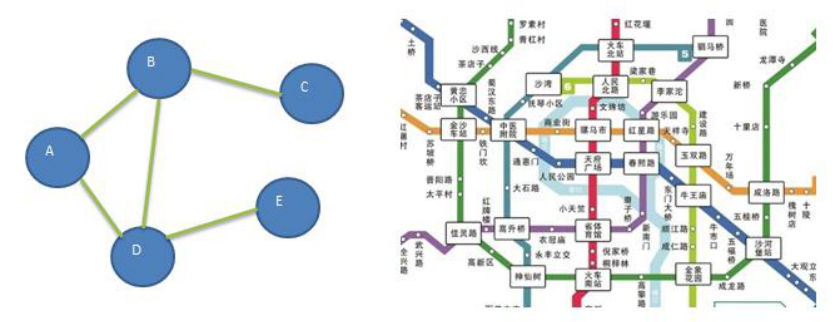
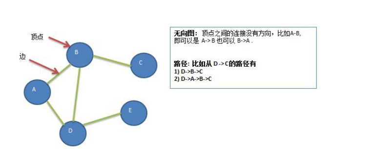
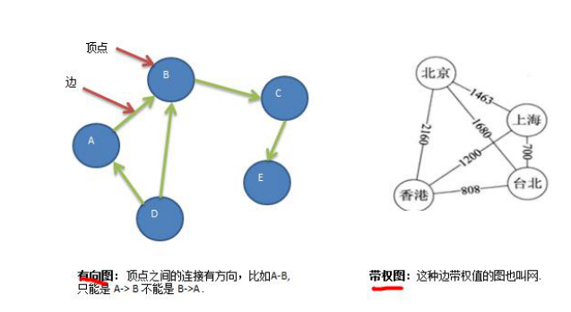
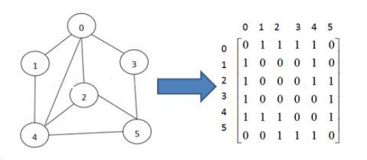
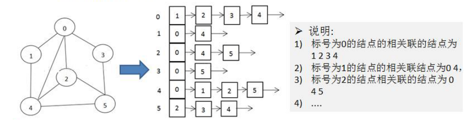
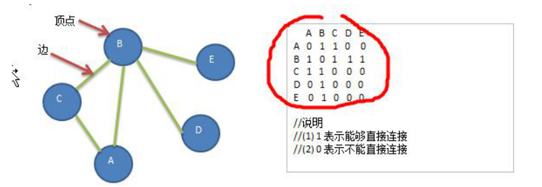

## 一、引言

图是一种数据结构，其中结点可以具有零个或多个相邻元素。两个结点之间的连接称为边。 结点也可以称为

顶点。如图：

      

## 二、常用概念

1. 顶点(vertex)
2. 边(dege)
3. 路径
4. 无向图
5. 有向图
6. 带权图



## 图的表示方式

图的表示方式有两种：二维数组表示（邻接矩阵）；链表表示（邻接表）。

### 1、邻接矩阵

邻接矩阵是表示图形中顶点之间相邻关系的矩阵，对于 n 个顶点的图而言，矩阵是的 row 和 col 表示的是 1....n 个点


      

### 2、邻接表

1. 邻接矩阵需要为每个顶点都分配 n 个边的空间，其实有很多边都是不存在,会造成空间的一定损失。
2. 邻接表的实现只关心存在的边，不关心不存在的边。因此没有空间浪费，邻接表由数组+链表组成。
3. 举例说明

      

## 四、代码实现

**要求** : 实现如下结构



**思路分析** 

1. 需要定义一个集合，存储顶点。
2. 定义一个二维数组，保存矩阵。

```java
package com.xuwei.graph;

import java.util.ArrayList;
import java.util.Arrays;

public class Graph {
    private ArrayList<String> vertexList; //存储顶点A,B,C,D,E
    private int[][] edges; //存储图对应的邻接矩阵，表示各个顶点之间的连接关系
    private int numOfEdges; //表示边的数目

    //构造器
    public Graph(int n) {
        //初始化矩阵和vertexList,边的数目
        edges = new int[n][n];
        vertexList = new ArrayList<String>(n);
        numOfEdges = 0;
    }

    //插入结点
    public void insertVertex(String vertex) {
        vertexList.add(vertex);
    }

    /**
     * 添加边,通过矩阵元素的值来确定两个结点之间是否具有边关系
     * @param v1    v1表示点的下标即是第几个顶点 A-0,B=1,C=2
     * @param v2    v2表示第二个顶点对应的下标
     * @param weight    表示两个结点是否关联
     */
    public void insertEdge(int v1,int v2, int weight) {
        edges[v1][v2] = weight;
        edges[v2][v1] = weight;
        numOfEdges++;

    }

    //返回结点的个数
    public int getNumOfVertex() {
        return vertexList.size();
    }

    //得到边的数目
    public int getNumOfEdges() {
        return numOfEdges;
    }

    //返回结点i(下标)对应的数据 0->A   1->B    2->C
    public String getValueByIndex(int i) {
        return vertexList.get(i);
    }

    //返回v1和v2的权值
    public int getWeight(int v1, int v2) {
        return edges[v1][v2];
    }

    //显示图对应的矩阵
    public void showGraph() {
        for (int[] link : edges) {
            System.out.println(Arrays.toString(link));
        }
    }

    public static void main(String[] args) {
        //测试图是否创建ok
        int n = 5; //结点的个数
        String vertexs[] = {"A","B","C","D","E"};
        //创建图对象
        Graph graph = new Graph(n);
        //循环的添加顶点
        for (String vertex : vertexs) {
            graph.insertVertex(vertex);
        }
        //添加边   A-B A-C B-C B-D B-E
        graph.insertEdge(0,1,1);
        graph.insertEdge(0,2,1);
        graph.insertEdge(1,2,1);
        graph.insertEdge(1,3,1);
        graph.insertEdge(1,4,1);
        //显示图
        graph.showGraph();
    }
}
```

## 五、深度优先遍历

### 1、基本思想

1. 深度优先遍历，从初始访问结点出发，初始访问结点可能有多个邻接结点，深度优先遍历的策略就是首先访问第一个邻接结点，然后再以这个被访问的邻接结点作为初始结点，访问它的第一个邻接结点， 可以这样理解：每次都在访问完当前结点后首先访问当前结点的第一个邻接结点。

2. 我们可以看到，这样的访问策略是优先往纵向挖掘深入，而不是对一个结点的所有邻接结点进行横向访问。

3. 显然，深度优先搜索是一个递归的过程。

总结：首先确定初始结点，访问它的第一个邻接结点，然后以这个邻接结点作为初始结点继续访问该结点的第一个邻接结点。

### 2、算法步骤

1. 访问初始结点 v，并标记结点 v 为已访问。
2. 查找结点 v 的第一个邻接结点 w。
3. 若 w 存在，则继续执行 4，如果 w 不存在，则回到第 1 步，将从 v 的下一个结点继续。
4. 若 w 未被访问，对 w 进行深度优先遍历递归（即把 w 当做另一个 v，然后进行步骤 123）。
5. 查找结点 v 的 w 邻接结点的下一个邻接结点，转到步骤 3。

### 3、代码实现

```java
 /**
     * 得到第一个邻接结点的下标 w
     * @param index
     * @return  如果存在就返回对应的下标，否则返回-1.
     * 举例：查找A结点的第一个邻接结点，index=0，返回的j=1，即指向B
     */
    public int getFirstNeighbor(int index) {
        for (int j = 0; j < vertexList.size(); j++) {
            if (edges[index][j] > 0) {
                return j;
            }
        }
        return -1;
    }

    //根据前一个邻接结点的下标来获取下一个邻接结点
    public int getNextNeighbor(int v1, int v2) {
        for (int j = v2 + 1; j < vertexList.size(); j++) {
            if (edges[v1][j] > 0) {
                return j;
            }
        }
        return -1;
    }

    //深度优先遍历算法

    /**
     * 访问下标为i的结点，确定该结点是否被访问过
     * @param isVisted
     * @param i
     */
    public void dfs(boolean[] isVisted, int i) {
        //首先访问该结点，输出
        System.out.print(getValueByIndex(i) + "->");
        //将结点设置为已经访问
        isVisted[i] = true;
        int w = getFirstNeighbor(i); //查找下标为i的结点的第一个邻接结点w
        while (w != -1) {//说明有
            if (!isVisted[w]) {
                dfs(isVisted,w);
            }
            //如果w结点已经被访问过
            w = getNextNeighbor(i, w);
        }
    }

    //对dfs进行重载，遍历我们所有的结点，并进行dfs
    public void dfs() {
        //遍历所有的结点，进行dfs[回溯]
        for (int i = 0; i < getNumOfVertex(); i++) {
            if (!isVisted[i]) {
                dfs(isVisted, i);
            }
        }
    }
```

## 六、广度优先遍历

### 1、基本思想

图的广度优先搜索(Broad First Search) ，类似于一个分层搜索的过程，广度优先遍历需要使用一个队列以保持访问过的结点的顺序，以便按这个顺序来访问这些结点的邻接结点。

### 2、算法步骤

1. 访问初始结点 v 并标记结点 v 为已访问
2. 结点 v 入队列
3. 当队列非空时，继续执行，否则算法结束
4. 出队列，取得队头结点 u。
5. 查找结点 u 的第一个邻接结点 w。
6. 若结点 u 的邻接结点 w 不存在，则转到步骤 3；否则循环执行以下三个步骤

1. 1. 若结点 w 尚未被访问，则访问结点 w 并标记为已访问
    2. 结点 w 入队列
    3. 查找结点 u 的继 w 邻接结点后的下一个邻接结点 w，转到步骤 6

### 3、代码实现

```java
//对一个结点进行广度优先遍历的方法
public void bfs(boolean[] isVisted, int i) {
    int u; //表示队列的头结点对应下标
    int w; //邻接结点w
    //队列,记录结点访问的顺序
    LinkedList<Object> queue = new LinkedList<>(); //用来当队列用
    //访问结点，输出结点信息
    System.out.print(getValueByIndex(i) + "->");
    //标记为已访问
    isVisted[i] = true;
    //将结点加入队列
    queue.addLast(i);

    while (!queue.isEmpty()) {
        //取出队列的头结点下标
        u = (Integer) queue.removeFirst();
        //得到第一个邻接结点的下标w
        w = getFirstNeighbor(u);
        while (w != -1) {//找到
            //是否访问过
            if (!isVisted[w]) {
                System.out.print(getValueByIndex(w) + "->");
                //标记已经访问
                isVisted[w] = true;
                //入队列
                queue.addLast(w);
            }
            //以u为前驱点，找w后面的下一个邻接结点
            w = getNextNeighbor(u,w); //体现出我们的广度优先
        }
    }
}

//遍历所有的结点，都进行广度优先搜索
public void bfs() {
    for (int i = 0; i < getNumOfVertex(); i++) {
        if (!isVisted[i]) {
            bfs(isVisted,i);
        }
    }
}
```


