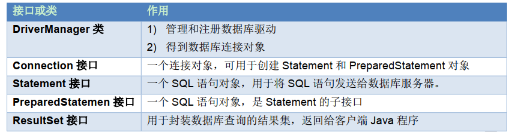
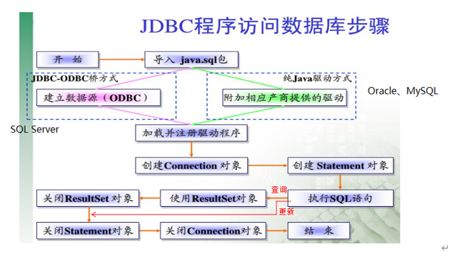

# 1. JDBC 概述

## 1. 什么是 JDBC

- JDBC(Java Database Connectivity)是一个**独立于特定数据库管理系统（DBMS）、通用的SQL数据库存取和操作的公共接口**（一组API），定义了用来访问数据库的标准Java类库，使用这个类库可以以一种标准的方法、方便地访问数据库资源。
- JDBC为访问不同的数据库提供了一种**统一的途径**，为开发者屏蔽了一些细节问题。
- JDBC的目标是使Java程序员使用JDBC可以连接任何**提供了JDBC驱动程序**的数据库系统，这样就使得程序员无需对特定的数据库系统的特点有过多的了解，从而大大简化和加快了开发过程。

## 2. JDBC 体系结构

- JDBC接口（API）包括两个层次：

- - 面向应用的API：Java API，抽象接口，供应用程序开发人员使用（连接数据库，执行SQL语句，获得结
        果）。
    - 面向数据库的API：Java Driver API，供开发商开发数据库驱动程序用。

## 3. JDBC API

JDBC API是一系列的接口，它统一和规范了应用程序与数据库的连接、执行SQL语句，并到得到返回结果等各类操作。声明在java.sql与javax.sql包中。

## 4. JDBC 程序编写步骤

