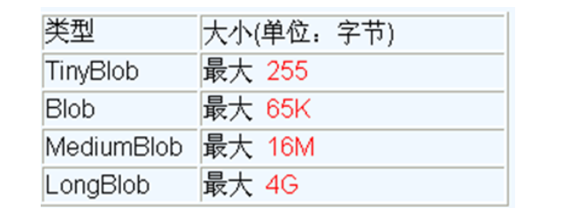

# 4. 操作 BLOG 类型字段


## 1. MySQL BLOB 类型

- MySQL中，BLOB是一个二进制大型对象，是一个可以存储大量数据的容器，它能容纳不同大小的数据。
- 插入BLOB类型的数据必须使用PreparedStatement，因为BLOB类型的数据无法使用字符串拼接写的。
- MySQL的四种BLOB类型(除了在存储的最大信息量上不同外，他们是等同的)



- 实际使用中根据需要存入的数据大小定义不同的BLOB类型


## 2. 向数据表中插入大数据类型


```
//获取连接
Connection conn = JDBCUtils.getConnection();
String sql = "insert into customers(name,email,birth,photo)values(?,?,?,?)";
PreparedStatement ps = conn.prepareStatement(sql);

// 填充占位符
ps.setString(1, "徐海强");
ps.setString(2, "xhq@126.com");
ps.setDate(3, new Date(new java.util.Date().getTime()));

// 操作Blob类型的变量
FileInputStream fis = new FileInputStream("xhq.png");
ps.setBlob(4, fis);

//执行
ps.execute();
fis.close();
JDBCUtils.closeResource(conn, ps);
```


## 3. 修改数据表中的 Blob 类型字段


```
Connection conn = JDBCUtils.getConnection();
String sql = "update customers set photo = ? where id = ?";
PreparedStatement ps = conn.prepareStatement(sql);

// 填充占位符
// 操作Blob类型的变量
FileInputStream fis = new FileInputStream("coffee.png");
ps.setBlob(1, fis);

ps.setInt(2, 25);
ps.execute();

fis.close();
JDBCUtils.closeResource(conn, ps);
```


## 4. 从数据表中读取大数据类型


```
//读取表中数据
    public static void query() throws Exception{
        String sql = "select * from t_user";
        ps = conn.prepareStatement(sql);
        //执行
        ResultSet resultSet = ps.executeQuery();
        while (resultSet.next()) {
            Object id = resultSet.getObject("id");
            Object username = resultSet.getObject("username");
            Object password = resultSet.getObject("password");
            //读取Bolb类型的字段
            Blob photo = resultSet.getBlob(4); //也可以通过第几列来获取字段当前值
            InputStream is = photo.getBinaryStream();
            FileOutputStream fos = new FileOutputStream("2.jpg");
            byte[] buffer = new byte[1024];
            int len = 0;
            while ((len = is.read(buffer)) != -1) {
                fos.write(buffer, 0, len);
            }
            System.out.print(id + "," + username + "," + password + "," + photo);
            System.out.println();
        }
    }
```