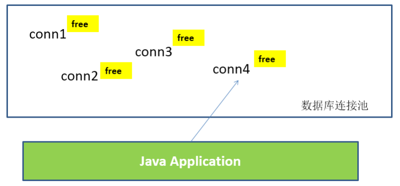

# 8. 数据库连接池

## 1. 数据库连接池技术

- 为解决传统开发中的数据库连接问题，可以采用数据库连接池技术
- 数据库连接池的基本思想：就是为数据库连接建立一个“缓冲池”。预先在缓冲池中放入一定数量的连接，当需要建立数据库连接时，只需从“缓冲池”中取出一个，使用完毕之后再放回去。
- 数据库连接池负责分配、管理和释放数据库连接，它允许应用程序重复使用一个现有的数据库连接，而不是重
    新建立一个
- 数据库连接池在初始化时将创建一定数量的数据库连接放到连接池中，这些数据库连接的数量是由**最小数据库
    连接数来设定**的。无论这些数据库连接是否被使用，连接池都将一直保证至少拥有这么多的连接数量。连接池
    的**最大数据库连接数量**限定了这个连接池能占有的最大连接数，当应用程序向连接池请求的连接数超过最大连
    接数量时，这些请求将被加入到等待队列中。



**数据库连接池技术的优点** ：

1. 资源重用
2. 更快的系统反应速度
3. 新的资源分配手段
4. 统一的连接管理，避免数据库连接泄漏


## 2. 多种开源的数据库连接池

- JDBC 的数据库连接池使用 javax.sql.DataSource 来表示，DataSource 只是一个接口，该接口通常由服务器(Weblogic, WebSphere, Tomcat)提供实现，也有一些开源组织提供实现：

- - DBCP 是Apache提供的数据库连接池。tomcat 服务器自带dbcp数据库连接池。**速度相对**c3p0**较快**，但因
        自身存在BUG，Hibernate3已不再提供支持
    - C3P0 是一个开源组织提供的一个数据库连接池，**速度相对较慢，稳定性还可以。**hibernate官方推荐使用
    - Proxool 是sourceforge下的一个开源项目数据库连接池，有监控连接池状态的功能，**稳定性较**c3p0**差一点**
    - BoneCP 是一个开源组织提供的数据库连接池，速度快
    - Druid 是阿里提供的数据库连接池，据说是集DBCP 、C3P0 、Proxool 优点于一身的数据库连接池，但是速度不确定是否有BoneCP快

- DataSource 通常被称为数据源，它包含连接池和连接池管理两个部分，习惯上也经常把 DataSource 称为连接
    池
- DataSource用来取代DriverManager来获取Connection，获取速度快，同时可以大幅度提高数据库访问速度。
- 数据源和数据库连接不同，数据源无需创建多个，它是产生数据库连接的工厂，因此**整个应用只需要一个
    数据源即可。**
- 当数据库访问结束后，程序还是像以前一样关闭数据库连接：conn.close(); 但conn.close()并没有关闭数
    据库的物理连接，它仅仅把数据库连接释放，归还给了数据库连接池
- 当数据库访问结束后，程序还是像以前一样关闭数据库连接：conn.close(); 但conn.close()并没有关闭数
    据库的物理连接，它仅仅把数据库连接释放，归还给了数据库连接池。


## 3. Druid 数据库连接池


```
public class JDBCUtils {
    private static Connection conn;
    private static DataSource ds;
    private static ThreadLocal<Connection> local; //使用ThreadLocal来保存同一个对象,共享局部变量
    private static Properties pro = new Properties();

    static {
        try {
            //把src下建一个druid.properties文件的数据，加载到一个properties对象里
            //加载，读取 jdbc.properties 配置的信息
            pro.load(JDBCUtils.class.getClassLoader().getResourceAsStream("druid.properties"));

            //创建池子
            ds = DruidDataSourceFactory.createDataSource(pro);
            local = new ThreadLocal<Connection>();

        } catch (IOException e) {
            e.printStackTrace();
        } catch (Exception e) {
            e.printStackTrace();
        }
    }

    ////使用ThreadLocal来保存同一个对象
    public static Connection getConnection() throws SQLException {
        conn = local.get(); //如果从local中能够得到一个连接对象，说明当前线程已经拿过了
        if (conn == null) {
            conn = ds.getConnection();
            local.set(conn);
        }
        return conn;
    }

    //提供关闭连接的方式
    public static void free() {
        conn = local.get();
        try {
            if (conn != null) {
                local.remove();
                conn.setAutoCommit(false); //还原我们的连接为自动提交，等别人再次拿到，默认自动提交.
                conn.close();
            }
        } catch (SQLException e) {
            e.printStackTrace();
        }

    }

    public static DataSource getDs() {
        return ds;
    }
}
```