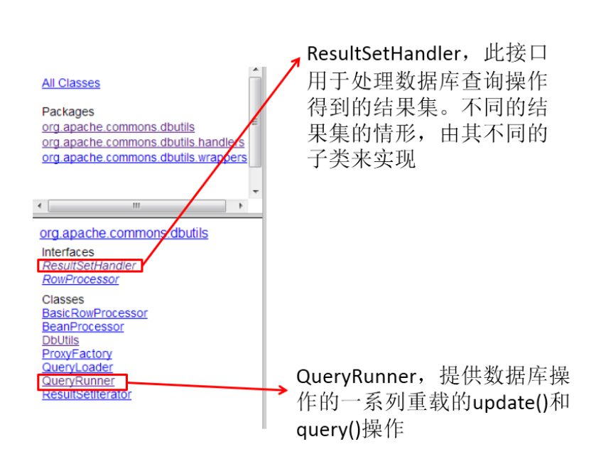

# 9. Apache-DBUtils 实现 CRUD 操作

## 1. Apache-DBUtils 简介

- commons-dbutils 是 Apache 组织提供的一个开源 JDBC工具类库，它是对JDBC的简单封装，学习成本极低，
    并且使用dbutils能极大简化jdbc编码的工作量，同时也不会影响程序的性能。
- API介绍：

- - org.apache.commons.dbutils.QueryRunner
    - org.apache.commons.dbutils.ResultSetHandler
    - 工具类：org.apache.commons.dbutils.DbUtils




## 2. 主要 API 的使用

### 2.1 DbUtils

- DbUtils ：提供如关闭连接、装载JDBC驱动程序等常规工作的工具类，里面的所有方法都是静态的。

- - public static void close(…) throws java.sql.SQLException： DbUtils类提供了三个重载的关闭方
        法。这些方法检查所提供的参数是不是NULL，如果不是的话，它们就关闭Connection、Statement和ResultSet。
    - public static void closeQuietly(…): 这一类方法不仅能在Connection、Statement和ResultSet为NULL情
        况下避免关闭，还能隐藏一些在程序中抛出的SQLEeception。
    - public static void commitAndClose(Connection conn)throws SQLException： 用来提交连接的事务，
        然后关闭连接
    - public static void commitAndCloseQuietly(Connection conn)： 用来提交连接，然后关闭连接，并且在
        关闭连接时不抛出SQL异常。
    - public static void rollback(Connection conn)throws SQLException：允许conn为null，因为方法内部做
        了判断
    - public static boolean loadDriver(java.lang.String driverClassName)：这一方装载并注册JDBC驱动程
        序，如果成功就返回true。使用该方法，你不需要捕捉这个异常ClassNotFoundException。


### 2.2 QueryRunner 类

- 该类简单化了SQL查询，它与ResultSetHandler组合在一起使用可以完成大部分的数据库操作，能够大大减少编码量。
- QueryRunner类提供了两个构造器：

- - 默认的构造器
    - 需要一个 javax.sql.DataSource 来作参数的构造器

- 更新：

- - public int update(Connection conn, String sql, Object... params) throws SQLException:用来执行一个更新（插入、更新或删除）操作

- 插入：

- - public T insert(Connection conn,String sql,ResultSetHandler rsh, Object... params) throws
        SQLException：只支持INSERT语句，其中 rsh - The handler used to create the result object from
        the ResultSet of auto-generated keys. 返回值: An object generated by the handler.即自动生成的
        键值

- 批处理：

- - public int[] batch(Connection conn,String sql,Object[][] params)throws SQLException： INSERT,
        UPDATE, or DELETE语句
    - public T insertBatch(Connection conn,String sql,ResultSetHandler rsh,Object[][] params)throws
        SQLException：只支持INSERT语句

- 查询：

- - public Object query(Connection conn, String sql, ResultSetHandler rsh,Object... params) throws
        SQLException：执行一个查询操作，在这个查询中，对象数组中的每个元素值被用来作为查询语句
        的置换参数。该方法会自行处理 PreparedStatement 和 ResultSet 的创建和关闭。


```
/**
 * apache工具包，有一个ResultHandler接口，结果集处理器的接口
 *
 *
 */
public class BasicDao2 {
    private QueryRunner qr = new QueryRunner(JDBCUtils.getDs());

    //适用于insert,update,delete语句
    public int update(String sql, Object... args) throws SQLException {
        return qr.update(sql, args);
    }

    //共享连接
    public int update(Connection conn, String sql, Object... args) throws SQLException {
        return qr.update(conn, sql, args);
    }

    public <T> List<T> getAll(Class<T> clazz, String sql, Object... args)throws Exception {
        return qr.query(sql, new BeanListHandler<T>(clazz), args);
    }

    public <T> T getById(Class<T> clazz, String sql, Object... args) throws Exception {
        return qr.query(sql, new BeanHandler<T>(clazz), args);
    }

    //例如:查询总记录，最高工资，最低工资，平均工资，
    public Object queryobject(String sql, Object... args) throws Exception {
        return qr.query(sql, new ScalarHandler<>(), args);
    }

    //按部门查询平均工资
    public List<Map<String,Object>> queryMap(String sql, Object... args) throws Exception {
        return qr.query(sql, new MapListHandler(), args);
    }
}
```