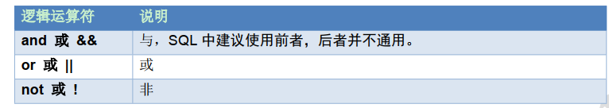
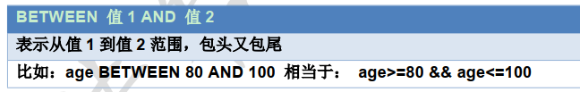

Beta请打开“钉钉”扫码重要文档！重要文档！重要文档！重要文档！领蛋孵福蛋继续赢取大奖奖品分享任务列表去完成已完成热门去完成水印[WIP] 为什么是语雀aboutNEWNEW

Adblocker

# 5. DQL 查询表中的数据

## 1. 简单查询

1. 查询所有的学生：select * from student;
2. 查询 student 表中的 name 和 age 列：select name,age from student;

## 2. 指定列的别名进行查询

1. 使用别名：select name as 姓名, age as 年龄 from student;
2. 表使用别名：select st.name as 姓名,age as 年龄 from student as st;

## 3. 清除重复值

1. 查询学生来自那些地方，去除重复的记录：select distinct address from student;

## 4. 查询结果参与运算

1. 给所有的年龄加 10：select age+10 from student;

## 5. 条件查询

- 准备数据

> CREATE TABLE student3 (
> id int, -- 编号name varchar(20), -- 姓名age int, -- 年龄sex varchar(5), -- 性别address varchar(100), -- 地址math int, -- 数学english int -- 英语);
> INSERT INTO student3(id,NAME,age,sex,address,math,english) VALUES (1,'马云',55,'男','杭州',66,78),(2,'马化腾',45,'女','深圳',98,87),(3,'马景涛',55,'男','香港',56,77),(4,'柳岩',20,'女','湖南',76,65),(5,'柳青',20,'男','湖南',86,NULL),(6,'刘德华',57,'男','香港',99,99),(7,'马德',22,'女','香港',99,99),(8,'德玛西亚',18,'男','南京',56,65);

- 运算符

- - 查询 math 分数大于 80 分的学生：select * from student3 where math > 80;
    - 查询 english 分数小于或等于 80 分的学生：select * from student3 where english <= 80;
    - 查询 age 等于 20 岁的学生：select * from student3 where age = 20;
    - 查询 age 不等于 20 岁的学生

> select * from student3 where age <> 20;
> select * from student3 where age != 20;

- 逻辑运算符

- - 查询 age 大于 35 且性别为男的学生(两个条件同时满足)：

> select * from student where age > 35 and sex='男';

- - 查询 age 大于 35 或性别为男的学生(两个条件其中一个满足)：

> select * from student3 where age > 35 or sex='男';

- - 查询 id 是 1 或 3 或 5 的学生：

> select * from student3 where id=1 or id=3 or id=5;

- **in 关键字**

- - 查询 id 是 1 或 3 或 5 的学生：select * from student3 where id in(1,3,5);
    - 查询 id 不是 1 或 3 或 5 的学生：select * from student3 where id not in(1,3,5);

- **范围查询**

- - 查询 english 成绩大于等于 75，且小于等于 90 的学生

> select * from student3 where english between 75 and 90;

- **like 关键字**

- MySQL 通配符

- - 查询姓马的学生：select * from student3 where name like '马%';
    - 查询姓名中包含'德'字的学生：select * from student3 where name like '%德%';
    - 查询姓马，且姓名有两个字的学生：select * from student3 where name like '马_';

## 6. 排序

desc：降序    asc：升序，默认值

1. 查询所有数据，使用年龄降序排序：select * from student3 order by age desc;
2. 查询所有数据,在年龄降序排序的基础上，如果年龄相同再以数学成绩升序排序

> select * from student3 order by age desc, math asc;

## 7. 聚合函数

使用聚合函数查询是纵向查询，它是对一列的值进行计算，然后返回一个结果值。聚合函数会忽略空值 NULL

1. 查询学生总数：
2. 查询 id 字段，如果为 null，则使用 0代替：select IFNULL(id,0) from student3;
3. 查询学生总数，如果记录为 NULL，给个默认值，这样统计的数据就不会遗漏：

> select count(ifnull(id,0)) from student;

1. 查询年龄大于 20 的总数：select count(*) from student3 where age > 20;
2. 查询数学成绩总分：select sum(math) as 总分 from student3;
3. 查询数学成绩平均分: select avg(math) 平均分 from student;
4. 查询数学成绩最高分：select max(math) 最高分 from student;
5. 查询数学成绩最低分：select min(math) 最低分 from student;

## 8. 分组

GROUP BY 将分组字段结果中相同内容作为一组，并且返回每组的第一条数据，所以单独分组没什么用处。分组的目的就是为了统计， 一般分组会跟聚合函数一起使用。

1. 按性别进行分组，求男生和女生数学的平均分：select sex,AVG(math) from student3 group by sex;
2. 查询男女各多少人：select sex,COUNT(*) from student3 group by sex;
3. 查询年龄大于25岁的人，按性别分组，统计每组的人数：

> select sex,COUNT(*) from student3 where age>25 group by sex;

1. 查询年龄大于 25 岁的人，按性别分组，统计每组的人数，并只显示性别人数大于 2 的数据

> select sex,COUNT(*) from student3 where age>25 group by sex having COUNT(*) > 2;

**问题：having 和 where 的区别？**

面试题：有如下订单表 , Orders 表数据如下所示，执行如下 SQL 语句，运行结果是？

select product,sum(price) from orders group by product where sum(price) > 30;

答案：运行有误，groub by 后面不能出现 where，使用 having.

## 9. limit 语句

1. 准备数据：

> INSERT INTO student3(id,NAME,age,sex,address,math,english) VALUES
> (9,'唐僧',25,'男','长安',87,78),
> (10,'孙悟空',18,'男','花果山',100,66),
> (11,'猪八戒',22,'男','高老庄',58,78),
> (12,'沙僧',50,'男','流沙河',77,88),
>
> (13,'白骨精',22,'女','白虎岭',66,66),
> (14,'蜘蛛精',23,'女','盘丝洞',88,88);

1. LIMIT 的作用就是限制查询记录的条数。
2. 查询学生表中数据，从第三条开始显示，显示6条：

> select * from student3 limit 2,6;  注意：索引从0开始

1. 如果第一个参数是 0 可以省略写：select * from student3 limit 5;
2. 最后如果不够 5 条，有多少显示多少：select * from student3 limit 10,5;