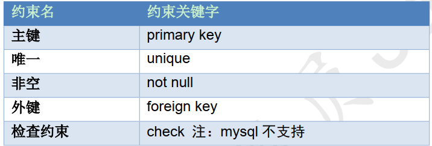
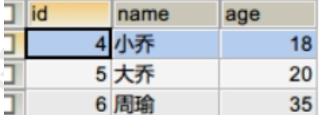
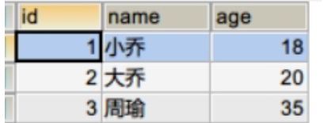
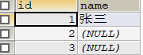
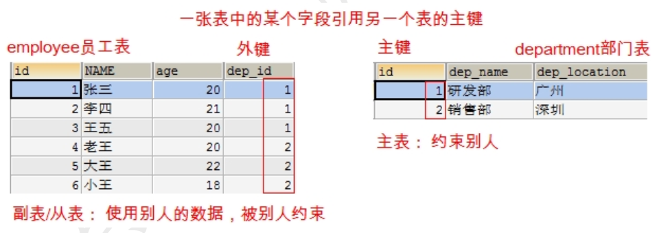
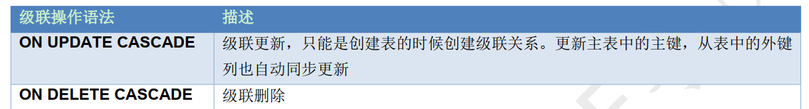
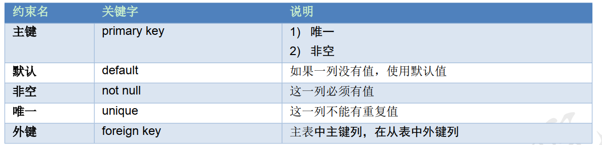

Beta请打开“钉钉”扫码重要文档！重要文档！重要文档！重要文档！领蛋孵福蛋继续赢取大奖奖品分享任务列表去完成已完成热门去完成水印[WIP] 为什么是语雀aboutNEWNEW

Adblocker

# 7. 数据库表的约束

## 1. 数据库约束的概述

对表中的数据进行限制， 保证数据的正确性、 有效性和完整性。一个表如果添加了约束， 不正确的数据将无法插入到表中。约束在创建表的时候添加比较合适

## 2. 主键约束

### 2.1 主键的作用

主键的作用：用来唯一标识数据库中的每一条记录。

### 2.2 哪个字段应该作为表的主键？

通常不用业务字段作为主键，单独给每张表设计一个 id 的字段，把 id 作为主键。 主键是给数据库和程序使用的，不是给最终的客户使用的。所以主键有没有含义没有关系，只要不重复，非空就行

### 2.3 创建主键

- 主键的特点：非空，唯一

创建主键方式：

1. 在创建表的时候给字段添加主键： 字段名 字段类型 primary key;
2. 在已有表中添加主键：alter table 表名 add primary key(字段名);

- 创建学生表st5

- - 插入重复的主键值会报错

### 2.4 删除主键

- 删除主键：alter table st5 drop primary key;
- 添加主键：alter table st5 add primary key(id);

### 2.5 主键自增

使用 auto_increment 表示自动增长（字段类型必须是整数类型）

> ---插入数据：

> ---另一种写法：

### 2.6 修改自增长的默认起始值

默认地 AUTO_INCREMENT 的开始值是 1，如果希望修改起始值,请使用下列 SQL 语法

- 创建表时指定起始值：

- 创建好以后修改起始值：

**注意：要修改的默认起始值不能比原来的起始值小。**

### 2.7 delete 和 truncate 对自增长的影响

- delete：删除所有的记录之后，自增长没有影响。

- truncate：删除以后，自增长又重新开始

## 3. 唯一约束

表中某一列不能出现重复的值。

### 3.1 格式

### 3.2 实现唯一约束

-- 创建学生表 st7, 包含字段(id, name),name 这一列设置唯一约束,不能出现同名的学生

> create table st7 (
>
> id int,
>    name varchar(20) unique
> )

-- 添加一个同名的学生

> insert into st7 values (1, '张三');
>
> select * from st7;

**错误代码** ：

> -- Duplicate entry '张三' for key 'name'
>
> insert into st7 values (2, '张三');

-- 重复插入多个 null 会怎样？

> insert into st7 values (2, null);
>
> insert into st7 values (3, null);
>
> 
>
> null 没有数据，不存在重复的问题

## 4. 非空约束

### 4.1 非空约束基本语法

### 4.2 默认值

- 疑问：如果一个字段设置了非空与唯一约束，该字段与主键的区别？

1. 主键数在一个表中，只能有一个。不能出现多个主键。主键可以单列，也可以是多列。
2. 自增长只能用在主键上

## 5 外键约束

### 5.1 什么是外键约束？

- 什么是外键：在从表中与主表主键对应的那一列，如：员工表中的 dep_id
- 主表： 一方，用来约束别人的表
- 从表： 多方，被别人约束的表

### 5.2 创建约束的语法：

- 新建表时增加外键：

- 已有表增加外键：

- 具体操作：

> 删除从表 employee：drop table employee;
>
> 创建从表 employee 并添加外键约束 emp_depid_fk：
>
> create table employee(
>   id int primary key auto_increment,
>   name varchar(20),
>   age int,
>   dep_id int, -- 外键对应主表的主键-- 创建外键约束
>
> constraint emp_depid_fk foreign key (dep_id) references   department(id)
> )
>
> 正常添加数据：
>
> INSERT INTO employee (NAME, age, dep_id) VALUES ('张三', 20, 1);
> INSERT INTO employee (NAME, age, dep_id) VALUES ('李四', 21, 1);
> INSERT INTO employee (NAME, age, dep_id) VALUES ('王五', 20, 1);
> INSERT INTO employee (NAME, age, dep_id) VALUES ('老王', 20, 2);
> INSERT INTO employee (NAME, age, dep_id) VALUES ('大王', 22, 2);
> INSERT INTO employee (NAME, age, dep_id) VALUES ('小王', 18, 2);

### 5.3 删除外键

> -- 删除 employee 表的 emp_depid_fk 外键

> alter table employee drop foreign key emp_depid_fk;
>
> 
> -- 在 employee 表情存在的情况下添加外键

> alter table employee add constraint emp_depid_fk foreign key (dep_id) references department(id);

### 5.4 外键的级联

- 什么是级联操作：

在修改和删除主表的主键时，同时更新或删除副表的外键值，称为级联操作

>  **删除** **employee** **表，重新创建** **employee** **表，添加级联更新和级联删除****drop table employee;**
> create table employee(
> id int primary key auto_increment,
> name varchar(20),
> age int,
> dep_id int, -- 外键对应主表的主键-- 创建外键约束constraint emp_depid_fk foreign key (dep_id) references
> department(id) on update cascade on delete cascade
> )
>
> **再次添加数据到员工表和部门表****INSERT INTO employee (NAME, age, dep_id) VALUES ('****张三****', 20, 1);**
>
> INSERT INTO employee (NAME, age, dep_id) VALUES ('李四', 21, 1);
> INSERT INTO employee (NAME, age, dep_id) VALUES ('王五', 20, 1);
> INSERT INTO employee (NAME, age, dep_id) VALUES ('老王', 20, 2);
> INSERT INTO employee (NAME, age, dep_id) VALUES ('大王', 22, 2);
> INSERT INTO employee (NAME, age, dep_id) VALUES ('小王', 18, 2);
>
> 
>
> **删除部门表？能不能直接删除？  不能**

> drop table department;

> 

> **把部门表中** **id** **等于** **1** **的部门改成** **id** **等于** **10**
> update department set id=10 where id=1;
> select * from employee;
> select * from department;
>
> 
>
> **删除部门号是** **2** **的部门**

> delete from department where id=2;

## 6. 数据约束小结

