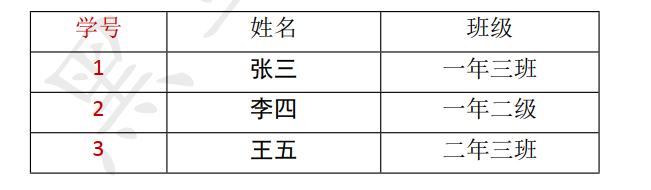
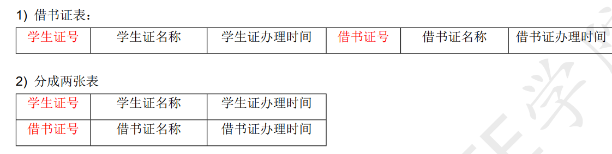
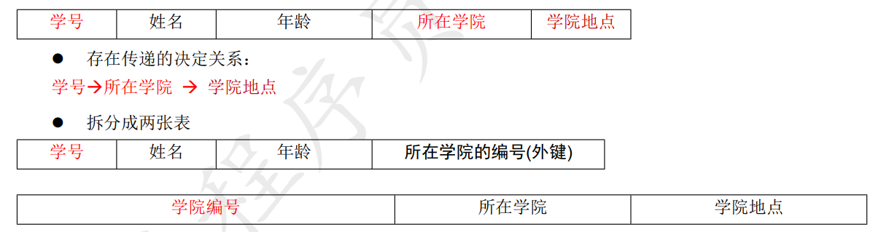

Beta请打开“钉钉”扫码重要文档！重要文档！重要文档！重要文档！领蛋孵福蛋继续赢取大奖奖品分享任务列表去完成已完成热门去完成水印[WIP] 为什么是语雀aboutNEWNEW

Adblocker

# 9. 数据库设计

## 1. 数据规范化

### 1.1 什么是范式？

好的数据库设计对数据的存储性能和后期的程序开发， 都会产生重要的影响。建立科学的， 规范的数据库就需要满足一些规则来优化数据的设计和存储，这些规则就称为范式。

### 1.2 三大范式：

目前关系数据库有六种范式： 第一范式（ 1NF）、 第二范式（ 2NF）、 第三范式（ 3NF）、 巴斯-科德范式（ BCNF） 、第四范式(4NF）和第五范式（ 5NF，又称完美范式）。

满足最低要求的范式是第一范式（ 1NF）。在第一范式的基础上进一步满足更多规范要求的称为第二范式（ 2NF） ，其余范式以次类推。一般说来，数据库只需满足第三范式(3NF就行了。

## 2. 1NF

数据库表的每一列都是不可分割的原子数据项， 不能是集合、 数组等非原子数据项。即表中的某个列有多个值
时，必须拆分为不同的列。 简而言之，第一范式每一列不可再拆分，称为原子性

举例：

## 3. 2NF

在满足第一范式的前提下，表中的每一个字段都完全依赖于主键。所谓完全依赖是指不能存在仅依赖主键一部分的列。 简而言之， 第二范式就是在第一范式的基础上所有列完全依赖于主键列。 当存在一个复合主键包含多个主键列的时候， 才会发生不符合第二范式的情况。比如有一个主键有两个列，不能存在这样的属性，它只依赖于其中一个列，这就是不符合第二范式。

**特点:**

1. 一张表只描述一件事情。
2. 表中的每一列都完全依赖于主键。

示例：

## 4. 3NF

**在满足第二范式的前提下，表中的每一列都直接依赖于主键，而不是通过其它的列来间接依赖于主键。**
简而言之，第三范式就是所有列不依赖于其它非主键列，也就是在满足 2NF 的基础上， 任何非主列不得传递依赖于主键。 所谓传递依赖， 指的是如果存在"A → B → C"的决定关系， 则 C 传递依赖于 A。因此， 满足第三范式的数据库表应该不存在如下依赖关系：主键列 → 非主键列 x → 非主键列 y

示例：

## 5. 三大范式小结

