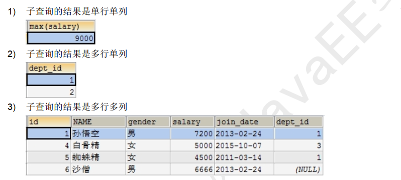

Beta请打开“钉钉”扫码重要文档！重要文档！重要文档！重要文档！领蛋孵福蛋继续赢取大奖奖品分享任务列表去完成已完成热门去完成水印[WIP] 为什么是语雀aboutNEWNEW

Adblocker

# 11. 子查询

## 1. 什么是子查询？

需求：查询开发部中有哪些员工

-- **通过两条语句查询**

select id from dept where name='开发部' ;
select * from emp where dept_id = 1;

-- **使用子查询**

select * from emp where dept_id = (select id from dept where name='开发部');

子查询概念：

- - 一个查询的结果做为另一个查询的条件
    - 有查询的嵌套，内部的查询称为子查询
    - 子查询要使用括号

## 2. 子查询结果的三种情况：

## 3. 子查询的结果是一个值的时候

- 子查询结果只要是单行单列， 肯定在 WHERE 后面作为条件， 父查询使用： 比较运算符。

1. 查询工资最高的员工是谁？

> -- 1) 查询最高工资是多少
>
> select max(salary) from emp;
> -- 2) 根据最高工资到员工表查询到对应的员工信息
>
> select * from emp where salary = (select max(salary) from emp);

1. 查询工资小于平均工资的员工有哪些？

> select * from emp where salary < (select AVG(salary) from emp);

## 4. 子查询的结果是多行单列的时候

子查询结果是单例多行，结果集类似于一个数组，父查询使用 IN 运算符

1. 查询工资大于 5000 的员工，来自于哪些部门的名字

> -- 先查询大于 5000 的员工所在的部门 id
> select dept_id from emp where salary > 5000;
> -- 再查询在这些部门 id 中部门的名字 Subquery returns more than 1 row
> select name from dept where id in (select dept_id from emp where salary > 5000);

1. 查询开发部与财务部所有的员工信息

> -- 先查询开发部与财务部的 id
> select id from dept where name in('开发部','财务部');
> -- 再查询在这些部门 id 中有哪些员工
>
> 
> select * from emp where dept_id in (select id from dept where name='开发部' or name='财务部');
>
> select * from emp where dept_id in (select id from dept where name in('开发部','财务部'));

## 5. 子查询的结果是多行多列

子查询结果只要是多列，肯定在 FROM 后面作为表

子查询作为表需要取别名，否则这张表没有名称则无法访问表中的字段

**查询出 2011 年以后入职的员工信息，包括部门名称**

**
**

> -- 查询出 2011 年以后入职的员工信息，包括部门名称-- 在员工表中查询 2011-1-1 以后入职的员工
>
> select * from emp where join_date >='2011-1-1';
> -- 查询所有的部门信息，与上面的虚拟表中的信息组合，找出所有部门 id 等于的 dept_id
> select e.name,e.gender,e.salary,e.join_date,d.`name` from dept d,  
>
> (select * from emp where join_date >='2011-1-1') e  

> where d.`id`= e.dept_id ;

> -- 也可以使用表连接：
>
> select * from emp inner join dept on emp.`dept_id` = dept.`id` where join_date >='2011-1-1';
> select * from emp inner join dept on emp.`dept_id` = dept.`id` and join_date >='2011-1-1';

## 6. 子查询小结

- 子查询结果只要是单列，则在 WHERE 后面作为条件
- 子查询结果只要是多列，则在 FROM 后面作为表进行二次查询