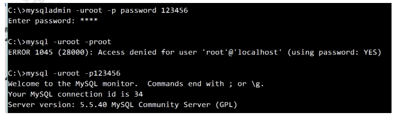

Beta请打开“钉钉”扫码重要文档！重要文档！重要文档！重要文档！领蛋孵福蛋继续赢取大奖奖品分享任务列表去完成已完成热门去完成水印[WIP] 为什么是语雀aboutNEWNEW

Adblocker

# 13. DCL

## 1. 创建用户

### 1.1 语法：

### 1.2 关键字说明：

| 关键字   | 说明                                                         |
| -------- | ------------------------------------------------------------ |
| '用户名' | 将创建的用户名                                               |
| '主机名' | 指定该用户在哪个主机上可以登陆，如果是本地用户可用 localhost，如果想让该用户可以 从任意远程主机登陆，可以使用通配符% |
| '密码'   | 该用户的登陆密码，密码可以为空，如果为空则该用户可以不需要密码登陆服务器 |

### 1.3 具体操作

- 创建 user1 用户，只能在 localhost 这个服务器登录mysql 服务器，密码为 123

> create user 'user1'@'localhost' identified by '123';

- 创建 user2 用户可以在任何电脑上登录 mysql 服务器，密码为 123

> create user 'user2'@'@'%' identified by '123';

## 2. 给用户授权

用户创建之后，没有什么权限！需要给用户授权

| 关键字            | 说明                                                         |
| ----------------- | ------------------------------------------------------------ |
| GRANT…ON…TO       | 授权关键字                                                   |
| 权限              | 授予用户的权限，如 CREATE、 ALTER、 SELECT、 INSERT、 UPDATE 等。如果要授 予所有的权限则使用 ALL |
| 数据库名.表名     | 该用户可以操作哪个数据库的哪些表。如果要授予该用户对所有数据库和表的相应操作 权限则可用*表示，如*.* |
| '用户名'@'主机名' | 给哪个用户授权，注：有 2 对单引号                            |

具体操作：

1. 给 user1 用户分配对 test 这个数据库操作的权限：创建表，修改表，插入记录，更新记录，查询

> grant create,alter,insert,update,select on test.* to 'user1'@'localhost';

1. 给 user2 用户分配所有权限，对所有数据库的所有表

> grant all on *.* to 'user2'@'%';

## 3. 撤销授权

### 3.1 语法

| 关键字            | 说明                                                         |
| ----------------- | ------------------------------------------------------------ |
| REVOKE…ON…FROM    | 撤销授权的关键字                                             |
| 权限              | 用户的权限，如 CREATE、 ALTER、 SELECT、 INSERT、 UPDATE 等，所有的权 限则使用 ALL |
| 数据库名.表名     | 对哪些数据库的哪些表，如果要取消该用户对所有数据库和表的操作权限则可用*表 示，如*.* |
| '用户名'@'主机名' | 给哪个用户撤销                                               |

### 3.2 具体操作：

- 撤销 user1 用户对 test 数据库所有表的操作的权限

> revoke all on test.* from 'user1'@'localhost';

## 4. 查看权限

### 4.1 语法

### 4.2 具体操作

- 查看 user1 用户的权限：

> show grants for 'user1'@'localhost';

## 5. 删除用户

### 5.1 语法

### 5.2 具体操作

- 删除 user2

> drop user 'user2'@'%';

## 6. 修改管理员密码

### 6.1 语法

注意：需要在未登陆 MySQL 的情况下操作，新密码不需要加上引号。

### 6.2 具体操作

1) 将 root 管理员的新密码改成 123456
2) 要求输入旧密码

3) 使用新密码登录

## 7. 修改普通用户密码

### 7.1 语法

注意：需要在登陆 MySQL 的情况下操作，新密码要加单引号。

### 7.2 具体操作

1) 将'user1'@'localhost'的密码改成'666666'
2) 使用新密码登录，老密码登录不了

> set password for 'user1'@'localhost'=password('666666');