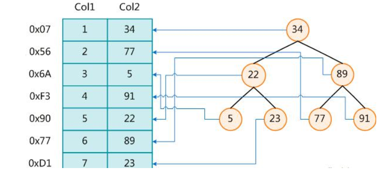
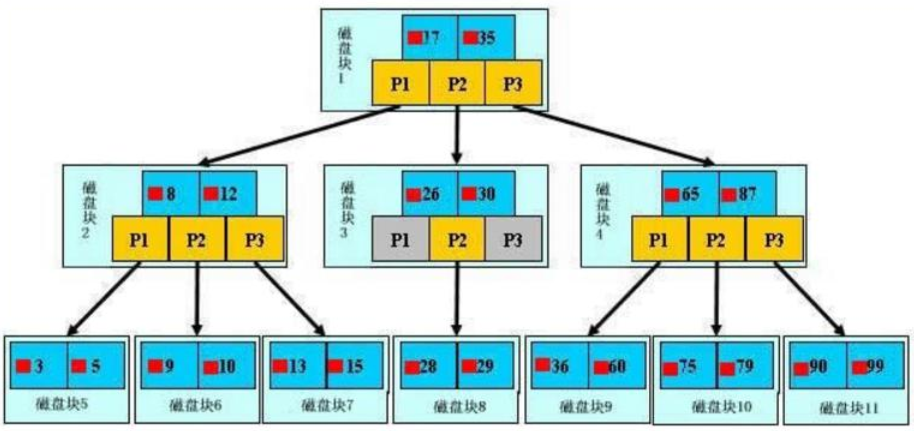
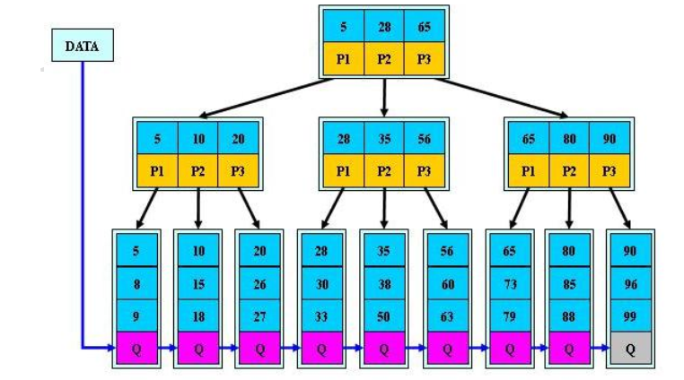
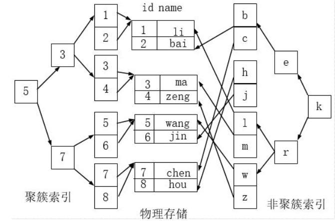
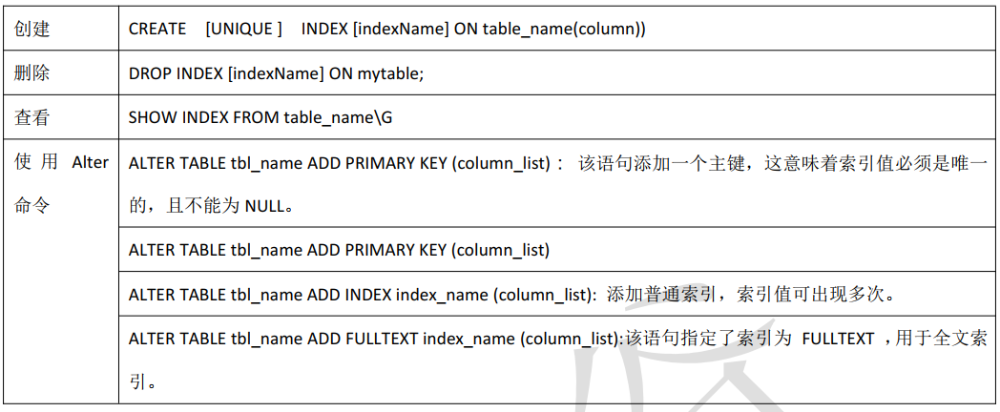

Beta请打开“钉钉”扫码重要文档！重要文档！重要文档！重要文档！领蛋孵福蛋继续赢取大奖奖品分享任务列表去完成已完成热门去完成水印[WIP] 为什么是语雀aboutNEWNEW

Adblocker

# 16. 索引

## 1. 索引的概念

### 1.1 索引是什么?

MySQL 官方对索引的定义为： 索引（Index） 是帮助 MySQL 高效获取数据的数据结构。 可以得到索引的本质：索引是数据结构。 可以简单理解为排好序的快速查找数据结构

在数据之外， 数据库系统还维护着满足特定查找算法的数据结构， 这些数据结构以某种方式引用（指向） 数据，这样就可以在这些数据结构上实现高级查找算法。 这种数据结构， 就是索引。 下图就是一种可能的索引方式示例：

左边是数据表， 一共有两列七条记录， 最左边的是数据记录的物理地址。 为了加快 Col2 的查找， 可以维护一个右边所示的二叉查找树， 每个节点分别包含索引键值和一个指向对应数据记录物理地址的指 针， 这样就可以运用二叉查找在一定的复杂度内获取到相应数据， 从而快速的检索出符合条件的记录。

一般来说索引本身也很大， 不可能全部存储在内存中， 因此索引往往以索引文件的形式存储的磁盘上。

### 1.2 优缺点

优点:

1. 提高数据检索的效率，降低数据库的 IO 成本。
2. 通过索引列对数据进行排序， 降低数据排序的成本， 降低了CPU的消耗

缺点：

1. 虽然索引大大提高了查询速度， 同时却会降低更新表的速度， 如对表进行INSERT、 UPDATE和DELETE。 因为
    更新表时， MySQL不仅要保存数据， 还要保存一下索引文件每次更新添加了索引列的字段， 都会调整因为
    更新所带来的键值变化后的索引信息。
2. 实际上索引也是一张表， 该表保存了主键与索引字段， 并指向实体表的记录， 所以索引列也是要占用空间的。

## 2. MySQL 的索引

### 2.1 Btree 索引

MySQL 使用的是 Btree 索引。

**初始化介绍：**

> 一颗 b 树， 浅蓝色的块我们称之为一个磁盘块， 可以看到每个磁盘块包含几个数据项（深蓝色所示） 和指针（黄色所示），如磁盘块 1 包含数据项 17 和 35， 包含指针 P1、 P2、 P3，P1 表示小于 17 的磁盘块， P2 表示在 17 和 35 之间的磁盘块， P3 表示大于 35 的磁盘块。真实的数据存在于叶子节点即 3、 5、 9、 10、 13、 15、 28、29、 36、 60、 75、 79、 90、 99。非叶子节点只不存储真实的数据， 只存储指引搜索方向的数据项， 如 17、35 并不真实存在于数据表中。

**查找过程** ：

> 如果要查找数据项 29， 那么首先会把磁盘块 1 由磁盘加载到内存， 此时发生一次 IO， 在内存中用二分查找确定 29在 17 和 35 之间， 锁定磁盘块 1 的 P2 指针， 内存时间因为非常短（相比磁盘的 IO） 可以忽略不计， 通过磁盘块 1的 P2 指针的磁盘地址把磁盘块 3 由磁盘加载到内存， 发生第二次 IO， 29 在 26 和 30 之间， 锁定磁盘块 3 的 P2 指针， 通过指针加载磁盘块 8 到内存， 发生第三次 IO， 同时内存中做二分查找找到 29， 结束查询， 总计三次 IO。
>
> 
>
> 真实的情况是， 3 层的 b+树可以表示上百万的数据， 如果上百万的数据查找只需要三次 IO， 性能提高将是巨大的，如果没有索引， 每个数据项都要发生一次 IO， 那么总共需要百万次的 IO， 显然成本非常非常高。

### 2.2 B+tree 索引

**B+Tree 与 B-Tree 的区别** ：

1. B-树的关键字和记录是放在一起的， 叶子节点可以看作外部节点， 不包含任何信息； B+树的非叶子节点中只有关键字和指向下一个节点的索引， 记录只放在叶子节点中。
2. 在 B-树中， 越靠近根节点的记录查找时间越快， 只要找到关键字即可确定记录的存在； 而 B+树中每个记录的查找时间基本是一样的， 都需要从根节点走到叶子节点， 而且在叶子节点中还要再比较关键字。 从这个角度看 B-树的性能好像要比 B+树好， 而在实际应用中却是 B+树的性能要好些。因为 B+树的非叶子节点不存放实际的数据，这样每个节点可容纳的元素个数比 B-树多， 树高比 B-树小， 这样带来的好处是减少磁盘访问次数。 尽管 B+树找到一个记录所需的比较次数要比 B-树多， 但是一次磁盘访问的时间相当于成百上千次内存比较的时间， 因此实际中B+树的性能可能还会好些， 而且 B+树的叶子节点使用指针连接在一起， 方便顺序遍历（例如查看一个目录下的所有文件， 一个表中的所有记录等）， 这也是很多数据库和文件系统使用 B+树的缘故。

**思考** ：为什么说 B+树比 B-树更适合实际应用中操作系统的文件索引和数据库索引？

1. B+树的磁盘读写代价更低。

> B+树的内部结点并没有指向关键字具体信息的指针。 因此其内部结点相对 B 树更小。 如果把所有同一内部结点的关键字存放在同一盘块中， 那么盘块所能容纳的关键字数量也越多。 一次性读入内存中的需要查找的关键字也就越多。 相对来说 IO 读写次数也就降低了。

1. B+树的查询效率更加稳定

> 由于非终结点并不是最终指向文件内容的结点， 而只是叶子结点中关键字的索引。 所以任何关键字的查找必须走一条从根结点到叶子结点的路。 所有关键字查询的路径长度相同， 导致每一个数据的查询效率相当。

## 3. 聚簇索引和非聚簇索引

聚簇索引并不是一种单独的索引类型， 而是一种数据存储方式。 术语‘聚簇’ 表示数据行和相邻的键值聚簇的存储在一起。 如下图， 左侧的索引就是聚簇索引， 因为数据行在磁盘的排列和索引排序保持一致。

**聚簇索引的好处：**

按照聚簇索引排列顺序， 查询显示一定范围数据的时候， 由于数据都是紧密相连， 数据库不不用从多
个数据块中提取数据， 所以节省了大量的 io 操作。

**聚簇索引的限制：**

对于 mysql 数据库目前只有 innodb 数据引擎支持聚簇索引， 而 Myisam 并不支持聚簇索引。由于数据物理存储排序方式只能有一种， 所以每个 Mysql 的表只能有一个聚簇索引。 一般情况下就是该表的主键。

**总结：聚簇索引用字典来说相当于按照拼音来查，非聚簇索引相当于用偏旁来查。**

**
**

## 4. MySQL 索引分类

### 4.1 单值索引

概念： 即一个索引只包含单个列， 一个表可以有多个单列索引

语法：

| 所表一起创建：                                               |
| ------------------------------------------------------------ |
| CREATE TABLE customer (id INT(10) UNSIGNED AUTO_INCREMENT ,customer_no VARCHAR(200),customer_name VARCHAR(200), PRIMARY KEY(id),KEY (customer_name)); |
| 单独建单值索引：                                             |
| CREATE INDEX idx_customer_name ON customer(customer_name);   |
| 删除索引：drop index idx_customer_name on customer;          |

### 4.2 唯一索引

概念： 索引列的值必须唯一， 但允许有空值

| 随表一起创建：                                               |
| ------------------------------------------------------------ |
| CREATE TABLE customer (id INT(10) UNSIGNED AUTO_INCREMENT ,customer_no VARCHAR(200),customer_name VARCHAR(200), PRIMARY KEY(id), KEY (customer_name),UNIQUE (customer_no)); |
| 单独建唯一索引：                                             |
| CREATE UNIQUE INDEX idx_customer_no ON customer(customer_no); |
| 删除索引：drop index idx_customer_no on customer(customer_no); |

### 4.3 主键索引

概念： 设定为主键后数据库会自动建立索引， innodb为聚簇索引

| 随表一起建索引                                               |
| ------------------------------------------------------------ |
| CREATE TABLE customer (id INT(10) UNSIGNED AUTO_INCREMENT , customer_no VARCHAR(200),customer_name VARCHAR(200),PRIMARY KEY(id)); |
| 单独建主键索引：ALTER TABLE customer add PRIMARY KEY customer(customer_no); |
| 删除建主键索引：ALTER TABLE customer drop PRIMARY KEY ;      |
| 修改建主键索引：必须先删除掉(drop)原索引， 再新建(add)索引   |

### 4.4 复合索引

| 随表一起建索引：                                             |
| ------------------------------------------------------------ |
| CREATE TABLE customer (id INT(10) UNSIGNED AUTO_INCREMENT ,customer_no VARCHAR(200),customer_name VARCHAR(200), PRIMARY KEY(id), KEY (customer_name), UNIQUE (customer_name),KEY (customer_no,customer_name)); |
| 单独建索引：                                                 |
| CREATE INDEX idx_no_name ON customer(customer_no,customer_name); |

### 4.5 基本语法

## 5. 索引的创建时机

### 5.1 适合创建索引的情况

- 主键自动建立唯一索引；
- 频繁作为查询条件的字段应该创建索引
- 查询中与其它表关联的字段， 外键关系建立索引
- 单键/组合索引的选择问题， 组合索引性价比更高
- 查询中排序的字段， 排序字段若通过索引去访问将大大提高排序速度
- 查询中统计或者分组字段

### 5.2 不适合创建索引的情况

- 表记录太少
- 经常增删改的表或者字段
- Where 条件里用不到的字段不创建索引
- 过滤性不好的不适合建索引

## 6. 索引优化

### 6.1 索引不会包含有 NULL 值的列

只要列中包含有 NULL 值都将不会被包含在索引中， 组合索引中只要有一列含有 NULL值， 那么这一列对于此组合索引就是无效的。 所以我们在数据库设计时不要让字段的默认值为 NULL。 create table table_name(c1 varchar(32) default ‘0’)

### 6.2 使用短索引

对串列进行索引， 如果可能应该指定一个前缀长度。 例如， 如果有一个 CHAR(255)的列，如果在前 10 个或 20 个字符内， 多数值是惟一的， 那么就不要对整个列进行索引。 短索引不仅可以提高查询速度而且可以节省磁盘空间和 I/O 操作。

> CREATE INDEX index_name ON table_name (column(length))

### 6.3 索引列排序

MySQL 查询只使用一个索引， 因此如果 where 子句中已经使用了索引的话， 那么 order by 中的列是不会使用索引的。 因此数据库默认排序可以符合要求的情况下不要使用排序操作； 尽量不要包含多个列的排序， 如果需要最好给这些列创建复合索引。

### 6.4 like 语句操作

一般情况下不鼓励使用 like 操作， 如果非使用不可， 如何使用也是一个问题。like “%aaa%”不会使用索引， 而 like “aaa%”可以使用索引

### 6.5 不要在列上进行运算

例如： select * from users where YEAR(adddate)<2007， 将在每个行上进行运算， 这将导致 索 引 失 效 而 进 行 全 表 扫 描 ， 因 此 我 们 可 以 改 成 ： 

select * from users where adddate<’2007-01-01