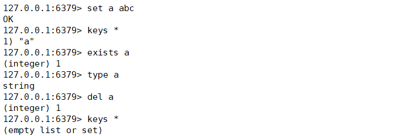
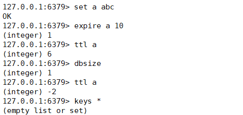
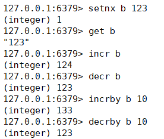

# 3. 五大数据类型

## 1. key 常用命令

1. 查看当前数据库的所有键：keys *
2. 判断某个键是否存在：exists <key>
3. 查看键的类型：type <key>
4. 删除某个键：del <key>
5. 为键值对设置过期时间，单位秒：expire <key> <seconds>
6. 查看还有多久过期，-1 表示永不过期，-2表示已过期：ttl <key>
7. 查看当前数据库中 key 的数量：dbsize
8. 清空当前库：flushdb
9. 通杀全部库：Flushall




## 2. String 

### 2.1 概述

String 是 redis 最基本的类型，一个key对应一个value，并且 String 类型是二进制安全的，意味着Redis的string可以包含任何数据。比如jpg图片或者序列化的对象 。但是 一个Redis中字符串value最多可以是512M。


### 2.2 常用操作

- 查询对应键值对：get <key>
- 添加键值对：set <key> <value>
- 将给定的 <value> 添加到原值的末尾：append <key> <value>
- 获取值的长度：strlen <len>
- 只有在 key 不存在时设置 key 的值：setnx <key> <value>
- 将 key 中存储的数字值增 1，只能对数字值操作，如果为空，新增值为 1：incr <key>
- 将 key 中存储的数字值减 1，只能对数字值操作，如果为空，新增值为 -1：decr <key>
- 将 key 中存储的数字值增减，自定义步长：incrby/decrby <key> 步长
- 同时设置一个或多个 value：mset <key1> <value1> <key2> <value2>
- 同时设置一个或多个key-value对，当且仅当所有给定的key都不存在：msetnx <key1> <value1> <key2> <value2>
- 获得值的范围，类似 java 中的 substring：getrange <key> <起始位置> <结束位置>
- 用 <value> 覆盖 <key> 所存储的字符串值，从 <起始位置> 开始：setrange <key> <起始位置> <value>
- 设置键值对的同时，设置过期时间，单位秒：setex <key> <过期时间> <value>
- 以新换旧，设置了新值的同时获取旧值：getset <key> <value>




**说说 incr key 操作的原子性**

所谓原子操作是指不会被线程调度机制打断的操作；这种操作一旦开始，就一直运行到结束，中间不会有任何 context switch （切换到另一个线程）。

在单线程中， 能够在单条指令中完成的操作都可以认为是" 原子操作"，因为中断只能发生于指令之间。

在多线程中，不能被其它进程（线程）打断的操作就叫原子操作。
   ***\*Redis\**\**单命令的原子性主要得益于\*******\*Redis\*******\*的单线程\****


**思考:** **java****中i****++****是否是原子操作?**

i++ 和++i 并非原子操作, 我们若查看字节码,会发现 i++ 执行了多部操作, 从变量i中读取读取 i 的值->值+1 ->将 +1 后的值写回 i 中,这样在多线程的时候执行情况就类似如下了：


```
Thread1             Thread2  
r1 = i;             r3 = i;                 
r2 = r1 + 1;        r4 = r3 + 1;  
i = r2;             i = r4;
```


这样会造成的问题就是 r1, r3 读到的值都是 0,最后两个线程都将 1 写入 i, 最后 i 等于 1,但是却进行了两次自增操作。


## 3. List

### 3.1 List 概述

1. List 是单键多值的。
2. Redis 列表是简单的字符串列表，按照插入顺序排序。你可以添加一个元素导列表的头部（左边）或者尾部（右边）。
3. 它的底层实际是个***\*双向链表，对两端的操作性能很高，通过索引下标的操作中间的节点性能会较差\****


### 3.2 常用操作

- 从左边/右边插入一个或多个值：lpush/rpush <key> <value1> <valu2>
- 从左边/右边吐出一个值。值在键在，值光键亡：lpop/rpop  <key>
- 从<key1>列表右边吐出一个值，插到<key2>列表左边：rpoplpush  <key1>  <key2>  
- 按照索引下标获得元素(从左到右)：lrange <key> <start> <stop>
- 按照索引下标获得元素(从左到右)：lindex <key> <index>
- 获得列表长度：llen <key>
- 在<value>的后面插入<newvalue> 插入值：linsert <key>  before/after <value>  <newvalue>
- 从左边删除n个value(从左到右)：lrem <key> <n>  <value>


## 4. Set

### 4.1 概述

1. Redis set 对外提供的功能与 list 类似是一个列表的功能，特殊之处在于set是可以自动排重的，当你需要存储一个列表数据，又不希望出现重复数据时，set是一个很好的选择，并且set提供了判断某个成员是否在一个set集合内的重要接口，这个也是list所不能提供的。
2. Redis的Set是string类型的无序集合。它底层其实是一个value为null的hash表,所以添加，删除，查找的复杂度都是O(1)。


### 4.2 常用操作

- 将一个或多个 member 元素加入到集合 key 当中，已经存在于集合的 member 元素将被忽略：sadd <key> <value1> <value2> ...
- 取出该集合的所有值：smembers <key>
- 判断集合是否为含有该值，有返回1，没有返回0：sismember <key> <value>
- 返回该集合的元素个数：scard <key>
- 删除集合中的某个元素：srem <key> <value1> <value2>...
- 随机从该集合中吐出一个值：spop <key>
- 随机从该集合中取出n个值,不会从集合中删除：srandmember <key> <n>
- 返回两个集合的交集元素：sinter <key1> <key2>
- 返回两个集合的并集元素：sunion <key1> <key2> 
- 返回两个集合的差集元素：sdiff <key1> <key2>  


## 5. Hash

1. Redis  hash 是一个键值对集合
2. Redis hash是一个string类型的 field 和 value 的映射表，hash特别适合用于存储对象。
3. 类似Java里面的Map<String,Object>


**分析一个问题:** **现有一个Java****Bean****对象，在Redis中如何存**?

第一种方案: 用户ID为key ,VALUE为JavaBean序列化后的字符串

缺点: 每次修改用户的某个属性，需要先反序列化改好后再序列化回去。开销较大


第二种方案: 用户ID+属性名作为key, 属性值作为Value.

缺点: 用户ID数据冗余。


第三种方案: 通过 key(用户ID) + field(属性标签) 就可以操作对应属性数据了，既不需要重复存储数据，也不会

带来序列化和并发修改控制的问题。


### 5.2 常用操作

- 给集合中的键赋值：hset <key> <field> <value>
-  从集合 取出 value：hget <key> <field>
-  批量设置hash的值：hmset <key1> <field1> <value1> <field2> <value2>...
-  查看哈希表 key 中，给定域 field 是否存在：hexists key <field>
-  列出该hash集合的所有field：hkeys <key>
-  列出该hash集合的所有value：hvals <key>
- 为哈希表 key 中的域 field 的值加上增量 increment：hincrby <key> <field> <increment>
- 将哈希表 key 中的域 field 的值设置为 value ，当且仅当域 field 不存在：hsetnx <key> <field> <value>


## 6. zset（sorted set）

### 6.1 概述

1. Redis 有序集合 zset 与普通集合 set 非常相似，是一个没有重复元素的字符串集合。不同之处是有序集合的每个成员都关联了一个评分（score） ，这个评分（score）被用来按照从最低分到最高分的方式排序集合中的成员。集合的成员是唯一的，但是评分可以是重复了 。
2. 因为元素是有序的, 所以你也可以很快的根据评分（score）或者次序（position）来获取一个范围的元素。访问有序集合的中间元素也是非常快的,因此你能够使用有序集合作为一个没有重复成员的智能列表。


### 6.2 常用操作

- 将一个或多个 member 元素及其 score 值加入到有序集 key 当中：zadd  <key> <score1> <value1>  <score2> <value2>...
-  返回有序集 key 中，下标在 之间的元素：zrange <key>  <start> <stop>  [WITHSCORES]  
-  带WITHSCORES，可以让分数一起和值返回到结果集。zrange <key>  <start> <stop>  [WITHSCORES]  
-  返回有序集 key 中，所有 score 值介于 min 和 max 之间(包括等于 min 或 max )的成员。有序集成员按 score 值递增(从小到大)次序排列：zrangebyscore key min max [withscores] [limit offset count]
-  同上，改为从大到小排列：zrevrangebyscore key max min [withscores] [limit offset count]
-  为元素的 score 加上增量：zincrby <key> <increment> <value>
-  删除该集合下，指定值的元素：zrem  <key>  <value>  
-  统计该集合，分数区间内的元素个数：zcount <key>  <min>  <max>
-  返回该值在集合中的排名，从0开始：zrank <key>  <value>


