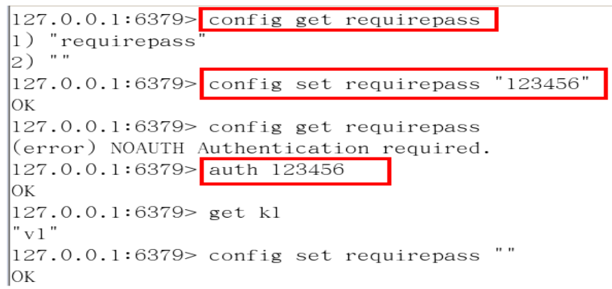

# 4. Redis 相关配置

1. 计量单位说明,大小写不敏感

 

1. include

类似jsp中的include，多实例的情况可以把公用的配置文件提取出来

1. ip地址的绑定 bind

- 默认情况bind=127.0.0.1只能接受本机的访问请求
- 不写的情况下，无限制接受任何ip地址的访问
- 生产环境肯定要写你应用服务器的地址
- 如果开启了protected-mode，那么在没有设定bind ip且没有设密码的情况下，Redis只允许接受本机的相应

1.  tcp-backlog

- 可以理解是一个请求到达后至到接受进程处理前的队列.
- backlog队列总和=未完成三次握手队列 +  已经完成三次握手队列
- 高并发环境tcp-backlog 设置值跟超时时限内的Redis吞吐量决定

1.  timeout

一个空闲的客户端维持多少秒会关闭，0为永不关闭。

1. tcp keepalive

对访问客户端的一种心跳检测，每个n秒检测一次，官方推荐设置为60秒

1. daemonize

是否为后台进程

1. pidfile

存放pid文件的位置，每个实例会产生一个不同的pid文件

1. log level

四个级别根据使用阶段来选择，生产环境选择notice 或者warning

1. log level

日志文件名称

1. syslog

是否将Redis日志输送到linux系统日志服务中

1. syslog-ident

日志的标志

1. syslog-facility

输出日志的设备

1. database

设定库的数量 默认16

1. security

在命令行中设置密码

1. maxclient

最大客户端连接数

1. maxmemory

设置Redis可以使用的内存量。一旦到达内存使用上限，Redis将会试图移除内部数据，移除规则可以通过maxmemory-policy来指定。如果Redis无法根据移除规则来移除内存中的数据，或者设置了“不允许移除”，

那么Redis则会针对那些需要申请内存的指令返回错误信息，比如SET、LPUSH等。

1. Maxmemory-policy

- volatile-lru：使用LRU算法移除key，只对设置了过期时间的键
-  allkeys-lru：使用LRU算法移除key
- volatile-random：在过期集合中移除随机的key，只对设置了过期时间的键
- allkeys-random：移除随机的key
- volatile-ttl：移除那些TTL值最小的key，即那些最近要过期的key
- noeviction：不进行移除。针对写操作，只是返回错误信息

1. Maxmemory-samples

设置样本数量，LRU算法和最小TTL算法都并非是精确的算法，而是估算值，所以你可以设置样本的大小。

一般设置3到7的数字，数值越小样本越不准确，但是性能消耗也越小。