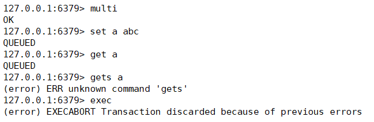
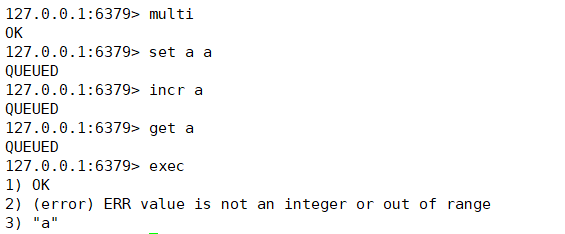
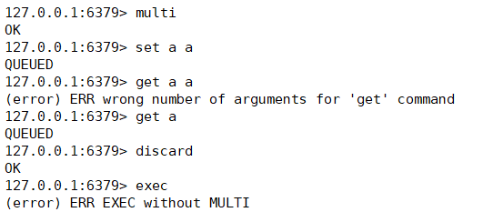
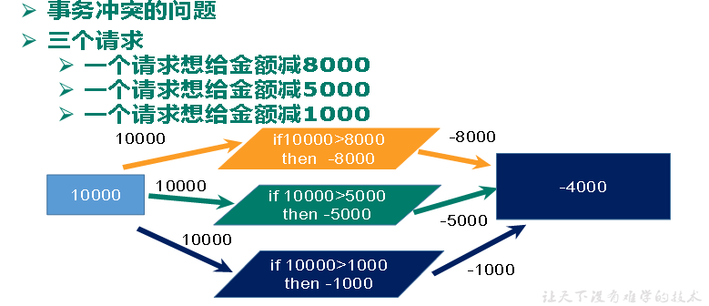
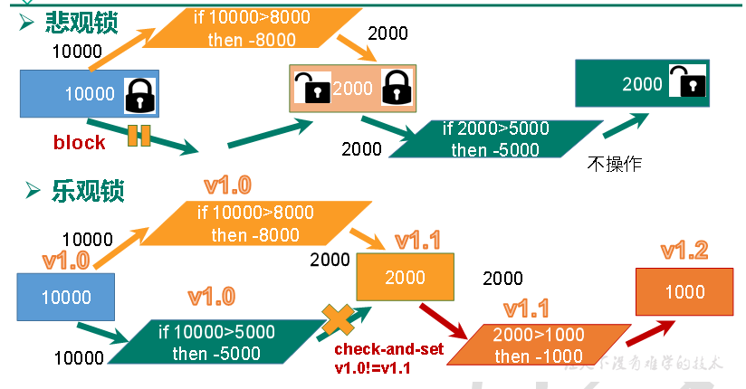

# 6. 事务

## 1. 定义

Redis事务是一个单独的隔离操作：事务中的所有命令都会序列化、按顺序地执行。事务在执行的过程中，不会被其他客户端发送来的命令请求所打断Redis事务的主要作用就是串联多个命令防止别的命令插队。

##  


## 2. multi、exec、discard

1. 从输入Multi命令开始，输入的命令都会依次进入命令队列中，但不会执行，至到输入Exec后，Redis会将之前的命令队列中的命令依次执行。
2. 组队的过程中可以通过discard来放弃组队。  


## 3. 事务的错误处理

1. 组队中某个命令出现了报告错误，执行时整个的所有队列会都会被取消。


 出现了编译时异常，错误产生后事务取消。


1. 如果执行阶段某个命令报出了错误，则只有报错的命令不会被执行，而其他的命令都会执行，不会回滚。


事务中其中的某一步错误并不影响其他命令的执行。


  discard 取消事务


## 4. 为什么要做成事务？

**举个例子**

有很多人有很多的账户，同时去参加双十一抢购




**通过事务解决问题**




**悲观锁**

顾名思义，就是很悲观，每次去拿数据的时候都认为别人会修改，所以每次在拿数据的时候都会上锁，这样别人想拿这个数据就会block直到它拿到锁。传统的关系型数据库里边就用到了很多这种锁机制，比如行锁，表锁等，读锁，写锁等，都是在做操作之前先上锁。


**乐观锁**

顾名思义，就是很乐观，每次去拿数据的时候都认为别人不会修改，所以不会上锁，但是在更新的时候会判断一下在此期间别人有没有去更新这个数据，可以使用版本号等机制。乐观锁适用于多读的应用类型，这样可以提高吞吐量。Redis就是利用这种check-and-set机制实现事务的。


## 5. 事务的使用

**1. WATCH key**

在执行 multi 之前，先执行 watch key1 [key2]，可以监视一个(或多个) key ，如果在事务执行之前这个(或这些) key 被其他命令所改动，那么事务将被打断。

  


注意：**在事务执行之前，如果监视的内容发生改变，事务全部取消。**

**
**

**2. unwatch** 

取消 WATCH 命令对所有 key 的监视。如果在执行 WATCH 命令之后， EXEC 命令或 DISCARD 命令先被执行了的话，那么就不需要再执行 UNWATCH 了。


**3. 三特性**

- 单独的隔离操作 ：事务中的所有命令都会序列化、按顺序地执行。事务在执行的过程中，不会被其他客户端发送来的命令请求所打断。
- 没有隔离级别的概念 ：队列中的命令没有提交之前都不会实际的被执行，因为事务提交前任何指令都不会被实际执行，也就不存在“事务内的查询要看到事务里的更新，在事务外查询不能看到”这个让人万分头痛的问题 
- 不保证原子性 ：Redis同一个事务中如果有一条命令执行失败，其后的命令仍然会被执行，没有回滚


## 6. Redis 秒杀案例

\1. **需求**

解决计数器和人员记录的事务操作


 **秒杀商品**


```
public static boolean doSecKill(String uid,String prodid) throws IOException {
    /**
         * 秒杀还没开始，redis中还没有库存
         * 秒杀成功后，redis中保存了用户id，不能重复秒杀
         */

    //拼接key ---> prodid是商品id
    String kcKey = "Seckill:" + prodid + ":kc";
    String userKey = "Seckill:" + prodid + "user"; //代表着秒杀这一件商品成功的所有的用户id

    Jedis jedis = new Jedis("192.168.1.128",6379);
    //获取库存
    String kc = jedis.get(kcKey);

    //秒杀还没开始，表示库存为null
    if (kc == null) {
        System.out.println("秒杀还没开始");
        jedis.close();
        return false;
    }

    //已经秒杀成功，表示存储uid的set中已经有该用户uid
    if (jedis.sismember(userKey,uid)) {
        System.out.println("已经秒杀成功,不能重复秒杀成功");
        jedis.close();
        return false;
    }

    //判断库存，若大于0，则减库存家人；若小于等于0，秒杀结束
    if (Integer.parseInt(kc) <= 0) {
        System.out.println("秒杀已结束");
        jedis.close();
        return false;
    }

    //库存大于0，减库存加入
    jedis.decr(kcKey);
    jedis.sadd(userKey,uid);
    System.out.println("秒杀成功");
    jedis.close();
    return true;
}
```


**2. 秒杀并发模拟 ab 工具**

- 联网: yum install httpd-tools
- ab –n 请求数  -c 并发数  -p  指定请求数据文件 -T  “application/x-www-form-urlencoded”  测试的请求


**3. 超卖问题**


```
public static boolean doSecKill(String uid,String prodid) throws IOException {
    /**
         * 秒杀还没开始，redis中还没有库存
         * 秒杀成功后，redis中保存了用户id，不能重复秒杀
         */

    //拼接key ---> prodid是商品id
    String kcKey = "Seckill:" + prodid + ":kc";
    String userKey = "Seckill:" + prodid + "user"; //代表着秒杀这一件商品成功的所有的用户id

    Jedis jedis = new Jedis("192.168.1.128",6379);
    //监视库存
    jedis.watch(kcKey);
    //获取库存
    String kc = jedis.get(kcKey);

    //秒杀还没开始，表示库存为null
    if (kc == null) {
        System.out.println("秒杀还没开始");
        jedis.close();
        return false;
    }

    //已经秒杀成功，表示存储uid的set中已经有该用户uid
    if (jedis.sismember(userKey,uid)) {
        System.out.println("已经秒杀成功,不能重复秒杀成功");
        jedis.close();
        return false;
    }

    //判断库存，若大于0，则减库存家人；若小于等于0，秒杀结束
    if (Integer.parseInt(kc) <= 0) {
        System.out.println("秒杀已结束");
        jedis.close();
        return false;
    }

    //库存大于0，减库存加入
    Transaction transaction = jedis.multi();

    transaction.decr(kcKey);
    transaction.sadd(userKey,uid);

    //执行事务
    List<Object> exec = transaction.exec();
    if (exec == null || exec.size() == 0) {
        System.out.println("秒杀失败");
        jedis.close();
        return false;
    }

    System.out.println("秒杀成功");
    jedis.close();
    return true;
}
```


**4. 遗留问题**

- LUA脚本
- LUA脚本在Redis中的优势

- - 将复杂的或者多步的redis操作，写为一个脚本，一次提交给redis执行，减少反复连接redis的次数。提升性能。
    - LUA脚本是类似redis事务，有一定的原子性，不会被其他命令插队，可以完成一些redis事务性的操作。

- 利用lua脚本淘汰用户，解决超卖问题。


