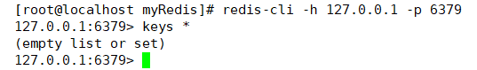
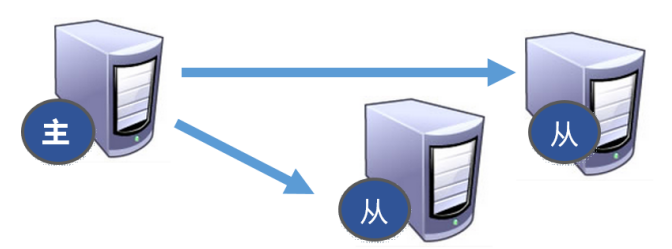
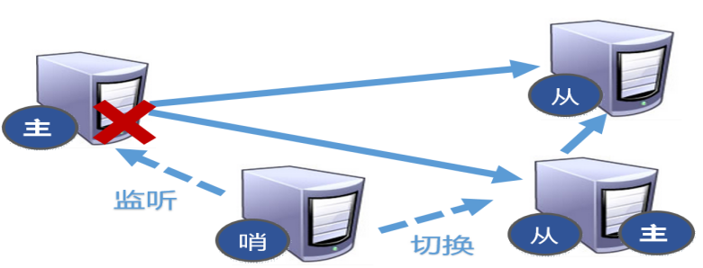

# 8. Redis 主从复制

## 1. 什么是主从复制

主从复制，就是主机数据更新后根据配置和策略，自动同步到备机的 master/slaver 机制，Master 以写为主，Slave 以读为主。

## 2. 作用

- 读写分析，性能扩展。
- 容灾快速恢复。

主服务器只有一个，从服务器可以有多个，主服务器用来写，从服务器用来读。保证主服务器和从服务器内容一致，**但是这不能解决内存的压力**。

## 3. 主从配置

- 原则：配从不配主
- 步骤：准备三个Redis实例，一主两从

- - 拷贝多个redis.conf文件include
    - 开启daemonize yes
    - Pid文件名字pidfile
    - 指定端口port

 配置一主两从，下面是redis.conf文件            关闭 AOF

**查看当前服务器的状态**

**将6380，6381 redis 服务器设置为从服务器**

1. 主从复制中，主服务器和从服务器保证数据保持一致。
2. 主服务器中可读可写，一般只实现写的功能，从服务器只有读的功能。

## 4. 一主二从模式演示

**相关问题**

1、切入点问题？slave1、slave2是从头开始复制还是从切入点开始复制?比如从k4进来，那之前的123是否也可以复制。

先将6381从服务器 shutdown，然后在主服务器上添加数据，并通过 info replication 查看从机只剩一个。待 6381 从服务器连接上来，发现该 6381 为主服务器，查看所有数据，发现为从机shutdown之前的数据。需要将其置为 从服务器，然后再次查看数据，与主服务器保持了一致。

将6381shutdown后的主服务器状态        重连之后的6381从服务器的所有数据

将6381重新置为6379的从服务器,查看所有内容

2、从机是否可以写？set可否？

3、主机shutdown后情况如何？从机是上位还是原地待命    **原地待命**

4、主机又回来了后，主机新增记录，从机还能否顺利复制    **可以**

5、其中一台从机down后情况如何？依照原有它能跟上大部队吗？  **能**

**复制原理**

- 每次从机联通后，都会给主机发送sync指令
- 主机立刻进行存盘操作，发送RDB文件，给从机
- 从机收到RDB文件后，进行全盘加载
- 之后每次主机的写操作，都会立刻发送给从机，从机执行相同的命令

**第一步，主从关系确定后主服务器将****rdb****文件发送给从服务器，加载数据。**

**第二步，如果说主从关系已经确立了，然后主服务器每次执行的写的指令都会交给从服务器也执行一遍。**

**
**

**永久保存主从关系** 

将redis.conf中的 slaveof 注释取消，输入主服务器ip和端口号，这样通过配置关系以后主从关系都在，不再是临时的。

## 5. 薪火相传模式演示

1. 上一个 slave 可以是下一个 slave 的 Master，slave 同样可以接收其他 slaves 的连接和同步请求，那么该 slave作为了链条中下一个的 master, 可以有效减轻 master 的写压力,去中心化降低风险。

- - 中途变更转向:会清除之前的数据，重新建立拷贝最新的。
    - 风险是一旦某个slave宕机，后面的slave都没法备份。

2**. 反客为主**

- - 当一个master宕机后，后面的slave可以立刻升为master，其后面的slave不用做任何修改。用 slaveof  no one  将从机变为主机。

① 此时6379主服务器发生宕机后，此时从服务器还是个从服务器，不能写入数据。

  

② 在6380从服务器使用命令，将其变为主服务器

1. **哨兵模式**

反客为主的自动版，能够后台监控主机是否故障，如果故障了根据投票数自动将从库转换为主库。

配置哨兵：

- - 调整为一主二从模式
    - 自定义的/myredis目录下新建 sentinel.conf 文件
    - 在配置文件中填写内容：sentinel  monitor  mymaster  127.0.0.1  6379  1

- - - 其中mymaster为监控对象起的服务器名称， 1 为 至少有多少个哨兵同意迁移的数量。

- - 启动哨兵

- - - 执行redis-sentinel  /myredis/sentinel.conf

## 6. 故障恢复

