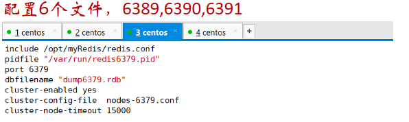

# 9. Redis 集群

# Redis 集群

## 1. 问题

1. 容量不够，redis如何进行扩容？
2. 并发写操作， redis如何分摊？


## 2. 什么是集群

1. Redis 集群实现了对 Redis 的水平扩容，即启动N个redis节点，将整个数据库分布存储在这N个节点中，每个节点存储总数据的1/N。
2. Redis 集群通过分区（partition）来提供一定程度的可用性（availability）： 即使集群中有一部分节点失效或者无法进行通讯， 集群也可以继续处理命令请求。


## 3. 集群方案

### 3.1 安装 ruby 环境

- 执行yum install ruby
- 执行yum install rubygems


### 3.2 准备 6 个 Redis 实例

1. 准备6个实例  6379,6380,6381,6389,6390,6391

1. 1. **拷贝多个redis.conf文件**
    2. **开启daemonize yes**
    3. **Pid文件名字**
    4. **指定端口**
    5. Log文件名字
    6. **Dump.rdb名字**
    7. Appendonly 关掉或者换名字

1. 再加入如下配置

- - **cluster-enabled yes   打开集群模式**
    - **cluster-config-file  nodes-端口号.conf  设定节点配置文件名**
    - **cluster-node-timeout 15000  设定节点失联时间，超过该时间（毫秒），集群自动进行主从切换**





### 3.3 合体

1.  将6个实例全部启动，nodes-端口号.conf文件都生成正常。


1. 合体

- - 进入到 cd  /opt/redis-3.2.5/src
    - 执行


```
./redis-trib.rb create --replicas 1 192.168.1.128:6379 192.168.1.128:6380 192.168.1.128:6381 192.168.1.128:6389 192.168.1.128:6390 192.168.1.128:6391
```


- - 注意: IP地址修改为当前服务器的地址（不能用127.0.0.1），端口号为每个Redis实例对应的端口号。


### 3.4 集群操作

1. 以集群的方式进入客户端：redis-cli  -c  -p  端口号
2. 通过cluster nodes 命令查看集群信息


 


1. redis cluster 如何分配这六个节点

1. 1. 一个集群至少要有三个主节点。
    2. 选项 --replicas 1 表示我们希望为集群中的每个主节点创建一个从节点。
    3. 分配原则尽量保证每个主数据库运行在不同的IP地址，每个从库和主库不在一个IP地址上。


1. 什么是slots?

1. 1. 一个 Redis 集群包含 16384 个插槽（hash slot）， 数据库中的每个键都属于这 16384 个插槽的其中一个， 集群使用公式 CRC16(key) % 16384 来计算键 key 属于哪个槽， 其中 CRC16(key) 语句用于计算键 key 的 CRC16 校验和 。
    2. 集群中的每个节点负责处理一部分插槽。 举个例子， 如果一个集群可以有主节点，其中：

1. 1. 1. 节点 A 负责处理 0 号至 5500 号插槽。
        2. 节点 B 负责处理 5501 号至 11000 号插槽。
        3. 节点 C 负责处理 11001 号至 16383 号插槽


1. 在集群中录入值

- - 在redis-cli每次录入、查询键值，redis都会计算出该key应该送往的插槽，如果不是该客户端对应服务器的插槽，redis会报错，并告知应前往的redis实例地址和端口。
    - redis-cli客户端提供了 –c 参数实现自动重定向。

- - - 如 redis-cli  -c –p 6379 登入后，再录入、查询键值对可以自动重定向。

- - 不在一个slot下的键值，是不能使用mget,mset等多键操作。
    - 可以通过{}来定义组的概念，从而使key中{}内相同内容的键值对放到一个slot中去


1. 查询集群中的值

- CLUSTER KEYSLOT <key> 计算键 key 应该被放置在哪个槽上。
- CLUSTER COUNTKEYSINSLOT <slot> 返回槽 slot 目前包含的键值对数量
- CLUSTER GETKEYSINSLOT <slot> <count> 返回 count 个 slot 槽中的键


1. 故障恢复

- 如果主节点下线？从节点能否自动升为主节点？
- 主节点恢复后，主从关系会如何？
- 如果所有某一段插槽的主从节点都当掉，redis服务是否还能继续?

- - redis.conf中的参数  cluster-require-full-coverage


## 4. 集群的 Jedis 开发


```
public class JedisClusterTest {
  public static void main(String[] args) {
 
     Set<HostAndPort> set =new HashSet<HostAndPort>();
     set.add(new HostAndPort("192.168.31.211",6379));
     JedisCluster jedisCluster=new JedisCluster(set);
     jedisCluster.set("k1", "v1");
     System.out.println(jedisCluster.get("k1"));
  }
}
```


## 5. Redis 集群的优缺点

**优点** 

实现扩容

分摊压力

无中心配置相对简单

**缺点**

多键操作是不被支持的。

多键的Redis事务是不被支持的。lua脚本不被支持。

由于集群方案出现较晚，很多公司已经采用了其他的集群方案，而代理或者客户端分片的方案想要迁移至redis cluster，需要整体迁移而不是逐步过渡，复杂度较大。