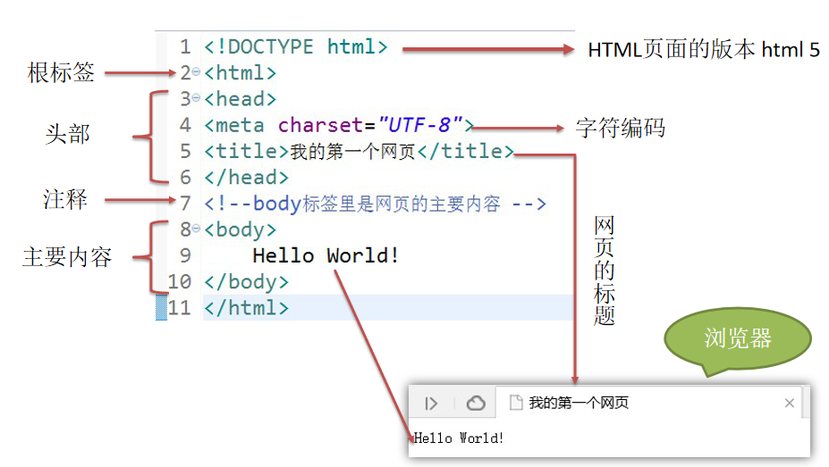
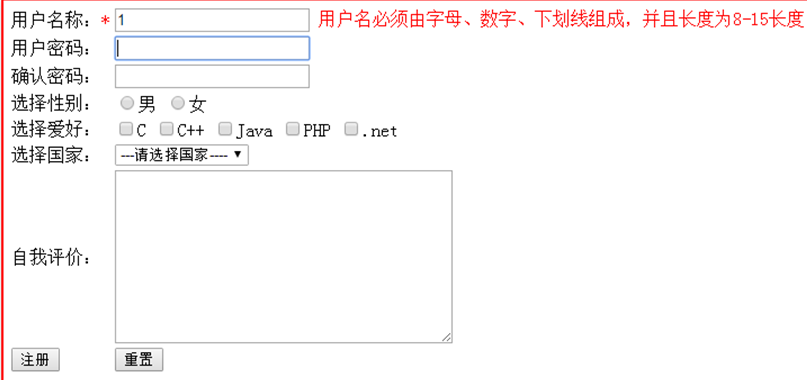
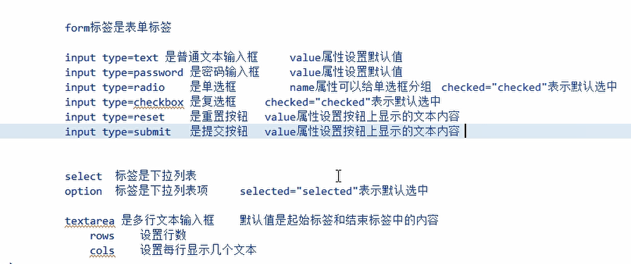
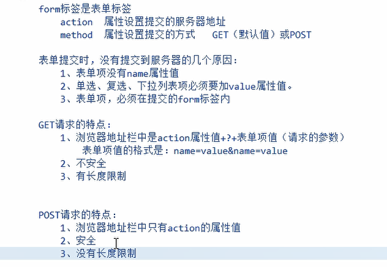

# html

## 1. 网页的组成部分

页面由三部分内容组成，分别是**内容（结构）、表现、行为。**

1. 内容（结构），是我们在页面中可以看到的数据。我们称之为内容。一般内容 我们使用html技术来展示。
2. 表现，指的是这些内容在页面上的展示形式。比如说布局、颜色、大小等。一般用 CSS 技术实现。
3. 行为，指的是页面中元素与输入设备交互的响应。一般使用 javascript 技术实现。


## 2. HTML 简介

HTML，Hyper Text Markup Language（超文本标记语言），是用来描述网页的一种语言，通过标签来标记要显示的网页的各个部分。。网页文件本身是一种文本文件，通过在文本文件中添加标记符，可以告诉浏览器如何显示其中的内容（如：文件如何处理，画面如何安排，图片如何显示等）。


## 3. HTML 文件的书写规范




## 4. 常用标签

#### 1. 标题标签

<h1>xxx</h1>


#### 2. 换行标签

<br/>


#### 3. 超链接

<a href=""></a>


#### 4. 图片标签


#### 5. 列表标签

- 无序列表：<ul><li></li></ul>
- 有序列表：<ol><li></li></ol>


```
<!DOCTYPE html>
<html lang="en">
<head>
    <meta charset="UTF-8">
    <title>标签的使用</title>
</head>
<body>
    <h1>百度页面</h1>
    <a href="http://www.baidu.com">百度</a>
    <br>
    <h1>列表标签的使用</h1>
<!-- 无序列表 -->
    <ul>
        <li>张三</li>
        <li>李四</li>
        <li>王五</li>
    </ul>
<!--有序列表-->
    <ol>
        <li>加油</li>
        <li>努力</li>
        <li>奋斗</li>
    </ol>
    <h1>图片标签</h1>
    

</body>
</html>
```


#### 6. 表格标签

**需求****1****：做一个** **带表头的** **，三行，三列的表格，并显示边框**

**需求****2****：修改表格的宽度，高度，表格的对齐方式，单元格间距。****
需求3****：新建一个五行，五列的表格，第一行，第一列的单元格要跨两列，第二行第一列的单元格跨两行，第四行第四列的单元格跨两行两列。**


```
<!DOCTYPE html>
<html lang="en">
<head>
    <meta charset="UTF-8">
    <title>表格标签的使用</title>
</head>
<body>
<!--
    table 标签表示表格
        border属性设置表格的边框大小
        width属性设置表格的宽度
        height属性设置表格的高度
        cellspacing属性设置单元格间距

    tr  标签表示行
    td  标签表示单元格
        align   属性设置单元格的对其方式
    b 标签文本加粗标签
-->
    <h3>做一个带表头的，3行3列的表格，并显示边框</h3>
    <table border="1" width="300" height="300" cellspacing="0">
        <tr>
            <td>1.1</td>
            <td>1.2</td>
            <td>1.3</td>
        </tr>
        <tr>
            <td>2.1</td>
            <td>2.2</td>
            <td>2.3</td>
        </tr>
        <tr>
            <td>3.1</td>
            <td>3.2</td>
            <td>3.3</td>
        </tr>
    </table>
</body>
</html>
```


```
<!DOCTYPE html>
<html lang="en">
<head>
    <meta charset="UTF-8">
    <title>Title</title>
</head>
<body>
    <!--新建一个五行，五列的表格，第一行，第一列的单元格要跨两列，
        第二行第一列的单元格跨两行，第四行第四列的单元格跨两行两列。

        colspan属性设置跨列数
        rowspan属性设置跨行数
        -->
    <table border="1" cellspacing="0" width="400" height="400">
        <tr>
            <td colspan="2">1.1</td>
            <td>1.3</td>
            <td>1.4</td>
            <td>1.5</td>
        </tr>
        <tr>
            <td rowspan="2">1.1</td>
            <td>1.2</td>
            <td>1.3</td>
            <td>1.4</td>
            <td>1.5</td>
        </tr>
        <tr>
            <td>1.2</td>
            <td>1.3</td>
            <td>1.4</td>
            <td>1.5</td>
        </tr>
        <tr>
            <td>1.1</td>
            <td>1.2</td>
            <td>1.3</td>
            <td colspan="2" rowspan="2">4.4</td>
        </tr>
        <tr>
            <td>1.1</td>
            <td>1.2</td>
            <td>1.3</td>
        </tr>
    </table>
</body>
</html>
```


#### 7. iframe 框架标签(了解)

iframe 标签可以在一个单独的 html 页面中，开辟一个小窗口，用来显示一个单独的 html 页面。


```
<!DOCTYPE html>
<html lang="en">
<head>
    <meta charset="UTF-8">
    <title>Title</title>
</head>
<body>
    我是一个单独的页面
    <br>
    <!--
        iframe开辟一个小窗口，加载一个单独的页面,src属性设置你要加载的单独页面的路径

        iframe和a标签组合使用的步骤：
            1.在iframe标签中使用name属性设置一个名称
            2.在a标签的target属性中，设置你要让哪个iframe的name属性值

    -->
    <iframe src="Demo02.html" width="500" height="500" name="abc"></iframe>

    <br/>
    <a href="Demo03.html" target="abc">Demo03.html</a>
    <a href="Demo01.html" target="abc">Demo01.html</a>
    <a href="Demo04.html" target="abc">Demo04.html</a>

</body>
</html>
```


#### 8. 表单标签

表单是 html 页面中用来收集用户信息的元素集合.这些信息都会发送给服务器







```
<!DOCTYPE html>
<html lang="en">
<head>
    <meta charset="UTF-8">
    <title>Title</title>
</head>
<!--
    input type="password"：密码
    input type="radio"：单选框
    option selected="selected": 表示默认选中
    textarea 是多行文本输入框
        rows 设置行数
        cols 设置每行显示几个文本
    input type="reset"：是重置按钮
-->
<body>
    <form action="">
        用户名：<input type="text" value="abc"><br>
        密 码：<input type="password"><br>
        性别：
             <input type="radio" name="sex" checked="checked">男
             <input type="radio" name="sex">女  <br>
        兴趣爱好：
            <input type="checkbox">C++
            <input type="checkbox">Java
            <input type="checkbox">JavaScript  <br>
        国籍：
            <select>
                <option>---请选择国籍---</option>
                <option selected="selected">中国</option>
                <option>美国</option>
            </select>
            <br>
        自我评价：
            <textarea rows="10" cols="30">我是默认值</textarea>
            <br>
        <input type="reset" value="恢复到默认"> <br>
        <input type="submit">
    </form>
</body>
</html>
```


表单格式化:


```
<!DOCTYPE html>
<html lang="en">
<head>
    <meta charset="UTF-8">
    <title>Title</title>
</head>
<body>
    <form action="">
        <center>
            <h1>用户注册</h1>
            <table>
                <tr>
                    <td>用户名：</td>
                    <td> <input type="text" value="abc"></td>
                </tr>
                <tr>
                    <td>密 码：</td>
                    <td><input type="password"></td>
                </tr>
                <tr>
                    <td>性别：</td>
                    <td><input type="radio" name="sex" checked="checked">男
                        <input type="radio" name="sex">女</td>
                </tr>
                <tr>
                    <td>性别：</td>
                    <td>
                        <input type="radio" name="sex" checked="checked">男
                        <input type="radio" name="sex">女
                    </td>
                </tr>
                <tr>
                    <td>兴趣爱好：</td>
                    <td>
                        <input type="checkbox">C++
                        <input type="checkbox">Java
                        <input type="checkbox">JavaScript
                    </td>
                </tr>
                <tr>
                    <td>国籍：</td>
                    <td>
                        <select>
                            <option>---请选择国籍---</option>
                            <option selected="selected">中国</option>
                            <option>美国</option>
                        </select>
                    </td>
                </tr>

            </table>
        </center>
    </form>
</body>
</html>
```


表单提交的细节:




#### 9. 其他标签

1. div：块标签，默认独占一行
2. span：内联标签，它的长度是封装数据的的长度
3. p：段落标签