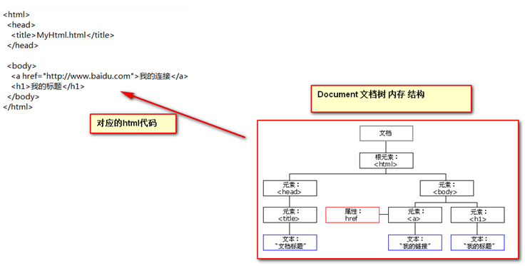

# JavaScript

## 1. JavaScript 的介绍

JavaScript（弱类型）是运行在浏览器端的脚本语言, 是由浏览器解释执行的, 简称js, 它能够让网页和用户有交互功能, 增加良好的用户体验效果。


特点：

1. **交互性（它可以做的就是信息的动态交互）**
2. **安全性（不允许直接访问本地硬盘）**
3. **跨平台性（只要是可以解释Js的浏览器都可以执行，和平台无关）**

**
**

**
**

**
**

## 2. JavaScript 的使用方式

### 2.1 行内式（主要用于事件）


```
<input type="button" name="" onclick="alert('ok！');">
```


### 2.2 内嵌式

只需要在head 标签中，或者在body标签中， 使用script 标签 来书写JavaScript代码


```
<script type="text/javascript">        
    alert('ok！');
</script>
```


### 2.3 外链式

使用Script 标签引入 单独的JavaScript代码文件


```
<script type="text/javascript" src="js/index.js"></script>
```


## 3. 变量和数据类型

### 3.1 定义变量

JavaScript 是一种弱类型语言，也就是说不需要指定变量的类型，JavaScript的变量类型由它的值来决定， 定义变量需要用关键字 'var', 一条JavaScript语句应该以“;”结尾。**定义变量的语法格式:**  var 变量名 = 值;


### 3.2 JavaScript 注释

JavaScript的注释分为单行注释(//注释内容)和多行注释(/*多行注释*/)


### 3.3 数据类型

js中有六种数据类型，包括五种基本数据类型和一种复杂数据类型(object)。

5种基本数据类型：

1、number 数字类型

2、string 字符串类型

3、boolean 布尔类型 true 或 false

4、undefined undefined类型，变量声明未初始化，它的值就是undefined

5、null null类型，表示空对象，如果定义的变量将来准备保存对象，可以将变量初始化为null,在页面上获取不到对象，返回的值就是null


1种复合类型：

object 后面学习的**数组、函数和JavaScript对象**都属于复合类型


```
<script>
    var i;
    // alert(i); //undefined
    i = 12;
    // alert(typeof(i)); //number

    i = "abc";
    alert(typeof(i)); //string

    var a = 12;
    var b = "abc";
    alert(a - b); // Nan 非数字，非数值
</script>
```


### 3.4 变量命名规范

1、区分大小写

2、第一个字符必须是字母、下划线（_）或者美元符号（$）

3、其他字符可以是字母、下划线、美元符或数字


### 3.5 匈牙利命名风格

对象o Object 比如：oDiv

数组a Array 比如：aItems

字符串s String 比如：sUserName

整数i Integer 比如：iItemCount

布尔值b Boolean 比如：bIsComplete

浮点数f Float 比如：fPrice

函数fn Function 比如：fnHandler


### 3.6 关系（比较）运算符

等于：            ==

全等于：          ===


```
<!DOCTYPE html>
<html lang="en">
<head>
    <meta charset="UTF-8">
    <title>Title</title>
    <script>
        var i = 12;
        var a = "12";
        // 等于比较在 js 语言种，只是简单的做字面值的比较
        alert(i == 12); //true;
        // 全等于，除了做字面值的比较之外，还会检查两个数据的类型石佛一致。
        alert(i === a); //false
    </script>
</head>
<body>
</body>
</html>
```


### 3.7 逻辑运算

且运算：               &&

或运算：               ||

取反运算：             !

 

在js中，任何的变量，都有其一个逻辑值（就是真假值）。0 、null、 undefined、””(空串) 都认为是 false；


```
<!DOCTYPE html>
<html lang="en">
<head>
    <meta charset="UTF-8">
    <title>Title</title>
    <script>
        var a = "abc";
        var b = true;
        var c = null;
        var d = false;
        // && 与运算
        // 第一种：当表达式全为真，返回最后一个表达式的值
        alert(b && a); //abc
        alert(a && b); //true
        // 第二种：当表达式有一个为假的时候。返回第一个为假的表达式的值
        alert(a && d); //false
        alert(c && d); // null

        // || 或运算
        // 第一种情况：当表达式全为假时，返回最后一个表达式的值
        alert(d || c); //null
        // 第二种情况：只要有一个表达式为真。就会返回第一个为真的表达式的值
        alert(a || b); //abc
    </script>
</head>
<body>
</body>
</html>
```


## 4. 数组

### 4.1 数组的介绍

数组就是一组数据的集合，javascript 中，数组里面的数据可以是不同类型的数据，好比 python 里面的列表。


### 4.2 数组的定义


```
// 实例化对象方式创建
var aList = new Array(1,2,3);

// 字面量方式创建，推荐使用
var aList2 = [1,2,3,'asd'];
```


### 4.3 多维数组

多维数组指的是数组的成员也是数组，把这样的数组叫做多维数组。


```
var aList = [[1,2,3],['a','b','c']];
```


### 4.4 数组的操作

1. 获取数组的长度


```
var aList = [1,2,3,4];
alert(aList.length); //弹出4
```


1. 根据下标取值


```
var aList = [1,2,3,4];
alert(aList[0]); // 弹出1
```


1. 从数组最后添加和删除数据


```
var aList = [1,2,3,4];
aList.push(5);
alert(aList); //弹出1,2,3,4,5
aList.pop();
alert(aList); // 弹出1,2,3,4
```


1. 根据下标添加和删除元素

> arr.splice(start,num,element1,.....,elementN)参数解析：

1. start：必需，开始删除的索引。
2. num：可选，删除数组元素的个数。
3. elementN：可选，在start索引位置要插入的新元素。

此方法会删除从start索引开始的num个元素，并将elementN参数插入到start索引位置。


```
<head>
    <meta charset="UTF-8">
    <title>Title</title>
    <script>
        var colors = ["red", "green", "blue"];
        colors.splice(0, 1); //删除第一项
        alert(colors); //green，blue
        // var len = colors.length;
        // alert(len); //2

        colors.splice(1, 0, "yellow", "orange"); //从第一个索引位置插入两项数据
        alert(colors); //green,yellow,organge,blue

        colors.splice(1, 1, "red", "purple"); //删除一项，插入两项数据
        alert(colors); //green,red,purple,orange,blue

        // 在js中通过下标对数组元素进行赋值操作的时候。js会自动的根据赋值的最大下标做扩容操作
        colors[5] = "black";
        alert(colors)
    </script>
</head>
<body>
</body>
</html>
```


### 4.5 小结

- 数组的定义使用一对中括号
- 获取数组的长度使用length属性
- 从数组最后添加元素使用push方法
- 从数组最后删除元素使用pop方法
- 根据下标添加和删除元素使用splice方法


## 5. 函数

### 5.1 函数的两种定义方式

函数就是可以**重复使用的代码块**, 使用关键字 **function** 定义函数。

#### 5.1.1 第一种方式 

**function**  **函数名****(** **参数列表** **) {**

**函数体**

**}**


如何定义一个带有返回值的函数。只需要在函数体内使用return关键字直接返回值即可。

```
<!DOCTYPE html>
<html lang="en">
<head>
    <meta charset="UTF-8">
    <title>Title</title>
    <script>
        // 定义一个无参函数
        function fun() {
            alert("fun 被调用了")
        }
        fun();

        // 定义有参函数
        function fun1(a, b) {
            alert("fun1 被调用了 a->" + a + ",b->" + b);
        }
        fun1(12, "abc");

        // 带有返回值函数的定义
        function fun2(num1, num2) {
            return num1 + num2;
        }
        var sum = fun2(100, 200);
        alert(sum);
    </script>
</head>
</html>
```


#### 5.1.2 第二种方式

**var** **函数名** **= function(****形参列表****){**

**函数体**

**}**


```
<!DOCTYPE html>
<html lang="en">
<head>
    <meta charset="UTF-8">
    <title>Title</title>
    <script>
        var fun = function () {
            alert("fun 函数被调用了")
        };
        fun();
    </script>
</head>
<body>

</body>
</html>
```


注：在Java中函数允许重载。但是在Js中函数的重载会直接覆盖掉上一次的定义


```
<!DOCTYPE html>
<html lang="en">
<head>
    <meta charset="UTF-8">
    <title>Title</title>
    <script>
        function fun(a, b) {
            alert(a);
            alert(b);
            alert("有参函数 fun(a,b)被调用了")
        }
        function fun() {
            alert("无参函数 fun 被调用了")
        }
        fun(12);//"无参函数 fun 被调用了"
    </script>
</head>
<body>
</body>
</html>
```


### 5.2 函数的 arguments 隐形参数（只在function函数内）

可变长参数(数组)

**public void 函数名(Object ... args) {}**


```
<!DOCTYPE html>
<html lang="en">
<head>
    <meta charset="UTF-8">
    <title>Title</title>
    <script>
        function fun(a, b) {
            // arguments它是隐形参数，可以用来接收传递的所有参数的值
            // 这个隐形参数操作跟数组一样
            alert(arguments.length); //3
            alert(arguments[2]); //true
            alert("a=>" + a); //12
            
            for (var i = 0; i < arguments.length; i++) {
                alert(arguments[i]);
            }
            alert("fun 被调用了")
        }
        // fun(12, "abc", true)

        // 要求定义一个函数。可以用来计算所有传入的参数的值相加的总和并返回
        function fun() {
            var num = 0;
            for (var i = 0; i < arguments.length; i++) {
                num += arguments[i];
            }
            return num;
        }
        alert(fun(1,2,"abc",3,10)); //3abc310
        // alert(typeof(fun(1,2,"abc",3,10))); //string
    </script>
</head>
<body>
```


## 6. JS 中的自定义对象

Object形式的自定义对象

**var** **变量名** **= new Object(); //****定义了一个对象实例**

**变量名****.****属性名** **=** **值****;**                 **添加一个属性**

**变量名****.****函数名** **= function(){}**         **添加一个函数**

**
**

如何访问对象的属性和方法：  

**变量名****.****属性名** **/** **函数名****(****实参****);**


```
<!DOCTYPE html>
<html lang="en">
<head>
    <meta charset="UTF-8">
    <title>Title</title>
    <script>
        var obj = new Object(); //定义了一个对象实例
        obj.name = "威少";
        obj.age = 12;

        obj.fun = function () {
            alert("威少牛背," + this.name + "," + this.age)
        };

        // 访问对象中的属性和方法
        // alert(obj.age); //12
        obj.fun();
    </script>
</head>
<body>

</body>
</html>
```


{}花括号形式的自定义对象

**var obj = {     //****定义一个空对象实例**

**属性：值****,              //****添加了一个属性**

**属性：值**               **//****添加了一个属性**

**函数名：****function(){}   //** **添加一个函数**

**};**   

**
**

如何访问对象的属性和方法：  

**变量名.属性名 / 函数名(实参);**


```
<!DOCTYPE html>
<html lang="en">
<head>
    <meta charset="UTF-8">
    <title>Title</title>
    <script>
        var obj = {
            name: "华仔",
            age: 12,
            fun:function () {
                alert("姓名：" + this.name + " , 年龄：" + this.age);
            }
        };
        obj.fun();
    </script>
</head>
<body>

</body>
</html>
```


## 7. js 中的事件

什么是事件？事件是电脑输入设备与页面进行交互的响应。我们称之为事件。


**常用的事件：**

onload加载完成事件             经常在页面加载完成后做一些初始化操作

onclick单击事件               常用于按钮

onblur失去焦点事件             经常用于验证用户名是否有验

onchange内容发生改变事件       常用于下拉列表。和输入框内容发生改变

onsubmit表单提交事件           常用于表单提交前验证表单项是否合法。如果有不合法，就阻止表单提交。


**事件的注册又分为静态注册和动态注册两种：**

1. 静态注册事件：静态注册事件是指通过标签的事件属性直接赋值事件响应后的代码。这种方式我们称之为静态注册。
2. 动态注册事件：动态注册事件是指通过代码的形式先获取标签对象。然后再通过标签对象.事件名=function(){}函数这种方式注册事件响应后代码，这种方式我们称之为动态注册。


**动态注册事件步骤：**

**window.onload = function(){**

**1、****获取标签对象**

**2、****通过标签对象****.****事件名** **= function(){}**

**}**

### 7.1 onload 加载完成事件


```
<!DOCTYPE html>
<html lang="en">
<head>
    <meta charset="UTF-8">
    <title>Title</title>
    <script>
        function onloadFun() {
            alert("静态注册 onloadFun() 页面加载完成")
        }
        // onload 事件，动态注册
        window.onload = function () {
            alert("动态注册 onlead 事件")
        }
    </script>
</head>
<!--
    onload 页面加载完成之后，静态注册
    <body onload="onloadFun();">
    -->
<body>

</body>
</html>
```


### 7.2 onclick 单机事件


```
<!DOCTYPE html>
<html lang="en">
<head>
    <meta charset="UTF-8">
    <title>Title</title>
    <script>
        function onclickFun() {
            alert("静态注册 onclick");
        }

        // 动态注册 onclick 事件
        window.onload = function () {
            // 1.获取标签对象
            /*
                document 是 js 语言提供的一个对象
                这个对象表示整个 html 页面内容
                getElementById方法 是通过id属性获取标签对象

                get 是获取
                Element 是元素（元素就是标签）
                By  通过   ，由...经
                Id  id属性
             */
            var btnObj = document.getElementById("btn01");
            // 2.通过标签对象.事件名 = function(){}
            btnObj.onclick = function () {
                alert("这是动态注册的 onclick事件")
            }
        }
    </script>
</head>
<body>
    <!--静态注册 onclick 事件-->
    <button onclick="onclickFun();">按钮1</button>
    <button id="btn01">按钮2</button>
</body>
</html>
```


### 7.3 onblur 失去焦点事件


```
<!DOCTYPE html>
<html lang="en">
<head>
    <meta charset="UTF-8">
    <title>Title</title>
    <script>
        function onblurFun() {
            // console 是 js 提供的一个控制台对象
            // log 方法就是往控制台打印信息，方便调试
            console.log("静态注册 onblur 事件");
        }

        window.onload = function () {
            //1.获取标签对象
            var passObj = document.getElementById("pass");
            //2.通过标签对象.事件名 = function(){}
            passObj.onblur = function () {
                console.log("动态注册失去焦点事件 onblur");
            }
        }
    </script>
</head>
<body>
    <!--
            静态注册失去焦点事件
         -->
    用户名：<input type="text" onblur="onblurFun()"/><br/>
    密码：<input id="pass" type="password" /><br/>
</body>
</html>
```


### 7.4 onchange 内容发生改变事件


```
<!DOCTYPE html>
<html lang="en">
<head>
    <meta charset="UTF-8">
    <title>Title</title>
    <script>
        function onChangeFun() {
            alert("静态注册的 onchange 事件");
        }

        window.onload = function () {
            //1.获取标签对象
            var selObj = document.getElementById("sel01");
            //2.通过标签对象.事件名 = function(){}
            selObj.onchange = function () {
                alert("onchange 动态注册");
            }
        }
    </script>
</head>
<body>
    请选择你心中的女神：
    <!--
        静态注册onchange事件
     -->
    <select onchange="onChangeFun()">
        <option>--你的女神--</option>
        <option>阿丽塔</option>
        <option>马尔扎哈</option>
        <option>隔壁王大妈</option>
    </select>
    <br/>
    请选择你心中的男神：
    <select id="sel01">
        <option>--你的男神--</option>
        <option>国哥</option>
        <option>飞龙</option>
        <option>英哥</option>
    </select>

</body>
</html>
```


### 7.5 onsubmit 表单提交事件

onsubmit事件经常用于表单提交前，验证所有表单项是否合法，只要有一个不合法，就阻止表单提交。


```
<!DOCTYPE html>
<html lang="en">
<head>
    <meta charset="UTF-8">
    <title>Title</title>
    <script>
        function onsubmitFun() {
            alert("静态注册 onsubmit 事件，开始验证所有表单项，发现有不合法，阻止提交")
            return false;
        }

        window.onload = function () {
            //1 获取标签对象
            var formObj = document.getElementById("form01");
            //2 通过标签对象.事件名=function(){}
            formObj.onsubmit = function () {
//                  alert("动态注册onsubmit事件,,开始验证所有表单项，发现有不合法，阻止提交");
                alert("动态注册onsubmit事件,,一切ok");
                return true;
            }
        }
    </script>
</head>
<body>
    <!--
            静态注册onsubmit事件

            return false可以阻止表单提交
         -->
    <form action="http://localhost:8080" onsubmit="return onsubmitFun();">
        <input type="submit" value="静怸onsubmit"/>
    </form>

    <form action="http://localhost:8080" id="form01">
        <input type="submit" value="动态onsubmit"/>
    </form>

</body>
</html>
```


## 8. DOM 模型

OM 全称是Document Object Model 文档对象模型

大白话，就是把文档中的标签，属性，文本，转换成为对象来管理。

### 8.1 Document 对象




**Document** **对象的理解：**

**第一点：Document****它管理了所有的Html****文档内容。**

**第二点：document****它是一种树结构的文档。有层级关系。**

**第三点：它让我们把所有的标签** **都** **对象化** 

**第四点：我们可以通过document****访问所有的标签对象。**

 

**
**

### 8.2 Document 对象中的方法介绍

- **document.getElementById(elementId) :** 通过标签的id属性查找标签dom对象，elementId是标签的id属性值
- **document.getElementsByName(elementName) :** 通过标签的name属性查找标签dom对象，elementName标签的name属性值
- **document.getElementsByTagName(tagname) :** 通过标签名查找标签dom对象。tagname是标签名
- **document.createElement( tagName) :** 方法，通过给定的标签名，创建一个标签对象。tagName是要创建的标签名

**document****的三个方法都可以查找标签对象。在使用的时候，优先顺序是：**

**1、****如果标签对象有****id****属性，就使用****id****属性进行查找**

**2、****如果没有****id****属性，就使用****name****属性进行查找**

**3、****如果没有****id****属性也没有****name****属性，最后再使用标签名查找。**


- getElementsById方法示例代码


```
<!DOCTYPE html>
<html lang="en">
<head>
    <meta charset="UTF-8">
    <title>Title</title>
    <script>
        // 希望用户点击验证按钮的时候。获取输入框用户名的内容。
        // 然后验证 用户名必须由字母。数字。下划线组成。并且长度是5-12位
        function onclickFun() {
            // 当你要操作某个标签的时候。要先获取到标签对象
            var usernameObj = document.getElementById("username");
            // 输入框中的内容
            var usernameText = usernameObj.value;

            // 验证 用户名必须由字母。数字。下划线组成。并且长度是5-12位
            // 验证字符串匹配规则，需要使用正则表达式技术。
            var patt = /^\w{5,12}$/;
            // test方法是正则表达式对象的方法，专门用来验证字符串是否匹配规则
            // 如果匹配就返回true，不匹配就返回false

            // 要操作 span 标签对象，就要获取 span 标签对象
            var usernameSpanObj = document.getElementById("usernameSpan");
            // innerHTML 属性表示起始标签和结束标签中的内容
            // 这个属性，可读可写
            if (patt.test(usernameText)) {
                usernameSpanObj.innerHTML = '';
                alert("用户名合法");
            } else {
                usernameSpanObj.innerHTML = "用户名不合法";
                alert("用户名不合法")
            }
        }
    </script>
</head>
<body>
    用户名：<input id="username" type="text" name="username" />
    <span id="usernameSpan" style="color: red;">

            </span>
    <br/>
    <button onclick="onclickFun()">验证</button>

</body>
</html>
```


- getElementsByName方法示例代码


```
<!DOCTYPE html>
<html lang="en">
<head>
    <meta charset="UTF-8">
    <title>Title</title>
    <script>
        // 全选单机事件
        function checkAll() {
            // 操作所有复选框标签对象
            // 通过name属性查找所有标签对象集合
            // 这个集合操作跟数组一样
            // 这个集合中每个元素都是查找到的标签对象
            // 集合中的元素顺序跟这些标签在html页面中从上到下的顺序一样
            var hobbyObjs = document.getElementsByName("hobby");
            // checked 属性表示当前复选框是否选中的状态
            // 它可读可写
            for (var i = 0; i < hobbyObjs.length; i++) {
                hobbyObjs[i].checked = true; // 选中所有
            }
        }

        // 全不选单机事件
        function checkNo(){
            var hobbyObjs = document.getElementsByName("hobby");
            // checked属性表示当前复选框是否选中的状态
            // 它可读可写
            for (var i = 0; i < hobbyObjs.length; i++) {
                hobbyObjs[i].checked = false;
            }
        }

        // 反选单继事件
        function checkReverse() {
            // 要获取全部的复选框标签对象
            var hobbyObjs = document.getElementsByName("hobby");
            // 遍历每个复选框，判断，原来的选中状态。
            for (var i = 0; i < hobbyObjs.length; i++) {
                if (hobbyObjs[i].checked) {
                    hobbyObjs[i].checked = false;
                } else {
                    hobbyObjs[i].checked = true;
                }
            }
        }

    </script>
</head>
<body>
    兴趣爱好：
    <input name="hobby" type="checkbox" value="喝酒" checked="checked"/>喝酒
    <input name="hobby" type="checkbox" value="抽烟" />抽烟
    <input name="hobby" type="checkbox" value="烫头" />烫头
    <br/>
    <button onclick="checkAll()">全选</button>
    <button onclick="checkNo()">全不选</button>
    <button onclick="checkReverse()">反选</button>
</body>
</html>
```


- getElementsByTagName方法示例代码


```
<!DOCTYPE html>
<html lang="en">
<head>
    <meta charset="UTF-8">
    <title>Title</title>
    <script>
        function checkAll() {
            // 先获取全部的复选框标签对象
            var inputObjs = document.getElementsByTagName("input");
            for (var i = 0; i < inputObjs.length; i++) {
                inputObjs[i].checked = true;
            }
        }
    </script>
</head>
<body>
    兴趣爱好：
    <input  type="checkbox" value="喝酒" checked="checked"/>喝酒
    <input  type="checkbox" value="抽烟" />抽烟
    <input  type="checkbox" value="烫头" />烫头
    <br/>
    <button onclick="checkAll()">全选</button>
</body>
</html>
```


注意: documet 对象的三个查找标签的方法要在页面加载完成之后才有效


### 8.3 节点的常用属性和方法

节点，就是标签对象。

**方****法:**  通过具体的元素节点调用

- getElementsByTagName() 返回包含带有指定标签名称的所有元素的节点列表（集合/节点数组）。 
- appendChild( oChildNode ) 方法，可以添加一个子节点，oChildNode是要添加的孩子节点


**属性:**

- childNodes: 属性，获取当前节点的所有子节点
- firstChild: 属性，获取当前节点的第一个子节点
- lastChild: 属性，获取当前节点的最后一个子节点
- parentNode: 属性，获取当前节点的父节点
- nextSibling: 属性，获取当前节点的下一个节点
- previousSibling: 属性，获取当前节点的上一个节点
- className: 用于获取或设置标签的class属性值
- innerHTML: 属性，表示获取/设置起始标签和结束标签中的内容
- innerText: 属性，表示获取/设置起始标签和结束标签中的文本

练习: DOM 查询


```
<!DOCTYPE html>
<html lang="en">
<head>
    <meta charset="UTF-8">
    <title>Title</title>
    <script src="../js/jquery-1.9.1.js"></script>
    <script>
        window.onload = function() {
            //1.查找#bj的节点
            document.getElementById("btn01").onclick = function () {
                var bjObj = document.getElementById("bj");
                alert(bjObj);
            }
            //2.查找所有li节点
            var btn02Obj = document.getElementById("btn02");
            btn02Obj.onclick = function() {
                var liObjs = document.getElementsByTagName("li");
                alert(liObjs.length);
            }
            //3.查找 name=gender的所有节点
            document.getElementById("btn03").onclick = function () {
                var genderObj = document.getElementsByName("gender");
                alert(genderObj.length);
            }
            //4.查找#city下所有li节点
            document.getElementById("btn04").onclick = function () {
                var cityObj = document.getElementById("city");
                var liObj = cityObj.getElementsByTagName("li");
                alert(liObj.length);
            }
            //5.返回#city的所有子节点
            document.getElementById("btn05").onclick = function () {
                var cityObjs = document.getElementById("city");
                alert(cityObjs.childNodes.length); //获取当前节点的所有子节点
            }
            //6.返回#phone的第一个子节点
            document.getElementById("btn06").onclick = function () {
                var phoneObj = document.getElementById("phone");
                alert(phoneObj.firstChild.innerHTML);
            }
            //7.返回#bj的父节点
            document.getElementById("btn07").onclick = function () {
                var bjObj = document.getElementById("bj");
                alert(bjObj.parentNode.innerHTML)
            }
            //8.返回#android的前一个兄弟节点
            document.getElementById("btn08").onclick = function () {
                var androidObj = document.getElementById("android");
                alert(androidObj.previousSibling.innerHTML);
            }
            //9.返回#username的value属性值
            document.getElementById("btn09").onclick = function () {
                var usernameObj = document.getElementById("username");
                alert(usernameObj.value)
            }
            //10.设置#username的value属性值
            document.getElementById("btn09").onclick = function () {
                var usernameObj = document.getElementById("username");
                usernameObj.value = "weishao";
            }
            //11.返回#bj的文本值
            document.getElementById("btn11").onclick = function () {
                alert( document.getElementById("city").innerHTML );
                alert( document.getElementById("city").innerText );
            }
        }
    </script>
</head>
<body>
    <div id="total">
        <div class="inner">
            <p>
                你喜欢哪个城市?
            </p>

            <ul id="city">
                <li id="bj">北京</li>
                <li>上海</li>
                <li>东京</li>
                <li>首尔</li>
            </ul>

            <br>
            <br>

            <p>
                你喜欢哪款单机游戏?
            </p>

            <ul id="game">
                <li id="rl">红警</li>
                <li>实况</li>
                <li>极品飞车</li>
                <li>魔兽</li>
            </ul>

            <br />
            <br />

            <p>
                你手机的操作系统是?
            </p>

            <ul id="phone"><li>IOS</li><li id="android">Android</li><li>Windows Phone</li></ul>
        </div>

        <div class="inner">
            gender:
            <input type="radio" name="gender" value="male"/>
            Male
            <input type="radio" name="gender" value="female"/>
            Female
            <br>
            <br>
            name:
            <input type="text" name="name" id="username" value="abcde"/>
        </div>
    </div>
    <div id="btnList">
        <div><button id="btn01">查找#bj节点</button></div>
        <div><button id="btn02">查找所有li节点</button></div>
        <div><button id="btn03">查找name=gender的所有节点</button></div>
        <div><button id="btn04">查找#city下所有li节点</button></div>
        <div><button id="btn05">返回#city的所有子节点</button></div>
        <div><button id="btn06">返回#phone的第一个子节点</button></div>
        <div><button id="btn07">返回#bj的父节点</button></div>
        <div><button id="btn08">返回#android的前一个兄弟节点</button></div>
        <div><button id="btn09">返回#username的value属性值</button></div>
        <div><button id="btn10">设置#username的value属性值</button></div>
        <div><button id="btn11">返回#bj的文本值</button></div>
    </div>
</body>
</html>
```