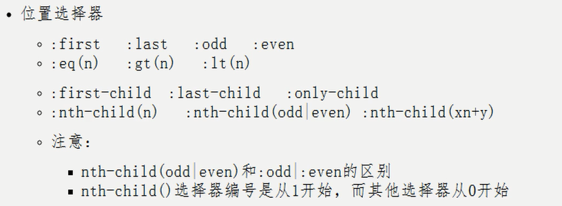

# JQuery

## 1. JQery 介绍

**什么是 JQuery？**

jQuery，顾名思义，也就是JavaScript和查询（Query），它就是辅助JavaScript开发的js类库。


 **JQuery****核心思想！！！**

它的核心思想是write less,do more(写得更少,做得更多)，所以它实现了很多浏览器的兼容问题。


**JQuery****流行程度**

  jQuery现在已经成为最流行的javascript库，在世界前10000个访问最多的网站中，有超过55%在使用jQuery。


**JQuery****好处****！！！**

jQuery是免费、开源的，jQuery的语法设计可以使开发更加便捷，例如操作[文档](http://baike.baidu.com/view/55621.htm)对象、选择[DOM](http://baike.baidu.com/view/14806.htm)元素、制作动画效果、事件处理、使用[Ajax](http://baike.baidu.com/view/1641.htm)以及其他功能


## 2. JQuery 的初体验

需求：使用 JQuery 给一个按钮绑定单机事件


```
<!DOCTYPE html>
<html lang="en">
<head>
    <meta charset="UTF-8">
    <title>Title</title>
    <script src="../js/jquery-1.7.2.min.js"></script>
    <script>
        $(function () { //这是 jquery的页面加载完成之后
            //1.获取标签对象
            var $btnObj = $("#btnId");
            //2.绑定单击事件
            $btnObj.click(function () {
                alert("这是 jquery的单击事件")
            })
        })
    </script>
</head>
<body>
    <button id="btnId">SayHello</button>
</body>
</html>
```


常见问题？

1. 使用 jquery 一定要引入 jquery 库吗？ 答案：是
2. jquery 中的 $ 到底是什么？ 答案：核心函数
3. 怎么为按钮添加点击响应函数的？

> $("选择器").click(function() {
>
> 单击事件的内容
>
> });


## 3. JQuery 核心函数 

$ 是jquery的核心函数，能完成jquery的很多功能。$()就是调用$这个函数

1. 传入参数为 [ 函数 ] 时：$(function(){})，页面加载完成之后

> $(**function**(){
>
> ​    alert("这是页面加载完成之后");
>
>   });

1. 传入参数为 [ HTML 字符串 ] 时：$("<span>12</span>");	它就会创建出这个html标签对象
2. 传入参数为 [ 选择器字符串 ] 时：

- - $(“#id”)        id选择器，根据指定的id值查找标签对象
    - $(“标签名”);    标签名选择器，根据指定的标签名，查找标签对象集合返回（返回是一个jquery对象）

1. 传入参数为 [ DOM对象 ] 时: $(dom对象) ===>>>> 转成了jquery对象


## 4. JQuery 对象和 dom 对象区分

### 4.1 什么是 jquery 对象，什么是 dom 对象

Dom对象 Alert出来效果是：[object HtmlXxxxElement]

Jquery对象 Alert出来的效果是：[object Object]

**Dom****对象**

1. 通过getElementById()查询出来的标签对象是Dom对象
2. 通过getElementsByName()查询出来的标签对象是Dom对象
3. 通过getElementsByTagName()查询出来的标签对象是Dom对象
4. 通过createElement() 方法创建的对象，是Dom对象

**JQuery****对象**

1. 通过JQuery提供的API创建的对象，是JQuery对象        
2. 通过JQuery包装的Dom对象，也是JQuery对象
3. 通过JQuery提供的API查询到的对象，是JQuery对象


### 4.2 JQuery对象的本质是什么？

Jquery对象是一个Dom对象数组 + 一系列jquery对象自己的功能函数集合。

### 4.3 Jquery对象和Dom对象使用区别

jquery对象不能使用dom对象的属性和方法

dom对象也不能使用jquery对象的属性和方法


### 4.4 Dom对象和Jquery对象互转

1. dom 对象转化为 jquery 对象：

> var dom 对象
>
> $(dom 对象) ===>>>>> jquery 对象

1. jquery 对象转换为 dom 对象

> var jquery对象
>
> jquery对象[下标] ===>>>> 得到你想要的dom对象


## 5. JQuery 选择器

### 5.1 基本选择器

\#ID       选择器：根据id查找标签对象 

.class    选择器：根据class查找标签对象

element  选择器：根据标签名查找标签对象

\*        选择器：表示任意的，所有的元素

selector1，selector2 组合选择器：合并选择器1，选择器2的结果并返回

```
<!DOCTYPE html>
<html lang="en">
<head>
    <meta charset="UTF-8">
    <title>Title</title>
    <style>
        .myClass {
            background: red;
        }
    </style>
    <script src="../js/jquery-1.7.2.min.js"></script>
    <script>
        $(function () {
            // 标签选择器
            // $("h3").addClass("myClass")  // 给所有的h3标题加上一个class选择器
            
            // ID选择器
            // $("#h32").addClass("myClass");

            // 类选择器
            // $("p.red1").addClass("myClass"); // 标签为p，选择器为red1

            // 通配选择器
            // $("*").addClass("myClass");

            // 并集选择器
            // $("h3, p").addClass("myClass");

            // 父子选择器   >
            // $("p>span").addClass("myClass");
            // 后代选择器
            // $("p span").addClass("myClass");
            
            // 后面第一个兄弟元素 prev + next
            // $("h3 + p").addClass("myClass");
            // 后面所有兄弟元素 prev ~ next
            $("h3 ~ p").addClass("myClass");
        })
    </script>
</head>
<body>
    <h3 id="h31"> JSP </h3>
    <p>haha<span>weishao</span></p>

    <h3 id="h32" class="red1">servlet</h3>
    <p class="red1">hahah</p>
</body>
</html>
```


### 5.2 属性选择器


```
<!DOCTYPE html>
<html lang="en">
<head>
    <meta charset="UTF-8">
    <title>Title</title>
    <style>
        .myClass {
            background-color: aqua;
        }
    </style>
    <script src="../js/jquery-1.7.2.min.js"></script>
    <script>
        $(function () {
            // [attribute]                              匹配包含给定属性的元素。
            // [attribute=value]                  匹配给定的属性是某个特定值的元素
            // [attribute!=value]      匹配所有不含有指定的属性，或者属性不等于特定值的元素。
            // [attribute^=value]      匹配给定的属性是以某些值开始的元素
            // [attribute$=value]      匹配给定的属性是以某些值结尾的元素
            // [attribute*=value]      匹配给定的属性是以包含某些值的元素
            // [attrSel1][attrSel2][attrSelN]    复合属性选择器，需要同时满足多个条件时使用。
            
            // $("a[href]").addClass("myClass");
            // $("a[href='http://www.bjsxt.com/flag']").addClass("myClass");
            // $("a[href^=http]").addClass("myClass");
            // $("a[href$=html]").addClass("myClass");
            $("a[href*=bjsxt]").addClass("myClass");
        })
    </script>
</head>
<body>

    <ul  id="sxt">
        <li><a href="http://www.bjsxt.com/score.html">尚学堂积分管理制度</a>
        <li><a href="http://www.bjsxt.com/dorm">尚学堂宿舍管理制度</a>
        <li><a href="http://www.bjsxt.com/mobile">尚学堂班级手机入袋制度</a>
        <li><a href="http://www.bjsxt.com/flag">尚学堂班级流动红旗制度</a>
        <li><a href="http://www.bjsxt.com/film">尚学堂周末经典电影剧场</a>
            <ul id="film">
                <li><a href="film-1.html">乱世佳人</a></li>
                <li><a href="film-2.html" title="阿郎的故事">阿郎的故事</a></li>
                <li id="film3"><a href="film-3.html" >阿甘正传</a></li>
                <li><a href="http://www.bjsxt.com/film/film-4.htm" title="鲁冰花">鲁冰花</a></li>
                <li><a name="film-5.htm" title="太行山上">太行山上</a></li>
                <li>无问西东</li>
            </ul>
        </li>
    </ul>

</body>
</html>
```

###  

### 5.3 位置选择器




```
<!DOCTYPE html>
<html lang="en">
<head>
    <meta charset="UTF-8">
    <title>Title</title>
    <style>
        .myClass {
            background-color: aqua;
        }
    </style>
    <script src="../js/jquery-1.7.2.min.js"></script>
    <script>
        $(function () {
            // $("p:first").addClass("myClass"); //p标签的第一个
            // $("p:last").addClass("myClass");
            // $("p:odd").addClass("myClass"); //奇数，索引从0开始
            // $("p:even").addClass("myClass"); //偶数
            // $("p:lt(4)").addClass("myClass"); //小于4
            // $("p:eq(4)").addClass("myClass"); //等于4
            // $("p:gt(4)").addClass("myClass"); //大于4

            //针对上级标签的
            // $("p:first-child").addClass("myClass"); //针对上级的第一个孩子 ，即div标签的第一个孩子
            // $("p:last-child").addClass("myClass"); //针对上级的最后一个孩子
            // $("p:only-child").addClass("myClass"); //针对上级标签的唯一孩子

            // $("p:nth-child(1)").addClass("myClass"); //这个索引从0开始,每个段落的第一个孩子
            $("p:nth-child(3n)").addClass("myClass"); // 该段落从每3个选1个。
        })
    </script>
</head>
<body>
<div>
    <p>1. JavaSE</p>
    <p>2. Oracle</p>
</div>
<div>
    <p>3. HTML/CSS/JS</p>
    <p>4. jQuery/EasyUI</p>
    <p>5. JSP/Servlet/Ajax</p>
</div>
<div>
    <p>6. SSM</p>
    <p>7. SpringBoot/SpringCloud/SpringData</p>
    <p>8. Maven/Linux/p>
    <p>9. Redis/Solr/Nginx</p>
    <p>10. SpringBoot/SpringCloud/SpringData</p>
</div>
<div>
    <p>11. 就业指导</p>
</div>
</body>
</html>
```


### 5.4 表单选择器


```
<!DOCTYPE html>
<html lang="en">
<head>
    <meta charset="UTF-8">
    <title>Title</title>
    <style>
        .myClass {
            background-color: aqua;
        }
    </style>
    <script src="../js/jquery-1.7.2.min.js"></script>
    <script>
        $(function () {
            //1.input
            // $("input").addClass("myClass");
            // $(":input").addClass("myClass"); //匹配所有input,textarea,select,button

            //2.表单的类型   type：text text radio password submit
            // $("input[type=text]").addClass("myClass");
            // $(":text").addClass("myClass");
            // $(":submit").addClass("myClass");

            //3.表单项的状态 seleted checked
            // $("input[disabled]").addClass("myClass");
            // $(":selected").addClass("myClass");
            // $(":disabled").addClass("myClass");
            var arr = $(":checked").addClass("myClass");
            console.info(arr);

        })
    </script>
</head>
<body>
<h3>注册用户</h3>
<form action="doRegister.jsp" method="get">
    <table border="1" width="40%">
        <tr>
            <td>用户名</td>
            <td><input  type="text" name="username" id="username" value="请输入姓名" disabled="disabled"/></td>
        </tr>
        <tr>
            <td>密&nbsp;码</td>
            <td><input  type="password" name="pwd" id="pwd" /></td>
        </tr>
        <tr>
            <td>确认密码</td>
            <td><input type="color" name="repwd" id="repwd"/></td>
        </tr>
        <tr>
            <td>性别</td>
            <td>
                <input  type="radio" name="sex" value="男"/>男
                <input  type="radio" name="sex" checked="checked" value="女"/>女
            </td>
        </tr>
        <tr>
            <td>年龄</td>
            <td><input type="text" min="6" max="30"   name="age" id="age" value="18"/></td>
        </tr>
        <tr>
            <td>电子邮箱</td>
            <td><input type="text" name="email" id="email"/></td>
        </tr>
        <tr>
            <td>爱好</td>
            <td>
                <input  type="checkbox" name="hobby" value="music"/>音乐
                <input  type="checkbox" name="hobby" value="sports" checked="checked"/>体育
                <input  type="checkbox" name="hobby" value="art" checked/>美术
            </td>
        </tr>
        <tr>
            <td>身份</td>
            <td>
                <select name="professional" multiple="multiple">
                    <option value="1">工人</option>
                    <option value="2">农民</option>
                    <option value="3" selected="selected">解放军</option>
                    <option value="4">知识分子</option>
                </select>
            </td>
        </tr>
        <tr>
            <td>简历</td>
            <td>
                <textarea name="resume" rows="5" cols="40">请输入简历</textarea>
            </td>
        </tr>
        <tr>
            <td>照片</td>
            <td><input type="file" name="photo" id="photo"/></td>
        </tr>
        <tr>
            <td colspan="2"  align="center">
                <input  type="submit" value="提交" disabled="disabled"/>
                <input type="reset" value="重置"/>
                <input type="button" value="返回" onclick="alert('back')"/>
                <button onclick="confirm('返回2')">返回2</button>
            </td>

        </tr>
    </table>
</form>
</body>
</html>
```


### 5.5 内容选择器

:contains(text)      匹配包含给定文本的元素

:empty             匹配所有不包含子元素或者文本的空元素

:parent         匹配含有子元素或者文本的元素

:has(selector)    匹配含有选择器所匹配的元素的元素


```
<!DOCTYPE html>
<html lang="en">
<head>
    <meta charset="UTF-8">
    <title>Title</title>
    <style>
        .myClass {
            background-color: red;
        }
        div {
            border: 1px solid red;
        }
    </style>
    <script src="../js/jquery-1.7.2.min.js"></script>
    <script>
        $(function () {
            // $("td:parent").addClass("myClass"); //td里有内容
            // $("td:empty").addClass("myClass"); //td里无内容

            // $("div:has(p)").addClass("myClass"); //找有子元素p的div
            $("div:contains('Hello')"); //找包含文字的div

            //:not
            // $("input[checked]").addClass("myClass");
            // $("input:not(checked)").addClass("myClass");
            $("input:disabled").addClass("myClass");
        })
    </script>
</head>
<body>
    <table border="1">
        <tr>
            <td>Value 1</td>
            <td>&nbsp;</td>
        </tr>
        <tr>
            <td>Value 2</td>
            <td></td>
        </tr>
    </table>

    <div><p>Hello</p></div>
    <div>Hello again!</div>

    <input name="apple" />
    <input name="flower"  disabled="disabled"/>
</body>
</html>
```


## 6. 事件


### 6.1 练习1


```
<!DOCTYPE html>
<html lang="en">
<head>
    <meta charset="UTF-8">
    <title>Title</title>
    <style>
        .myClass {
            background-color: aqua;
        }
    </style>
    <script src="../js/jquery-1.7.2.min.js"></script>
    <script>
        $(function () {
            //给按钮1绑定单击事件
            $("input:first").click(function () {
                $("div").bind("mouseover", function () {
                    $(this).css("background-color", "yellow");
                })
                $("div").bind("mouseout", function () {
                    $(this).css("background-color", "cyan");
                })

            })
            $("input:first").click(); //单击1次

            //给按钮2绑定单击事件
            $("input:last").bind("click", function () {
                $("div").unbind();
            })

        })
    </script>
</head>
<body>
<div style="background-color: #7FFFD4;">
    div1
</div>
<p></p>
<div style="background-color: #7FFFD4;">
    div2
</div>
<p></p>
<div style="background-color: #7FFFD4;">
    div3
</div>
<p></p>
<input  id="btn2" type="button" value="绑定"/>
<input  id="btn2" type="button" value="解除绑定"/>
</body>
</html>
```


### 6.2 练习2


```
<!DOCTYPE html>
<html lang="en">
<head>
    <meta charset="UTF-8">
    <title>Title</title>
    <style type="text/css">
        li{
            font-size: 12px;
            color: #ffffff;
            background-color:gray;
            border-radius:5px;
            height: 33px;
            width:104px;
            text-align: center;
            line-height:38px;
            list-style:none;
            float:left;
        }
    </style>
    <script src="../js/jquery-1.7.2.min.js"></script>
    <script>
        //页面加载完后，给li绑定over和out事件
        // $(function () {
        //     //给所有的li绑定over事件
        //     $("li").mouseover(function () {
        //         // $(this).style.backgroundColor = "green";
        //         $(this).css("background-color", "green");
        //     })
        //
        //     //给所有的li绑定out事件
        //     $("li").bind("mouseout", function () {
        //         $(this).css("background-color", "gray");
        //     })
        // })
        //页面加载完后，给两个按钮绑定单击事件
        //单击第1个按钮后，给li绑定两个事件
        //单击第2个按钮，给li接触绑定
        $(function () {
            //单击第1个按钮后，给li绑定两个事件
            $("input:eq(0)").click(function () {
                // 给所有的li绑定over事件
                    $("li").mouseover(function () {
                        // $(this).style.backgroundColor = "green";
                        $(this).css("background-color", "green");
                    })

                    //给所有的li绑定out事件
                    $("li").bind("mouseout", function () {
                        $(this).css("background-color", "gray");
                    })
            })
            //通过js代码单击第一个按钮
            $("input:first").click(); //鼠标单击以下的动作

            //单击第2个按钮，给li解除绑定
            $("input:last").click(function () {
                $("li").unbind();
            })
        })
    </script>
    
</head>
<body>
    <ul>
        <li>前端技术</li>
        <li>编程技术</li>
        <li>数据库</li>
    </ul>
    <br>
    <br>
    <br>
    <input  id="btn2" type="button" value="绑定" />
    <input  id="btn2" type="button" value="解除绑定"/>
</body>
</html>
```


## 7. 动画


```
<!DOCTYPE html>
<html lang="en">
<head>
    <meta charset="UTF-8">
    <title>Title</title>
    <script src="../js/jquery-1.7.2.min.js"></script>
    <script>
        function hideElem() {
            //js实现
            // document.getElementById("img1").style.display = "none";
            // document.getElementById("img1").style.visibility = "hidden";

            //jq实现
            // $("#div1, #img1").hide();
            // $("#div1, #img1").hide(5000);
            // $("div,img").fadeOut(3000)  //淡入
            $("div, img").slideUp(3000); //滑入,只改变高度
        }

        function showElem() {
            //js实现
            // document.getElementById("img1").style.display = "block";
            // document.getElementById("img1").style.visibility = "visible";

            //jq实现
            // $("#div1, #img1").show();
            // $("#div1, #img1").show(3000);
            // $("div,img").fadeIn(300)
            $("div, img").slideDown(3000); //滑出


        }
    </script>
</head>
<body>
    <input  type="button" value="立刻隐藏" onclick="hideElem()"/>
    <input  type="button" value="立刻显示" onclick="showElem()"/>
    <input  type="button" value="3秒隐藏" onclick="hideElem()"/>
    <input  type="button" value="3秒显示" onclick="showElem()"/>|
    <input  type="button" value="3秒淡出" onclick="hideElem()"/>
    <input  type="button" value="3秒淡入" onclick="showElem()"/>|
    <input  type="button" value="3秒滑入" onclick="hideElem()"/>
    <input  type="button" value="3秒滑出" onclick="showElem()"/>
    <br>          <br>       <br>
    
    <div style="border: 1px solid red; width: 600px; height: 100px; "></div>

</body>
</html>
```


## 8. DOM 编程

### 8.1 操作文本


```
<!DOCTYPE html>
<html lang="en">
<head>
    <meta charset="UTF-8">
    <title>Title</title>
    <script src="../js/jquery-1.7.2.min.js"></script>
    <script>
        function func1() {
            //获取第一个div的文本
            var txt = $("div:first").html(); //相当于innerHTML，无参表明是取值
            //显示获取的文本
            alert(txt);
            //写入到第二个div中
            $("div:last").html(txt); //赋值
            // $("div:last").text(txt); //相当于innerText
        }
        
        function func2() {
            //取值
            var val = $("#username").val(); //value;

            //写值
            $("#username").val(val + "321");
        }
    </script>
</head>
<body>
<div id="div1" style="border:1px solid red; background-color: aqua;">
    <h3>测试操作文本</h3>
</div>
<div id="div2" style="border:1px solid red;background-color:bisque;">
    1
</div>
<input id="username" type="text" value="zhangsan" /><br>
<input type="button" value="func1" onclick="func1()" />
<input type="button" value="func2" onclick="func2()" />
</body>
</html>
```


### 8.2 操作属性


```
<!DOCTYPE html>
<html lang="en">
<head>
    <meta charset="UTF-8">
    <title>Title</title>
    <script src="../js/jquery-1.7.2.min.js"></script>
    <script>
        function changeA() {
            //获取超链接
            // var aElem = $("a #a1");

            //修改文本
            $("a#a1").html("京东");

            //修改两个属性
            $("a#a1").attr("href", "http://www.jd.cn");
            $("a#a1").attr("target", "_self");
        }

        function changeSubmit() {
            //获取协议框的值
            // var flag = $("#agreement").attr("checked");
            // alert(flag);
            var flag = $("#agreement").prop("checked");
            alert(flag)

            //根据协议框的值修改
            if (flag) {
                $("#sub1").prop("disabled", false);
            } else {
                $("#sub1").prop("disabled", true);
            }
            // $("$sub1").prop("disabled", !flag); //简化if
        }
        
        function changeImg() {
            // $("img").attr("src", "../images/img1.jpg")
            // var arr = $("img");
            // for (var i = 0; i < arr.lang; i++) {
            //     arr[i].src = "../images/img" + (5-i) + ".jpg";  //不能使用隐式迭代
            // }

            $("img").each(function (i) {
                $(this).attr("src", "../images/img" + (5-i) + ".jpg");
            })
        }
    </script>
</head>
<body>
<h3>注册用户</h3>
<form action="doRegister.jsp" method="get">
    <table border="0" width="40%">
        <tr>
            <td>手机号码</td>
            <td><input  type="text"  name="username" id="username" value="请输入姓名"/></td>
        </tr>
        <tr>
            <td>密&nbsp;码</td>
            <td><input  type="password" name="pwd" id="pwd" /></td>
        </tr>
        <tr>
            <td>确认密码</td>
            <td><input type="password" name="repwd" id="repwd"/></td>
        </tr>
        <tr>
            <td>&nbsp;</td>
            <td><input type="checkbox" name="agreement" id="agreement"  onchange="changeSubmit()"/>我同意该协议</td>
        </tr>
        <tr>
            <td colspan="2"  align="center">
                <input id="sub1" type="submit" disabled="disabled" value="提交"  />
                <input type="reset" value="重置"/>
            </td>
        </tr>
    </table>
</form>

<a id="a1"  href="http://www.taobao.com" target="_blank">淘宝</a>
<input type="button" value="改变超链接" onclick="changeA()"/>
<hr />


<input  type="button" value="改变图片" onclick="changeImg()"/>

</body>
</html>
```


### 8.3 操作元素


```
<!DOCTYPE html>
<html lang="en">
<head>
    <meta charset="UTF-8">
    <title>Title</title>
    <style type="text/css">
        div{
            font-size:16px;
            border:1px solid #003a75;
            margin:5px;
        }
        .myClass{
            background-color:#7FFFD4;
        }
    </style>
<!--        <div><p>口才训练课</p></div>
-->
    <script src="../js/jquery-1.7.2.min.js"></script>
    <script>
        $(function () {
             var newDiv = $("<div><p>口才训练课</p></div>");
             // $("div:first").append(newDiv);
            // newDiv.appendTo($("div:first"));
            // $("div:first").prepend(newDiv);
            // newDiv.prependTo($("div:first"))
            // $("div:first").before(newDiv);
            // $("div:first").after(newDiv);

            // $("div:last").replaceWith(newDiv);
            
            // $("div:first").remove();  //删除第一个div
            // $("div:first").empty(); //清空第一个div

            //删除上级
            // $("#p1").remove();
            // $("#p1").parent().remove();
            // $("#p1").parents("body").remove();  // 删除上级是body级的元素

            //删除下级
            // $("#div1").children().remove();
            // $("#div1").find("p#p1").remove(); //找到id=p1的元素删除

            //删除平级
            // $("#p8").nextAll().remove(); //删除当前div中id=p8后的所有元素
            $("p").has("span").remove();
        })
    </script>
</head>
<body>
<div id="div1">
    <p id="p1">1. JavaSE</p>
    <p>2. Oracle</p>
</div>

    <div>
        <p>3. HTML/CSS/JS</p>
        <p>4. jQuery/EasyUI</p>
        <p>5. JSP/Servlet/Ajax</p>

    </div>
    <div>
        <p>6. SSM</p>
        <p>7. SpringBoot/SpringCloud/SpringData</p>
        <p id="p8">8. Maven/Linux</p>
        <p><span>9. Redis/Solr/Nginx</span></p>
        <p>10. SpringBoot/SpringCloud/SpringData</p>
    </div>

    <div>
        <p>11. 就业指导</p>
    </div>
</body>
</html>
```


### 8.4 实例


```
<!DOCTYPE html>
<html lang="en">
<head>
    <meta charset="UTF-8">
    <title>Title</title>
    <script src="../js/jquery-1.7.2.min.js"></script>
    <script>
        function addFileItem2() {
            //1.创建一个tr
            var newDir = $('<tr>'+
                '<td> </td>'+
                '<td>'+
                '<input type="file" name="photo" id="photo"/>'+
                '<input type="button"  value="删除"  onclick="delFileItem(this)"/>'+
                '</td>'+
                '</tr>');
            //2.将新创建的tr加入到指定的位置
            $("#lastrow").before(newDir);
        }
        function delFileItem2(obj) {
            // $(obj).parent().parent().remove();
            $(obj).parents("tr").remove();
        }

        function addFileItem() {
            //1.创建一个tr
            var newDir = $('<tr>'+
                '<td> </td>'+
                '<td>'+
                '<input type="file" name="photo" id="photo"/>'+
                '<input type="button"  value="删除"  onclick="delFileItem(\'weishao\')"/>'+
                '</td>'+
                '</tr>');
            //2.将新创建的tr加入到指定的位置
            $("#lastrow").before(newDir);
        }
        function delFileItem(obj) {
            // $(obj).parent().parent().remove();
            $(obj).parents("tr").remove();
        }
    </script>
</head>
<body>
<h3>注册用户</h3>
<form action="doRegister.jsp" method="get">
    <table id="table1" border="1" width="40%">
        <tr>
            <td>用户名</td>
            <td><input  type="text" name="username" id="username" value="请输入姓名"/></td>
        </tr>
        <tr>
            <td>照片 </td>
            <td>
                <input type="file" name="photo" id="photo"/>
                <input type="button"  value="添加"  onclick="addFileItem()"/>
            </td>
        </tr>


        <tr id="lastrow">
            <td colspan="2"  align="center">
                <input  type="submit" value="提交" />
                <input type="reset" value="重置"/>
            </td>
        </tr>

    </table>
</form>
</body>
</html>
```


### 8.5 操作 CSS


```
<!DOCTYPE html>
<html lang="en">
<head>
    <meta charset="UTF-8">
    <title>Title</title>
    <style>
        .myClass {
            background-color: #7FFFD4;
        }
    </style>
    <script src="../js/jquery-1.7.2.min.js"></script>
    <script>
        $(function () {
            $("p").click(function () {
                // if ($(this).hasClass("myClass")) {
                //     $(this).removeClass("myClass");
                // }else {
                //     $(this).addClass("myClass");
                // }
                $(this).toggleClass("myClass");
            })
        })
    </script>
</head>
<body>
    <p>阿里巴巴：马云</p>
    <p>腾讯：马化腾</p>
    <p>百度：李彦宏</p>
    <p>京东：刘强东</p>
    <p>小米：雷军</p>
</body>
</html>
```