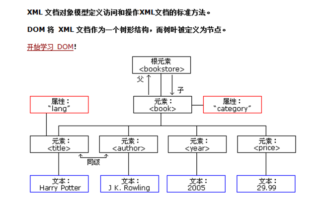

# XML

## 1. XML 简介

1. 什么是 XML？

> xml是可扩展的标记性语言。

1. XML 的作用？

> 1. 可以用来保存信息。
> 2. 可以做为数据的传输格式。
> 3. 可以做配置文件。
>
>  


## 2. XML 语法

1. 文档声明
2. 元素（标签）
3. xml 属性
4. xml 注释
5. 文本区域（CDATA区）


```
<?xml version="1.0" encoding="UTF-8" ?>
<!--
    它是xml的声明，表明是一个xml文本，并且说明xml文件的属性。
    version                         是版本号
    encoding                        是xml的文件编码
-->
<books> <!-- 这是xml注释 -->
    <book id="SN123123413241"> <!-- book标签描述一本图书   id属性描述 的是图书的编号  -->
        <name>java编程思想</name> <!-- name标签描述 的是图书 的信息 -->
        <author>华仔</author>     <!-- author单词是作者的意思 ，描述图书作者 -->
        <price>9.9</price>      <!-- price单词是价格，描述的是图书 的价格 -->
    </book>
    <book id="SN12341235123">   <!-- book标签描述一本图书   id属性描述 的是图书的编号  -->
        <name>葵花宝典</name>   <!-- name标签描述 的是图书 的信息 -->
        <author>班长</author> <!-- author单词是作者的意思 ，描述图书作者 -->
        <price>5.5</price>  <!-- price单词是价格，描述的是图书 的价格 -->
    </book>
</books>
```


### 2.1 什么是 xml 元素？

元素是指从开始标签到结束标签的内容，例如：<title>java 哈哈</title>


### 2.2 xml 命名规则

1. 名称可以含字母、数字以及其他的字符。
2. 名称不能以数字或者标点符号开始。
3. 名称不能包含空格。


### 2.3 xml 中的元素（标签）也分成单标签和双标签

1. 单标签：<标签名 属性="值" .../>
2. 双标签：< 标签名  属性=”值”  属性=”值” ......>文本数据或子标签</标签名>


### 2.4 xml 属性

xml的标签属性和html 的标签属性是非常类似的，**属性可以提供元素的额外信息** 

在标签上可以书写属性：一个标签上可以书写多个属性。**每个属性的值必须使用** **引号** **引起来**。


### 2.5 语法规则

1. 所有的 xml 元素都必须有关闭标签（也就是闭合）。
2. xml 标签对大小写敏感。
3. xml 必须正确的嵌套。
4. xml 文档必须有根元素。
5. xml 属性值必须加引号。
6. xml 中的特殊字符： 

1. 1. \>: &lt；
    2. <: &gt;

1. 文本区域（CDATA 区）

CDATA 格式：**这里可以把你输入的字符原样显示，不会解析xml **]]>**


## 3. xml 解析技术

不管是html文件还是xml文件它们都是标记型文档，都可以使用w3c组织制定的dom技术来解析。



**早期JDK****为我们提供了两种xml****解析技术Dom****和Sax****简介（已经过时，但我们需要知道这么个东西）**

1. dom解析技术是W3C组织制定的，而所有的编程语言都对这个解析技术使用了自己语言的特点进行实现。

Java对dom技术解析标记也做了实现。

1. sun公司在JDK5版本对 dom解析技术进行升级：SAX（ Simple API for XML ）SAX解析，它跟W3C制定的解析不太一样。它是以类似事件机制通过回调告诉用户当前正在解析的内容。它是一行一行的读取xml文件进行解析的。不会创建大量的dom对象。所以它在解析xml的时候，在内存的使用上。和性能上。都优于Dom解析。
2. 第三方的解析：

1. 1. jdom 在 dom 基础上进行了封装。
    2. dom4j 又对 jdom 进行了封装。
    3. pull 主要用在Android 手机开发，是在跟sax非常类似都是事件机制解析xml文件。

注意：这个Dom4j 它是第三方的解析技术。我们需要使用第三方给我们提供好的类库才可以解析xml文件。


## 5. dom4j 解析技术

\1. 准备 xml 文件


```
<?xml version="1.0" encoding="UTF-8" ?>
<!--
    它是xml的声明，表明是一个xml文本，并且说明xml文件的属性。
    version                         是版本号
    encoding                        是xml的文件编码
-->
<books> <!-- 这是xml注释 -->
    <book id="SN123123413241"> <!-- book标签描述一本图书   id属性描述 的是图书的编号  -->
        <name>java编程思想</name> <!-- name标签描述 的是图书 的信息 -->
        <author>华仔</author>     <!-- author单词是作者的意思 ，描述图书作者 -->
        <price>9.9</price>      <!-- price单词是价格，描述的是图书 的价格 -->
    </book>
    <book id="SN12341235123">   <!-- book标签描述一本图书   id属性描述 的是图书的编号  -->
        <name>葵花宝典</name>   <!-- name标签描述 的是图书 的信息 -->
        <author>班长</author> <!-- author单词是作者的意思 ，描述图书作者 -->
        <price>5.5</price>  <!-- price单词是价格，描述的是图书 的价格 -->
        <![CDATA[<鹦哥>]]>
    </book>
</books>
```


\2. 在当前项目目录创建lib包，并把dom4j这个jar包拷贝进行，并进行配置。

\3. 创建 java 文件


```
public static void test1() throws Exception {
        // 创建一个类,去读取xml文本
        SAXReader reader = new SAXReader();
        // 读取指定的xml文本,生成Document对象
        Document document = reader.read("src/xml/books.xml");
        System.out.println(document); //org.dom4j.tree.DefaultDocument@7cd84586 [Document: name src/xml/books.xml]
    }
```


1. 高级操作


```
public class Demo02 {
    public static void main(String[] args) throws DocumentException {
        //1.获取SAXReader对象
        SAXReader reader = new SAXReader();
        //2.读取指定的xml文件，返回document对象
        Document document = reader.read("04-xml\\src\\xml\\books.xml");
        System.out.println(document);

        //3.获取根元素
        Element root = document.getRootElement();
//        System.out.println(root.asXML());
        //4.通过根元素可以获取子元素, 通过elements方法返回book标签集合
        List<Element> books = root.elements("book");
        for (Element book : books) {
            //4.1 通过book标签，继承取得子元素的文本内容
            Element nameObj = book.element("name");
            //获取起始标签和结束标签中的文本
            String nameText = nameObj.getText();
            //4.2 获取图书作者
            String authorText = book.elementText("author");
            //4.3 获取图书价格
            String priceText = book.elementText("price");
            //4.4 获取book的id属性
            String idText = book.attributeValue("id");
            //4.5 创建图书对象
            System.out.println(new Book(idText, nameText, authorText, priceText));
        }
    }
}

class Book {
    private String id;
    private String name;
    private String author;
    private String price;

    public Book(String id, String name, String author, String price) {
        this.id = id;
        this.name = name;
        this.author = author;
        this.price = price;
    }

    @Override
    public String toString() {
        return "Book{" +
                "id='" + id + '\'' +
                ", name='" + name + '\'' +
                ", author='" + author + '\'' +
                ", price='" + price + '\'' +
                '}';
    }
}
```