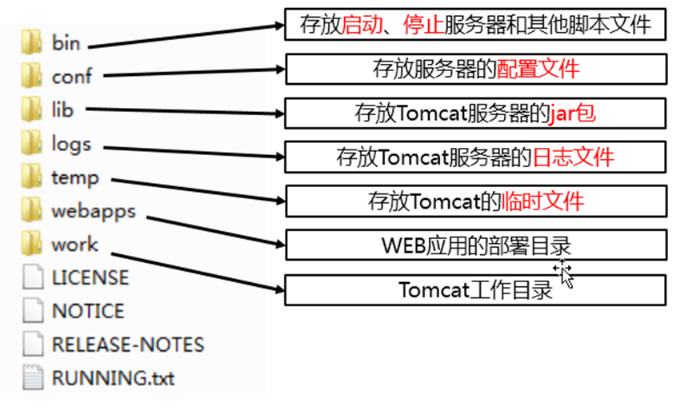

# Tomcat

## 1. Web 服务器

### 1.1 概述

Web 服务器主要用来接收客户端发送的请求和响应客户端请求。


**常见的 JavaWeb 服务器** ：

- Tomcat（Apache）：当前应用最广的JavaWeb服务器；
- JBoss（Redhat红帽）：支持JavaEE，应用比较广EJB容器 –> SSH轻量级的框架代替
- Resin（Caucho）：支持JavaEE，应用越来越广；


### 1.2 软件架构

C/S：客户端/服务器    B/S：浏览器/服务器


### 1.3 资源分类

**静态资源** ：所有用户访问后，得到的结果都是一样的。可以直接被浏览器解析。

**动态资源** ：每个用户访问相同资源后，得到的结果可能不一样。动态资源被访问后，需要先转换为静态资源，在返回给浏览器。比如：servlet，php...


### 1.4 网络通信三要素

1. IP：计算机在网络中的唯一标识。
2. 端口：应用程序在计算机中的唯一标识。 （0~65536）
3. 传输协议：规定了数据传输的规则。


## 2. Tomcat 服务器

### 2.1 概述

Tomcat是 Apache 软件基金会（Apache Software Foundation）的Jakarta 项目中的一个核心项目，最新的 Servlet 和 JSP 规范总是能在 Tomcat 中得到体现，因为Tomcat 技术先进、性能稳定，而且免费，因而深受Java 爱好者的喜爱并得到了部分软件开发商的认可，成为目前比较流行的Web 应用服务器。目前最新版本是9.0。

 


### 2.2 Tomcat 安装



- conf 目录下存放着非常重要的文件，server.xml：配置整个服务器信息，例如修改端口号。
- webapps：存放 web 项目的目录，其中每个文件夹都是一个项目。
- work：允许临时生成的文件，最终运行的文件都在这里。通过 webapps 中的项目生成的！


### 2.3 Tomcat 启动

在 bin 目录下点击 startup.bat，在浏览器中输入：http://localhost:8080 即可发现 tomcat 访问成功。

**问题** 

1. 黑窗口一闪而过：正确配置 JAVA_HOME 环境变量。
2. 启动报错：找到占用的端口号，并且找到对应的进程，杀死该进程： `netstat -ano`


### 2.4 Tomcat 配置

#### 2.4.1 部署项目的方式

1. 直接将项目放到 webapps 目录下即可，访问时需加上项目的访问路径。可以简化部署，将项目达成一个 war 包，再将 war 包放到 webapps 目录下，war 包会自动解压缩。


1. 配置 conf/server.xml 文件，在 <Host> 标签体中配置。


1. **在** **conf/Catalina/localhost** **创建任意名称的****xml****文件，在文件中配置 Context 标签**  (热部署，很重要）


```
<Context docBase="G:\尚学堂 Java />
• 虚拟目录：xml 文件的名称
```


#### 2.4.2 Tomcat 集成到 IDEA 上


