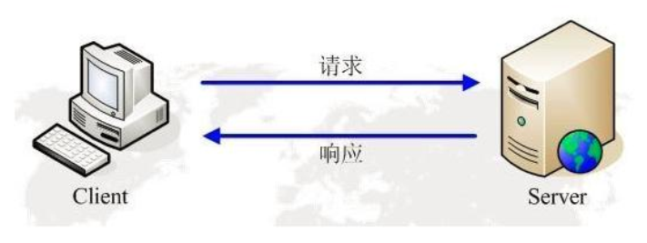
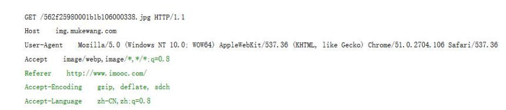
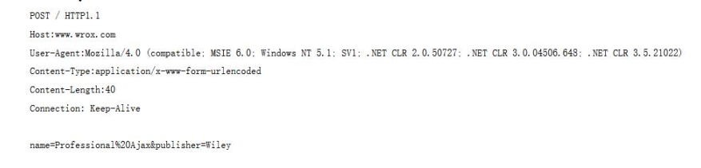
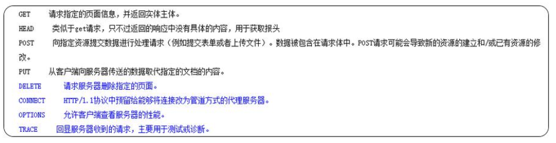
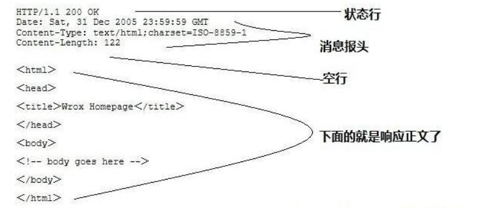
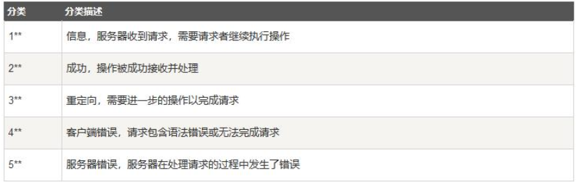

Beta请打开“钉钉”扫码重要文档！重要文档！重要文档！重要文档！领蛋孵福蛋继续赢取大奖奖品分享任务列表去完成已完成热门去完成水印[WIP] 为什么是语雀aboutNEWNEW

Adblocker

# http 协议讲解

## 1. HTTP 协议详解

### 1.1 web 交互的基本流程

**图片介绍** ：客户端根据用户输入的地址信息请求服务器， 服务器在接收到用户的请求后进行处理， 然后将处理结果响应给客户端， 客户端将响应结果展示给用户。

**专业术语** ：

- 请求：客户端根据用户地址信息将数据发送给服务器的过程。
- 响应：服务器将请求的处理结果发送给浏览器的过程。

**问题** ：

客户端也就是浏览器的版本是有很多的， 服务器的版本也是有很多的， 如何实现不同版本的浏览器和不同版本的服务器之间的数据交互呢？

**解决** ：规范浏览器和服务器的数据交互的格式。

**实现** ：HTTP 协议

### 1.2 HTTP 的概念和介绍

**概念** ：超文本传输协议（Hyper Text Transfer Protocol）

**作用** ：规范了浏览器和服务器的数据交互。

**特点** ：

- 简单快速：客户向服务器请求服务时，只需传送请求方法和路径。请求方法常用的有 GET、HEAD、POST。每种方法规定了客户与服务器联系的类型不同。由于 HTTP 协议简单，使得 HTTP 服务器的程序规模小，因而通信速度很快
- 灵活：HTTP 允许传输任意类型的数据对象。正在传输的类型由 **Content-Type** 加以标记。
- 无连接：无连接的含义是限制每次连接只处理一个请求。服务器处理完客户的请求，并收到客户的应答后，即断开连接。采用这种方式可以节省传输时间。
- 无状态：HTTP 协议是无状态协议。无状态是指协议对于事务处理没有记忆能力。缺少状态意味着如果后续处理需要前面的信息，则它必须重传，这样可能导致每次连接传送的数据量增大。另一方面，在服务器不需要先前信息时它的应答就较快。

- - 支持 B/S 及 C/S 模式。
    - HTTP1.1 版本后支持可持续连接

## 2. HTTP 的交互流程

HTTP 的交互流程一般分为四个步骤（一次完整的请求）：

步骤一：客户端与服务器建立连接。

步骤二：客户端发送请求数据到服务器端（HTTP 协议）

步骤三：服务器端接受到请求后，进行处理，然后将处理结果响应客户端（HTTP协议）。

步骤四：关闭客户端和服务器端的连接（HTTP1.1 后不会立即关闭）。

## 3. HTTP 协议之请求格式

请求格式的结果：

请求头：请求方式、请求的地址和 HTTP 协议版本。

请求行：消息报头，一般用来说明客户端要使用的一些附加信息。

空行：位于请求行和请求数据之间，空行是必须的。

请求数据：非必须

注意： 一张网页的内容是极其丰富的， 浏览器会遵循 HTTP 请求的格式将有效数据发送给服务器。

**示例（get 请求方式）：**

**示例（post 请求方式）**：

## 4. HTTP 协议之请求方式

- HTTP1.0 定义了三种请求方法： GET, POST 和 HEAD 方法。
- HTTP1.1 新增了五种请求方法： OPTIONS, PUT, DELETE, TRACE 和CONNECT 方法。

get 和 post 请求方式的区别：

- get 请求方式：

- - 请求数据会以 ？ 的形式隔开拼接在请求头中， 不安全， 没有请求实体部分
    - HTTP 协议虽然没有规定请求数据的大小， 但是浏览器对 URL 的长度是有限制的， 所以 get 请求不能携带大量的数据。

- post 请求方式：

- - 请求数据在请求实体中进行发送， 在 URL 中看不到具体的请求数据，安全。 适合数据量大的数据发送。

## 5. HTPP 协议之响应

响应格式的结构：

**响应行（状态行）**：HTTP 版本、状态码、状态消息。

**响应头**：消息报头，客户端使用的附加信息。

**空行**：响应头和响应实体之间的，必须的。

**响应实体**：正文，服务器返回给浏览器的信息。

**HTTP 常见响应状态码含义：**

HTTP 状态码由三个十进制数字组成， 第一个十进制数字定义了状态码的类型， 后两个数字没有分类的作用。 

HTTP 状态码共分为 5 种类型：

常见的状态码：

200 OK            //客户端请求成功

400 Bad Request    //客户端请求有语法错误，不能被服务器所理解

401 Unauthorized   //请求未经授权， 这个状态代码必须和 WWW-Authenticate 报头域一起使用
403 Forbidden     //服务器收到请求， 但是拒绝提供服务
404 Not Found     //请求资源不存在， eg： 输入了错误的 URL
500 Internal Server Error   //服务器发生不可预期的错误

https://www.yuque.com/u277073/iv1c9b/liqkrw?language=en-us)