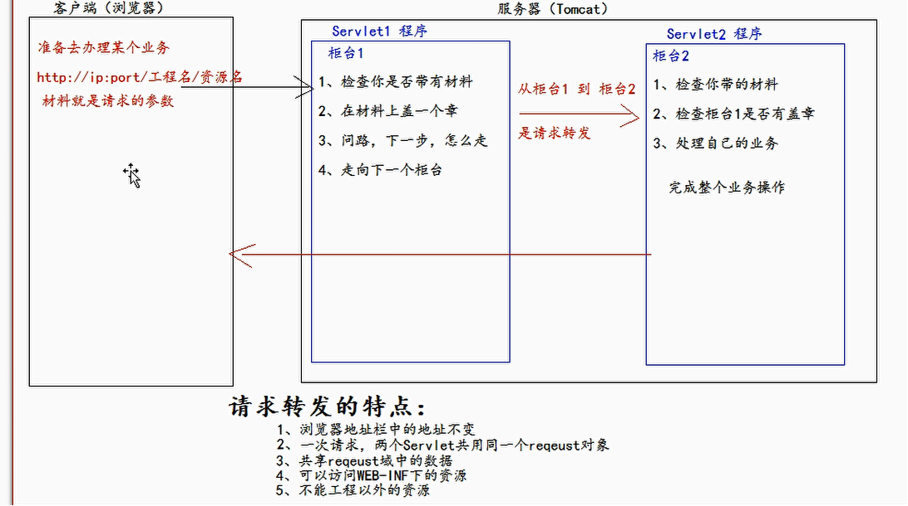

Beta请打开“钉钉”扫码重要文档！重要文档！重要文档！重要文档！领蛋孵福蛋继续赢取大奖奖品分享任务列表去完成已完成热门去完成水印[WIP] 为什么是语雀aboutNEWNEW

Adblocker


# Servlet

## 1. 概述

Servlet 是运行在 Web 服务器或应用服务器上的程序，可以接收来自客户端的请求并响应处理请求。


从广义上来讲，Servlet 规范是 Sun 公司制定的一套技术标准，包含与 Web 应用相关的一系列接口，是 Web 应用实现方式的宏观解决方案。而具体的 Servlet 容器负责提供标准的实现。


从狭义上来讲，Servlet指的是 javax.servlet.Servlet 接口及其子接口，也可以指实现了 Servlet 接口的实现类。


Servlet 作为服务器端的一个组件，它的本意是“服务器端的小程序”。Servlet 的实例对象由 Servlet 容器负责创建；Servlet 的方法由容器在特定情况下调用；Servlet 容器会在 Web 应用卸载时销毁 Servlet 对象的实例。


如果把 Web 应用比作一个餐厅，Servlet 就是餐厅中的服务员，负责接待顾客、上菜、结账。


## 2. 快速入门

1. 搭建 Web 开发环境
2. 创建动态 Web 工程
3. 创建 java.servlet.Servle 接口的实现类：com.xuwei.servlet.MyFirstServlet
4. 在 service() 方法中编写如下代码，输出响应信息：


```
public class MyFirstServlet extends HttpServlet {
    @Override
    protected void service(HttpServletRequest req, HttpServletResponse resp) throws ServletException, IOException {
        //1.编写输出语句，证明当前方法被调用
        System.out.println("Servlet worked");
        //2.通过PrintWriter对象向浏览器发送响应信息
        resp.getWriter().println("Servlet response");
    }
}
```


1. 在 web.xml 配置文件中注册 MyFirstServlet


```
<!-- 声明一个Servlet -->
    <servlet>
        <!-- 为Servlet 指定一个名称，以便于引用 -->
    <servlet-name>MyFirstServlet</servlet-name>
        <!-- 注册 Servlet 实现类的全类名 -->
    <servlet-class>com.xuwei.servlet.MyFirstServlet</servlet-class>
    </servlet>

    <!-- 建立一个从虚拟路径到Servlet之间的映射关系 -->
        <servlet-mapping>
        <!-- 引用Servlet名称 -->
        <servlet-name>MyFirstServlet</servlet-name>
        <!-- 映射到Servlet的虚拟路径：“/mfs” -->
        <url-pattern>/mfs</url-pattern>
    </servlet-mapping>
```


1. 在 index.jsp 中添加超链接：


```
<a href="mfs">To Servlet</a>
```


1. 运行分析


1. 执行原理

1. 1. 当服务器接受到客户端或浏览器的请求后，会解析请求URL路径，获取访问的 Servlet 的资源路径。
    2. 查找web.xml文件，是否有对应的 <url-pattern> 标签体内容。
    3. 如果有，则在找到对应的 <servlet-class> 全类名
    4. tomcat 会将字节码文件加载进内存，并且创建其对象
    5. 调用其方法


## 3. Servlet 的技术体系

### 3.1 Servlet 接口


### 3.2 GenericServlet抽象类


对Servlet功能进行了封装和完善，将service(ServletRequest req, ServletResponse res)保留为抽象方法，让使用者仅关心业务实现即可。


### 3.3 HttpServlet抽象类

- 对 GenericServlet 进行了进一步的封装和扩展，更贴近HTTP协议下的应用程序编写，在 service(ServletRequest req, ServletResponse res) 方法中，根据不同HTTP请求类型调用专门的方法进行处理。
- 今后在实际使用中继承HttpServlet抽象类创建自己的Servlet实现类即可。重写doGet(HttpServletRequest req, HttpServletResponse resp)和doPost(HttpServletRequest req, HttpServletResponse resp)方法实现请求处理，不再需要重写service(ServletRequest req, ServletResponse res)方法了。


## 4. Servlet 生命周期

Servlet生命周期表示Servlet从产生到毁灭的过程，我们可以将 Servlet 的生命周期分为三个阶段，分别是初始化阶段、运行阶段和销毁阶段。


1. **初始化阶段**

当客户端向 Servlet 容器发出 HTTP 请求要求访问 Servlet 时，Servlet 容器首先会解析请求，检查内存中是否已经有了该 Servlet 对象，如果有，则直接使用该 Servlet 对象，如果没有，则创建 Servlet 实例对象，然后通过调用 init() 方法实现 Servlet 的初始化工作。需要注意的是，在 Servlet 的整个生命周期内，它的 init() 方法只能被调用一次。

1. **运行阶段**

1. 1. **这是 Servlet 生命周期中最重要的阶段，在这个阶段中，Servlet 容器会为这个请求创建代表 HTTP 请求的 ServletRequest 对象和代表 HTTP 响应的 ServletResponse 对象，然后将它们作为参数传递给 Servlet 的 service() 方法。**
    2. **service() 方法从 ServletRequest 对象中获得客户请求信息并处理该请求，通过 ServletResponse 对象生成响应结果。**
    3. **在 Servlet 的整个生命周期内，对于 Servlet 的每一次访问请求，Servlet 容器都会调用一次 Servlet 的 service() 方法，并且创建新的 ServletRequest 和 ServletResponse 对象，也就是说，service() 方法在 Servlet 的整个生命周期中会被调用多次。**

1. **销毁阶段**

**当服务器关闭或 Web 应用被移除出容器时，Servlet 随着 Web 应用的关闭而销毁。在销毁 Servlet 之前，Servlet 容器会调用 Servlet 的 destroy() 方法，以便让 Servlet 对象释放它所占用的资源。在 Servlet 的整个生命周期中，destroy() 方法也只能被调用一次。**

**
**

注意点：

1. Servlet 的生命周期一般是从第一次调用到服务器关闭，如果 Servlet 在web.xml中配置了load-on-startup，load-on-startup 的默认值为负，将其修改为0或正数，生命周期就会变成从服务器启动到服务器关闭。
2. init 方法是对Servlet进行初始化的一个方法， 会在Servlet第一次加载进行存储时执行。
3. destory 方法是在servlet被销毁时执行， 也就服务器关闭时。


```
@WebServlet(urlPatterns = "life")
public class ServletLife extends HttpServlet {

    //初始化方法，在servlet第一次加载内容的时候被调用
    @Override
    public void init() throws ServletException {
        System.out.println("init...");
    }


    @Override
    protected void service(HttpServletRequest req, HttpServletResponse resp) throws ServletException, IOException {
        resp.getWriter().write("servlet life");
        System.out.println("service...");
    }

    //在servlet被销毁时执行也就是服务器关闭时调用
    @Override
    public void destroy() {
        System.out.println("destory...");
    }
}
```


## 5. Servlet、doGet、doPost 方法的区别

**service 方法：**

不管是 get 方式还是 post 方式的请求， 如果 Servlet 类中有service 方法， 则优先调用 Service 方法。

**doGet 方法：**

在没有 service 方法的情况下如果是 get 方式的请求所调用的处理请求的方法。

**doPost 方法：**

在没有 service 方法的情况下如果是 post 方式的请求所调用的处理请求的方法。


**注意：**

**如果在 service 方法中调用了父类的 service 方法，而没有重写当前请求方式的 doGet 或 doPost 方法，会报405 错误，但是当前 service 方法依然是被调用了。这是因为父类的 service 方法是根据请求方式而调用不同的 doGet 和 doPost 方法。**


```
@WebServlet(urlPatterns = "/servletmethod")
public class ServletMethod extends HttpServlet {
    @Override
    protected void service(HttpServletRequest req, HttpServletResponse resp) throws ServletException, IOException {
        System.out.println("子类中的service方法...");
        super.service(req, resp); //会根据请求方式的不同调用不同的doGet和doPost方法
    }
}
```


## 6. Servlet 常见错误

1、404 错误：资源未找到

原因1：在请求地址中的 servlet 的别名写错了。

原因2：虚拟项目名称拼写错误。


2、405 错误：请求方式不支持

原因：请求方式和 servlet 中的方法不匹配所造成的。

解决：尽量使用 service 方法进行请求处理， 并且不要再 service 方法中调用父类的service。


3、500 错误：内部服务器错误

1. 错误一：java.lang.ClassNotFoundException: com.bjsxt.servlet.ServletMothod

1. 1. 解决: 在web.xml中校验servlet类的全限定路径是否拼写错误。

1. 错误二：因为 service 方法体的代码执行错误导致

1. 1. 解决: 根据错误提示对 service 方法体中的代码进行错误更改。


## 7. Servlet 的请求处理

### 7.1 Request 对象

服务器接受到了浏览器的请求后，会创建一个 Request 对象，对象中存储了此次请求相关的请求数据。服务器在调用 servlet 时会将创建的 Request 对象作为实参传递给servlet 的方法，比如 servlet 方法。


```
@WebServlet(urlPatterns = "/request")
public class RequestServlet extends HttpServlet {
    @Override
    protected void service(HttpServletRequest req, HttpServletResponse resp) throws ServletException, IOException {
        //1.获取请求头数据
        //1.1 获取请求方式
        String method = req.getMethod();
        //1.2 获取请求地址
        StringBuffer requestURL = req.getRequestURL();
        //1.3 获取请求URI
        String requestURI = req.getRequestURI();
        //1.4 获取请求协议
        String scheme = req.getScheme();
        System.out.println(method + ":" + requestURL + ":" + scheme);
        //2.获取请求行数据
        //2.1 获取指定的行信息
        String value = req.getHeader("User-Agent");
        //2.2 获取所有请求行的键的枚举
        Enumeration<String> e = req.getHeaderNames();
        while (e.hasMoreElements()) {
            String name = e.nextElement(); //获取当前键的名字
            value = req.getHeader(name); //获取当前键的值
            System.out.println(name + ":" + value);
        }
        //3.获取用户信息
        String uname = req.getParameter("uname"); //获取用户名
        String pwd = req.getParameter("pwd"); //获取密码
        String fav = req.getParameter("fav"); //获取爱好，但是只能获取一行
        String[] favs = req.getParameterValues("fav"); //获取爱好
        if (favs != null) {
            for (String fav2 : favs) {
                System.out.println(uname + "," + pwd + "," + fav2);
            }
        }
    }
}
```


```
<form action="request">
  用户名：<input type="text" name="uname" value=""> <br>
  密  码：<input type="password" name="pwd" value=""> <br>
  爱  好：<input type="checkbox" name="fav" value="C++">C++
  <input type="checkbox" name="fav" value="java">java
  <input type="checkbox" name="fav" value="python">python
  <input type="submit" value="提交">
</form>
```


### 7.2 Response 对象

服务器在调用指定的 Servlet 进行请求处理的时候， 会给 Servlet 的方法传递两个实参 request 和 response。 其中 request 中封存了请求相关的请求数据， 而 response 则是用来进行响应的一个对象。


```
@WebServlet(urlPatterns = "/rs")
public class ResponseServlet extends HttpServlet {
    @Override
    protected void service(HttpServletRequest req, HttpServletResponse resp) throws ServletException, IOException {
        //1.设置响应头信息
        //1.1 在响应头中添加响应信息，但是同键会覆盖
        resp.setHeader("mouse", "two fly birds");
        resp.setHeader("mouse", "three fly birds");
        //1.2 在响应头中添加响应信息，同键不会覆盖
        resp.addHeader("key", "weishao");
        resp.addHeader("key", "weishao");

        //2.设置响应状态码
        //            resp.sendError(404, "error");

        //3.设置响应编码格式
        resp.setContentType("text/html; charset=utf-8"); //设置html格式
        resp.setContentType("text/text; charset=utf-8"); //设置text格式

        //4.设置响应实体，在页面上能看到的
        resp.getWriter().println("及你太美");
    }
}
```


## 8. 请求中文值乱码问题

### 8.1 Get 请求中文值乱码问题解决

#### 8.1.1 第一种：使用String类的方法进行编解码


```
<!--<form action="http://localhost:8080/login/getParams" method="get"> 绝对路径-->
<form action="getParams" method="post">
    用户名：<input name="uname" type="text" /><br/>
    密　码：<input name="pwd" type="password" /><br/>
    兴趣爱好：
    <input name="hobby" type="checkbox" value="c" />C
    <input name="hobby" type="checkbox" value="cpp" />C++
    <input name="hobby" type="checkbox" value="java" />java
    <input name="hobby" type="checkbox" value="php" />php
    <br/>
    <input type="submit" />
</form>
```


```
@WebServlet(urlPatterns = "/getParams")
public class GetParams extends HttpServlet {
    @Override
    protected void service(HttpServletRequest req, HttpServletResponse resp) throws ServletException, IOException {
        //1.获取用户名
        String uname = req.getParameter("uname");
        System.out.println("用户名：" + uname);

        //先 iso-8859-1 编码，再 utf-8 解码
        uname = new String(uname.getBytes("iso-8859-1"), "utf-8");
        System.out.println("乱码解决后用户名：" + uname);

        //获取密码
        String pwd = req.getParameter("pwd");
        System.out.println("密码：" + pwd);
    }
}
```


#### 8.1.2 第二种：修改 server.xml 文件

在 tomcat 的目录 conf 目录下的 server.xml 文件中，在 Connector 标签中添加如下内容

- URIEncoding="UTF-8"


### 8.2 Post 请求中文值乱码问题解决

#### 8.2.1 乱码产生原因

Tomcat服务器对参数的默认编码是ISO-8859-1


#### 8.2.2 第一种：使用String类的方法进行编解码

具体内容如 get 请求方式


#### 8.2.3 第二种：设置请求体的字符集


```
@WebServlet(urlPatterns = "/getParams")
public class GetParams extends HttpServlet {

    private static final long serialVersionUID = 1L;

    @Override
    protected void service(HttpServletRequest req, HttpServletResponse resp) throws ServletException, IOException {
        //设置请求体的字符集
        req.setCharacterEncoding("utf-8"); //必须在getparameter前才能生效,推荐使用.

        //1.获取用户名
        String uname = req.getParameter("uname");
        System.out.println("用户名：" + uname);
        //获取密码
        String pwd = req.getParameter("pwd");
        System.out.println("密码：" + pwd);
    }
}
```


### 8.3 在 Web 应用中统一字符集

1. 请求参数中含有中文

1. 1. ***\*请求由浏览器发送给服务器\****

1. 1. 1. 由浏览器编码

1. 1. 1. 1.  浏览器使用HTML页面指定的字符集编码，只需要将HTML页面的字符集指定为UTF-8即可

1. 1. 1. 由服务器解码

1. 1. 1. 1. 默认字符集是IOS-8859-1

1. 1. 1. 解决方案

1. 1. 1. 1. ***\*对于POST请求\****：post请求在Servlet中解码，默认的字符集是ISO-8859-1，不支持中文，所以我们需要修改Servlet的字符集为UTF-8。使用request.setCharacterEncoding("UTF-8");设置request对象使用UTF-8字符集对***\*请求体\****中的内容进行解码。***\*但需要注意的是\****，这个操作一定要在调用getParameter()方法之前进行。
            2. ***\*对于GET\*******\*请求\****：GET请求是在URL地址栏中传递请求参数的，它会被Tomcat服务器自动解码，而Tomcat服务器默认的字符集也是ISO-8859-1，所以我们需要修改Tomcat服务器的字符集为UTF-8。由于请求参数是包含在***\*请求行内\****的，无法通过request对象进行设置，所以需要在Server.xml文件中修改Connector标签，添加URIEncoding="utf-8"属性。

1. 服务器响应中含有中文

1. 1. ***\*响应由服务器发送个浏览器\****

1. 1. 1. 由服务器编码

1. 1. 1. 1. 默认使用ISO-8859-1进行编码

1. 1. 1. 由浏览器解码

1. 1. 1. 1. u 默认使用GBK进行解码

1. 1. 1. 解决方案

1. 1. 1. 1. 方法1：设置响应头：response.setHeader("Content-Type","text/html;charset=utf-8");
            2. 方法2：设置响应的内容类型：response.setContentType("text/html;charset=utf-8");
            3. ***\*通过这种方式可以在响应头中告诉浏览器响应体的编码方式是UTF-8；同时服务器也会采用该字符集进行编码\****
            4. ***\*但需要注意的是\****，两种方法一定要在response.getWriter()之前进行。


## 9. 做为域对象设置请求Request范围的属性值

// 在Request中设置 属性值。

request.setAttribute("abc", "abcValue");     

// 获取 Request域中的属性值   

String abcAttr = (String) request.getAttribute("abc");    

 System.***out\***.println(abcAttr); // 控制台打印 abcValue


如果大家读源码你会发现。其实在Request对象中，有一个Map对象用来存放 属性值。所以属性的操作就跟操作一个map对象是一样一样的。


## 10. 请求转发和请求重定向

### 10.1 请求转发




```
@WebServlet(urlPatterns = "/servlet1")
public class Servlet1 extends HttpServlet {
    @Override
    protected void service(HttpServletRequest req, HttpServletResponse resp) throws ServletException, IOException {
        //1.检查业务需要的材料，材料就是 uname
        String uname = req.getParameter("uname");
        System.out.println("柜台1查看材料：" + uname);

        //2.加盖柜台1的章，表示柜台1完成了业务
        req.setAttribute("abc", "柜台1的章");
        System.out.println("柜台1盖了章");

        //3.问下一步，怎么走
        RequestDispatcher requestDispatcher = req.getRequestDispatcher("/servlet2");

        System.out.println("真正走到柜台2");
        requestDispatcher.forward(req, resp);
    }
}
```


```
@WebServlet(urlPatterns = "/servlet2")
public class Servlet2 extends HttpServlet {
    @Override
    protected void service(HttpServletRequest req, HttpServletResponse resp) throws ServletException, IOException {
        //1.查看你带的材料是否完事
        String uname = req.getParameter("uname");
        System.out.println("柜台2查看材料：" + uname);

        //2.查看柜台1是否以及办理完
        Object value = req.getAttribute("abc");
        System.out.println("柜台1带过来的证明：" + value);

        System.out.println("柜台2好了");
    }
}
```


### 10.2 请求重定向


```
@WebServlet("/response1")
public class response1 extends HttpServlet {
    @Override
    protected void service(HttpServletRequest req, HttpServletResponse resp) throws ServletException, IOException {
        System.out.println("这是Response1已经被取代");
        //设置响应状态码
//        resp.setStatus(302);
//        //设置响应头
//        resp.setHeader("Location", "response2");

        //设置请求重定向
        resp.sendRedirect("response2");
    }
}
```


```
@WebServlet("/response2")
public class response2 extends HttpServlet {
    @Override
    protected void service(HttpServletRequest req, HttpServletResponse resp) throws ServletException, IOException {
        System.out.println("用户已经访问到了，Response2");
    }
}
```


### 10.3 请求转发和请求重定向的区别


### 10.4 Base 标签

base 标签它会把所有的相对路径，设定在base指定的路径的基础之上做操作。


****


##  