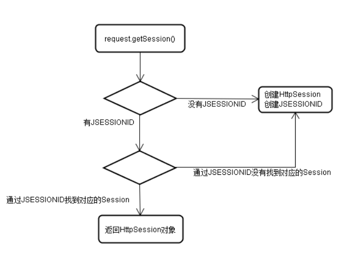

Beta请打开“钉钉”扫码重要文档！重要文档！重要文档！重要文档！领蛋孵福蛋继续赢取大奖奖品分享任务列表去完成已完成热门去完成水印[WIP] 为什么是语雀aboutNEWNEW

Adblocker


# 会话控制

## 1. Cookie

### 1.1 Cookie 的由来

**为什么要用 Cookie** 

HTTP是无状态协议，服务器不能记录浏览器的访问状态，也就是说服务器不能区分中两次请求是否由一个客户端发出。这样的设计严重阻碍的Web程序的设计。


**什么是 Cookie** 

Cookie 技术其实是浏览器端的数据存储技术， 解决了不同请求需要使用相同的请求数据的问题。 我们把请求需要共享的请求数据， 存储在浏览器端， 避免用户进行重复的书写请求数据。 但是哪些数据需要使用 Cookie 技术存储起来是一个主观问题， 需要在后台进行响应的时候来告诉浏览器， 有些数据其他请求还会使用，需要存储起来。


**特点** ：

- 适合少量数据
- 键值对
- 不安全


**Cookie 的用途** 

- 网上商城的购物车
- 保持用户登录状态
- 163邮箱的7天免登陆


**Cookie 的缺点** 

1. Cookie最为请求或响应报文发送，无形中增加了网络流量。
2. Cookie是明文传送的安全性差。
3. 各个浏览器对Cookie有限制，使用上有局限


### 1.2 Cookie 的使用

Cookie 的数据存储方式有两种，临时存储和定时存储。

- 临时存储：不设置 cookie 信息的存储时间，周期为一次会话，存储在浏览器内存中。
- 定时存储：设置存储时间，周期为时间设置，存储在用户电脑中。


```
//设置Cookie
@WebServlet(urlPatterns = "/ck")
public class CookieServlet extends HttpServlet {
    @Override
    protected void service(HttpServletRequest req, HttpServletResponse resp) throws ServletException, IOException {
        //1.设置请求编码格式
        req.setCharacterEncoding("utf-8");

        //2.设置响应编码格式
        resp.setContentType("text/html;charset=utf-8");

        //3.获取请求信息

        //4.处理请求信息

        //5.响应处理结果

            //使用Cookie进行浏览器端的数据存储
                //创建Cookie对象
                Cookie c = new Cookie("mouse", "thinkpad");
                Cookie c2 = new Cookie("key", "weishao");
                //设置Cookie
                    //设置Cookie的有效时间
                    c2.setMaxAge(3*24*3600);
                    //设置有效路径（防止其他路径访问获取Cookie）
                    c2.setPath("/servlet/ck");
                //响应cookie信息
                resp.addCookie(c);
                resp.addCookie(c2);

            //5.1 直接响应
                resp.getWriter().write("cookie 学习");
            //5.2 请求转发
            //5.3 重定向
    }
}
```


```
//获取Cookie
@WebServlet(urlPatterns = "/getCk")
public class GetCookieServlet extends HttpServlet {
    @Override
    protected void service(HttpServletRequest req, HttpServletResponse resp) throws ServletException, IOException {
        //1.设置请求编码格式
        req.setCharacterEncoding("utf-8");
        //2.设置响应编码格式
        resp.setContentType("text/html;charset=utf-8");
        //3.获取请求信息
            //获取Cookie信息
        Cookie[] cks = req.getCookies();
        if (cks != null) {
            for (Cookie ck : cks) {
                String name = ck.getName();
                String value = ck.getValue();
                System.out.println(name + ":" + value);
            }
        }
        //4.处理请求信息
        //5.响应处理结果
    }
}
```


### 1.3 Cookie 值的修改


```
//1.设置浏览器的编码格式
req.setCharacterEncoding("utf-8");
//2.设置服务器的编码格式
resp.setContentType("text/html; charset=utf-8");
//3.获取请求信息
//创建已经存在的Cookie对象
Cookie cookie = new Cookie("mouse", null);
//修改Cookie的值
cookie.setValue("this is new value");
//通知浏览器保存修改
resp.addCookie(cookie);
resp.getWriter().write("Cookie...已经修改");
```


**注意：** 修改 Cookie 的值会包 500 错误。


### 1.4 删除 Cookie

- 读取一个现有的 cookie，并把它存储在 Cookie 对象中。
- 使用 **setMaxAge()** 方法设置 cookie 的年龄为零，来删除现有的 cookie。
- 把这个 cookie 添加到响应头。


### 1.5 Cookie 的原理

- 总的来看Cookie像是服务器发给浏览器的一张“会员卡”，浏览器每次向服务器发送请求时都会带着这张“会员卡”，当服务器看到这张“会员卡”时就可以识别浏览器的身份。
- 实际上这个所谓的“会员卡”就是服务器发送的一个响应头：


- 如图Set-Cookie这个响应头就是服务器在向服务器发“会员卡”，这个响应头的名字是Set-Cookie，后边JSESSIONID=95A92EC1D7CCB4ADFC24584CB316382E和 Path=/Test_cookie，是两组键值对的结构就是服务器为这个“会员卡”设置的信息。浏览器收到该信息后就会将它保存到内存或硬盘中。
- 当浏览器再次向服务器发送请求时就会携带这个Cookie信息：


- 于是服务器就可以根据Cookie信息来判断浏览器的状态。


## 2. Session

### 2.1 Session 的由来

使用Cookie有一个非常大的局限，就是如果Cookie很多，则无形的增加了客户端与服务端的数据传输量。而且由于浏览器对Cookie数量的限制，注定我们不能再Cookie中保存过多的信息，于是Session出现。


Session的作用就是在服务器端保存一些用户的数据，然后传递给用户一个名字为JSESSIONID的Cookie，这个JESSIONID对应这个服务器中的一个Session对象，通过它就可以获取到保存用户信息的Session。


### 2.2 Session 的工作原理

- Session 的创建

- - Session的创建时机是在request.getSession()方法第一次被调用时。
    - Session被创建后，同时还会有一个名为JSESSIONID的Cookie被创建。
    - 这个Cookie的默认时效就是当前会话。

- Session的使用

- - Session被创建后，对应的Cookie被保存到浏览器中，之后浏览器每次访问项目时都会携带该Cookie。
    - 当我们再次调用时会根据该JSESSIONID获取已经存在的Cookie，而不是在创建一个新的Cookie。
    - 如果Cookie中有JSESSIONID，但是JSESSIONID没有对应的Session存在，则会重新创建一个HttpSession对象，并重新设置JSESSIONID。




### 2.3 Session 时效

**基本原则** 

Session对象在服务器端不能长期保存，它是有时间限制的，超过一定时间没有被访问过的Session对象就应该释放掉，以节约内存。所以Session的有效时间并不是从创建对象开始计时，到指定时间后释放——而是从最后一次被访问开始计时，统计其“空闲”的时间。


**默认设置** 

在全局web.xml中能够找到如下配置：<session-timeout>30</session-timeout>，说明Session对象默认的最长有效时间为30分钟。


**手工设置** 

- session.setMaxInactiveInterval(int seconds)
- session.getMaxInactiveInterval()


**强制失效** 

- session.invalidate()


**可以使Session对象释放的情况**

- Session对象空闲时间达到了目标设置的最大值，自动释放
- Session对象被强制失效
- Web应用卸载
- 服务器进程停止


### 2.4 URL 重写

- 在整个会话控制技术体系中，保持JSESSIONID的值主要通过Cookie实现。但Cookie在浏览器端可能会被禁用，所以我们还需要一些备用的技术手段，例如：URL重写。
- URL重写其实就是将JSESSIONID的值以固定格式附着在URL地址后面，以实现保持JSESSIONID，进而保持会话状态。这个固定格式是：URL;jsessionid=xxxxxxxxx
-  例如：


- 实现方式

- - response.encodeURL(String)
    - response.encodeRedirectURL(String)
    - 例如：


```
//1.获取Session对象
HttpSession session = request.getSession();

//2.创建目标URL地址字符串
String url = "targetServlet";

//3.在目标URL地址字符串后面附加JSESSIONID的值
url = response.encodeURL(url);

//4.重定向到目标资源
response.sendRedirect(url);
```


### 2.5 Session 的活化和钝化

- Session机制很好的解决了Cookie的不足，但是当访问应用的用户很多时，服务器上就会创建非常多的Session对象，如果不对这些Session对象进行处理，那么在Session失效之前，这些Session一直都会在服务器的内存中存在。那么就，就出现了Session活化和钝化的机制。
- Session钝化：Session在一段时间内没有被使用时，会将当前存在的Session对象序列化到磁盘上，而不再占用内存空间。
- Session活化：Session被钝化后，服务器再次调用Session对象时，将Session对象由磁盘中加载到内存中使用。
- 如果希望Session域中的对象也能够随Session钝化过程一起序列化到磁盘上，则对象的实现类也必须实现java.io.Serializable接口。不仅如此，如果对象中还包含其他对象的引用，则被关联的对象也必须支持序列化，否则会抛出异常：java.io.NotSerializableException


## 3. ServletContext

### 3.1 由来

Request 解决了一次请求内的数据共享问题， session 解决了用户不同请求的数据共享问题， 那么不同的用户的数据共享该怎么办呢？


**解决** ：

使用 ServletContext 对象


**作用** ：

解决了不同用户的数据共享问题


**原理** ：

ServletContext 对象由服务器进行创建， 一个项目只有一个对象。 不管在项目的任意位置进行获取得到的都是同一个对象， 那么不同用户发起的请求获取到的也就是同一个对象了， 该对象由用户共同拥有。


**特点**

服务器进行创建

用户共享

一个项目只有一个


**生命周期** ：

服务器启动到服务器关闭


**作用域** ：

项目内


**使用** ：

获取 ServletContext 对象
使用作用域进行共享数据流转
获取 web.xml 中的全局配置
获取 webroot 下项目资源流对象
获取 webroot 下资源绝对路径


### 3.2 使用


```
@WebServlet("/context")
public class ServletContextServlet extends HttpServlet {
    @Override
    protected void service(HttpServletRequest req, HttpServletResponse resp) throws ServletException, IOException {
        //获取ServletContext对象
        //第一种方式
        ServletContext sc = this.getServletContext();
        //第二种方式
        ServletContext sc2 = this.getServletConfig().getServletContext();
        //第三种方式
        ServletContext sc3 = req.getSession().getServletContext();
        System.out.println(sc == sc2); //true
        System.out.println(sc == sc3); //true

        //使用ServletContext完成数据共享
        //数据存储
        sc.setAttribute("str", "对象学习");

        //获取项目Webroot下的资源的绝对路径
        String path = sc.getRealPath("/doc/1.txt");
        System.out.println(path); //D:\Project\Java Web\out\artifacts\05_servlet_war_exploded\doc\1.txt
        
        //获取项目根目录下资源的流对象
        InputStream is = sc.getResourceAsStream("/doc/1.txt"); //只要没有报错说明成功
    }
}
```


```
@WebServlet("/context2")
public class ServletContextServlet2 extends HttpServlet {
    @Override
    protected void service(HttpServletRequest req, HttpServletResponse resp) throws ServletException, IOException {
        //创建ServletContext对象
        ServletContext sc = this.getServletContext();
        System.out.println(sc.getAttribute("str"));
    }
}
```


### 3.3 ServletConfig 的使用

ServletConfig 对象是 Servlet 的专属配置对象， 每个 Servlet 都单独拥有一个 ServletConfig 对象， 用来获取 web.xml 中的配置信息。


```
/**
 * 问题：
 *      如何获取在 web.xml 中给每个 servlet 单独配置的数据呢？
 *
 * 解决：
 *      使用 servletConfig 对象
 *
 * 使用：
 *      获取ServletConfig对象
 *      获取web.xml中的配置数据
 */
@WebServlet("/sg")
public class ServletConfigServlet extends HttpServlet {
    @Override
    protected void service(HttpServletRequest req, HttpServletResponse resp) throws ServletException, IOException {
        //获取ServletConfig对象
        ServletConfig servletConfig = this.getServletConfig();
        //获取web.xml中的配置数据
        String code = servletConfig.getInitParameter("config");
        System.out.println(code);
    }
}
```