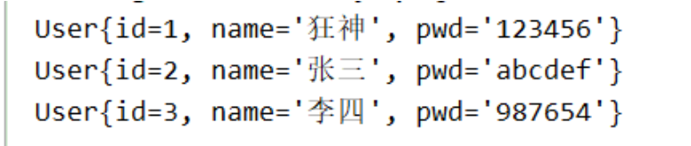

[TOC]

## 一、思路流程

 搭建环境 --》导入 MyBatis --》 编写代码 --》测试 

## 二、代码演示

### 1、创建实验所需数据库

```sql
CREATE DATABASE `mybatis`;

USE `mybatis`;

DROP TABLE IF EXISTS `user`;

CREATE TABLE `user` (
  `id` int(20) NOT NULL,
  `name` varchar(30) DEFAULT NULL,
  `pwd` varchar(30) DEFAULT NULL,
  PRIMARY KEY (`id`)
) ENGINE=InnoDB DEFAULT CHARSET=utf8;

insert  into `user`(`id`,`name`,`pwd`) values (1,'狂神','123456'),(2,'张三','abcdef'),(3,'李四','987654');
```

### 2、导入 MyBatis 相关 依赖

```xml
<!-- 导入依赖 -->
<dependencies>
    <!-- mybatis -->
    <dependency>
        <groupId>org.mybatis</groupId>
        <artifactId>mybatis</artifactId>
        <version>3.5.2</version>
    </dependency>

    <!-- mysql 驱动 -->
    <dependency>
        <groupId>mysql</groupId>
        <artifactId>mysql-connector-java</artifactId>
        <version>8.0.18</version>
    </dependency>

    <!-- junit -->
    <dependency>
        <groupId>junit</groupId>
        <artifactId>junit</artifactId>
        <version>4.12</version>
    </dependency>
</dependencies>
```

### 3、编写 MyBatis 核心配置文件

```xml
<?xml version="1.0" encoding="UTF-8" ?>
<!DOCTYPE configuration
        PUBLIC "-//mybatis.org//DTD Config 3.0//EN"
        "http://mybatis.org/dtd/mybatis-3-config.dtd">

<configuration>
    <environments default="development">
        <environment id="development">
            <transactionManager type="JDBC"/>
            <dataSource type="POOLED">
                <property name="driver" value="com.mysql.cj.jdbc.Driver"/>
                <!-- 我这里是mysql8，所以url中必须加上serverTimezone -->
                <property name="url" value="jdbc:mysql://localhost:3306/mybatis?useSSL=true&amp;useUnicode=true&amp;characterEncoding=utf8&amp;serverTimezone=Asia/Shanghai"/>
                <property name="username" value="root"/>
                <property name="password" value="123456"/>
            </dataSource>
        </environment>
    </environments>

    <mappers>
        <mapper resource="com/xuwei/dao/UserMapper.xml"/>
    </mappers>

</configuration>
```

### 4、创建实体类

```java
public class User {   
    private int id;  //id
    private String name;   //姓名
    private String pwd;   //密码
    
    //构造,有参,无参
    //set/get
    //toString()
}
```

### 5、编写 Mapper 接口类

```java
public interface UserMapper {
    List<User> selectUser();
}
```

### 6、编写 UserMapper.xml 配置文件

```xml
<?xml version="1.0" encoding="UTF-8" ?>
<!DOCTYPE mapper
        PUBLIC "-//mybatis.org//DTD Mapper 3.0//EN"
        "http://mybatis.org/dtd/mybatis-3-mapper.dtd">

<mapper namespace="com.xuwei.dao.UserMapper">
    <select id="selectUser" resultType="com.xuwei.pojo.User">
      select * from user
    </select>
</mapper>
```

### 7、编写 MyBatias 工具类

```java
public class MyBatisUtils {
    private static SqlSessionFactory sqlSessionFactory;

    static {
        try {
            String resource = "mybatis-config.xml";
            InputStream is = Resources.getResourceAsStream(resource);
            sqlSessionFactory = new SqlSessionFactoryBuilder().build(is);
        } catch (IOException e) {
            e.printStackTrace();
        }
    }

    //获取SqlSession链接
    public static SqlSession getSession() {
        return sqlSessionFactory.openSession();
    }
}
```

### 8、编写测试类

```java
public class UserMapperTest {
    @Test
    public void selectUser() {
        //1.获取Session对象
        SqlSession session = MyBatisUtils.getSession();

        //2.getMapper
        UserMapper mapper = session.getMapper(UserMapper.class);
        List<User> users = mapper.selectUser();

        for (User user : users) {
            System.out.println(user);
        }

        //3.关闭session
        session.close();
    }
}
```

### 9、运行测试



### 10、出现问题解决

 maven 由于它的约定大于配置，然后就会产生我们写的配置文件无法被导出或者生效等问题。

```xml
<build>
    <resources>
        <resource>
            <directory>src/main/java</directory>
            <includes>
                <include>**/*.properties</include>
                <include>**/*.xml</include>
            </includes>
            <filtering>false</filtering>
        </resource>
        <resource>
            <directory>src/main/resources</directory>
            <includes>
                <include>**/*.properties</include>
                <include>**/*.xml</include>
            </includes>
            <filtering>false</filtering>
        </resource>
    </resources>
</build>
```

