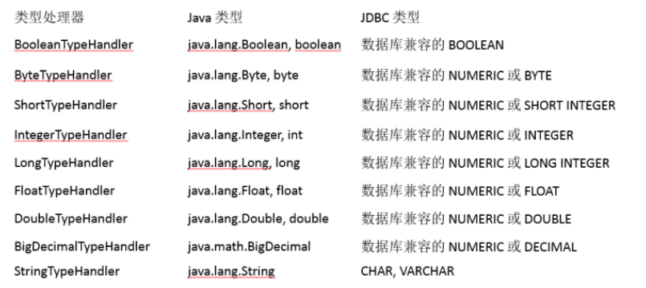
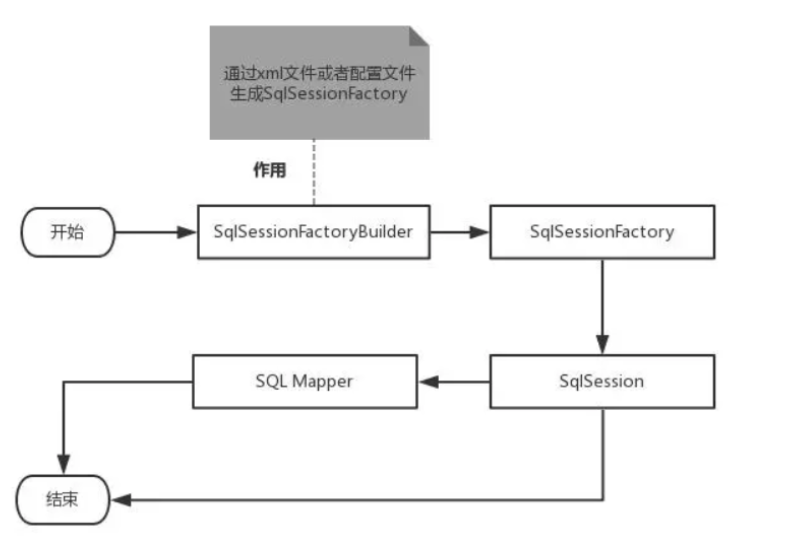
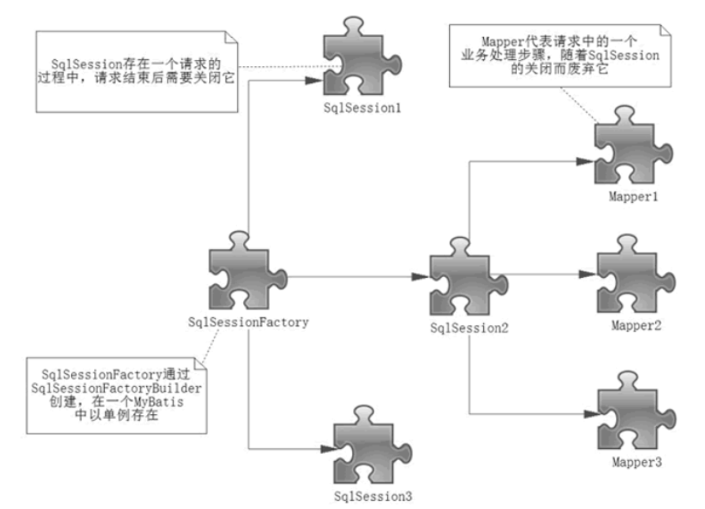

[TOC]

## 一、全局配置文件简介

mybatis-config.xml 系统核心配置文件，包含了会深深影响 MyBatis 行为的设置和属性信息。

 文件结构如下： 

```
Configuration 配置
  properties 属性
  settings 设置
  typeAliases 类型命名
  typeHandlers 类型处理器
  objectFactory 对象工厂
  plugins 插件
  environment 环境配置
    emvironment 环境变量
      transactionManager 事务管理器
      dataSource 数据源
    databaseIdProvider 数据库厂商标识
  mappers 映射器
 <!-- 注意元素节点的顺序，顺序不对会报错 -->
```

## 二、environments 元素

作用： 配置 MyBatis 的多套运行环境，将 SQL 映射到多个不同的数据库上，必须指定其中一个为默认运行环境（通过default指定） 。

- 子元素节点 environment： 具体的一套环境，通过设置 id 进行区别，id 保证唯一。 
    - 子元素节点 transactionManaver：事务管理器，常用的有三种。
        1.  JDBC：使用了 JDBC 的提交和回滚设置，依赖于从数据源得到的连接来管理事务。 
        2. MANAGER：不提交或回滚一个连接、让容器来管理事务的整个生命周期（比如 JEE 应用服务器的上下文）。 
        3. 自定义：实现 TransactionFactory 接口，type=全类名/别名
    - 子元素节点 dataSource： 使用标准的 JDBC 数据源接口来配置 JDBC 连接对象的资源，有三种内建的数据源类型。
        -  POOLED：**这**种数据源的实现利用“池”的概念将 JDBC 连接对象组织起来 , 这是一种使得并发** **Web 应用快速响应请求的流行处理方式。** 
        -  unpooled**：**不使用连接池。 
        -  jndi：这个数据源的实现是为了能在如 Spring 或应用服务器这类容器中使用，容器可以集中或在外部配置数据源，然后放置一个 JNDI 上下文的引用。 

## 三、properties 属性

1. 可以在 Java 属性文件中直接配置。

```xml
<property name="driver" value="com.mysql.jdbc.Driver"/>
<property name="url" value="jdbc:mysql://localhost:3306/mybatis?useSSL=true&amp;useUnicode=true&amp;characterEncoding=utf8&amp;serverTimezone=Asia/Shanghai"/>
<property name="username" value="root"/>
<property name="password" value="123456"/>
```

2. 也可以引用外部资源文件。

  jdbc.properties  资源文件

```
jdbc.driver=com.mysql.cj.jdbc.Driver
jdbc.url=jdbc:mysql://localhost:3306/mybatis?useSSL=true&useUnicode=true&characterEncoding=utf8&serverTimezone=Asia/Shanghai
jdbc.username=root
jdbc.password=123456
```

mybatis-config.xml 配置文件

```xml
<!--
    properties：引入外部的属性文件
        resource：从类路径下引入属性文件
        url：引入网络路径或者磁盘路径下的属性文件
    -->
<properties resource="jdbc.properties"></properties>
<environments default="development">
  <environment id="development">
    <transactionManager type="JDBC"/>
    <dataSource type="POOLED">
      <property name="driver" value="${jdbc.driver}" />
      <property name="url" value="${jdbc.url}" />
      <property name="username" value="${jdbc.username}" />
      <property name="password" value="${jdbc.password}" />
    </dataSource>
  </environment>
</environments>
```

## 四、Settings 设置

这是 MyBatis 中极为重要的调整设置，它们会改变 MyBatis 的运行时行为，主要实现：

- 懒加载
- 日志实现
- 缓存开启关闭

```xml
<settings>
  <setting name="cacheEnabled" value="true"/>
  <setting name="lazyLoadingEnabled" value="true"/>
  <setting name="multipleResultSetsEnabled" value="true"/>
  <setting name="useColumnLabel" value="true"/>
  <setting name="useGeneratedKeys" value="false"/>
  <setting name="autoMappingBehavior" value="PARTIAL"/>
  <setting name="autoMappingUnknownColumnBehavior" value="WARNING"/>
  <setting name="defaultExecutorType" value="SIMPLE"/>
  <setting name="defaultStatementTimeout" value="25"/>
  <setting name="defaultFetchSize" value="100"/>
  <setting name="safeRowBoundsEnabled" value="false"/>
  <setting name="mapUnderscoreToCamelCase" value="false"/>
  <setting name="localCacheScope" value="SESSION"/>
  <setting name="jdbcTypeForNull" value="OTHER"/>
  <setting name="lazyLoadTriggerMethods" value="equals,clone,hashCode,toString"/>
</settings>
```

## 五、typeAliases 别名

作用：为 Java 类型设置一个短的名字

注意：这个代码只能放到enviroment之前

1. 给类的全限定路径设置别名；

```xml
<!--配置别名,注意顺序-->
<typeAliases>
    <!-- 此时User就可以用在任何使用com.xuwei.pojo.User的地方-->
    <typeAlias type="com.xuwei.pojo.User" alias="User"/>
</typeAliases>
```

2. 给包下的所有注解设置别名，默认为类名首字母小写；

```java
<typeAliases>
    <package name="com.xuwei.pojo"/>
</typeAliases>
```

3. 若有注解，别名为注解值。

```java
@Alias("user")
public class User {
    ...
}
```

## 六、类型处理器

1.  无论是 MyBatis 在预处理语句（PreparedStatement）中设置一个参数时，还是从结果集中取出一个值时， 都会用类型处理器将获取的值以合适的方式转换成 Java 类型。 
2.  MyBatis 中提供的类型处理器： 



3. 自定义类型转换器
    1.  你可以重写类型处理器或创建你自己的类型处理器来处理不支持的或非标准的类型。 
    2.  步骤 
        -  实现 org.apache.ibatis.type.TypeHandler 接口或者继承 org.apache.ibatis.type.BaseTypeHandler
        -   指定其映射某个JDBC类型（可选操作） 
        -  在mybatis全局配置文件中注册 

## 七、mappers 映射器

 把 mapper 配置文件注入到 mybatis-config.xml 核心配置文件中有三种常用方式。 

1. 在 classpath 路径下引入；
2. 使用 mapper 接口的形式导入配置；
3. 使用包扫描的方式引入配置文件。

```xml
<!-- 从classpath路径下引入配置文件 -->
<mappers>
  <mapper resource="org/mybatis/builder/AuthorMapper.xml" />
</mappers>

<!-- 使用 mapper 接口类导入配置文件 -->
<mappers>
  <mapper class="org.mybatis.builder.AuthorMapper" />
</mappers>

<!-- 扫描包下所有的配置文件
 1.接口名和 Mapper 配置文件名必须相同。
 2.接口文件和 Mapper 配置文件必须在同一个包下。
-->
<mappers>
  <package name="org.mybatis.builder" />
</mappers>
```

## 八、对象工厂

- MyBatis 每次创建结果对象的新实例时，它都会使用一个对象工厂（ObjectFactory）实例来完成。

- 默认的对象工厂需要做的仅仅是实例化目标类，要么通过默认构造方法，要么在参数映射存在的时候通过有参构造方法来实例化。

- 如果想覆盖对象工厂的默认行为，则可以通过创建自己的对象工厂来实现。

## 九、生命周期和作用域

### 1、分析 MyBatis 的执行过程



### 2、作用域理解

- SqlSessionFactoryBuilder 的作用在于创建 SqlSessionFactory，创建成功后，SqlSessionFactoryBuilder 就失去了作用，所以它只能存在于创建 SqlSessionFactory 的方法中，而不要让其长期存在。因此 **SqlSessionFactoryBuilder 实例的最佳作用域是方法作用域**（也就是局部方法变量）。

- SqlSessionFactory 可以被认为是一个数据库连接池，它的作用是创建 SqlSession 接口对象。因为 MyBatis 的本质就是 Java 对数据库的操作，所以 SqlSessionFactory 的生命周期存在于整个 MyBatis 的应用之中，所以一旦创建了 SqlSessionFactory，就要长期保存它，直至不再使用 MyBatis 应用，所以可以认为 SqlSessionFactory 的生命周期就等同于 MyBatis 的应用周期。

- 由于 SqlSessionFactory 是一个对数据库的连接池，所以它占据着数据库的连接资源。如果创建多个 SqlSessionFactory，那么就存在多个数据库连接池，这样不利于对数据库资源的控制，也会导致数据库连接资源被消耗光，出现系统宕机等情况，所以尽量避免发生这样的情况。

- 因此在一般的应用中我们往往希望 SqlSessionFactory 作为一个单例，让它在应用中被共享。所以说 **SqlSessionFactory 的最佳作用域是应用作用域。**

- 如果说 SqlSessionFactory 相当于数据库连接池，那么 SqlSession 就相当于一个数据库连接（Connection 对象），你可以在一个事务里面执行多条 SQL，然后通过它的 commit、rollback 等方法，提交或者回滚事务。所以它应该存活在一个业务请求中，处理完整个请求后，应该关闭这条连接，让它归还给 SqlSessionFactory，否则数据库资源就很快被耗费精光，系统就会瘫痪，所以用 try...catch...finally... 语句来保证其正确关闭。

- **所以 SqlSession 的最佳的作用域是请求或方法作用域。**

