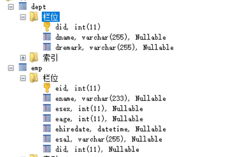

[TOC]

## 一、准备工作

### 1、数据库表的设计



### 2、创造数据


### 3、实体类的创建

#### 3.1 Dept 类

```java
@AllArgsConstructor
@NoArgsConstructor
@Data
public class Dept {
    private Integer did;
    private String dname;
    private String dremark;
}
```

#### 3.2 Emp 类

```java
@AllArgsConstructor
@NoArgsConstructor
@Data
public class Emp {
    private Integer eid;
    private String ename;
    private Integer esex;
    private Integer eage;
    private Timestamp ehiredate;  //导入的是java.sql.Timestamp
    private Double esal;
    private Dept dept; //一个部门下面可以有很多个员工
}

```

## 二、处理多对一的关系

部门和员工的关系是一对多，员工和部门的关系是多对一。

### 1、实现方法一：**使用resultMap的结果嵌套处理**

```xml
<?xml version="1.0" encoding="UTF-8" ?>
        <!DOCTYPE mapper
        PUBLIC "-//mybatis.org//DTD Mapper 3.0//EN"
        "http://mybatis.org/dtd/mybatis-3-mapper.dtd">
<mapper namespace="com.xuwei.dao.EmpMapper">

    <!--
        //查询所有员工
        public List<Emp> selectEmp();
    -->
    <select id="selectEmp" resultMap="selectEmpResultMap">
        select * from emp join dept using(did)
    </select>

    <resultMap id="selectEmpResultMap" type="com.xuwei.pojo.Emp">
        <id property="eid" column="eid" javaType="java.lang.Integer" />
        <result property="ename" column="ename" javaType="java.lang.String" />
        <result property="esex" column="esex" javaType="java.lang.Integer" />
        <result property="eage" column="eage" javaType="java.lang.Integer" />
        <result property="ehiredate" column="ehiredate" javaType="java.sql.Timestamp" />
        <result property="esal" column="esal" javaType="java.lang.Double" />
        <!-- 关联员工和部门的多对一 -->
        <!-- association配置关联对象的属性 -->
        <association property="dept" javaType="com.xuwei.pojo.Dept">
            <id property="did" column="did" javaType="java.lang.Integer" />
            <result property="dname" column="dname" javaType="java.lang.String" />
            <result property="dremark" column="dremark" javaType="java.lang.String" />
        </association>
    </resultMap>
</mapper>

```

### 2、实现方法二：使用 resultMap 的查询嵌套处理

```xml
<select id="selectEmp" resultMap="selectEmpResultMap2">
    select * from emp
</select>

<resultMap id="selectEmpResultMap2" type="com.xuwei.pojo.Emp">
    <association property="dept" column="did" javaType="com.xuwei.pojo.Dept" select="queryById"/>
</resultMap>

<select id="queryById" resultType="com.xuwei.pojo.Dept">
    select * from Dept where did=#{did}
</select>
```

## 三、处理一对多的关系

1. 修改 Dept.java

```java
@AllArgsConstructor
@NoArgsConstructor
@Data
public class Dept {
    private Integer did;
    private String dname;
    private String dremark;
    
    private Set<Emp> emps = new HashSet<>();
}
```

2. 修改 DeptMapper.xml

```xml
<?xml version="1.0" encoding="UTF-8" ?>
<!DOCTYPE mapper
        PUBLIC "-//mybatis.org//DTD Mapper 3.0//EN"
        "http://mybatis.org/dtd/mybatis-3-mapper.dtd">
<mapper namespace="com.xuwei.dao.DeptMapper">

    <!--//查询某个部门下的所有员工-->
    <!--public List<Emp> selectDeptEmps(Integer did);-->
    <select id="selectDeptEmps" resultMap="selectDeptEmpsResultMap" parameterType="java.lang.Integer">
        select e.*, d.dname, d.dremark from dept d join emp e on(d.did=e.did) where d.did=#{did}
    </select>

    <resultMap id="selectDeptEmpsResultMap" type="com.xuwei.pojo.Dept">
        <id property="did" column="did" javaType="java.lang.Integer"/>
        <result property="dname" column="dname" javaType="java.lang.String"/>
        <result property="dremark" column="dremark" javaType="java.lang.String"/>
        <!--
            collection：映射Dept中set集合属性
                property：指定集合的属性名
                ofType：集合中元素的类型
                javaType：当前字段的类型
        -->
        <collection property="emps" javaType="java.util.HashSet" ofType="com.xuwei.pojo.Emp">
            <id property="eid" column="eid" javaType="java.lang.Integer" />
            <result property="ename" column="ename" javaType="java.lang.String" />
            <result property="esex" column="esex" javaType="java.lang.Integer" />
            <result property="eage" column="eage" javaType="java.lang.Integer" />
            <result property="ehiredate" column="ehiredate" javaType="java.sql.Timestamp" />
            <result property="esal" column="esal" javaType="java.lang.Double" />
        </collection>
    </resultMap>
</mapper>
```

